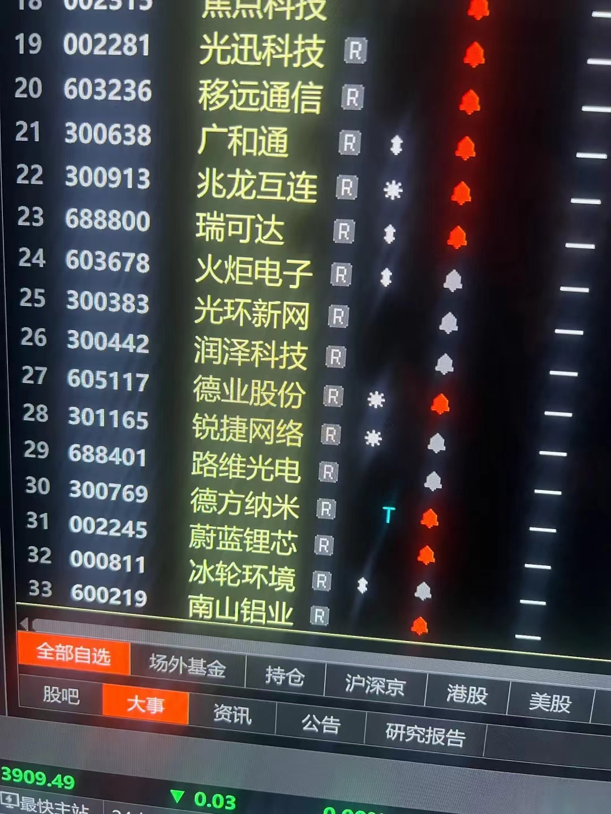

#### 12/05

我有南山铝业，但是拉的太快不能追了。
铝的逻辑先看下周美国降息，目前降息预期很高。
中军是中国铝业，你随便找一个喜欢的都一样。
但是现在铝买入点不好，有色金属每次都是回调一波的买点，因为跌起来A字就下来了，你挡不住。
铝要当心下周降息落地反而出现短线头部的概率。

兆龙互连今天低吸了一点，下周看看再说，沪指也是上去补缺口。
我上次笔记里面有写明年看好的板块，铜铝也写了。
存能依然可以，但是等调整好再说，一季度是新能源的淡季。

你只能赚自己能把握的钱，每个月都有主题，炒不完的。
这里的仓位依然不能太重，万一是B浪反弹，后面还有一次砸。

商业航天是游资在炒，也是十五五计划的逻辑。这种主题炒作，正好是现在很多机构休息的时候，消费股也是，都是游资品种。
航天发展本来是低位起来看两倍，现在这走势看看三倍，但是游资股随时A下来。
我一般喜欢做机构和游资共振的板块，进出方便，不喜欢纯主题。

兆龙互联我今天跟了一点点，但是这个板块还需要跟踪。
广和通需要看看下周走势，缺口不补就更强一点，补了其实也没啥，目前洗盘都是这么洗的。
机器人分化很厉害，力星这样很强，但是整个板块还没走出来。

每年最容易做的就是一季度的春季行情，因为一季度是我们钱最宽松的时间，熊市都可以做。
我因为在一些机构群里，也在几个游资群，信息比较多，但是也需要自己认真辨别，陈小群也和我一个群里。
最干的干货就是你看一个板块想不想参与，要看里面的中军的表现。
中军是指大容量的个股，比如这次的航天发展。比如上个月我做的蓝色光标，比如锂电里的多氟多我其中也参与了一波。
这些股票每天成交量50亿以上，自然是有我们这种资金量比较大的也会进去撸一把，因为进出方便。

易点天下我其实跟踪了几个月了，但是软件股的特点是短平快，打一把就跑，比较难做，越短节奏对你们来说越难做。
广和通，移远通信，兆龙互联这几个，是有机构参与的，但是能不能走出来还要观察。

Q&A
福建板块没明确时间节点，板块容量大，感觉应该还是有游资会持续做？
福建只是加成，关键还是看具体行业板块。

我只是传授你们思路，具体个股还需要自己练习。
最好的板块就是又有业绩又有故事。
就是底部进去，什么都不用做，等机构拉抬，最适合散户。
天天喊打喊杀盯盘太累了，也不适合业余的。
这批股票特点就是业绩好又是主线上的。

移远通信比较可惜的是里面机构比较肉，不然它做的模组销量很好，业绩也非常漂亮，一旦突破118以后就更厉害。
端侧就是这几个，因为也有业绩，机构一般不会放过。兆龙互联我今天52下面都买到了一点，挂了很多单。

消费电子我做过一个世华科技，干货就是定增以后经常有行情。
移远还没定增，光迅也是要定增。牛市定增是机构花钱买的，一般不肯亏的。熊市是机构也挡不住，大家都只能亏。
定增也要看历史涨幅，胜宏这样的我都懒得看。涨那么多，也是一个周期性行业而已。
一轮牛市先涨的不一定后面一年能大涨，反而是震荡出货为主。
你看航天机电则么就拉起来了，因为前面没涨过啊。

今年不算难做，明年很多高位股要出货，很容易被抹去利润。
今年我周期股没有重点做，明年会重点跟踪。
比如前一阵做的德方纳米，看业绩还是亏损的吧，但是亏了三年了，人家肯定要涨价。
一季度是新能源淡季，所以一季度价格撑住，后面就更有戏了，还需要跟踪。
干货就是股票不是简单看业绩，看的是预期。
原来亏损的，要赚钱了，就能涨。原来业绩很好，但是增速慢慢拐点，就没人炒了。
比如今年易中天这批，你就是能再拉一倍顶天了吧。我干嘛不去低位没炒过的票里做一倍呢，不然航天发展不就是一倍多了。
我说的是大资金的想法。
所以有些五年没大涨的低位股起来就要注意，很容易翻倍的。但是基本面也不能太差。
现在几千个股票很难做，板块买对不够，还要个股买对。

老登股不行的本质是人口红利没了，房地产这些都是。这波行情是需要把居民储蓄引出来的，所以还早。
这段时间板块节奏很快也是因为，好的板块都炒过一轮，接下来要等产业周期能不能有新故事，还有这个月的重大会议有没有新说法。
军工其实一直是二季度和年底喜欢拉的板块，医药是四月到六月。
周期是不是可以还要看资金，如果是两万亿以上就可以多个板块开花。
现在没有，仅能维持有限局部的板块，不着急，会出现的，一根放量中阳线就开启春季行情。

#### 12/07

真正的利好是外媒写的，下周经济会议会释放宽松政策，后面一轮春季行情开始。
12月17日日本加息，下周美联储加息，然后还有我们的重要会议，比较复杂。
调整周期原先是到12月中旬以后，具体会不会提早还要观察。
目前短线明天必然是冲高，沪指补缺口。短期热点是航天，有色，机器人，福建，还有端侧看看有没有调整到位。
现在最大问题是因为太多量化，每个月主题都在切换，到中下旬就开始高位涨不动了，下周主要看成交量，有钱才能多点开花。
11月是储能和软件，下旬和12月马上就换了，航天这些。节奏很快，但是春季行情我会挖几个中线股，可以躺平拿40%。
其实明年我感觉周期股很有戏，化工有色这些，主因是PPI在好转。

#### 12/08

科技股里面站上60天线的，就已经开始春季行情了，突然两万亿因为周末有消息，这肯定是涨的，具体再看后面几天量。
周五中午我写了情绪回暖，盘面能看出来。周五我从半仓加到7成。跌的时候也可以做消费。
回调的时候分批买就行，股票多的是节奏都有先后，不会踏空。
每次都是先光通信，然后国产算力，芯片材料。然后固定电池或新能源这些，有色这些是穿插其中。
有色只能低吸，而且是中线品种，短线不知道会不会降息时兑现。
焦点科技股性太差，里面机构操盘弱，本来是挺好的公司。
今天不用追，不着急。

有一个稳健型的蔚蓝锂芯可以先跟踪，哪天底部有放量阳线可以进去，这样比较安全也节省时间。我今年这股做了两拨了，一季度和三季度都参与了。
现在毕竟还是12月初，钱没有1月宽松，不过既然政策已经给了，后面回调都是洗盘，都是加仓的机会。
广和通的观测点是10日线不破，还有缺口不补就更强势一点。
锐捷网络也有机构打起来了，今天光通信都是机构在打。
券商很难说涨多少，因为上面要求的是慢牛。
移远通信是因为定增还没实施，压价，定增以后理论上应该去120。
这个月还是阴线低吸，我也没满仓，春季行情最少两个月，所以不要在乎一天的阳线。

#### 12/09

怎么看机构参与的票：机构股一般盘子大，业绩还行，因为机构有风控的。
春季行情估计还是多板块轮动的，有先后次序。
可以考虑买三到四个股，各自分布不同板块，比如科技股，有色，电池。

电池里面，德业股份也拉起来了，这个是储能。阳光电源是储能的指向标，不用买，用来风向标观察板块的动向。
瑞可达这样的可以等五日线低吸，兆龙也是，五日线低吸，万一回踩10日线加仓。
有色看的支撑是月线，5月线。
天马不要买了，我是周五打了一把，两三天就跑，游资股。天马快进快出，明天拉高卖。
福建板块下周就不能碰了。
消费就是大盘回调收益，而且就是12月。去年一模一样。

惠泉啤酒也拉了把，早上图里面，福建板块就这两个，不过都是短线抢一把就走，绝对不能追。游资股都是抢的到就抢，抢不要也要闭眼跑，本来就是Du
是福建股都这样吗？不是，是这个月热点不就是航天和福建股，但是都位置高了，不能追了。
路维光电 光迅科技 兆龙这些才是机构股，有基本面支持，万一短套也没事。
你看不懂的股就不做，短线股留给水平高的人去玩。
航天 福建回调能追吗？第一波都没坐上，后面就不要去了。你看看上个月储能怎么下来的，后面没有了

一季度一般就是成长股，周期股。
创新药你想做就买ETF，二季度看药和军工。
我早上推里面的路维光电不就是半导体，现在涨了就不要追了。
你们都喜欢做个股，个股是需要很高水平的才做的好。11月21日那天中午我说下午可以抄一点做反弹，你们如果买了创业板指数呢，那天ETF2.91，今天3.2躺赢的收益。
创业板明年看4500电 你想一想多少收益，那天2920点
A股至少隔5年才有一次行情，不是让你做小差价浪费的
指数基金就是每次大跌买，这是干货。科创估计明年能去2000点
直接买指数ETF最简单，一般人判断不了板块的切换。

一季度比如你收益30%到40%，三季度也一样30%到50%，一年就有70%到翻倍，已经战胜了绝大部分人，七亏二平一赚的比例。
熊市做一波行情，再小的资金也能慢慢做上去，亏钱的根源还是贪
春季行情的做法是科技这些里面先突破60天线的你选入自选，看好基本面业绩增长这些，回踩分批买入，回踩的时候也就是指数回调的时候。
一般强势一点的是底部起来翻倍，你就吃当中50%也不算贪，然后再看看其他补涨的低位品种，做高切低位切换。最简单就是看底部第一根涨停的股票。
短线是完全靠自己练习，别人教不了，所有游资都是自己练出来的盘感。

#### 12/10

中线观察票，不急着买，等回踩再看支撑，撑的好才是真正想做的。
广和里面量化好多，兆龙盘子小相对控盘稳定一点，这个月还是按照我原先的猜测，先砸了。
科技股低位就有人买，天马封不住就卖。最近很多新基金在批准发售。

怎么看量化很多？看盘面。
兆龙早上破55我加了。蔚蓝不着急，不过买了也没事。
摩尔我昨晚还和朋友聊，等吸筹结束跟一点，没想到这么着急拉，应该能到1000。不是抢筹，是迅速打一把就跑。
我举个例子雷赛智N，我一季度重仓品种30元买的，一季度一把拉完，后面三个季度行情和它没关系了。
我这边也有机构的一些信息，筛选以后再给你们。周末经常有券商研究院的电话会议。

我从来不看那指标，比如光迅，你看他五月到7月平台，一看就是机构成本啊，所有每次跌破60我就会回补一点，做个反弹也好。
平台就是机构压盘吸筹用的，举个例子。方框就是平台，机构的成本区域。

还有去年的广和通

平台就是机构压着股价不让大涨，但是还有波动，一个区域内震荡，单不是什么股票机构都能看得上啊，大部分股票只震荡没拉高。
拉主升浪之前经常有一波洗盘，比如安记食品拉之前，一波洗盘就洗的挺厉害。
现在有时候洗5天，有时候是7天，也有10天，一个月的，没有规则。
比如四方精创，4月份第一波拿货我就看上了，后来洗了一个月了才起来。
罗牛山算机构票吗？不算正宗的机构股，跟海南板块炒地图
别问我筹码峰，从来不看这些，毫无意义。看均线系统，简单的MACD金叉，背离

我也是做大波段为主，短线手速太慢
创业指数很强，你们不如这把下来配置创业板ETF，创业板3000点不会破了，上次大跌是很好的配置机会，3100如果破，坚决买。
因为创业板既有中际旭创，又有宁德时代，阳光电源，还有创新药
这波牛市主要就是算力AI，我今年其他板块几乎没做，只二季度做了军工和稳定币

给你们看看7月1日 我在抖音当时发选出来的中线股

但是这些操盘手更厉害，有中科大少年班出来的。所以你和他们拼交易，等于在和他们比高考，比不过的。现在计算机更厉害，所以游资也被收割不少。
还有就是大A一些公司请操P手运作自己股票，市值做上去配合出消息，很多年前就有了。所以我买中线股一般都是行业龙头，基本面要好的。

#### 12/11

2900还想再低，所以我一开始说散户做不好都是因为贪。散户要先摆正自己的位置，你只能吃到当中一段就已经是赢了，最后贪恋不肯跑的，是贪卖在顶部，低位还等更低位的是贪抄底。

买基金就是要大盘大跌时进一部分，然后不跌了，开始反身向上再加一部分。下周可能是最后一次挖坑了。创业板不一定会破3000点了，月底收盘基本再3050上方。挖坑就是你买指数基金最好的时机。