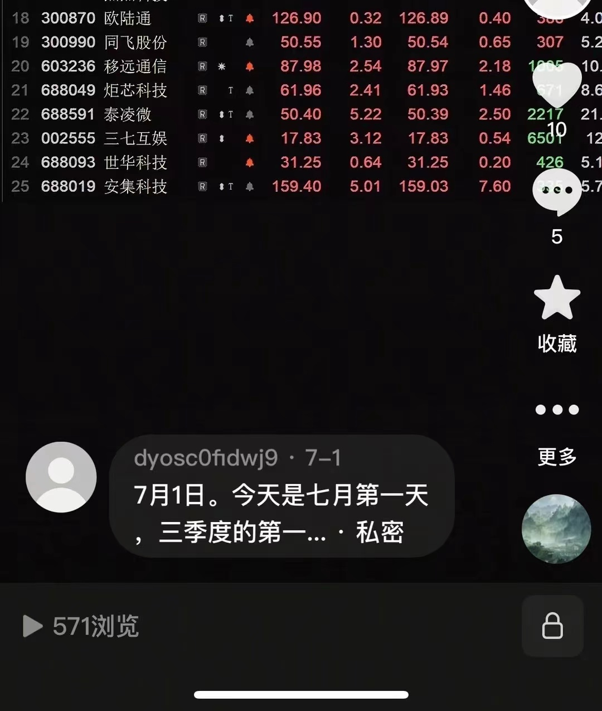
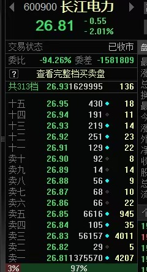

#### 12/05

我有南山铝业，但是拉的太快不能追了。
铝的逻辑先看下周美国降息，目前降息预期很高。
中军是中国铝业，你随便找一个喜欢的都一样。
但是现在铝买入点不好，有色金属每次都是回调一波的买点，因为跌起来A字就下来了，你挡不住。
铝要当心下周降息落地反而出现短线头部的概率。

兆龙互连今天低吸了一点，下周看看再说，沪指也是上去补缺口。
我上次笔记里面有写明年看好的板块，铜铝也写了。
存能依然可以，但是等调整好再说，一季度是新能源的淡季。

你只能赚自己能把握的钱，每个月都有主题，炒不完的。
这里的仓位依然不能太重，万一是B浪反弹，后面还有一次砸。

商业航天是游资在炒，也是十五五计划的逻辑。这种主题炒作，正好是现在很多机构休息的时候，消费股也是，都是游资品种。
航天发展本来是低位起来看两倍，现在这走势看看三倍，但是游资股随时A下来。
我一般喜欢做机构和游资共振的板块，进出方便，不喜欢纯主题。

兆龙互联我今天跟了一点点，但是这个板块还需要跟踪。
广和通需要看看下周走势，缺口不补就更强一点，补了其实也没啥，目前洗盘都是这么洗的。
机器人分化很厉害，力星这样很强，但是整个板块还没走出来。

每年最容易做的就是一季度的春季行情，因为一季度是我们钱最宽松的时间，熊市都可以做。
我因为在一些机构群里，也在几个游资群，信息比较多，但是也需要自己认真辨别，陈小群也和我一个群里。
最干的干货就是你看一个板块想不想参与，要看里面的中军的表现。
中军是指大容量的个股，比如这次的航天发展。比如上个月我做的蓝色光标，比如锂电里的多氟多我其中也参与了一波。
这些股票每天成交量50亿以上，自然是有我们这种资金量比较大的也会进去撸一把，因为进出方便。

易点天下我其实跟踪了几个月了，但是软件股的特点是短平快，打一把就跑，比较难做，越短节奏对你们来说越难做。
广和通，移远通信，兆龙互联这几个，是有机构参与的，但是能不能走出来还要观察。

Q&A
福建板块没明确时间节点，板块容量大，感觉应该还是有游资会持续做？
福建只是加成，关键还是看具体行业板块。

我只是传授你们思路，具体个股还需要自己练习。
最好的板块就是又有业绩又有故事。
就是底部进去，什么都不用做，等机构拉抬，最适合散户。
天天喊打喊杀盯盘太累了，也不适合业余的。
这批股票特点就是业绩好又是主线上的。

移远通信比较可惜的是里面机构比较肉，不然它做的模组销量很好，业绩也非常漂亮，一旦突破118以后就更厉害。
端侧就是这几个，因为也有业绩，机构一般不会放过。兆龙互联我今天52下面都买到了一点，挂了很多单。

消费电子我做过一个世华科技，干货就是定增以后经常有行情。
移远还没定增，光迅也是要定增。牛市定增是机构花钱买的，一般不肯亏的。熊市是机构也挡不住，大家都只能亏。
定增也要看历史涨幅，胜宏这样的我都懒得看。涨那么多，也是一个周期性行业而已。
一轮牛市先涨的不一定后面一年能大涨，反而是震荡出货为主。
你看航天机电则么就拉起来了，因为前面没涨过啊。

今年不算难做，明年很多高位股要出货，很容易被抹去利润。
今年我周期股没有重点做，明年会重点跟踪。
比如前一阵做的德方纳米，看业绩还是亏损的吧，但是亏了三年了，人家肯定要涨价。
一季度是新能源淡季，所以一季度价格撑住，后面就更有戏了，还需要跟踪。
干货就是股票不是简单看业绩，看的是预期。
原来亏损的，要赚钱了，就能涨。原来业绩很好，但是增速慢慢拐点，就没人炒了。
比如今年易中天这批，你就是能再拉一倍顶天了吧。我干嘛不去低位没炒过的票里做一倍呢，不然航天发展不就是一倍多了。
我说的是大资金的想法。
所以有些五年没大涨的低位股起来就要注意，很容易翻倍的。但是基本面也不能太差。
现在几千个股票很难做，板块买对不够，还要个股买对。

老登股不行的本质是人口红利没了，房地产这些都是。这波行情是需要把居民储蓄引出来的，所以还早。
这段时间板块节奏很快也是因为，好的板块都炒过一轮，接下来要等产业周期能不能有新故事，还有这个月的重大会议有没有新说法。
军工其实一直是二季度和年底喜欢拉的板块，医药是四月到六月。
周期是不是可以还要看资金，如果是两万亿以上就可以多个板块开花。
现在没有，仅能维持有限局部的板块，不着急，会出现的，一根放量中阳线就开启春季行情。

#### 12/07

真正的利好是外媒写的，下周经济会议会释放宽松政策，后面一轮春季行情开始。
12月17日日本加息，下周美联储加息，然后还有我们的重要会议，比较复杂。
调整周期原先是到12月中旬以后，具体会不会提早还要观察。
目前短线明天必然是冲高，沪指补缺口。短期热点是航天，有色，机器人，福建，还有端侧看看有没有调整到位。
现在最大问题是因为太多量化，每个月主题都在切换，到中下旬就开始高位涨不动了，下周主要看成交量，有钱才能多点开花。
11月是储能和软件，下旬和12月马上就换了，航天这些。节奏很快，但是春季行情我会挖几个中线股，可以躺平拿40%。
其实明年我感觉周期股很有戏，化工有色这些，主因是PPI在好转。

#### 12/08

科技股里面站上60天线的，就已经开始春季行情了，突然两万亿因为周末有消息，这肯定是涨的，具体再看后面几天量。
周五中午我写了情绪回暖，盘面能看出来。周五我从半仓加到7成。跌的时候也可以做消费。
回调的时候分批买就行，股票多的是节奏都有先后，不会踏空。
每次都是先光通信，然后国产算力，芯片材料。然后固定电池或新能源这些，有色这些是穿插其中。
有色只能低吸，而且是中线品种，短线不知道会不会降息时兑现。
焦点科技股性太差，里面机构操盘弱，本来是挺好的公司。
今天不用追，不着急。

有一个稳健型的蔚蓝锂芯可以先跟踪，哪天底部有放量阳线可以进去，这样比较安全也节省时间。我今年这股做了两拨了，一季度和三季度都参与了。
现在毕竟还是12月初，钱没有1月宽松，不过既然政策已经给了，后面回调都是洗盘，都是加仓的机会。
广和通的观测点是10日线不破，还有缺口不补就更强势一点。
锐捷网络也有机构打起来了，今天光通信都是机构在打。
券商很难说涨多少，因为上面要求的是慢牛。
移远通信是因为定增还没实施，压价，定增以后理论上应该去120。
这个月还是阴线低吸，我也没满仓，春季行情最少两个月，所以不要在乎一天的阳线。

#### 12/09

怎么看机构参与的票：机构股一般盘子大，业绩还行，因为机构有风控的。
春季行情估计还是多板块轮动的，有先后次序。
可以考虑买三到四个股，各自分布不同板块，比如科技股，有色，电池。

电池里面，德业股份也拉起来了，这个是储能。阳光电源是储能的指向标，不用买，用来风向标观察板块的动向。
瑞可达这样的可以等五日线低吸，兆龙也是，五日线低吸，万一回踩10日线加仓。
有色看的支撑是月线，5月线。
天马不要买了，我是周五打了一把，两三天就跑，游资股。天马快进快出，明天拉高卖。
福建板块下周就不能碰了。
消费就是大盘回调收益，而且就是12月。去年一模一样。

惠泉啤酒也拉了把，早上图里面，福建板块就这两个，不过都是短线抢一把就走，绝对不能追。游资股都是抢的到就抢，抢不要也要闭眼跑，本来就是Du
是福建股都这样吗？不是，是这个月热点不就是航天和福建股，但是都位置高了，不能追了。
路维光电 光迅科技 兆龙这些才是机构股，有基本面支持，万一短套也没事。
你看不懂的股就不做，短线股留给水平高的人去玩。
航天 福建回调能追吗？第一波都没坐上，后面就不要去了。你看看上个月储能怎么下来的，后面没有了。

一季度一般就是成长股，周期股。
创新药你想做就买ETF，二季度看药和军工。
我早上推里面的路维光电不就是半导体，现在涨了就不要追了。
你们都喜欢做个股，个股是需要很高水平的才做的好。11月21日那天中午我说下午可以抄一点做反弹，你们如果买了创业板指数呢，那天ETF2.91，今天3.2躺赢的收益。
创业板明年看4500电 你想一想多少收益，那天2920点。
A股至少隔5年才有一次行情，不是让你做小差价浪费的。
指数基金就是每次大跌买，这是干货。科创估计明年能去2000点。
直接买指数ETF最简单，一般人判断不了板块的切换。

一季度比如你收益30%到40%，三季度也一样30%到50%，一年就有70%到翻倍，已经战胜了绝大部分人，七亏二平一赚的比例。
熊市做一波行情，再小的资金也能慢慢做上去，亏钱的根源还是贪。
春季行情的做法是科技这些里面先突破60天线的你选入自选，看好基本面业绩增长这些，回踩分批买入，回踩的时候也就是指数回调的时候。
一般强势一点的是底部起来翻倍，你就吃当中50%也不算贪，然后再看看其他补涨的低位品种，做高切低位切换。最简单就是看底部第一根涨停的股票。
短线是完全靠自己练习，别人教不了，所有游资都是自己练出来的盘感。

#### 12/10

中线观察票，不急着买，等回踩再看支撑，撑的好才是真正想做的。
广和里面量化好多，兆龙盘子小相对控盘稳定一点，这个月还是按照我原先的猜测，先砸了。
科技股低位就有人买，天马封不住就卖。最近很多新基金在批准发售。

怎么看量化很多？看盘面。
兆龙早上破55我加了。蔚蓝不着急，不过买了也没事。
摩尔我昨晚还和朋友聊，等吸筹结束跟一点，没想到这么着急拉，应该能到1000。不是抢筹，是迅速打一把就跑。
我举个例子雷赛智N，我一季度重仓品种30元买的，一季度一把拉完，后面三个季度行情和它没关系了。
我这边也有机构的一些信息，筛选以后再给你们。周末经常有券商研究院的电话会议。

我从来不看那指标，比如光迅，你看他五月到7月平台，一看就是机构成本啊，所有每次跌破60我就会回补一点，做个反弹也好。
平台就是机构压盘吸筹用的，举个例子。方框就是平台，机构的成本区域。

还有去年的广和通

平台就是机构压着股价不让大涨，但是还有波动，一个区域内震荡，单不是什么股票机构都能看得上啊，大部分股票只震荡没拉高。
拉主升浪之前经常有一波洗盘，比如安记食品拉之前，一波洗盘就洗的挺厉害。
现在有时候洗5天，有时候是7天，也有10天，一个月的，没有规则。
比如四方精创，4月份第一波拿货我就看上了，后来洗了一个月了才起来。
罗牛山算机构票吗？不算正宗的机构股，跟海南板块炒地图。
别问我筹码峰，从来不看这些，毫无意义。看均线系统，简单的MACD金叉，背离

我也是做大波段为主，短线手速太慢。
创业指数很强，你们不如这把下来配置创业板ETF，创业板3000点不会破了，上次大跌是很好的配置机会，3100如果破，坚决买。
因为创业板既有中际旭创，又有宁德时代，阳光电源，还有创新药。
这波牛市主要就是算力AI，我今年其他板块几乎没做，只二季度做了军工和稳定币。

给你们看看7月1日 我在抖音当时发选出来的中线股。

但是这些操盘手更厉害，有中科大少年班出来的。所以你和他们拼交易，等于在和他们比高考，比不过的。现在计算机更厉害，所以游资也被收割不少。
还有就是大A一些公司请操P手运作自己股票，市值做上去配合出消息，很多年前就有了。所以我买中线股一般都是行业龙头，基本面要好的。

#### 12/11

游资股说翻脸就翻脸的，不然人家几个亿怎么赚导的，就是买卖都要果断。一般一季度做完不管牛熊。

这轮牛市会持续到多久？ 一般一季度做完不管牛熊都会跑，今年我是三月份跑的，所以四月份没有被吐回利润，时间周期理论上是12月24日。

股票炒的是未来，我不看我多少钱卖的，我只管买回来以后后面还能不能涨。

你喜欢做短线，短线主要看故事大不大，还有大盘的背景是什么情况，一般一季度做主线，三季度做主线，二季度做防御 医药加游资股，四季度消费加游资股。

所以你们知道为何我当时很早就埋伏惠发食品，就是位四季度做准备，但是我也没法未卜先知。

我不知道福建股能炒这么疯狂，商业航天以前因为板块容量不够也没业绩，其实依然是主题为主。

2900还想再低，所以我一开始说散户做不好都是因为贪。散户要先摆正自己的位置，你只能吃到当中一段就已经是赢了，最后贪恋不肯跑的，是贪卖在顶部，低位还等更低位的是贪抄底。

买基金就是要大盘大跌时进一部分，然后不跌了，开始反身向上再加一部分。下周可能是最后一次挖坑了。创业板不一定会破3000点了，月底收盘基本再3050上方。挖坑就是你买指数基金最好的时机。

#### 12/14

做超短的选手，依然在卫星这些快进快出。然后可以看看电力设备的力度。

做中线的可以分批低吸，比如四个板块各选一个股，拿两个月或者三个月，40%利润应该问题不大。

端侧兆龙，移远，这些都可以，半导体光刻胶也可以看看，也可以看看华峰测控，安集科技这种。

春季行情一般科技先行，后面也会轮动到储能，有色金属铜和铝。

下周如果有回调，再看看那几个撑的好，撑住不跌的肯定后面涨。

#### 12/15

北美缺电，燃机板块出海，出海的逻辑，因为已经拉了一段，不在低位，适合有交易能力的可以试试，图里还漏了一个国机重装

光刻机（胶水） 南大业绩更好，容大业绩差一点，主要很久没涨。业绩好的其实是彤程新材，但是以前一直股性一般

分不同板块各买一个，板块是轮动的，这周理论上是回踩的，所以分批低吸，但是个股节奏不一样

中线股一般沿五周线低吸，有些股票位置不抵的，需要自己交易水平高的，普通选手就买低位的

#### 12/16

还有最后七个交易日，低位个股最后一砸也就这几天之内见底，时间周期到24日左右。

储能里面一开始我说的德业股份，另外上能电气也可以作为中线观察标的。德业是因为乌克兰重建，业务在那很多，有很多股票上涨是背后有原因的。

机构股一般要等定增以后有行情。春季行情要分散持仓，板块轮动的，因为春季行情是市场钱做多的时候，各个板块有逻辑的都会有资金去打，小资金四个足够了。

成长股三个，包括科技能源这些，再配一个有色涨价概念就够了。每年二月份，低位成长股必涨。

商业航天这波已经走的有点像年初的机器人了，但是即使年初机器人大波，后来也有DeepSeek这些起来。

航天行情是因为马斯克，成长股很多都是跟美国的，本来四季度是机器人投产，但是马斯克延期了，去弄太空算力，所以大资金也去打航天板块。

美准备扩表，会不会跟着调整？（先降息，后扩表） 美国降息，当然是利好，我今年上半年当时在抖一直说主线，降息就是放钱出来，有钱股市才能涨。经济一般也能涨，只要有钱。

储能这些逻辑也是因为缺电，为何缺电呢，因为算力消耗了大量的电。始终是因为大规模发展电力，只有中美才搞得起。

你做股票，不要想领导想的事，哪个板块有钱进去打，你跟着赚钱就行了。春季行情，看哪些板块底部放量，有资金进去，然后跟着进去就可以了。

当年新能源一样故事很好，等高位以后，一样跌的不成样子。牛市就跟着做一把，熊市到时候再说。

投资是简单一点，想太多就赚不到钱，所以爱因斯坦也亏钱。

买什么就看底部哪些有放量，因为现在还差最后一跌，很多板块还没出信号。但是基本面逻辑是明年，储能肯定有铜铝也会有。出海逻辑也肯定的，国内太卷，出国外赚钱。

如果刚接触股票，我建议你这周跌下去买创业板指数ETF，春季行情，万一能到3600点，甚至更高呢。

我不做港股，A股才是主要的定价市场，港股只有阿里这几个才看看。港股马上进入红利月，就是因为下跌红利板块股息率要达到6.5了。

底部放量怎么排除是不是主力诱多？ 连续放量几天，周线上就能倍量

怎么观察主力撤了？ 撤也是分批的，有个B浪反弹，比如11月龙蟠科技，我本来21.58卖了，然后18回补想做反弹，结果又砸到16，只能继续加仓，反弹到20上面就卖了，因为判断是板块结束了。科技股一般有一个B浪反弹 还是来得及跑的，有色这些就尖顶 需要提早跑

有色可以包括铝对吧？ 有色就是主要看铜和铝，钨的话位置已经很高了

怎么判断一个板块退潮了？ 看时间周期，看板块龙头涨幅。关键是你为何要吃最后一口，平潭如果涨了40个交易日以后，这个月也接近下旬了，下旬的话很容易有月末杀。

上证指数支撑今天是3780点，创业板因为上次砸到2900，这次还要观察，下午看一下。

姐姐3780砸到位了还是可能继续往下啊？ 应该有反弹，不会太过分，也没啥利空。

错过五次10%就腰斩了，短线其实是最难的模式，普通人大波段更合适。

哪个赚钱比较稳？ 比如你现在买低位主线业绩好的，向下最多跟着指数跌5%到10%，向上50%。低位一般指的离前一波高点已经四个月左右，该割肉的也割肉的

其实航天动力这几个机构是8月份建仓，当时给了我信息。我当时看很慢就没跟。洗盘洗了好几个月，人家内部盘是一年就只吃这一波。 现在还能入吗？能问出这样的问题就是准备送钱给机构？人家成本15元成本涨到40了，再拉的概率和你抛硬币博正反面差不多。

我2015年做了5倍收益，账户被通知被券商监控，那时才几个股票，选股很容易，现在已经难上加难。所以为何要去做小概率事件追求一年10倍？

姐姐，买的软件ETF和证券ETF的基金一年了一直被套着，能给点建议吗？继续拿着还是转到创业板。 把券商换创业板，正好券商不跌，创业板下跌。软件因为还有变数，万一一季度轮到。

创业板3000点风险很小，但我也不知道能不能砸破，创业板里面有科技，有储能，有新能源，有创新药，有机器人，几乎都有了，也可以每下去50点加一次。

容大感光也是量化资金，天天有做T差价但涨幅不大，现在难做就是因为这些量化。

那个姐，我之前有买煤炭ETF半死不活的，还要留着吗? 煤炭ETF是机构拿股息配置的，你买它干嘛

航天动力底部起来一倍位置是35，然后48不一定能到（当天是40，所以姐的意思是上升空间至少20%+才值得买？）就和上月末我说储能高位也不行，他现在拉就是为了勾人进去买单，越没人买单越拉。
11月20日的时候，都在讨论储能，有谁注意商业航天，他们资金永远都是从高位板块分批撤出，流入低位板块。

下个月自然有新的板块出来，出来了才知道是什么板块，没人提早知道短线，埋伏只能是中线品种，而且如果不是春季行情也没必要埋伏，不一定轮到，春季行情钱多一点，容易百花齐放。

创业板3000点支撑，接近3000点的时候，不要怕。

移远今天终于出定增了，机构花22亿85元一股买它，这才是确定的机会。去年40多我做过一波移远，因为确实是好公司，但A股好公司不一定是好股票，操盘手不行。

主要现在的牛市确实很难做，比起以前的牛市，太多用电脑操作的，所以有时候我配置一部分中线股就是纯因为基本面，这样就和量化无关。

我2021年下半年给过我孩子同学妈妈一个股浪潮信息，当时30元，后来涨了一点点就砸导20，还好她很能拿，后来45卖的，虽然赚的也不多，但是两年熊市下，一年20%也已经战胜大部分人了。
肯定不是特别好的选择，但普通人就是赚个安稳钱，移远也一样道理。

每个热门股票都是经过打压吸筹，洗盘，拉升，加速然后出货，拉升初期进去是最理想的，不要等加速再进去，吸筹时，没有消息，没人知道。

**语音**

每年的一月份到三月份是进攻的时候，进攻的时间不用买什么防守板块，这样反而会拉低你的收益率。

但是三月份以后开始你就可以买点防守板块，为什么呢？因为创业板要跌当然是买防守板块了，这个时候大资金也会转到防守板块，今年二季度的时候我银行都买过，
因为知道那个时候指数没戏了嘛，一直到七八月份才起来的，创业板就是七月份嘛，所以二季度这是买防守板块的时候，都有时间的。

其他大V我不知道，但是你看他有哪个人在11月21号告诉你们要买的，就是那天星期五大跌，我当时笔记里面就写了分三块，那天当天下午就应该建仓，几乎就是最低点次低点，
你看看他们哪家大v说了就说明他还算有点水平，如果没有人说的说明很次了，因为真正有点水平的也不一定在这种公开场合会教你们买，人家都是私下花钱什么的那种，就是招会员那种可能还会给点正确的信息，这种公开的不一样有人会说，或者他的水平没到。

11月21日我为什么觉得可以买，是因为它跌到了我觉得它的低位区域了，就说股市这个东西不是说预测有用，就说你还要知行合一，就说它已经跌倒你原来想的低位位置，你就应该不要怕试错，试错了也很正常。

就是我们自己交易不可能经常全对，就是胜率没有那么高，没有一个人是神仙，但是拿一部分仓位是试错是不会有错的。所以我当时也说分三次呗，
第二周如果缩量了，说明抛盘没有了，那你就可以一点点再加上去，但结果它很快反弹了，就现在的大资金比你们都想要，还有那些量化，它是用电脑算的，它比我们人脑更聪明一点，他们就更果断。

做股票就是逆人性的，所以很难。做指数基金相对容易一点，有底。

11月21号那天一个是指数跌得厉害，然后就是它是跳空低开的，低开以后早上砸了一上午，然后下午继续砸，这个时候你买入的部分，只要它反弹补缺你就有收益，
所以根本就不用操心，然后它再慢慢缩量以后，那就是反弹的力度会更大一点，然后你加满，然后就有一波收益，至少十个点吧，就是个股也是那天跳空缺口下砸的时候，
主线里有一些好的股票也是可以回补缺口的，然后一回补缺口你就可以卖，这是一种短线的交易，但指数基金就是一次很好的定投，等于是。

就是我们的交易经验是怎么积累的，就是这么每一次重大的下跌上涨自己是不是错过，不要觉得就是好像错过什么是很大的事，很正常，有时候我也会错过没什么，
但是你的交易经验你就积累了一点，然后这么慢慢积累要很多年你就有一些肌肉意识了，就知道应该怎么样了，
所以说股市里面投资你开户很简单，就进入的门槛很低，但是做得好你等于要经常总结自己失败的经验就没有那么容易。

有时候我跟你说，嗯，不用把主力和那些基金啊也好，私募也好，想得太深，他们也会试盘，有时候他这个板块它试不上去怎么办，
它也要撤，他撤之前一般还会就是反弹一次，所以你反弹的时候你看着不对你也可以跟着他走，就是他们也会试盘，他们不是每一次都是成功的。

股票复利的关键是赚确定性的钱，没有完美的交易，不用追求完美，龙蟠卖了以后也能涨到了24，但我根本不看，这要我这笔交易赚钱出来就行，因为板块已经是拐头了。

#### 12/17

没买光迅的可以看看景旺电子，所以说破3100点就是要先买一部分，没有肯定跌倒3000道理，不一定的。上次11月21日也是，跌下去先捡一点，万一后面不砸了呢。人民币一直再升值，资产没道理跌的。

是我们不计较最后那3%的得失，非要买到最低点才是给自己出难题，光迅62.7我今天最低加的。不是集合竞价加的，是盘中砸下去加的，大盘不是一日游，明显都是机构股拉的。

春季行情做到明年3月，看好品种分批买。

`13:46:45【日本央行前副行长、政府小组成员若田部昌澄：鉴于中性利率水平，日本央行应避免过早加息以及过度调整货币支持措施。】`
原先是砸到周五，日本周五加息，不加息就提前涨，其实跌本来就是机构打压吸货，所以要分批买呢，万一跌不到预定位置呢

`14:01:15【汇金宣布今日购买各类ETF以稳定股市，鼓励长期价值投资，后续还将继续维护市场健康发展。】`

所以3800点就是他们短期底线了，然后再看看个股买什么，兆龙、移远都是定增以后，因为机构花了大笔钱参与定增，总体公司还比较可靠。

涨也能看出来好坏，但是需要连续放量，只一天普涨就没法看好坏。

搭平台说明不肯跌了 平台破位才止损，我前几天和你们说的搭平台就是这个意思，平台是一个平衡位置 不肯跌就是算一下平台开始涨幅能到多少。

我记得中际旭创当时我回帖别人说 为何不能400多砸到300，再去600，后来还真是这么走的。

**语音**

就是每个人的承受能力不一样，我昨天看大跌我不买嘛，对吧，但是你们就不一样了，你们到时候在万一再跌，那你心态又会不好了，所以我跟你们说越跌越买，
但我自己操作的时候我肯定是有就看谁有比较有赌性的那种，所以我昨天我昨天收盘的时候像瑞可达之类的都加了加了好几个，然后今天再一乘继续加码。

然后你要这么想，你想你3100到三千就一百点，你就是分批买，你你上下可能也就差个3%，不会超过5%了，但对于个股来说，你这一波行情有30到五十个点，你还差那3%嘛，
其实是不差的对吧，稍微留点余地就可以了，当然这是我是比较激进的想法，也许有些博主比较比较那个稳的，他可能会跟你们说到时候什么什么也跟中央在买，当然也对左侧和右侧的区别

融资当然是只有高手才能用了，你们就不要用了，我认识的上亿的人都用融资，谁不想多赚一点对不对？就是一般像我们能做上去的人本身就是做股票的人，赌性还是比较重的
，就但是融资一般我不会超过我本金的30%，就是就比如说他夸夸哗真的跌到三千点了，我就去开融资了，他不跌我可能也就不开了，你懂我意思吗？他真的敢跌，我就感觉

我普通话还好吧，因为我不是北京人，我是上海人，然后你们看一下光讯科技就是标准的，我那天说的就是先突破60天线，然后他这两天是回踩，所以昨天我就在密切关注它，
他回踩以后今天往上一拉，说明它不想跌了，就等于60天线在回踩完成了，这个时候是一个很好的加仓点，就是说当然也要有点亮对吧，这个个股和大盘其实不是完全同步的，
景旺是因为它昨天大盘这样跌它都不肯跌，说明它的主力要维持这个平台至少所以你买进至少不会亏对吧，他那样跌它都不肯添，那后面至少能涨一涨嘛，对不对？这个逻辑能懂吗？

你们买一个股票也可以就是分三段，比如说你先拿一点货拿点底仓，我们进半奖，然后它回踩5日线的时候，你可以加一点对吧，然后再留点余地看看，如果它不肯跌了也可以加一点，
然后它这个行情明显是就是要两三个月，它到时候板块都会有先涨的，那就先到顶后涨的就是后到顶，所以到时候还可以切换，所以你也不用太着急，我感觉手里现在你至少应该有半仓以上，
你拿五成到七成仓，然后它当中有回调，盘中有回调，你再可以一点一点一点加上去，因为你手里拿到五成到七成仓，它万一涨的话，你你的收益应该就至少有了对吧，因为春季行情还是有的，前提是因为是

然后有一个干货就是你们建仓的时候也可以看，如果六十分钟k d这死差的话可以可以先看一看，然后它相对低位的时候你买进去，但是这个情况就是在下跌的时候你不能说你这样我就下跌趋势的时候不能用，
就是你正好它是在一个平台，那你没有必要追高它回调的时候基本上六十分钟k d j也在低位，那你加一点每次下来加一点，

这批股票基本面都不错，但是因为现在行情走到这儿，我今天晚上要复盘，看看今天放量的东西，还有先走出来的心态的这些基本上机构经为了春季行情先建仓了，你肯定先买先建仓，
像蔚蓝锂芯这些都属于就是另一个板块，其实也可以，但是一般你看光讯这些都是cpo每次都是算力先行他们像先锋一样，然后就是储能这些然后跟上对吧，然后最后还有有色，
这是都是后后一批的，但是有色这些就是适合现在在底部的时候，底息你拿到明年三月份，我估计百分之三四十也有的，比如南山铝约我昨天就加仓了，然后就基本上先是我今天晚上要复盘一下，我看看今天因为放量

我讲东西有时候你要是真的一点就是做个股的经验都没有，也许比较难听懂，就是抗跌也好，60天线也好，昨天晚上我就是观察的哪些是抗跌的哪些就是这很重要，
因为昨天都是大跌，大跌的时候谁是金子才看得出来，大涨的时候阿狗阿猫都涨你也看不出来对吧，然后还基本面就是平时就积累了，我就基本上看这个行业还有他们，
他们基本上行业怎么样盈利经验怎么样，基本上明年储能肯定有，有色金属也有，我估计一季度应该也有，但他们但科技每次都是先锋就是他，而且他前两天的盘面已经把cpo又拉起来了，
所以就等于是先锋，所以我就光讯拿着手里了一直，景旺昨天也抗跌。

有些股票一开始你觉得不错，就是走了也还可以，好像也堆量，但是现在因为有了量化，有些股票被量化把持以后，它比如说它一下子打到一下子打到44，一下子砸到40，
他赚的是当中差价，它不愿意把股票往上堆就往上推，它不愿意推到50，60，那这样的票我们就不要了，就是你反正它震荡也大上去了，给它下来弄几下你也就赚钱走人了，
现在有一批股票我发现都被量化这么搞了，搞废了，等于本来挺好的股票，去年有几个股票去年做过，今年好像都被他们搞坏了，到时候看嘛，就是还是要做能往上走的，愿意往上打开空间的这种，

指数我觉得创业板指你也是阴线买吧，因为这个指数是定投，没有人肯定知道它跌到多少，我要知道我也是首付了，因为是把做期货就行了，我只能说大致的范围就是跌下去，
你不要怕，因为这个它下面是有底的，说白了就是，但是上次你要是破3000没买，这一次你看它只破了3100，它等于3000根本没下去，但昨天我是给人家定投了指数基金，
因为已经破了3000亿干嘛不买了对吧，我不差那几十点，但是你你就是说要知行合一你懂吗？然后在下面你就是每次阴线的时候买呗，定投那基本也就是这样了，然后晚上我要仔细付个盘再说

#### 12/18

上午没看，目前基本创业板指数跌 ，航天就起来，翘翘板，所以分批低吸看好的票更安全。当天涨起来了就不用再急着追进去。

因为成交量还是没有两万亿 达不到各板块都有资金拉。创业板指数今天宁德砸，还有反复。纳斯达克因为也没见底，钠指估计也是调整到前低附近。

对 你买股的时候 都是尽量回调的时候分批吸 昨天这种阳线一拉就赚钱了。时间周期一直是看12月24日左右，还有最后4，5个交易日，没有坏股票只有坏的操作。

当创业板见底的时候 商业航天也就见顶，昨天是一个预演。短线资金每天都是流动的呀，今天 航天 消费 AI 三个分完了，两万亿以上基本就能全面开花。

因为明天日本加息不加息还是未知的，这里的策略是跌下去可以加，不追涨，存量资金就是跷跷板，有两万亿就可以同时几个板块一起拉 大家都能赚到钱。

AI细分有很多，光通信不也是，存储也是因为AI需要，本质都是一样的，不然发那么多卫星 谁来付钱呢，美国需要AI，不然美国股市也完蛋了。我们也需要，因为消费不振 人口红利没了，所以老登板块都不行了，地产，白酒这些都是一个道理。

你要分清自己的能力圈在哪，善于做短线的人不会等现在才买航天，早都在里面了。短线能力一般，做大波段的，现在就是低吸的时间段。个股能力一般的，就等着创业板指数下跌，分批低吸ETF。先看自己属于哪一类

现在讨论航天的人和上个月末讨论储能的人，有区别吗，纳斯达克支撑是21500到22000还差5%到8%，我们创业板就看最后几天砸不砸，昨天下午是消息干扰，今天最大问题是拉银行。

短线来钱快，但是亏的也快，航天板块很明显今天低位的都开始起来了，高位没那么好拉了，举例英维克，它就是平台搭建，然后才突破又拉了一波，这些主线品种，平台不破就没有问题。

短线不是靠别人指导，完全靠自己练盘感。英维克是举例用的，高位股震荡，不是每一个都能再拉出一波，它是因为基本面好，机构愿意再拉一波，现在就不需要看了。也不算观察标的，只是举例液冷板块的龙头。

各板块都有龙头，胜宏科技是PCB龙头，今天砸，景旺也不能拉。宁德时代，阳光电源今天砸，整个储能都起不来。卫星的主要龙头是中国卫星。

看周线，本来这周就应该是一根周阴线，昨天小作文又来干扰了。下去也不用害怕 不就100点 砸下去反而是机会，反弹反而不好买。

构筑平台很重要 当时6，7月我就找出来同飞股份 瑞可达 欧陆通这批。金盘科技其实抖音当时五月份我短暂买过 也是平台了很久 那时32元。后来推荐给一个朋友 拿到60才卖。

中线股对我来说 省力 躺着赚钱，不用天天和游资搏杀。现在的问题是你们遇到我太晚了 牛市过半，这批主线股票已经被机构炒高了，越到上面越不确定，从30到60缺定 从60到100就要看运气了。

瑞可达我50买的 当时本来看100 但是后来80 整个板块尾声了，但是砸到60多 那么快就又到90。光迅科技也是一样 9月2日 我也没跑 后来反弹70多才卖的，但是机构成本就是50多，所以砸下来根本不怕，但是追高就不确定了。

科士达也是 当时20多闭眼买 但是50就很不确定了，看6月30日 我发的抖音，江海都翻倍了。

因为基本面分析是大部分博主做不到的，只会涨了喊涨 牛市总能胜率高一点，熊市会死的很惨。

这波航天因为机构反应慢了 有分歧 中国卫星今天才涨停，所以还有持续 但是品种一直在换，瑞可达是跟算力 其实是做连接器的。

最近还有一个问题是港股红利周期，所以A股银行也拉，拉银行是创业板的天敌。

今天又出现一个蚂蚁阿福板块，这种主题每个月都有 具体要看持续性，消费和军工 一向是主线不行的时候 逆属性，先看后面几天的低点，然后看反弹 其实具体还是看量。
比如昨天涨 今天如果放一点量继续站住 那么就已经见底。 但是今天阴线，所以继续看寻底。因为昨天下午的消息没有得到证实，明天等日本加息消息出来再看。

历史上有六次12月开始的春季行情有4次都是12月20日以后出现的，下周是重点时间窗口，所有的预测都要顺市场情况调节，应对更重要。

不是 因为美国降息 目前到明年四月我们也可能降准之类的，中美都在宽松 所以没事，但是每次不排除跌过头或者没跌到支撑位就见底了，两种短线可能都存在的。

就像你买入股票 不能只想买入以后就涨，如果跌则么办 买之前就想好，除了中美其他没法看，每个国家股市是自己担保 日本又没自主权 随时被美国抽血。

**语音**

我可以告诉你们一点干货，就是其实基本面分析是很难的，每个板块比如有色，它是怎么估值，它的周期是什么，比如说是跟大宗商品还是石油，还是黄金，还是金铜比。这些对吧，它都不一样的。

然后我们的大的牛市的周期是怎么产生的，跟美股有什么联系，跟美债有什么联系，跟降息和加息有什么联系，也都是有一定道理的，不是说。嗯，闭着眼睛就说牛市来了，不是这样的。

技术面分析，只是为了让我买的时候买的就是位置稍微好一点儿，然后发现技术面有什么问题，也许潜在有什么利空，我们不知道的，那破位也要走。这是一个纪律嘛，技术面只是辅助的。

基本面很难，譬如说半导体，你怎么知道它进入了一个上涨周期了，就是个股啊，我说的行业中的细分板块，还有就是化工。比如说碳酸锂这些怎么知道它就建立见底了，
怎么就知道它是反转了，怎么知道它就能涨价了，也都是有道理的。这个东西要写本书都可以，我就该这么说，就很复杂。

就举例德方纳米和龙盘，我当时为什么买，就说他已经3年这都亏损了，它那个加工费3年亏损以后，它不可能不涨价，没有人一天到晚亏损的给你干活。没有的对不对，
就是他已经面临一个转机了，然后还要看他的业绩到底是不是到时候能够释放，可以看它，而且新能源一季度是淡季，如果它的淡季的价格。不跌，哎，二季度它肯定又起来了，
也许会提早，因为机构有时候会提早知道数据嘛，对吧，所以你看他们现在涨的很厉害，但是他们到底有没有要看数据的验证不是。闭着眼睛说啊，我后面肯定有那些都是吹牛的
，你知道吗？要数据验证的，你的涨价了，的确你们价格稳定了也可以涨价了，机构就会就会做了。

铜和铝也是一个道理，它的缺多少，它要涨价，趋势是怎么样，跟金是一样的道理，但是它跟金的金子的那个。背后的逻辑就不一样，那个跟金子跟美元，主要是那个问题。
然后，铜和铝跟我们现在的电力设备，还有这些新材料的东西，用量人家都是量化计算的。不是说我闭着眼睛，我告诉你们说我铜肯定涨价，铝肯定涨价，不是这样的，全部要分析，
分析完了以后，你再算这个行情有没有有多大，然后再是技术分析，找到一个低位。进去有色香，这两天低位我也会加的，就是这是属于那种配置型的，就是我就等等到明年三四月份有个高点出来，
不管你是让我涨赚三十三十个点也好，也许运气好50个点也好，到时候我都会走。

指数基金也是配置型的，就是说，你每次大跌，我肯定配一点儿，你每次跌配一点儿，然后你彻底已经站稳了，看起来不跌了，你量也放出来，然后我还是等回踩的时候我再加。
就这属于配置型的，它能赚一个肯定是大大跑赢利息的那个收益，而且很稳。

玩个股呢，你肯定要看你主题，特别是主题投资，像我也做了那个福建的股，当时也挖了，其实挖了两个，还有一个卢燕那个医药，我我也没做下去，我后来懒得做了。
当时除了汇泉啤酒以外啊，就是跟这帮游资不想跟他们再搞，我也没做下去，结果这两天倒是涨停了，涨了两个板，我也没做，就是主题有主题的一个问题，它也有一个时间限制，
到后期就得。越来越小心，随时就走人，但震荡太大，今天一个涨停，明天一个跌停，我也不太喜欢这种股票，我就懒得看，有时候都。

盛宏科技和景旺他们都是PCB嘛，然后今天因为盛宏跌，然后景旺肯定也跟着跌。景旺现在就在构筑一个平台，但它这个平台是不是能完全构筑成，我不能说100%肯定。
因为做股票没有100%肯定赚钱的事儿，只能说大概，然后他这边跟着创业板，如果他能稳住的话，他就会走出跟英维克差不多的这两天英维克不是一拉嘛，但英维克比他早构筑平台嘛，
他更早。更早在底部在那儿磨了，嗯，景旺这些如果能磨出来的话，它也有一波拉伸，就至少能过个前高吧，前高好像80多吧，我估计能过上去，但前提就是它不能破位，
对吧，很多事情。预测没有那么重要，你要应对。比如说创业板看看，哎，砸的很低，哎，它基本上不怎么坑，跌下面有托盘，哎，那我就肯定也跟着减一点儿，就是这样会更稳妥。

我就简单说了一下 但是你们应该听出来 炒股很难的 都是系统性的

短线一个主题是很难的，你想像储能这样的，它是因为基本面反转，嗯，有机构参与，所以它做了做了挺其实挺久的，这一波也做的挺好的，但是像商业航天这样一开始。
都是几个游资在搞机构，其实是有分歧的，到现在都有分歧，因为他们没有业绩啊。你这些东西发上去，谁给你钱？你赚钱了吗？对吧，那些最大的公司，
就像储能什么的都是确实是有业绩的那个。嗯，但是现在我看机构线也在开始挖商业航天，就是他在挖一些到底能受益这一次商业航天的就是扩大，就是能受益的那些真正受益的企业。
这个我到时候也会挖。因为不着急，第一波一般都是建仓打压以后才是第二波。

因为你都是主题闭着眼睛瞎炒的，我也不太喜欢，比如说去年二四年年底的时候，机器人其实是第一波减仓，它打压了一个多月以后，今年一季度才是真正的三浪拉升。
他这个航天，我感觉也有这个可能性啊，但是也许他的故事没那么大，那就没有后面那么大的三浪。也有可能毕竟，算力这些才是当时那么大的三浪，是因为他人家确实看到业绩了。
易中天人家业绩那么好，你就现在估值也很低呀，对吧，这才是最大的那一批，就机构最喜欢的，因为它它故事好，自然就有一帮喜欢搞投资的人跟着你了，对不对，
其实高位我我就不太喜欢听。到了高位，你不要告诉我它有多好，低位的时候你告诉我就可以了，这样我都是在低位挖的这些这些股票，高位的话我就看看。

你看它天天因维克天天是绿的，那你有没有看它在哪个区域之间没有破过呢，就看看它在哪根线上面，它是一个平的，你不能说只看一天，你看比如它三三五天的涨。
三五天的跌，三五天的涨，三五天的跌，上下上下，这不就是一个平台吗？就它在这个区域范围内，你任何股票的底部也是啊，我以前买的金盘科技也是，它比如在29~33，29~33，
一会儿到33，一会儿到29。他不这么折腾，怎么会把底部的人都散户都给磨掉呢？他需要一点点把你们的筹码拿到手在底部的时候，金盘科技我一个朋友，我就是推给他，他他还确实拿住了，
就32，我当时嫌慢，我去买欧路通他们了。但是他确实拿住了，然后他拿到我说60应该问题不大，在上面我也不知道，这在上面是看运气，当时我挖出来也是因为他基本面好，业绩好。

而且，当时我挖出来那几个股票，就是我自己都知道最少有一倍的利润。但当时，所以当时抖音被封的时候好着急啊，我想那些粉丝都赚不到这个钱了。8月份的时候，就8月初，
正好是8月初的时候给封了。然后正好后面一波欧路通这些大涨的时候，我记得好像所以蛮可惜的。但是当时这批股票可以翻番空间 现在没有那么多空间了 英维克涨了50%。

你们主要学最简单的就学一点均线系统，就是MACD呀，RSI呀，布林轨道这种都最简单的那些参考一下，至少知道金叉死叉这些。是不是在高位，KDJ在高位还是低位，这辅助你买入和卖出。
还有就是，干活就是，调整的时间周期很重要。有时候，空间和时间两个都到，那就是最理想的空间。如果没到，但时间到了，说不定它就没有下跌空间，就已经该止损的也都止损了。
就是一般就是斐波那契数列嘛，一般调整，譬如说34天，21天，然后还有就是55天，89天这些。

#### 12/19

光迅有一个太空算力概念 所以这波强势一点。

https://mp.weixin.qq.com/s/vBVsN-uXqmvQm0I3F79y1A
张忆东是机构追捧的策略 明年为何牛市他解释的比较清晰了。

（龙磁科技，博迁新材，东睦股份）这三个新材料可以周末研究看看，三选一，都是基本面很好的机构股。我看下来龙磁科技还行，早上新材料的研究员给我推了这三个。

医药基金你们也别割肉了 也差不多见底了。有色也是见底了 各个板块明年上涨节奏不一样。

当时最早我给你们看的图里面有一个自选是中邮科技 当时我判断它要去冲一下60天线。中线票就是这么慢慢的观察节奏 根本不着急。另外几个当时先冲过60天线的 已经回踩60天线。
没事 主要是举例 当时中邮科技53吧，60天线是核心机构中线股的生命线，先站上踩稳才能展开上升攻击，肯放量冲击60天线的 说明这个股票有机构在运作，5000个股 只有一部分是有机构愿意操作的，虽然这股基本面很烂。

今天大盘整体又是缩量，上涨需要放量。有跌可以吸一点，比如南山铝业 我就是12月16日那天低吸的。有色，新材料明年都有戏 不能只压科技板块。接近前低就可以赌 万一是双底。中邮不用追买 过一阵再看看。

容大12.1那天突破60均线 这算底部放量吧？是不是等几天回踩60天就可以买点。算 但是那天我说了，可惜它被量化做了，量化一进去 股票特点就变成了 每天大震荡 但是他们不肯往上做空间。往上打是需要花钱的，从选股到买入 到加仓是一个观察后的结果。

光迅 锐捷 景旺这些都属于一个算力硬件板块，你选一个做就行。铝这些是属于有色板块，铝今天拉的是云铝。

做短线就是看堆量堆不少的龙头容量品种 每天几十亿成交的。

做短线的不是应该想到福建早就是尾声了 我连鹭燕医药选出来都没做 当时和惠泉啤酒一起选出来的。我一直说吃中段就是这个意思，头是做盘的人 我们不知道的 拉出来才知道，
尾不小心就回吐 吃中段。吃的到就吃 吃不到也没啥后悔 股市天天开着 每个月都有新主题。尾盘跳水是游资惯招啊，不然他几个亿则么赚到的 机构又不买这些。

#### 12/22

冬至以前好几年是一个变盘点，关键是应对 如果下去你则么操作 上去则么操作。上去要看成交量 放量就说明新一轮行情开始 确认以后也是加仓。要多看有色金属小金属 新材料。

景旺周五正好回踩60天线，跌不敢买 涨了追就很被动。

你这样的我觉得根本不太适合做个股，你想你你你买入，你怎么保证你第一笔的买入，一次的买入，你肯定就是能够马上赚钱的，你这样的就不会自己一点都不会看线，你就做ETF呗。

他60天线，他星期一他周五的时候，60天线在38块钱，他砸到38块8了，有有什么不能补啊，而且他的5周线，他上周的5周线在38块2。他砸到38块8了，你有什么不敢补啊，
你补了今天就解套了，把上周补的部分就可以卖了，对不对，所以说你不会操作个股就定投ETF，因为我觉得你要是这个这种类型的股都。不会操作的话，你以后个股很难啊，怎么保证你买入就涨。

兆龙也是，他今天的5周线已经到63了，那你你星期五六十六十二有什么不敢买的，就差一天，他就是下周它的5周线就拖上来了63了，对吧，而且你买股票你是分分批买，
没有说我在一个价位买完以后。我我就等着涨，那你就慢慢等，对吧，你就做的比较死板了，那你就只能等，就现在这种位置，它涨完了以后，你你你说你补，
然后下午量化给你砸下去了，对吧？所以你你买股票也是分批。卖股票也是，它越涨越卖，买股票是越买，它下下探到一个关键点位，你给它回补也是分批，
你不能说我想买10万块钱，我蹭的一下10万块钱买进去，我先买3万，我看一下它强不强。你懂吗？

因为春季行情已经开始，很明显已经开始，你看光绪它当时底部在哪儿，它才五十几块，它现在多少啊，都70了，那个有些个股就是先跑了，
有些个股慢慢回上来，就是到时候我我们可以把先做好的股票卖了以后钱再去。做那些补涨的就可以赚两波钱，但是你不可能每个股票正好都是先跑，
那那也没有运气那么好，对吧，你也要分散配置的，为什么要你们四个板块分散配置，就是它是轮动的，比如金属，金属今天涨了嘛，对吧。要是上周你买了呢，
上周我有色一直在一直在加仓，他今天不就拉上去了吗？对吧。

景旺也是景旺，你看他，他这个底平底已经做了很久了。说白了，要是像熊市，人家要想赌的话，就是它破位就直接止损下去，比如5个点它都破了，它就止损，
但牛市它大概率是往上走的。往上走的时候，日线的阴线就是回踩，它正好是就给你一个更好一点的买点，比如你在70块钱，你先打了底仓，那它66有什么不敢补的，
他的业绩又不差，两块多钱的业绩明年对吧。然后主要它的形态做的做的就是它不太想下去，如果它形态是可上可下，那你说，那也不用买了，你你可以试探性买一点点，
也别补仓了，他得看，而且它板块整个在切，我跟你们说过要分4个板块的。嗯，你要是投ETF，你就投ETF，不要做个股。个股没有那么容易做的，
而且你的心态，嗯，没怎么玩过个股的话，心态很容易就做坏了。

其实荣大感光你们可能就是还是个股做的少，我那天说了，它是量化在里面，所以他那天尾盘拉到42块8，他明显是给自己拉上去以后，他是给自己跑的，
但是你们没有经验，你没法判断他是。他是为了维持股价，还是为了他自己可以跑掉，然后再往下砸，这个就是完全要看，就很要很久的经验才能看得出来，他那天拉上去。
其实就给他自己短线短线仓位跑，然后他下去砸下去以后，他再捡回来，就是真正操操盘手都是很灵活的，就是所以说个股你们很难操作，只能吃个大段，就是这个道理，
就是有些股票。感觉好，但是它进去以后，你觉得它不好就换春季行情，因为各个股票都会涨，觉得不好的就换。

而且，你们要是仔细仔细看我笔记的话，我昨天除了端测，我一直说的就是赵龙。这些都是属于通信类的，通信设备类的。因为他们业绩比较好，然后位置也不算太高。
然后，我昨天加了一个光纤，你们没有注意吗？我的笔记光纤，我今天打的是长飞和亨通。这个就是一看就是机构在玩的，所以，但是我也不能确认他今天是阴线还是阳线。
我也没有办法给你们推荐，因为你们手一慢，万一追进去它就打下来了呢，对吧，因为我们也不知道今天指数是涨是跌，本来我想今天中午再说，但是他一开盘就打涨停，那也没法说。

牛市里大概率平台是不会破的，就是它在那儿磨磨磨了磨了好几周了，它就不太会破，但是熊市还有就是你要看基本面，有些股票它本来就是一个负的业绩，
就是炒一把人家就走，那它平台也有可能破。但是一般我推荐的股票都是有业绩的，一般不不至于牛市里如果它破的话，那这个行情就很差劲了。

关键是一般的散户都是，哎呀，一看到跌了有点害怕了，不敢买了，但是你要看它有支撑什么，为什么要看，我让你们要简单学一下均线，均线就是你要知道年线半年线。
嗯，60天线，三十，二十，十五都是很重要的，看一下支撑它们这个是代表着它的平均股价，比如说一个股票，我去看它的10月线是它10个月的平均股价就是它。
他们的成本在哪儿，平均股价就是好多人的成本在那个位置，5天就是5天买入的人的成本，60天就六十六十天里面所有人买入的平均成本，那他当然有支撑，因为。毕竟没有那么多人喜欢止损的，对吧？

其实不是冲刺阶段，我说的那些股票，现在暂时还不是冲刺阶段，都属于平台，你看连景旺都没有突破呢，还也在平台，光信的话，我上次就说了，因为光讯他。50多已经拉到69了，那我说你不行，你就你就看看景旺，至少他还在一个平台，都不是冲刺阶段。

我跟你说，你们看我推的股票，它的最低点，你上去算50%，就它最低点上去，除了容大是因为它是它是一个，它有些股票是因为它被量化搞了。
量化搞了以后，它的空间可能就没有那么大了，你就得看盘面，如果是量化给接手了，就没有办法搞了，如果没有量化接手，它一般最低点，你就看这一波11月的最低点上去数50%。
就是他的目标位，一般来说，你你想想，如果他才上去10%，那你还有30%~40%可以吃，对吧，都不是冲刺阶段还。

常飞，我肯定不会给你们推，我要是昨天想推，我也是推亨通，因为亨通你看它是刚起来，但我今天星期五就就就打了个底，但是我还要观察一下，
因为它的股性原来就是说涨3天它。它也要跌两天的，那我想不着急，但是现在因为好东西越来越少了，而且春季行情你要知道你们在那儿谨慎，
人家私募他们都像抢一样，所以一下子就被抢到涨停了。就春节行情，他们怎么也得做一把牛市，一共就两把行情，一个就是一年就两把行情，
主要的就是春季和三季度，就是机构能参与的，所以就是钱比较多的行情，你错过了话，今年的收益。这一年的收益，这两个行情没有好好做，收益会受很大的影响。

我给你们推龙磁就是哎呀，上上周我看我当时已经我已经感觉新材料有色这些要涨了，我们一般我都是提早看的，像亨通其实第一根阳线就开始，第一根阳线我就开始看。就是就是，这是老手盘感嘛。
然后，新材料到时候就研究员一推，我正好也有兴趣。因为他们每天有不同的研究员会给你们，会给你们那个推，这各种各样的东西，还是要自己辨别。

股票能做到多好，最终还是要看每个人的悟性和努力。就像同一个老师，有人考清华 有人普高。

再教你们一些干货，就是你看就是同样一个板块，不是有好多股嘛，它不是说一个板块有不同的股票，一个是基本面，基本面他一下子也教不会，
你看技术面，你看景旺他他每个月是最近几个月他上下的。它月线打开，它最高点到最低点，它是不是百分之几十那样是吧，就是我我说的时候是70块钱的话，
它比如说你在70块上方，你买一点，它回踩到60多。60多，它这个月最低位置也有59，它等于只有10个点的偏差，所以它怎么样都很安全，而且它5周线也到67了，
5月线也到六十六十多了，好像我现在因为没在电脑旁边就。这个位置买六十七八买是很安全，就相当输的概率很低，那做股票你不就是买大概率的东西吗，
有些小概率连板什么的，你追进去，它不一定啊，它第二天涨还是跌，你完全是两。

有些股票比如它就是比较温，但是它很稳，就是适合那种不怎么会做差价的人，它一个月的波幅就上下震荡，像移远也就20%，对吧，它它它就比较慢一点，相对。
有些股票它蹭蹭上去，蹭蹭蹭下，砸也砸的狠，拉也拉的狠，这种一般都是比较凶的装，那你会做的人当然是这种更好一点，它的上下波幅大，意味着你做的差价，
你也可以买到很低的位置，对吧。你赚的利润也能超过20%。

那个2245那个蔚蓝离心这个股票呢，我还没有买，但是呢，它一直在我自选股里面，因为它这个主力还是比较善的，他做的很有规律，然后它一般是后期涨，
就是我是把它作为一个补涨品种，比如说我光讯或者景旺，我做完了，然后我看看它是不是放量了。如果有量，然后它回踩的时候，我我再换过去，
就是我再吃它百分之二三十，这样就是你要有一个第第一梯队，就是先锋嘛，CPO这些。光模块这些永远都是先锋嘛，因为这波牛市就是他们的，
然后他们先锋以后呢，当中就会有一些什么有色啊，小金属这些都会涨，就是你你都可以分布，万一他追光模块，因为已经涨上去了嘛，你不想追你就可以做。
下面一个没有，就是离底部不远的，比如说那天我说你要是光讯没有买，那你就看景旺，就是一样的道理，就是一个离底部比较远，一个是底部刚拉出来，
那么它还有一段涨幅，当然前提是基本面也是可以的，也是放量的，就看盘面，它机构是愿意做一把春节行情的。

然后一个股票你建仓肯定是分批的，还有就是你不能只想明天如果跌了，我要怎么怎么怎么，那如果他万一不按照你的想法走呢，就像创业板指数，没有人能100%的说肯定下周涨，
或者指数下周跌。有谁说100%涨跌的，那他不会说期货他早就是首富了，对吧，期货里面放杠杆做，没有人知道，只能说我只知道指数基金就是越跌越买，
你每次下跌我来一点儿，我不管你后面是不是。比我第一次买的跌低还是不低，但是只要你大跌，我就买指数基金就是这样定投的，你最后最终你的成本不会太高，
那你不能说，哎呀，我肯定是不是下周跌了我才买，那万一涨了你该怎么办呢。有没有想过这个问题？

其实，昨晚复盘我还选出了有色里面有个翔鹭钨业。因为我看，比如说这个钨是现在是很强，而且各种材料都需要。但厦门钨业这些已经高了。
上次我就说物有点高，但这个翔鹭钨业他没有。就是你会做的人你就做个补涨，就是他因为别的钨高了嘛，那他也要补涨，这个就是大A的规律，
就是那帮人就这么操盘的，就你们知道那帮小赵啊，还有那个陈小群都已经是后来后来后来后来的人了。但他们就是都遵循着这么一个规律，
大家默认的一些规律在做，就是不能说完全没有规律。

然后还有你先从大再到小，就像打仗一样，它怎么先是战略的布局，比如说这轮牛市是什么，是科技的牛市，科技的牛市先锋就是CPU光模块这些，
对吧，因为英伟达大家。中美两国要抢那个AI，就是看谁能先那个，然后所有的衍生的点缺点什么的都是跟AI相关的。你先把大的逻辑搞明白了，
然后再看现在我们处于什么处于。春季行情，春季行情呢，就是去年你看机器人这些很强，但今年它就是四面等于八面开花了，
就几乎就各种各样的板块都会有，因为它已经进入到。你快要到，牛牛二已经快要过了。

我看小红书好多博客，但没有人，没有一个人能够，他不会，他可能知道的人也不会写，就是牛市他是怎么操作的，牛1你应该买什么，牛2你应该买什么，牛3应该怎么操作。
其实是有一定的规律的，就一些比较大方向的规律，牛一就是大家普涨，对不对，所有的股票都修复一遍，牛2就是这些成长股就真正有业绩的，这就是为什么易中天长成那样。
当时一点都不奇怪，因为牛二就是他嘛，就是这些业绩增速快的，就是质地最好的这批股票，就是有牛二拉开空间，100涨到四百五百六百这样。

然后真的进入到牛三，我估计明年的年终年终了可能或者4月份以后，牛3就是那些基本面也还凑合，但是这轮牛市没怎么涨。这个时候就会补涨了，所以说都是有规律的，你们可以拿本子记一下。

但是我说的好多细节内容，你们不要再去广泛的这种公共论坛去聊，因为这种东西啊，其实很多规律知道的人多了就没有规律了，他主力可能就反着来了，所以说就。自己心里知道，学会了就好了，就不要去传播。

#### 12/23

南山铝业12月16日那天加仓的 不快 但是躺赢，昨天买的翔鹭钨业，江海股份也过了60天线 回踩也可以慢慢观察 不着急。

昨天你问的宜安科技完全没有业绩 不是我的菜。

蔚蓝也是先看60天线，唯一没料到是同飞这吧比瑞可达快，三季度我做的时候本来是瑞可达比同飞灵活。

主要是我有个朋友，他不是做股票不是那么旺，他每次跟着我买什么，我感觉就会被他没到。自从他买了一远一远变得很慢啊，然后他又选了瑞克达。他资金量很大，好几千万，但是真的很霉啊，我就觉得他每次跟我买了我的股票，被他拖累着。

然后，我跟你们说的上次说的那个干货就是一般一波大大波的行情以后，他要调整一个季度，就三三个月左右，三个月一个季度调整完了以后，基本上该想卖的做短线，
不坚坚持不了的基本上就跑了。你们去看一下英维克的那个K线图，就知道它的月线打开是不是标准的调整了3个月，一般至少要3个月，如果它调整了6个月的话，
那起来一波就比较大，3个月的话就得看。主力或者它的基本面，它基本上3个月能起稳，就是3个月以后看前面要是拉过一波大的。

江海，这些因为都是我三季度做的。当时我在抖音也推过这个。然后江海就是他也是，但是这一波一季度的，我不知道他是不是做的大，也得一步一步看。有时候你都在底部的时候，
你不知道哪个快，他也还是要看资金，还有看消息，还有基本面的，有些产业产业政策的变化，这个比较复杂。

商业航天月末肯定不要去弄它了，就是看看它能调整到什么位置，到时候再观察，就现在肯定不要去买了。商业航天它涨了一个月了，就不要去碰它。

#### 12/24

蔚蓝是不是标准走法，昨天就算放量了，这股特点是开始阶段慢，后期才加速。

最近是去弱留强的阶段 一般第一阶段都这样，我上周其实就和你们说我满仓了 后面加的都是融资仓位，我开群那时就是觉得行情已经开始了，不然不会着急开群。

然后就是下个月跑的最快的科技我会卖了 换到低位，半导体也很好。华锋测控这种估计你们买不了科创，安集科技是材料 我三季度做了。

华锋测控是测试 都很好 科创板有些人不能买我就没推，我给你们推荐的基本都是估值比较合适的亏不了。

姐姐，景旺现在算加速了么？还没加速，连续三根大阳线就是加速了，景旺我看目标100。能不能到 看运气。

火炬因为一季度我跟过一小波，火炬业绩那么好 补涨也该轮到它。

后面策略是个股有回踩五日线可以加仓，盘中回踩也算。

每天盘中都会有回调，它指数它不会涨很多，所以说主要是个股，个股你看它位置不是说短线涨了很多的，盘中有回调就可以加一点儿，也可以分批加，
嗯，要是有一个个股，比如上次我觉得光讯高了。那就再换一个低位的都可以的，其实现在行情刚开始不着急。

当时我已经看到春江水暖鸭先知，就是他已经有有些票已经走出来，我就感觉有些人抢跑了，就是有些机构他脑子灵活，他就先抢跑，有些机构还是按部就班，
它因为基金嘛，他没必要。太激进，他就慢慢的行情开始了，它就加一点，所以说是有先有后，然后你们记得结束也是有先有后的，它12月份就大涨了，
它到1月份再一冲结束了，就这种股先先获利了结了。然后他12月底刚刚开始动的，1月份就是它的主升，就是到2月份才结束，所以都有先后，不着急。

龙磁那天我说的那天就是最好的位置，我那天不说了，他他那个5周线，你想5周线就在63这周对吧，上周说的时候他就在63。它5周线是一个很好的依托，
我觉得你看它上一波它没有几乎没有破过5周线，它当中除了大的震荡，它其他没有破过，就依托着周线一点一点往上拱，它这个股票。然后月线它现在在63块6毛8，
所以我当时那天给你们推，我一般都是这个价位，基本不会让你们亏钱，就是时间问题。

但是，龙磁它是属于有色，你们就记住，科技其实，我手里比如说啊，我科技有7成，我有色有3成。然后包括固态电池什么就储能。但到后来，我就会把7成的科技可能走的最快那两个。去掉两成。

#### 12/25

创业板因为连涨好几天了，不过这行情不怕跌。看瑞可达不也拉回来了，越是挖坑越是买。688388 嘉园科技。分批买，加了金诚信，我资金量大 你们挑三个股 最多4个就够了。

那个商业航天，因为它已经是最后的加速段了，你就没有必要了。但是我感觉钱在往有色那边在转，就金城信啊，龙磁这些都属于新材料有色。然后另一半我就写的我昨天写的科技。
就是科技，我们一直做的景旺这些，华丰瑞可达这些都是电力一家科技一半，包括蔚蓝，也算是那一段蔚蓝也有液冷的那个概念，这算是科技。然后另一半就是。有色这两个我估计两个板块都都可以。

蔚蓝锂芯，你们不用追他，他每天早上都有一个往下砸的一个动作。你要想买，你就是低吸就可以了。

家园科技，是啊，12月初的时候有有机构给我推，然后我观察了一段时间，看他这两天也拉出了新高，就说明他们还是要继续做的，那还还可以，你要回调。愿意买也行，
华丰测控是啊，它估值各方面也还可以，而且它估属于国产半导体板块设备，它们都是不同板块的，就是谁更猛更快，我也我现在我也不知道。

这行情无非就是谁早上往下砸的时候，你就加手里的，你有留一点流动资金，就是比如他先砸到55日线附近，你加一点他上去，你可以把当天的给他都可以，对不对，这不就T走完了吗。

机器人呢，是这样，本来我当时以为四季度，因为宇通不是那个叫什么对对对那个做机器人的，他说四季度他要上，结果他没上，然后马斯克等于也没有量产，所以。机器人等于往后拖了，
但是他总要做的，他明年机器人很确定的，所以你你要看你手里，比如说只有这两个股的话，但是我觉得春季行情你可以可以可以持股。就是说因为现在这种股票都没有加速呢，对吧，
双环它怎么样也能走到47或者到50，然后那个另一个也是他都是刚刚起来。现在不是高位股，我觉得没有必要卖，然后找如果特别慢的话，才会找一个高点换更强势的股票。

机器人因为有一年没有涨了，嗯，最差也有一个反弹这里，但是明年下半年也许它要是量产了呢，那机器人又有大波了，所以这个事情现在没有办法预测，走一步看一步，
然后你可以。找一个压力位再跑，就现在还不着急，到下个月看看有没有高点。

有一些科技股就是它离那个它三季度的高点不远的，基本上它的目标都是先是那个过那个高点，所以有时候你砸下来你可以买，是因为你可以测算一下到那个高点，你的利润是多少，
对吧。所以包括未来也是，但他不一定快，有一些可能会快一点。像景旺上次83，他这里大概率都要过。光讯也是，但是光讯它因为从50多涨出来的，它已经这里它就属于像中场休息一样，
它前面一段涨的多了，所以有些股票它刚起来赔了5个点10个点的，那现在都是被抢筹的，因为大家知道它还能。涨一段，毕竟低底位的现在还是比较安全的嘛，你上面你头部也是涨20个点，
下面也是涨30个点，那有人喜欢做头部，有人喜欢做底部的对吧。

#### 12/26

机器人也开始了，加仓的机会要等这几天等个股回踩五日均线 不追。可以看看中鼎股份 ，一般需要几天才能看出几个重点品种 第一天只是先看看。

金诚信是不是昨天砸10日线是最好的买点 有色股不能追涨 低吸。谁跌加谁 手里要有不同板块四个股票 留一点现金滚动操作。

蔚蓝今天我挂的17.95 买入 然后上去就可以卖出今天买的部分。如果没买足 开盘下来就是加仓点 不卖也没事 刚开始。

蔚来那天我就跟你说了，他每天早上都是往下一砸，你就正好你想加仓就加仓，你想做T的就是买进，然后拉上去。你比如仓位太满了他拉上去你就卖掉，你当天不就有收益吗？
家园科技，我看下来也还可以，但它是六八八（科创板）的，好多人不能买，然后我再看一下。

亨通光电买的人，我不知道你是多少钱买的，因为我那天说了涨停就不给你们推荐了，因为它那个位置是不对的，你知道吗？因为它不是小盘股，如果你要是追涨去买了，
你就得等周线回调。下周的5周线在23左右吧，它也许砸也许不砸，这个因为现在行情刚开始也不好说，就是你也不用止损，就是等它10天线附近看看能不能企稳，
10天线或者5周线附近起稳了以后，它肯定还有后面一波。然后阴线的量缩下来，它就基本上调整好了，但是下次记住我没有给你们推的，你不要去追买，你这样就是你的收益会少，
春季行情尽量是买底部刚起来的，反正大家都能涨，你也能涨50%，我也能涨50%，对吧。

蔚蓝，我当时给你们推，因为它的业绩特别好，才20倍不到的PE，所以就会特别安全，比较适合给别人推荐。就你们亏不了钱，那个位置是16块，然后他因为又能蹭上人形机器人，
什么锂电机器人不也得用电吗？然后又能蹭蹭，我看他固态电池什么都能蹭一点儿。然后上次好像液冷也蹭上，反正他都能蹭一点儿。蔚蓝不用追涨。

亨通没事儿，它主要是5周线离这有点远，他因为不是那种就是不是那种小盘股，你知道吗？他回打一下也没关系，有时候有些股票回打一下正好说不定我我我我也开始买了，
就有些像冰轮，我就是前两天他我看他。基本上起稳了，我买，然后蹭蹭两天我就卖了，就是有些短线资金也会这么这么弄，你等一下他应该问题不大，但你不要说我一个股票铺全满仓铺进去，
那你怎么保证你肯定是它是快的呢，对吧，它万一正好调整呢，所以我让你们买4个股票，春季行情你4个板块你肯定能轮到昨天你看就不是有色，今天不就轮到有色了吗。

我跟你说，你想等就是你太贪了。那天我连医药我都说见底了，你就想我。而且，我在笔记里面写的，我在小红书笔记写的两大板块，科技和有色。然后，科技里面呢，你可以细分，
比如有光模块来一点儿。光纤到时候回调下来也可以买，像亨通这种等回调完了也可以买，然后其他就是那些半导体对吧，都可以，然后有色原来我看的是铜铝铜铝。都是比较强的新材料，
就是我们一开始看的龙磁什么的也还可以，就基本上就这些了，也够做了。你一个春季行情，你那个固态电池什么的不正好有蔚蓝离心嘛，它就是不太快。就你们不用追，他是后期会发力的。

主要，你我说了，你你比如说你七成的，如果你已经有六成的科技，你有色应该配个三成对吧？然后一成滚动的现金，这样搭配会比较好一点。然后但是这里要当心就是什么，
因为它又逼近4000点了每次一到这里，谁知道呢，量化有时候就会搞事，再看一下，但是它总体就是震荡向上，跌也不用去止损。现在因为春季行情刚开始嘛，涨不要追。

春季行情它每一次的震荡，它都是为了要洗掉筹码，所以它每一次下来，比如到你自己想好它离5天线什么位置，你你你你分3批，你第一批先打底仓。然后5天先加一笔，
10天先加一笔，基本上3次你就建完仓了，应该这个股票对吧。

有时候看运气 支撑点低吸就没事。

#### 12/29

有时候看运气 支撑点低吸就没事。

模塑科技和万向钱潮已经拉出来了 机器人方向。这里我感觉不需要满仓 留两层现金滚动。主要看航天里的资金出来资金是不是流入机器人，还需要观察。春季行情成长股都会涨，就是有先后次序。
有色和券商一样 只适合支撑位低吸。还要看量 放量可以等明天再说。其实现在股市大部分时间涨跌比只有1比3，或者1比2，所以很多时间是震荡回调，然后再拉出新高。
11月初涨的是储能和存储 12月初是航天，1月初应该有新的板块。9月10月那时是半导体光刻机。7月8月算力液冷。要是想做短线，就需要在月底空一部分仓位出来 打下一个月的主线。

短线需要有容量的股领头连续放量 带板块起来。比如三季度半导体当时寒武纪 华虹 中芯 轮流带头 易中天带算力板块。一定要大家伙。储能是阳光电源 宁德时代 今天锂电池调整就是因为宁德。
一般一季度是它们淡季 所以周五我也奇怪则么锂矿又起来了 调整时间不够。航天这波是航天发展 然后航天动力几个一起辅助 不然板块拉不了这么久。星是中国卫星 一定要有大市值股带头。
液冷这波英维克拉 但是三季度刚涨完大波 所以这波板块力度没那么大。机器人比较麻烦的是每次换龙头 最早建投工业 后来中大力德 等等。下周看一下是什么再说。

短线我只能告诉你们逻辑 具体还需要自己多练才有盘感。所有短线做得好的都是很多次失败以后的经验。短线你就是要选大板块里面最强势的几个。中国卫星我也有一点 今天卖了。

短线有两种 一种纯主题 比如地域 什么新概念。一种就是现在牛市轮流的主线 每个月都换 最晚一个季度。纯主题我做的少。超捷今天也卖了 我都是提早走的。我是分批买的。一般是它第一个板的翻倍价格附近就跑了。

卖点怎么选？它12月4日 40出头 到80多肯定跑了。比如赛微电子启动价格接近30 到接近60也可以走了。亚翔集成47启动 到90多也可以分批卖了。我是举例 亚翔我没参与。
因为有时候万一市场变化 没到一倍先调整一下也可以的。然后再冲一次。

我也没有抄底 半路买的。一般你买的越高部分 就要跑早。成本高 一个震荡抗不住 又不是易中天有业绩。航天这板块其实一开始大家都没信，因为马斯克又不是现在做回收 做星琏 做了多少年了也没见航天动力拉一下。
本质原因是这批股票在低位 很久没拉了。价格也不高，另外这都是有背景的公司。牛市不能不让人家赚吧。我不能说的再深 不然群没了。所以现在散户难做 ，5000个股票，既没有消息，也没数据统计。

军工股每几年都有一把行情 因为人家都是有背景的公司。熊市一般就只做春季行情 做完休息9个月。很多年了 春季行情也叫吃饭行情。像算力 机器人 储能这些都是产业逻辑 就是可以跟踪到整个产业。
有色明年肯定有 因为美元不行。但是有色是非常难做的板块 因为和期货有关系 但期货涨不等于股价马上涨。有色每次见顶都是尖顶 砸起来三天就跌不少。低吸就没事 还会新高。
机器人最近重点观察 算力我都做的有点审美疲劳了。对 有色就是分批低吸 急拉几天就给它。一般行情都是科技成长股先行 然后科技休息时有色化工储能这些轮动。都轮差不多 就是消费医药开始了。

蓝思科技还能拿吗？它是消费电子 问题不大，春季行情都会有表现。下次记得消费电子大的行情一般都是下半年。因为华为苹果新产品手机发布都是9月吧。

#### 12/30

明年估计有非常大的波动，把很多人牛市的利润抹去。所以春季行情稳扎稳打，等春节后锁住利润。春季行情估计有50个交易日，尽量不要追涨，回调支撑性分批买，涨太快可以不追，股票多的是。
个股就是暂时套住也不怕，等大阳线再跑。创业板基金也是回调低吸。机器人里面 科达利也是底部区域，站上60天线以后会开始趋势，缺点就是股价高，虽然估值一点不高 白马股。

赚钱跑 它后面则么涨就不用管了，也要让别人赚。模塑科技 你要是会做短线的 昨天盘中砸开涨停就应该买一点 我昨天就是这么买的。短线最考验水平，不然底部买一个躺赢也挺好的。
机器人拉了五洲 但我想要低价 所以昨天和你们说了模塑。五洲里面的机构成本太低了 我不想去托。科达利是作为备选 放自选股。我昨天两个都买的 今天加了模塑卖了万向，去弱留强。
买不进就别买了 等下次机会。春季行情 个股调整的位置可以参考五周线。举例中邮科技 昨天我叫别人加的这股，因为她套住很久了 就是一个补仓点。这股也是机器人概念加无人驾驶。但是基本面很烂 所以我没推荐。

我是昨天清了航天 换了一点机器人。不同板块配四个，瑞可达 景旺这些都是算力相关。板块集中的好处是打主线时 利润也厚。缺点是碰到轮动行情 就也不快。所以还是要分仓，算力 机器人 储能 有色 各配两成，还有两成钱短线哪个强加哪个。

像双环传动和中鼎股份，以前我给你们推过，它两个的特点是估值低，它比如说它是30倍，对吧，甚至20倍，那它碰到春季行情，它怎么样也能涨一个平均涨幅，对吧，你不会。不会太差，
但是如果机器人夸夸夸拉出来的时候就能看，有一些可能性，就是更快性价比，魔术和万象前朝我本来选出来，结果周末就选出来，本来是是那个。是因为上一波他来不及跑，有点像建仓，前面一波等于当中一个回踩，然后再起来一波。

所以像蔚蓝蔚蓝李欣这种就属于你们当中谁不太会交易的，交易能力不那么强，她没有那么快，但他很温和，就是他操盘手很很很善，他啪啪啪拉几下，他要回一下。然后，你想加仓就加，然后他啪啪啪一拉，
你又可以把加的给他。然后，他回来，你再再再回补，就比较好操作，就是属于躺赢的那种。但是，你也不能说我，我就靠着他，我要翻倍，那也不太可能，因为他本来就是属于慢性子的那种操盘手。

小金属它新材料它是有研究员推，就说明也有基金会做，但是具体快不快，因为你知道现在面临一个什么问题，为什么算力都不是很快，这一波为什么他们要拉航天，因为三季度。
算力的半导体拉的太猛了，那都好多都翻倍。你刚刚一个季度休整，其实理论上来说时间还是不太够，就是最好是修个半年以上，再拉一波就比较猛。休三个月的话，这一波他的他的要翻倍的概率就很小，
他可能拉个50%什么，但是春季行情来说，万一他拉的快呢，你有30个点，然后你可以换换到下下一个没涨的板块，对吧，也可以就是一种。快不快现在不好说就是。

有色每次都是打下来的时候捞一点，就跟你买eTF一样。你看，你们看有色的有色金属的ETF，这这这大半年涨了多少了，都快翻倍了，已经也很好。有色的逻辑是因为明年明年美元还是不行，
那你黄金涨那么多，黄金和铜是有比例的，黄金同比等于是现在是越来越不行，越低了，所以它铜也要补涨一下。然后黄金和石油的比以前也有一个限制，那你现在黄金涨那么多，
那石油它也要补涨一下。所以这一波其实我错过了那个恒逸石化，我我很早就想买，一直没买，就是铝和铜可能没跑过它。它因为从底部上来说白了就是牛市没涨过的东西，
马上就有人去打一把，速度就很快，越是低位的越越快，就现在这个状况，因为牛市已经快过半了。

三季度是67月份的时候，我选的算力当中我就选就是它是最贴切主线，当时什么同飞啦，当时瑞可达也选了鼎通啊，这些都是后来都涨得非常好。但是现在春季行情就不一样，
因为一年下来该炒的主线都炒差不多了，现在就是要选那些涨幅不大的，估值还可以的，那人家从高位出来的资金，他也喜欢这种。他也会进去打，就他的逻辑不一样了，跟三季度的时候。

机器人说白了，也是因为横了一年了。然后机器人现在两个方向，一个就是它三季度进去以后，它来不及出货的，或者三季度只是建仓，他现在再拉一把的。还有一个方向就是估值低。
它有它原前面没有爆炒过，就不是说已经翻过3倍5倍的，它只涨过一倍，比如说去年今年一季度，那它现在还在底部的，看看有有点量出来了，过了60天线了，你也可以进。
因为像科达利这种肯定是好东西啊，它肯定是个好公司，你没看它已经历史新高过了，但是它就是60天线还没过，那它过了以后，有时候还要回踩一下什么的，它就是时间会慢。
你要性子急，你就可以买那些快的。你要性子慢，你就科达利蔚蓝这种都是属于后一后一半的，就后后半程发力的。比如到2月份发力，1月下旬2月份发力的，你前半部，你看那些已经先拉出来的。对吧，但是你。

以远就是最大的问题是什么，就是你一个非常好的公司，它不一定里面主力是好的，就它里面的操盘的人不行，以前还有一个华测导航也是，哎，那么好的公司操盘不行，怡远也是。
它比较慢，但是一般我为什么给你们推，你看他20年到22年的春季行情，他也拉，他也也拉了五六十个点，好像七八十个点，这说明他每年春季行情大家都要吃饭的嘛，
它里面的机构也要吃饭对吧。所以我觉得他春节行情拉过118的概率还是比较大，就是他原来的历史头部，但是就是这个这个主力特别特别恶心，就他他们特特别耐心，
所以但是只要。钱到了，哐的一下，它也很快，所以就是这个节奏不好说。你要说快慢，它暂时是慢的，它也属于慢的。

以远端测模组，它也算是AI的，也算算力这方面的端测其实就是需要一个是叫AI应用了，已经是它跟前面硬件算力是两个分支，但是也算也算是。也算是AI那个里面的，
它就跟有色完全是不同板块，它跟锂电也是不同板块，就是它也算算力科技里的。

成长股一般我们就说什么是成长股，就是科技就比如说计算机的硬件软件对吧，然后，还有就是分啊。成长股当中，其实创新药也算成长股，但它是另一个分支，锂电、新能源也是另一个分支，
但它也算成长股。还有一个成长股就是文化传媒，就是比如我们说的游戏，这些就是有点消费属性的成长股。就分这几大几大类。

一般春季行情他们都会轮到，其实文化传媒好像前昨天也有动，我没看，因为我这个板块我不怎么做啊，它它也有动啊，但它有一定的消费属性，你想春节嘛，大家都要看电影什么的，但它也算成长股。

然后周期股是分哪几种，周期股分的是有色金属化工类的石油的，因为我我本来错过恒逸石化，就是因为石油一般是大宗商品最后一个涨的。哎呀，我怕我觉得它可能我想等二三月份再看，
没想到它这一波已经涨上来了，那也只能等，错过也没有办法，这个牛市经常是错过，然后周期股就是有色化工类的什么锂矿，但锂矿我不是很看好，因为。我不认为它一季度是淡季，主要是它不会再涨那么多。

还有一大类，除了成长股和周期股，我们大约还有一大类就是金融，金融分银行和非银，非银就是分成保险和券商，还有一些买券商的话，有时候不如买金融科技，就是比如说啊。我打个比方，
东东方财富啊，同花顺啊，这些就是金融科技，就是有点像金融类的，但弹性更好的，但暂时没有拉指数的时候还没轮到他们，除非是拉到5000点那一波。估计会轮到他们，现在还看不清。

因为我这边也有很多基金经理也有联系，哎呀，他们有些有些股就是他你他里面的操盘手，他每天就喜欢自己做下做差价，他做出5块钱5毛钱差价，他他不是往上拉，我们要做的是尽量能往上拉的。
像怡园也好，赵龙我觉得他还是那个原来那个操盘手他就慢，但是他他春季行情他不可能说只涨这么一点，他肯定还会往上拔高，就股性不好的，什么时候开大阳线的时候你给他。

A股最大的毛病是因为就是有好多人就是用用赌的心态进来的，有些好多大资金都是这样的，撩一把就走去，今年我被坑了一个股票，就是新大陆各方面的基本面都很好，就是不涨。
当时新国都涨得特别好，它就不涨，哎呀，它的基本面比他们要好多了，真正的稳定币这些它都有，它在国外已经有很大的网络，但它就是不涨，所以说有时候A股不是说你公司好就肯定涨。
你所以为什么要看它是不是放量站上60天线，就说明至少有人看中它了，然后我们再跟，作为散户我们就是跟风的，说白了谁强我跟谁，你太弱了，我就不要你了，我再换换到人家强庄那儿去跟一下。
你懂我这个这是一个逻辑，你要实在不会交易能力差的，你买ETF，创业板ETF也可以，嗯，科创双创都可以配一点科创和创业板。

还有就是我给你们的干货，就是一定要看成交量，就是有些比如中国卫星啊，它这种股票轻易它的市值是不会拉涨停的，它拉出涨停，其实就是里面的机构告诉游资们，
我们要拉这个股票了。你懂吗？这种大股票轻易不会拉涨停的啊，然后有好多股票，你要知道它一年里面你看着它涨，等你进，像蓝思科技它不涨了啊，因为它为什么他有好多次都是骗线的。
但是真正等到它要涨的时候，你就不一定进去，为什么，它一定要有足够的量，要么你就是涨停，涨停也是一个，因为肯定要放量嘛，对吧，你要是能堆量就更好了，你连续开三四天的大阳线。
堆量那你它回踩一个5日线，你就可以马上进去，它不行你就10日线加，对吧，所以说就是成交量是很重要的，上涨一定要放量，最好是连续放量。

就是要有趋势，要连续放量就可以了，你至少你的赢面很大，我们要做的是确定性的交易，我们是不能说我买这个股票，它明天也许涨也许跌，就像你问我的瑞科达，你加进去，也许它明天涨。
也许它明天跌了，对吧，还有那天问我的航天发展还是那航天动力来，我说那天你要买它是50%的概率，但它比如10天线它稳住了，这个时候概率就达到80%了，你知道吗？我们就要等百分之八九十的概率的时候去。
加仓这个股票，或者是新或者是怎么样补仓。

轮动 涨多了就不别追。小资金不要总交易 一天不买就难受。一年里面总有几次暴跌机会 买两次 一次都有20% 利润 两次就是40%以上。亏损的关键是你太喜欢交易。

万向也板了 说明航天资金流了出来。今天很明显是机器人那个资金是航天的资金一部分流入机器人了，所以你到时候也不用特别着急，因为1月初有时候板块切换的时候还会有大的波动，反正你也别存满仓了，
留一点点现金，万一下来的时候不是买的更好一点价格。但是这个仓这里仓位一般来说，我觉得应该至少要有7成吧，就就是一般我们牛市最少一般也有5成，嗯，现在因为你要是板块踩对了，
那就有个7成。还有个两三成，看看到时候有没有就是回下来买的机会，如果没有也无所谓，因为还有其他补涨板块总会有的，对吧。

我跟你们说，关键是板块，你就是没有买到魔术万象钱朝你一开始买的中鼎，这种低估值的双环传动，什么也也能赚钱。他只要板块对了，科达利什么的也能赚钱。因因为它在底部嘛，它估值也比较低，
它也能赚，它没有那那两个就是低位的，就价格低了也不叫低位，价格低的爆发力那么强，但是也一样能赚钱，关键是你就是。板块我说的观察观察观察的就是我，我们看的就是航天出来资金去哪个板块。

航天昨天卖的。卫星都走了那么久了 都知道是击鼓传花 反弹走人吧。我昨天不是说卫星我已经走了。昨天切机器人正好。昨天我都说的那么清楚了 40多涨到90多 你进去干嘛呢。

机器人短线我买的模塑科技 双环也有。回踩买 不要追涨。买机器人ETF其实也可以。机器人冲过历史新高的 大概率还能继续冲高。模塑科技我估计是先冲历史高点15 然后回踩时也可以考虑。
双环传动主要估值低 先看上次高点。伟创电气我本来做了两波 这次因为你们很多人不能买科创 我也没买，反正一个板块都差不多。中鼎目前位置也不高，机构主要推荐的是三花智控 浙江荣泰 北特科技这些。
明天也不要太追高机器人，盘中有回踩下来可以考虑来一点。景旺继续持股，移远我感觉下个月也该拉了 就是好慢。科达利刚过60天线还是底部区域，个股一般底部是慢慢一波一波推升 到最后才会加速连拉阳线。
所以底部慢 但能洗走很多人，机器人可以分批加仓。其实移远端侧也是偏向AI应用，机器人也属于AI应用。景旺 锐捷 光迅这些是算力硬件，这轮牛市就是围绕AI的牛市 紧抓主线，
最终一轮牛市里面 主线股票更容易翻5倍 8倍 10倍，其它行业比较难。

先看机器人吧 现在都是电脑操盘 很变态的，本来早上我加仓模塑科技 板了，但看万向钱潮完全不跟，然后中午才几秒拉板。同时航天掉头往下，你没有预判，节奏就跟不上。
严重怀疑当一个板块起来，量化程序一起去跟风那个板块，那么多同步涨停，我因为是计算机专业毕业的。则么写程序还是比较了解的。这批主线科技股 第一目标位都是几个月前的高点，
牛市就是每一波突破高点 除非第一波涨幅太大，第一波就涨完牛市涨幅的 比如常山北明 长盛轴承这种。四季度是因为宇树推迟 马斯克又放鸽子。双环当时因为看50多根本没有出货空间。
大票也是需要拉出足够空间，机器人也不会一波拉完 当中日内分歧点就可以加仓。300503本来我也特别看中，没做上这波，你们看它特点就是前面几波没有好好拉过 后面就爆发了。
双环也涨幅不大 中鼎也不大，所以也不会表现太差 不过有时候还需要运气，不是只看逻辑 还是需要运气的，科达利可以作为备选的补涨品种。

这周日正好一个国外的同学带全家来看我。周日晚上我匆忙扫了一遍机器人，本来模塑我周一还想再观察一下 结果周一拉板速度太快 没法提早说了。

#### 01/04

万向钱潮和模塑科技震荡回踩时可以低吸 应该没走完

#### 01/05

AI应用可以看蓝色光标和利欧股份.比较理想的是手里有一个算力股 一个机器人 一个其他低位科技 一个铜.模塑科技 双环传动 都可以 估值都不高.有色就是跌的时候低吸 比如我12月16日那天说了买了铝.
光标早上没人买吗，现在不用追了。

#### 01/06

主要都喜欢炒新面孔 老登没人炒。铝也厉害啊 所以说要配不同板块 四个。诶 去弱留强，同一个板块里面肯定是去弱留强。

魔术和万象钱朝，万象钱朝因为它盘子大，所以大资金进出，老张他们进出会比较方便，所以肯定就他就凶一点，魔术因为他基本上你看他的业绩还可以。等于也没有什么大炒过，
所以我觉得这个我还比较推荐，但是你要买吧出你要加仓，你肯定要等它回来，比如说10天线附近，万一他哪天打到10天线附近可以加一次，因为它已经是我看一下。已经是历史新高了，
理论上应该还要往上冲一冲，万一去十八二十呢，对吧，所以也还可以双环这些吧，它是有点跟着三花智控，但是它的走势。也不差，我觉得他怎么样也应该过一下前高吧，理论上来说啊，
就53那个位置应该要过，但是它不快，看着它是不快的方向，应该是不会不会有什么问题，因为他业绩还可以。

你就是要换股也是把手里股票拉大阳线的时候买，然后你想买的股票，它回调的时候打5日线或者10日线的时候，就是强势股回调的时候买，这样切换。弱势股是它早上晚上一般早上会有冲高的时候卖，
然后回下来以后，等强势股回调的时候再再换，这种换股有什么，有时候还要看运气啊，有时候运气好的时候。你正好就换对了，运气不好，正好你一卖它就涨，也有可能这个不好说。

有色也是一样，有色像我第一次买的时候，它位置也也不算低，但是它回调下来以后，我就一点点加上去了，特别是12月16号那天加加好了铝就加完了啊。铜我手里也有，我有金城信，是我推荐给你们，因为比较稳健，
我当时觉得，因为江西铜业当时已经拉了一波了，所以我当时吃不准，虽然我手里也有，铜和铝就是回调5日线阴线的时候买。阳线大阳线绝对就不就不追了，因为它有外盘的问题，万一期货跌一下呢，对吧。

软件这两个蓝色和利欧就是应该也没走完，但是你要低吸就都是回调低吸，然后你卖的时候不要它砸的时候你买，因为这样的话，它量化就是利用这个在震荡，它就每天都搞波动。
嗯，基本上就是它拉阳线往上拉的时候你再买，然后你再切，回调的时候再切别的股，这样你不会损失。

所以我说要配4个板块呢，因为它板块是轮动的，你看今天不就轮到有色了嘛，对吧，然后今天金诚信也就起来了，因为他每天都在论。它往下砸的时候，你你把自己手里的加一点儿，
然然后你也可以做做T或者怎么样都行，然后你觉得你的股特别的弱，你就在反弹的时候，它每天往上拉的时候，你你分批卖掉它，然后你你再换股。就是因为春季行情，
各个板块都会动，只不过也许1月强的这这批股票，它2月你看看不不强的，也许有些股票春节快到春节的时候，他开始抢了，2月份抢最终的涨幅都差的不太多。所以要分四个板块呢。

现在其实个股很难走，因为因为已经是到牛市的下半场，下半场以后只有这种低位起来的，价格不高的，你看像像叫什么魔术什么的都属于这种类型，万象前朝。属于低位股，高价的那些，
你看像中级市场易中天已经有点走不动啊，因为牛市已经下半场了，他们应该人家也要出货了，其实说白了，即使有再有新高也没有什么意思。然后，其他我觉得就是你还是分4个板块这样，
然后低息配好配比配好，然后他正好有根阴线砸下来的时候，你再低吸，你看清楚它强不强，而且前面最好是放过量的。

上次我跟我跟你们说过，那个创新药有人好像买了ETF，我跟你们说过，见底了就不用卖了。但是它什么时候动？像接着脑机接口怎么这种出来？因为人家也要吃饭嘛，吃饭行情人家也要吃饭。
对吧，你也不能说你你你科技股硬件软件在那儿涨，人家医药老是在那地板上躺着，嗯，但是就是这种，我因为我不可能每个板块都去买嘛，对吧，只能赚自己能赚到的钱。这一波吃到就行，
而且这一波利润要留下到年终，你看看你就比人家强多了。因为他们大大概率那些大震荡会给他们利润都抹去的，所以也不用看他们赚的多没有用，你得留到口袋里才是钱。

今年因为牛市下半场，然后4月份他来又来访这段时间，现在到3月还是比较安全，但是个股不一样啊，个股先先拉到顶的，你就得先走，还没有补涨的那就不着急。所以就是他个股，他机构也就这点钱，
他也不可能同时拉，这么手里的股票都拉，他也是先拉这个，然后这点钱再拉那个，一个个轮下去的然后到五六月份我觉得很悬，因为今年还有世界杯。一般世界杯我们股市都很惨，就到时候那一波躲开就好了。

你就想去年那个4月7号，你要是躲过了人家4月7号4月9号，你随便抄的就是20%，随便抄，你随便买一个股票，科技股都是20%到好的有50%对吧，所以我们到时候年终到时候再说3月份都出来。然后年终等这个震荡再进去，一定要空仓等。

反正就是春季行情，你也就是能赚多少是多少，到时候该撤的时候都要撤，别到时候留恋就行，因为每年的4月份都不太好啊，跟一个季末结束以后。嗯，因为4月份有好多垃圾股都要出报表嘛，就各种原因，几乎每年的4月份都不怎么好。

他虽然一会儿脑机了，一会儿商业航天了，一会儿什么，其实它的本质是牛市，这些股票都应该要涨一波，就是稍微有点基本面或者大股东有点背景的，他们都要赚钱的都要。涨一波本质是这个，至于什么故事不重要，是创新药也好，
还是脑机接口也好，都不重要，本质就是它就是牛市，他们都要轮流来，每个股票都要来一遍，其实说白了，到最后就是看谁还没涨呢，也许就钱就过去不涨。把洼地填平，但是反过来说，像易中天这种涨得多的，今年肯定就没什么大戏了。

我觉得是3月中旬之前没有什么事儿，因为开会嘛，你懂的，3月每年3月开会，一到开会结束一般都要跌的。

我的策略是就不管春节前春节后手里的那几个股票，谁先已经见顶了，就先出来，然后去加仓就是涨幅比较小的，而且也当然也有资金在运作的，也是主流板块的。这样你就等于所以要分散板块嘛，你也不知道谁先见底啊，对吧？运气好的就先做。

怎么看有没有见顶？一个是你看它的启动点就是它的平台，比如说万象这样，它启动点它在12块11块它翻倍了24了啊，那就差不多该出来一半了。当然它有个前高在那儿，25万一他冲过去了，也可以出来一半了，就基本上到时候要看还有量能什么的，偏离度就是要综合来看。

一般的股票，你要是第一波没跑吧，它下来以后还有一个B浪反弹，你还有一次机会跑，就是有两次机会，比如当时那个龙蟠科技，我也没来得及，我就我我其实是跑了，但是我我下来又接了，
接了以后他又往下砸。我只能加一点，然后等B浪反弹，结果它正好是弹的比较大，然后就走了，就是一般有一个B浪反弹，就是不要B浪反弹，你还不舍得走，那后面就是C浪下跌了就。

其实要我说到2月下旬开始，就是应该是涨一个跑一个啊，特别3月上旬是最后的跑的机会了，要等4月份不知道有没有呢。

不够强势的没法翻倍呢？那你就要看你这个股票已经涨了多少天了，还有时间周期，除了空间还有时间做股票是双双维的，就是我们看大盘指数也是，它有一个时间周期和一个和一个空间。比如空间到了，它也有可能到顶，时间到了，他也有可能。两个都可能。

所以说，你要分4个板块嘛，然后你可以做两个稳的，你万一忘了跑也没事儿的，再拿两个就是比较猛一点的，竖着长的都是猛一点的，但你要会会玩啊，不是每个人都会操作。你要操作反了呢，你要回调的时候，它砸起来也很猛，你像那个万象和那个魔术，
它每次往下一砸的时候，你都可以拿对吧，它5日线附近，然后这一波涨完以后，它回调就是看10日线。第一波能到哪儿，我也不知道，这个事情是人家高兴怎么拿就怎么拿，对吧，但你要买的话，你要加仓，你就等回调均线加。

比如说有些股票已经涨了30个交易日啊，有些可能只有一个月，像软件它一般涨一个月就很快速，涨一个月就差不多，硬件可能涨三十几个交易日了，就差不多了。还有一个极限，就是50个交易日，怎么样也差不多。

我跟你说，散户在股市里面亏钱，主要的一个就是恐惧，真的拉起来就急着走了，还有一种是贪婪，你每次都想翻倍，哪有那么简单翻倍的，你看看那个谁呀。那个段永平人家也就是年复利24%，24%，
但人家是几十年24%，你老是想着翻倍再翻倍，你那你要有操作能力，你也没有没有那个小。陈小群的操作能力，那你不能说我又想这样又想那样，没有那么好的事，没有天上掉馅饼。

我打个比方，这几春季行情，你你即使赚了35%，40%，然后你空仓，你等那次暴跌的机会又是20%，你算算复利多少，你再等三四季度三季度的时候。再有一次暴跌的机会，又是20%，你算算，你是不是已经翻倍了？翻倍了差不多。

你们要是学会空仓，你们就离赚钱稳定赚钱的方向越来越近了，你要学不会空仓或者小清仓，那你就一直在里面电梯坐来坐去，坐来坐去的A股，而且。牛短熊长，一般来说空仓不会错的，而且股市天天开着，总有机会这个月的，即使上个月的机会没抓住，还有下个月的机会。

每一次的亏损都是因为贪心，就是老想着满仓船满。而且，因为去年我因为抖音，当时我也没想着开群什么，我懒得弄这些东西。但是，去年确实比今年我觉得要好搞一点。
但是今年就是说就是短平快嘛，我看他们都是。现在因为他们有量化基金在好多游资的操作方法都改了，越来越像期货了，就逼空的，你越是不敢买，它越是拉，等到你敢买了，
它说不定就出货了。就商业航天什么的都是这样啊。但是24年9月份那一波和25年当中的几波都相对就好做，但是你要知道到26年有好多股人家是想着牛市我要出货了，
我已经拉了5倍了，我已经拉了3倍，我想出货了，你怎么分辨。你进去，万一是人家出货的狗呢，然后它的顶部是越来越低的，不会越来越高。

你们去看看那个中国长城20年，好像下旬的时候，年底的时候，我好像跟过一点儿，你看看他后来怎么走的，是不是就没有机会了？就是基本面好的股，它熊市也会慢慢起来，基本面不好的股，你又是一套套，
有好多股你没发现它高点在2015年呢，这都10年了，还有一些是2005年的，这都20年了，都是人家套在山顶上，为什么有时候我我以基本面为主。我情愿慢一点，我也不要被它套在山顶上，就以后没有人做了这个股票。

液冷主要是三季度那波炒的太充分了，可以等着买利欧和模塑科技都第二波，等回调五日线或10日线低吸。景旺起来了，主要是算力已经变成老登了 只能拉尾盘了。
模塑回调还可以买 不能追，利欧也是 回调买 没走完。追高没必要 万一明天回踩五日线，这些板块要等商业航天的资金再流出一部分。

商业航天是因为它没有业绩，纯主题，所以像我们这种看基本面的一部分，老老的那种选手都不太愿意跟。但是事情就这样，你越是不愿意跟他出货，出不了啊，
他总要给给别人吧。所以他就不停的拉拉到他家，觉得哎呀忍不住了近一点才开始他他他资金就流出了，不过一般不会超过两个月，1月中旬以后估计就没了。

光迅也有点慢，因为这些算力已经成为老灯，所以说就是说有一部分资金只做春节行情，他进来就扫的都是其他股票，低位股，你看这些商业航天也是。都十几块开始涨起来的，像景旺和光迅这种就老的主力还在做，就相对慢一点儿。

利欧和魔术明显是要等它回踩你才可以买。然后回踩的时候看看量，万一狂放量，你可以等一等，不要巨量放出来，你也冲进去，就看一下。然后他们后面一波，我估计商业航天如果资金出来，
他们就会强势一点，其他板块也会拉起来，他们现在都在蓄势，因为没钱，没轮到钱，没轮到他，你看着他不不快。我估计到2月份都会拉。

商业航天因为估计最最多也就是这个月的中下旬了，所以基本上位置也全部都超买啊，到时候这些钱流出来，自然这些股票就就有钱拉了，因为钱就这点嘛。

现在这个阶段，证券都扮演什么角色？ 金融可能是因为降息预期

一开始的时候，大家都在底部的时候，一开始我推的时候，你只按照基本面来看，就比它的业绩明年今年比较好，但是走着走着其实就应该能看出强弱，就是哪些是有资金量比较大的。然后它回调缩量的时候，你给他买进去换进去，把弱的换到强的里面。

而且资金明显流入一些，就是前面一年多牛市没有涨的一些股票，因为航天其实也是同样的道理，那个航天动力我大概七八月份的时候就关注了，因为它十年没涨了。然后像今天涨停的贵源博业，
你看看它这个轮牛市，它才涨了多少，它底部在十三四块，它今天也只有21块钱，所以总会有一些资金流入一些补涨的东西，所以最近比较散。每个板块都分化很厉害。

这行情走的有点主升浪的味道。这波走的特别急，因为时间窗口就是川普访问中国之前。各重点板块创新高的强势个股 回调低吸，至少保持7成仓。
大资金都在打市值高的容量票，所以蓝思科技这样的都起来了，进出方便 牛市主升浪就是要吸引新股民进场 所以到处都百花齐放。

今天冰轮调整可能也是这个原因，即使牛市也是盘中分时线下面低吸。基本面主要还是铜铝 ，其他的话按照趋势做，10日线不破就还好。有色麻烦的是每次头部都是尖顶 回调速度很快，没有科技股那么善。
因为美国降息预期，有色一般到降息前有可能会见阶段高点。一月是27日。一般会提前，你要买也是回踩，因为是尖顶。有色券商都是低吸才有肉，而且只有大盘资金很大的时候才能推得动。
11月那次不就是，11月中国铝业一把就跌掉20%，有色和化工也可以直接买ETF。

强势股五日线低吸，万一砸到10日线能横住就可以加仓，航天那些都是这么操盘的，第一波要连续放量.

券商明天看看龙头表现，因为2.5万亿成交 压不住券商。但是板块是震荡上行 还是加速 还要观察。市场钱一多 各板块都会有钱试探。有量化 盘中震荡加大 下来就是买的机会，今晚出来很多警示公告，中低位股无所谓。

#### 01/07

上次我记得有有人有亨通光电，他这里20天线只要盘住就还有上去，还能有新高，也许到30什么的，我觉得应该也也还好，主要看他20天线这里只要不破就没事儿。

哎，安吉科技没给你们推呀，因为它跟华丰测控一样，都是六八八，好像你们好多人都不能买。这两个都是我三季度做的半导体，三季度我就做了中威和这两个江峰什么的。
当时也也也参与了一把，因为当时基本上手里都是半导体，但比较可惜，有时候就是不知道哪个更猛。他突然来了一个日本的消息，所以他就变猛了。

主要是因为他当时去年一季度的时候，他其实他们不算是特别强势的，但是今年因为他出突然出了个日本消息，他才强势，因为但是你你要预测的话很难预测，因为一季度嘛。总是找常规一季度比较强的品种，这个事情有些事情这个事情是运气。

半导体的体的话，我上次不是推了一个华丰测控，这个也还可以，也是半导体设备。因因为安吉和他当时我三季度都做了，他也比较灵活的就是估值什么的也不高。
我不太懂，我那个时候一百一百九的时候推的时候你为什么不买，为什么一定要等到涨上去以后再买股票呢？对吧，因为一配置应该是早就应该配完了，这像现在等于是短线做短线的手里哪个强。轮到了做那个。

因为我当时我记得我好像12月底的时候，我写了几个板块，你看半导体材料，半导体设备，然后这就是半导体的两个细分端侧也说过是吧，还有就是。然后1月份的是软件，还有12月底，我觉得机器人也提过，
这都是不同板块，你也不可能每个板块都做到，你你手里有几千万吗？没有的话你就挑三四个板块做，你人家涨的时候它也会轮到你呀，早晚都会轮到。轮动你没发现昨天涨的板块，今天就不一定涨对吧，昨天涨了有色，
今天不就回调了吗？所以它都是轮动，你只要看哪个板块调整差不多了，你你你配。然后不要在板块涨的时候你冲进去，那人家到时候明后天回调怎么办。

华丰测控我记得好像说过已经，而且那天还有人买了，好像我记得那个时候好几天前了，就是我记得好像半导体，我说过华丰测控。半导体的设备材料是很确定的基本面，因为它国产，
你想那么美国那边在扩，你这边也扩啊，但是我当时不知道它一季度是很强，还是说一季度是中等强，这个你没有办法预测，这是看资金的。资金也是等消息，
他们可能前两天还不想拉那么快就拉材料，那日本的消息一出，他就趁机去拉了，这个事情就是基本面都是很确认的，但他资金今天拉哪个人，那谁知道对吧。

我一般都是低位给你们推的，它有些股票我推完以后，它已经涨了20个点了，你再问问我能不能进啊，如果是我说了以后涨了10个点，那我觉得你回调还可以进，涨了20个点，
那就要看你周线是不是有。拉的太高还要看月线和周线的走势了，比如这个月涨幅大了，你就可以挑那些涨幅小的买，或者说特别强的竖起来涨的那些，你可以等回调买。
这个很多操盘的细节，你还得要自己把握，我我没有办法。我只能给你饭，我没法喂到你的嘴里，是吧？

而且到了头部的时候，一般你看有些像之前商业航天一样，你你说那些已经夸夸夸狂涨的股票，你就没有必要接他一定要做那个板块，你可以就是做那个低位补涨的。
你看他们游资都是这样的，都高切低，你看后后排后来中国卫通什么不也涨得很好。所以就是你要有自己的，你要会操作，像这种股票我没有办法推，你会操作的人，
你自然就知道怎么做，如果你不会操作，我觉得你你配好一开始底部配三四个，你就躺着，等到2月中旬。春节前，春节后，嗯，差不多它开始加速了，你加速差不多你就给卖了。
这样多多简单一波做完，然后等它下一波下一波暴跌的时候，你再来做到时候我也会提示的，这样不是很省心嘛，换来换去有时候不一定。不，不好说。

现在有些股票它洗起来很很厉害，你看它那个亨通光电，它洗了1234567天，标准的7天，然后有些股票也是就比较慢，你要卖的时候也是等它大阳线以后，你再是卖点。
买的时候是它回踩均线的时候是买点，就不要做错了，你换股也不要太着急，一个看人家涨了，你把那个手里还没涨的卖了，然后去追他，突然就他突然就不行，
其实我给你们推这些基本上逻辑。我觉得没有什么问题，嗯，除了像冰冷这样，它是因为液冷它是这个是它基本面有有变化，它机构肯定要卖，因为它要用的少了，
对啊，到时候你反弹的时候，我觉得可以买可以换换。那么多股票是吧，没必要压在那个就是基本面有变化的。所以说要分仓几个板块 万一有利空或者利好。

这里震荡也很正常 不要太追高。什么是牛市，因为你们我不知道你们上两轮牛市有没有经过啊，我就跟你们说，其实去年磨磨唧唧换来换去那种不叫真正的就是牛市的主升浪。
牛市的主升浪就是这一个月商业航天走出的，就是以前我们2015年那个时候经过的牛市的主升浪，当时我手里五个创业板开盘10分钟全部涨停了，然后我就没事儿干了那种，那个时候是每天都是这样。

然后那个时候我有一个朋友从来不做股票的，想把房子抵押了进来，后来被我劝阻了，那个时候已经是因为太火爆了，还好后来他没这么做，嗯，后来也很惨，所以国家为什么要慢你，
就是你怎么上去。去尖顶会怎么下来，就是大部分人最终守不到那个利润，说白了就是像商业航天这种一个月翻倍的整个板块这么搞的，我们已经其实已经快10年没有碰到这样了，
已经很久远了，因为现在有5000股票，而且机构多，已经很少有。有人这么干了，就是说白了就是，但是牛市，真正的大牛市是应该是这样的。

而且你想这这轮牛市的基础是什么？一个是利率下降，你们房子又跌了啊，那大家手里的储蓄的钱干嘛呢？它总要有个池子给你蓄水池一样给你吸引过来吧，那美国每年都是牛市。
那我们也可以模仿啊，其实15年的时候，我就听机构当时一个比较啊，第一代操盘手吧，他后来已经位置已经做的很高，他当时就说啊，想要搞美国那种方式，但是后来。
因为各种各样的利益集团的关系啊，也不叫那个利益集团，反正就是各种关系，他就没搞出来。这一次能不能搞出来也是未知数。咱们就是还是走一步看一步，反正就是一段一段的做。

15年当时那一波啊，特别是年终反弹那一波，我做的比较漂亮，但是后来老导致我的账户被券商重点监控，因为买一个就砰砰砰三个涨停，我买一个就砰砰砰三个涨停，人家还以为我在操纵，其实我没有操作。但是他就是账户被监控了，然后券商的人也都告诉我了。

但是后来因为又换了一个领导的，后来他的他就不希望我们怎么这种这种操盘方式，他当时打压的特别厉害，就比如你啪啪几个涨停，它就停牌，当时我的损失也挺大，
因为我们当时都是一批人都是跟。跟着徐翔一样的做法，就现在老张什么的，陈小群都是已经这是以前现在的那个时候我们都是那么做法，但是后来有一段时间就被被整的比较惨，
因为他你只要涨停什么的几个他就给你停牌。那你肯定一出来就就跌的很厉害，那就当时当然也是快熊市了，所以才会这样。

后来我就我就还是做，就是因为我们这种可以做基本面，我也可以做游资那种，就是或者说是私募他们那种猛的操盘方法都可以，但是就是现在因为一方面我。年龄也大了，
然后还有两个孩子，我也不喜欢那么冲冲杀杀，天天在那儿。那个时候还年轻，还喜欢这种猛的这种做法。现在因为就是慢慢的复利，觉得也挺好，嗯，也不错，所以就是以。
稳健为主吧，然后你要真的有什么比较强的股也可以参与一下，就是也就是参与，但我不会太重仓的去参与这种没有任何基本面，然后吭吭吭往那儿纯靠情绪推的东西，我现在就参与的比较少。

所以到现在我还跟那个有几个福建私募什么的，哎呀，那个游资我们还在一个群，后来陈小群也在我们这个群，但是这个群啊，也就是发一些信息，因为大家各做各的，
每个人风格后来也不一样，关系比较好。福建私募他。他那个时候他已经经常上榜的，就是他是经常上榜的席位，但是后来因为去做期货，一下子爆仓了，
所以他也花了好久的时间才爬起来，就资本市场这个事情就是这样的，你就是其实还是稳健复利。太短平快的话，嗯，没有几个人能能能能赢。说白了，像陈小群这种啊，很少，非常的少。

西瓜瓜看来是经历过2015年的，那一年很简单，那个时候我跟你说，我我7月份的时候，我记得我还在游轮上，我去去那个游轮日本什么玩，然后看着后来好像大盘不行怎么样，
我就清仓了。当然不可能，最高顶点那也没有，不是神仙下来一段我就感觉不好，就清了，清了以后等等等，有一天发现我的天，那个我好像还买了好几个创业板下面的海量的。
挂单从来没有见过，到现在几十年都没有见过这么大量的挂单。

就是当你一个股票，你看下面的买单，比如说一般打个比方，我们应该是有些股票10万手，或者它出来一个100万，1000万手，就明摆着是国家队来的嘛，所以我一看下面有人托我肯定就进去了，
而且几乎就在那个最低点，就是最低点那一天。他那天下午的全部都挂出来，然后我进进了一大半，然后第二天开始再看哪个板块是比较重要的，再再去才去抢，就是那一波的反弹做的特别的舒服，
而且我那年2015年我的市值新高是在年底12月。就当中再怎么股灾怎么搞，就没有没有受太大的那个损失，就是还是一个节奏的问题，就是你不一定这一波你一定要翻倍，那你可以一年里面两三波你都做准了，你那你到最后比人家也很强，对吧。

所以这波行情你看好的，如果它这么快就加速，除非他现在又降速啊，那还又正常，它那么快就加速，它反正到春节前，你肯定要把一些涨得特别猛的一些先跑了。因为就是有些股票，
你别看你跑了以后，它还能涨20个点，那我干嘛不到低位去吃二十几个点，我干嘛要在你上面胆战心惊的一震荡，我就害怕你是不是出货了，对吧，这个这个逻辑你应该懂啊。

然后就是2月春节前，我估计就要就要有些涨多了就要跑。然后春节后最晚3月初，我感觉你不能等开会，就是有一些除非有些补涨，他没拉大阳线没加速啊，那你可以再等一等他也。
总会轮到它水下来了，它会把所有的洼地全部填平，它就是补涨的，肯定会也很猛，所以你不要急着，不然你一卖它就涨，所以到时候再看吧，先走一步看一步先咱们先把强势股先做了，
然后再吃后面的，你手里分四个。然后拿个七八成的仓，然后还有两成现金，万一哪天大盘明天后天万一来根阴线呢，那也很难说牛市很正常的一根大阴线，然后正好把这两层仓位加上去，
加到你喜欢的强势股里面，它正好回调。

西瓜话我可以说，因为你有你已经有一定的交易经验，我跟你说，那个量它有多少的量是很重要的，它只要一堆量以后，他第一次分歧是很好的，买的机会就是他啪啪啪啪连着堆量。
对，量了五六天了，它蹭蹭蹭一两根阴线的时候，10天线也好，5天线也好，这个时候是你买入这个强势股最好的机会，你看商业航天的波不都这么做，没打10天线，5天线你就可以买一点，
你试试，这个不怕亏，因为现在。其实商业航天启动的时候，那个时候成交量只有1万多亿，还是有点还没有那么稳，到现在两万多亿了，就随便做了，说白了就是你打下来我就买，就是这个意思。

因为一万多亿的时候，我的操作策略和两万亿和现在两万五千亿是完全不同的，你到了两万五三万亿的时候，你连那些一千亿市值的都可以打涨停，你还怕什么，对吧，它下来就有海量的钱嘛，牛市就是钱出来了。钱来打你这些股票，你只要跌人家就敢买。

原先我也没有预期春季行情就能说主升浪就出来啊，因为我们一般每次主升浪都是在年终的时候，不知道为什么好几轮我觉得好像都是年终春季行情就像先锋一样的，就先打一波
，但这咱们现在也不能说就先。先做起来，是赚到多少是多少，到口袋里的才是主要，你看有些股票啪啪啪的往下一打，你就忍一忍，然后等它往上拉的时候，你再考虑要不要走或者换，
你就一定要就是牛市也不要随便的就瞎操作，你这样浪费了时间了就。

其实你有经验，你知道牛市的第一波，第一次牛市结束以后的反弹也是超级厉害的啊，你还记得那个22年新能源年终好像我记得22年吧，是22年有一波大的反弹。
其实是他们撤离的一个反弹也很厉害，因为机构一波是跑不了的啊，现在不好说，但一般来说一波是跑不了，他们还要做反弹，所以说你只要留着子弹，你尽量到时候不要太。
太留恋那个市场，到时候再说吧。反正现在先现在是需要留恋市场的时候，你们不要做反了。

对先一步步做吧，先把这个春季行情做出来，它你想一共四五十个交易日，它也不可能说天天涨，对吧，它也会有当中有一两根阴线，不要因为这两个阴线把你手里的好的筹码给弄丢了就行了。
而且，每次大盘震荡调整的时候，正好是切换的时候，就你手里比如有商业航天那种翻了一倍的就正好出来，出来以后其他股票中位的他往下一砸，你正好进去。然后它后面的股票，中位股票它主升浪也会出来。
然后你操交易能力不强的，我觉得你拿这个股票就守躺着，牛市躺着也是能赚钱的，然后还有就是你指数基金，每次它阴线的时候，比如创业板基金，它阴线的时候，
你买你加一点儿分批，我上次一直说你阴线每次他。阴线或者盘中回调，它一开盘往下一砸，哎，你加一点儿，你哪怕当天做T，你都有收益对吧。

哎，我急着开群，就是因为我当时已经感受到春季行情已经开始，我当时已经有感觉了，但是你一开始有时候选的那些股，它有时候他先建仓，不等于他就是一个强的主力，
就是有些主力他他是后面才。他等靠谱了，确确定行情好了，他才肯动手再花钱，但他可能拉的很猛，还是要跟着这些拉的猛的股，就是主力，还有就是有些股票还是可能它三季度涨的多了，
然后它。它现在就它的力道没有那么强，因为好多散户还在三季度高顶那边套着呢，他不一定想更那么快的解放，所以所以说还是有时候还要看运气，半导体一般。一季度也还好
，但是他突然出个日本的消息，他不就起来了？半导体材料就一下子封，他就是找个理由，因为说白了，有钱。现在资金就看有什么理由让他拉一把。

其实现在你要有交易能力，你就这个几个板块里面，你炒看炒出那些特别强的，然后它的总总体涨幅，比如这个月的涨幅还可以，它离5月线偏离的度也不算特别高，然后你给他选到自选股。
万一大盘震荡的时候，你就可以换一点过去，就可以正好买进去，因为手里留一点，我上次说月底你可以留一点现金，留一点现金，为什么你1月初的时候，各个板块就知道哪个板块或者哪哪几个股有人做。
那你就跟进去，就是灵活一点，也不用说特别满。我是因为满仓，是因为我现金满仓。我有融资啊，我融资可以融个三五成都可以，但我一般不融那么多，就是这个融资就是我的灵活仓位，
所以是每个人那个不一样。你要是纯现金仓位的话，你可以七成到八成，然后留个两三成在那儿滚动。

西瓜瓜：上面要慢牛，就意味着不能涨指数，券商别名叫牛市旗手，一般指数狂拉的时候，券商会有非常弹性的表现，还有互金，如果指数不动，券商就拉垮了。所以除了924那波，券商基本没涨。
上面要的是慢牛 看中信证券，中信证券代表了态度，我没买券商，太慢。指南针我75买的 那时好像在抖音说的 130就开始卖了。去年924是直接加到满仓 买了一肚子新华保险 第二天才买了东方财富，第二天才开始融资。
2700附近我半仓 924那天早上就加满了。

昨晚复盘还选了英杰电气到自选股 下午没注意涨了不少。因为这个股票，我上一轮21年到22年那段时间，我好像炒过他一把，所以还有点数，基本面还可以，然后把它选成自选，
是因为它。你看他几年没涨了啊，他二四年这波牛市，它几乎没怎么涨，就没有怎么大动。属于观察备选品种。

亨通因为你看它打到5周线，你看他以前过去的时候也打到过，就是以前的走势啊，目前就是没有破位啊，它只要20天线这里稳住20天线每天在往上走呢。
下周五周线也要到25块钱了，下周五周线的25，5月现在23，其实这个位置还好，就你看他这里盘住了，他就能上去，时间上你现在就时间上不太确定。
我感觉牛市一般来说都是往上突的，大概率啊，只要基本面没有突发的利空。

因为它的逻辑是那个光纤要涨价，它也是涨价的逻辑，它不是说没有逻辑，那你存储炒的多凶是吧，它跟着国际上的那个光纤，它就是，其实也是个周期股。但是他有涨价的逻辑，
估计牛市怎么样都有人做吧，只要他20天线这里盘住了，大概率还是会往上，再往上可能就要去吐30块还是什么的，到时候看吧，他一点点这个圆盘看看能不能。做出来。

魔术这些，最理想是10日线，不破5日线不破是最强的股，然后他如果10日线不破啊，那也也不错，但是还得走一步看一步，就是他怎么洗盘。咱们事先是不知道的，
有些股票就会洗好久，洗的人就觉得要秃了，有些股票就稍微洗两下，人家就上去了。那种当然是最理想了，但有时候也还要看运气。

瑞可达那天那个谁西瓜瓜问我的时候，我就觉得他那个位置86块钱那个位置不太可靠，为什么？因为他明明12月8号就走了一个20个点的版，理论上你既然做出这样的，
你应该是往上突的对吧。结果他那一波洗的太深，洗的太深以后，我就觉得里面的机构就不太坚决了，就就是没有那么强势了，说白了，但是它也会涨，牛市这些基本面没有问题，
它也没创新高呢，怎么样，100块也要到我觉得。但是他这么磨叽就没意思了，就是就是你要买的时候就要盯在一个绝对的低点才可以。这帮算力可能因为三季度涨幅都太大了，
有好多不管是光学也好，什么也好，都是三季度。等于人家炒完一波了，老登了就是所以他现在慢，但是只要成交量在，还是有机会上去的。

华丰测控，我还是比较看好，因为他原来我和安吉科技一起做，他们俩经常是一个价格。那现在安吉科技已经可能因为光刻胶做出来了，它已经一下子就飞那么高。他因为做测试的设备，
那你。现在国产那么多设备，扩产以后你都要测试做对吧，但是它也是跟着半导体的，你就说你整个板块不行的时候，你也别指望它里面的个股一定要挺出来啊。就是整整体还是板块轮换嘛，
你看昨天还是有色，今天不就半导体了，就一直在那儿轮，明天说不定又是又是个什么了。但是你只要买的买点找对问题就不大。然后你手里有4个板块，你怎么样也能轮上一个，
我觉得。所以要分散，因为去年我一直说的要集中打，但是今年我就去年我记得一季度集中打的机器人，三季度集中打的那个算力。但现在我就一直说的是要分一分。

因为已经是牛市的下半场了，所以说好多5年10年没动，人家也要动一动，人家也要吃上吃口饭吧。你既然牛市还让人家饿着是吧，所以有好多低位股我也在找，
每天复盘的时候我也会看。但是当中节奏不好把握，因为春季行情一共就这几十天，你说谁先冲到前面，一下子好几个涨停，那也没有人能够预测，你只能走着一步一步看吧。

后面大盘也一样，大盘回踩5日线的时候也是你们看看个股要是到位了，也可以做个T呀，或者低位买一下，然后到10日线基本上闭着眼睛可以买，牛市嘛，10日线肯定可以买，
然后5日线也可以买。万一他不下去呢，没有道理说一定会下去的。反正就是你要是想滚动的话，你买好以后，他拉上去，你再给他，也是一个也可以降低降低成本。

主要去年一年，我在抖音大部分时间，当然我我因为没玩过这种平台，以前我们在论坛随便说个股都无所谓，因为股票论坛大家都是讨论的嘛，我没有想到这种平台的限制会那么多，
当时我就直接把实盘就放上去。一看就知道我买了什么卖了什么，但是我发现那个这个大平台就是它的限制比较严格啊，所以就去年其实时间更好一点，那今年大的震荡，
万一你能踏准。节奏是吧，说不定也很好，到时候再看吧，我反正15年的时候，我觉得我年底的时候是市值的最高点，所以我觉得还可以。

现在就是，这么突然那么多增量资金进来，肯定就有降准降息之类的这种利好，肯定潜在有人家大资金比咱们信息流更灵通一点儿，所以啊。好的股票趋势保持的挺好的，
他夸他盘中一个大往下一砸的时候，像今天下午不就你买进去，它不马上就拉回去了嘛，你正好做了一个T对吧。

但瑞可达万一月线，它目前的月线位置还比较低，它万一冲上去又来20个点了，你不用买错了不好说这种股票啊，我手里还有一点，在我就是我到90多的时候，我肯定滚掉一批的。但是就是让我再买买回来呢，
我可能就也不一定，因为现在好股票多了，不像那个时候只有它和另外几个好的，那个时候好多股票都没放量，根本没法买，现在因为好股票有点多了，所以我也我也就留着了一部分。

去年三季度这几个很确定的业绩增长景气增长，每个季度做的品种都不一样。现在一季度做分散配置 均衡。机器人 AI应用 半导体设备 算力中一些细分硬件都不错。
半导体材料因为今天已经拉了，对了还有金属，金属是慢牛。

关键时候被封了，6，7月好不容易找出来欧陆通这些。这里机器人可以看看模塑科技 回调时观察一下量能，利欧股份也是看一下回调低吸，个股都是一波一波做的。拉阳线的时候再卖。
回调看五日线和10日线支撑，对 有些洗的厉害的 砸到20日线也有的，半导体材料这波就洗盘厉害。

这些基本面特别好的 需要信仰。去年一季度 易中天砸的那么厉害 是金子总会发光，华锋测控你可以跟踪一下。**低位要看基本面 高位才看图。**

我前一阵推的景旺电子 其实也因为基本面 今年有扩产 业绩有保障，你也要看估值。高位人家来和你说基本面 是要你们去接盘。我一般推荐股票尽量挑估值低的 位置不高的。
至少很难亏钱，明天后天大盘震荡难免，但是无所谓 不是高位股就没事。小波动忽略 不然做不好牛市。加仓就要等回调 持仓就无所谓。回踩10日线也正常的 你不可能做好每个波动。

科达利本来我是说作为备选 不过业绩好 早晚起来。做T你也是盘中砸下去 先买后卖，你先卖后买 牛市容易做丢了。但是牛市 同板块你们看到更猛的也可以上。有色就是拉多了可以卖 回调再低吸。
化工我感觉直接买ETF就可以，你不能所有板块都买 选四个板块，电池主要是储能，好股太多来不及做。1千万可以别超过7个股票 2个短线 五个中线。

炒股是反人性的，人总会幻想 万一明天自己的股上去了，然后熊市套死。越不贪越容易赚钱，但是人谁不贪？ 所以反人性。
爆仓是必然的 学习的过程考一次不及格很正常 关键是有没有继续学习 吸取教训。

#### 01/08

目前就是要买 你可以等开盘时有时候往下砸一波 或者盘中砸，没有连续急拉就先持股。加仓等回踩五日线 10日线。后面要等商业航天出来资金。

润泽科技 大位科技这几天都是机构推荐，大位等回调时再说。一般都是一波一波做的 回调时看看资金力度再决定买不买。模塑等一下10日线上来，一般强势股10日线不破。
模塑它是历史新高的票 一般还能过新高涨20%,回踩10日线是很好的加仓点 5日线破不破不知道.瑞可达谁手里有的可以等下周,万向钱潮也一样 有回踩10日线才考虑 因为短线涨幅大了.
软件拿着利欧和光标 没做到汉得信息,光标短线涨幅大了 我已经开始冲高做T了.总体就是回调几天也没事 也不能天天涨 毕竟不是游资扎堆的航天.航天当时也都踩过10日线 每次分歧回踩正好买入.

震荡以后航天的资金才能出来,各板块一起震荡 但是资金会乘机流入中低位板块 然后再拉出新高,电池不强是因为宁德和阳光调整.

因为开年，我第一个给你们推荐的就是蓝色光标和利欧股份啊，因为软件的速度比较快，他这边如果有调整以后，他起来应该也会比较快。我估计软件在春节前应该就结束了，
也就是1月下旬。嗯，然后那个万象前朝和那个魔术那天我本来想观察一下再告诉你，但是他当天就把了，然后我就。说晚了一天，不过其实那个位置也不高，
嗯，但这两个可以等回调以后也是，但是你们记得回调有两种情况。

回头有两种情况，一种是它是可以横着等10日线上来，一种是往下杀，它主要要看有时候整个大盘要是指出一个震荡，它就会往下杀，但大盘一直在那儿横着。他也不一定，
所以这两种情况都是有可能的，当然是往下杀的时候更可靠一点，因为洗盘了嘛，但是横着它那个也也不是说没有这个概率，到时候再看吧，现在也别太追高了，因为。
好多股票都是第一波拉升都拉了一小波，然后看回调以后啊，看缩量看是不是能守住，不要回的太深的股票。就有点慢，像恒通广电什么都是这个情况，就是他回的太深了。
瑞可达也是，他这样就开始慢了，就是它一回升，它就慢了。

慢了不等于它不涨，它就是人家就是强势股票涨完他的钱还是会留到这些股票，再给他一个一个打上去的别到时候你一卖它就飞，一卖它就飞对吧。阳光电源这个股票，它前面一波涨得太大了，
而且是个大市值的股票，我买它我跟买指数基金没有太大的区别了，就跟买那个基金，它第一波涨了太多了，翻了太多倍了，我我就不太会考虑这个。我可以找一些市值小、更灵活的。

同样你看这一波的三花也好，拓普也好，就没有魔术科技和万象钱朝涨得好，因为那两个低位还是十几块的更灵活，是吧，就是还是要找。除了半导体设备都是高价股，那没办法对吧，一般还是有有便宜的不找高高价股就是。

我让你们留两成现金，就是防止万一有大的震荡，牛市大震荡也是正常，也不能说天天在那儿横着，但它幅度也不会太大，就当天有时候一个震荡，你下来的时候，
你你看中的股票正好，哎。跌的蛮舒服的价格了，哎，你你先抄一点试试对吧。有色就是不能追 我说过好几次了.

牛市 你要是有交易能力 就可以上最猛的股 关键看各人的交易能力.最猛的股都是情绪推动的 和基本面分析两回事.我都说了回踩10日线可以买 超捷141元不就是买点,
关键看自己敢不敢 这种我没法推荐的 买点错过就不用追了 纪律.牛市追涨也可以的 蓝色光标我也是它20个点板以后第二天才买的.牛市容错率高 打10日线就可以进去试试,
前提是前面有过连板的,比如中核科技 回踩几天就起来了 这还不是最强的股票.在那个位置板 是比较有决心的 为了带动板块的.

一季度那时软件我盯的是鼎捷数智,这次是光标 因为背后题材不同 AI应用在广告上比较容易实现.其实医疗上应该也挺有用 但是没抄.很多牛股都是涨停突破开始的.
以前没涨停过的都不看 现在因为有20个点 所以放量的都能看看,去年6月5日 胜宏科技那根放量 我和好几个高手都看上了 但是预期不到那么大的涨幅.

软件就是短平快 因为基本面一般,一季度做过的彩讯股份量都没起来,主要航天板块吸了太多资金,等中旬以后看看,15阳以后 只能踩均线买股票.

今天因为光标没垮 所以其他软件都有资金试探,光标是龙头 但是群里有人买不了创业板 所以我一起推了利欧,我手里两个都有 就像那天同时推了万向钱潮 和模塑科技.
万向里面资金凶一点 模塑基本面好一点 各有利弊.因为航天后面哪个板块能冲出来当老大 猜是猜不出来的 看市场选择,模塑是历史新高 所以不怕回踩 回踩就是买点.
以前21年那个小牛市 我有段时间只做历史新高股票 回踩买 每个都能吃到30%,

脑机我没做,大位科技我其实有底仓 因为前天有机构给我推 但是没板就觉得不够强.英杰连续堆量以后可以看看,大位科技价格低,润泽是板块中军 但是低价格的灵活,翻倍翻的快.
英杰是做光伏 核聚变,光标如果运作的好 能看20 但是还需要一步步走出来,新的热点板块需要一点点人气聚集 汉得信息也不差,赌的就是春节deep seek这些出东西.
但是万一没有也没办法,10日线5周线不破 个股可以继续持股.

#### 01/09

这里不要乱追了 指数短线走的太快了.

润泽和大卫科技的关系，就像蓝色光标和利欧股份是一个道理，一个是龙头，一个就是龙头中军，一个是啊，大家都能买的，买不了，创业板的人也能买的。具体就是尽量不要太追高，
因为今天涨的比较多了，看看有没有盘中回踩什么的，后面几天，但软件，因为我昨天就告诉你们速度会很快，你看蓝色光标根本就不回调。他不回调，其他股票软件也就拉起来，都要看龙头大哥的走势。

因为航天我估计肯定有一部分资金已经出来了，不然这些东西不会打的那么快啊，但是他们出来也是缓慢出来的，他那边他还要留一些好股票，让让大家再冲到航天里面，
那那个板块我基本上就不看了，因为到中旬以后。基本上都差不多了，我就是我昨天跟你们说的，他他钱流出来了，你知道吗？

算力硬件因为去年炒的时间太久了，他资金不愿意选，最终任何的预测你都要看盘面，看资金流向哪儿，你就哪儿先买个底仓，我就是前两天说的，买完底仓以后就观察资金进去了就跟上去。

我说的美没板够强，是指它第一天它第一天7块多的时候，机构就给我推了，说这个要做。然后我看第一天你都不板，然后我就看几天。你第要么你就第一天板，第二天买，要么你就是三天堆量。
然后再买，那它是不是已经堆量了呢？我就我跟你们说的要堆量，它是不是连续三天都堆量了呢？对吧，然后你再看一下润泽早上的走势就知道可不可以买了。

但是航天的资金它到时候出来以后，景旺这些也会上去，我不觉得它会不创新高，但它就没有那这些底部的新，就是新钢拉上来那么快，但是你拿这问题也不大，所以我让你们要分4个板块拿。
你看弱的有时候你觉得熬不住了，你就打这些新的板块，但是你要太追高它，万一回调也不好，这个事情交易关键是要看你的交易能力，你懂吗？你又想。赚快的钱，但是自己没有交易能力，那是做不到的。

像我前一阵说的焦点科技一样，它业绩也好，1月下旬都是出业绩的时候，它只要风来了，它不这两天不也涨的很快嘛，很多东西都是你要先看板块，然后再选股。

嗯，大家都在底部的时候，你看不出来哪个板块猛哪个板块快，但是你能根据基本面能赚一个平均收益，就是一个平均，但你要超额收益，就要看资金打哪儿，你你跟上去。
这就是短线猛的那些板块，因为你你在底部的时候，你也不知道宁德时代和阳光电源会调那么久，对吧，所以它电池就不会抢，它板块一定要看龙头，龙头不打，嗯，
就小弟其实你不做也也无所谓。润泽因为打起来以后，为什么当时最早我就润泽其实我是50块钱买，然后它因为它是这个板块的中军，他如果不动整个板块也没戏，所以我就买了点底仓在那儿。

你看那个我每次做的都是蓝色光标，10月份那波不也是做了吗，就是它板块的龙头，看清楚是哪个做上就好了，就像你当时5月份的时候，恒宝和。四方精创是吧，做稳定币的时候，
就每个板块它都有几一个中军一个先锋，当时昨天我说大卫，因为它价格低呀，而且它也那么久没涨了，也不是说没业绩的，正好机构力推。但是，机构力推你不是说他推了你就买，
那万一他瞎说呢，还得看量。他量开始堆起来了，看今天又下不去，那就可以买一点，哪怕买点试试也应该买一点儿啊。如果没有买到，到到后面再看吧，因为。这4100点这儿应该也有震荡，
但是它震荡不等于你板块会跌，不好说，就是个股和板，指数和板块两回事儿，你看商业航天都涨那么久了，它当中指数回调它也没影响它。

这个关键要看看盘能力，就是大家都是这么看的，其实说白了，润泽今天涨那么高，是因为会看盘的人都知道，一看他确实拉起来，好多人都跟风盘都进去了，嗯。
前几天才是就是堆量机构买的，今天我估计好多跟风盘都进去了，后面洗不洗也不知道，也许因为它5日线比较远，不知道洗不洗，反正它有回调，肯定可以买这种大股票它。
先看80吧，能不能到100，那要看看运气了，那商业航天我也不知道它能那么早，对吧，当时中国卫星我也看80多能看到，能不能到100要看运气的，就一样的道理。

机器人是这样，它因为量产还没产，但它三花打的挺好的，但是好多股票都没跟，因为它这个板块吧，去年一季度就像现在的商业航天一样，都炒疯了，然后有好多股票都是估值太高了，
然后它位置也比较高。然后怎么说呢，它它后面有点分化，我觉得机器人是分化啊，有些位估值还可以的，价位置也不高的，我觉得应该还是能上去的，因为它也是。跟当年的新能源一样，
也是不错的，但是短线就不好说，问题不大，我觉得今天好像那个100多的有一个好像也上去了啊，那个叫什么科达利也慢慢爬起来，他们这种现在它在底部的时候他不快，你要知道在。
润泽在底部的时候，他也趴了多久了，好几周了，对吧，趴了好几周，然后他突然一根阳线拉起来，你你你要没有底仓，你追都来不及。

我跟你们说，原来我说的七八成，七八成，你因为手里的两三成就是可以有什么强势股打个一成进去，对吧？你今天没买大卫或者润泽，你都可以打。如果没买的话，到时候再看吧，等我。我周末复盘以后再看。

记得要分仓，你不要说我一个一下子压到魔术里面，虽然概率就是失败的概率不大，但是万一呢，对吧，什么事情都有万一的，就是你我让你分4个4个股，其实你当初利欧买一部分。
魔术买一部分，然后你再有一个什么啊，就是那种稳健稳健的，你再吸一个对吧，然后再留一部分钱在手里，现在就很灵活了，是不是？下周其实有点悬 别太追高就行

航天震荡 其他板块只是洗盘,没涨过的也别卖在低点. 强势股做法，一种是第一波就进去 比如利欧这样的你们跟上了.第二次就是等分歧 回踩一下就上.
光标其实那天推荐我就猜20,它不拉到新高 板块带不起来.不是 经验 根据我对这帮游资的了解.其实蓝色光标两波都做到了 上一次11月份 还没开群.
等周末仔细复盘 不着急 要做到3月初 各板块都有机会,总会有震荡.

利欧那天第一板 我就猜去10元  可以猜但不能明说 需要走出来才能确认.科达利是业绩好 一月底都是开始炒业绩好的股票,因为是业绩预报.

你看那个蓝色光标，它是不是沿着5日线，它没有破过5日线对不对，就是低吸的，人家就是按照5日线低吸，哪天破了再说，就是一般就是教你们一个。
就是看这种龙头股的方法，就是不这不是恐高不恐高的问题，就是它5日不破，你就拿着。

算力，变成老邓了，哎，但是你你不要在阴线卖，他们也会拉阳线都是轮动的，有些股票你觉得没有预期中那么好，要等大阳线的时候跑。

我卖摩尔那天耶经典吧.伟测走趋势的 只要不破10日线 可以持股,牛市就是会形成泡沫 不然就不叫牛市.牛市不多赚一点 都不够后面亏的.三万亿了 海量资金进来,就是为了吸引资金.
润泽这样的 后面回踩五日线再考虑.

昨天还是前天，我还跟你们说彩讯怎么彩讯股份怎么没有人打？然后AI医疗，我说怎么没有人打。今天你看下午全来了，那个叫什么，原来我做过去年一季度做的卫宁健康和那个。
和彩信股份，但是我跟你们说，彩信还可以的，还有一个是九元银海也还可以，也还可以，但你有利欧就没有必要买这两个，就说你还没有上车这个板块的。你要嫌光标太高了，
你可以看看后排，就是就是那个叫什么彩信，或者那个都行。九安银行也还行。

自从这个航天搞好以后，这这个A股有个毛病，就是怼着一个板块在那儿，就是疯狂资金在往这个板块做完，然后再下一个感觉啊，因为现在钱比较多的时候可能。嗯，具体让我等我周日仔细复盘以后再看还有什么其他方向。

魔术调整是因为今天转热点全到软件那儿去了，它也算是硬件，但是它这个操盘是有点肉，理论上这种行情你就不要洗了，有什么可洗的。这不是普通的春节行情，因为这个是牛市的主升浪嘛，
因为现在你们看是不是走的很快，它跟四季度的节奏是完全不同的，原来我以为是年终才会有这一波，但他提早了，因为。机构都知道现在最好的时间就是4月份之前了，
4月份以后是不是变成熊市我们都不知道，大家都是走一步看一步，先抢完现在的钱再说，到时候再看。

无人驾驶的问题是它不是一个新的概念，我早我们做德赛西威的时候，还几几年来着，我自己都忘了，我得翻图，我电脑关了那个翻图才知道它无人驾驶是一个老的主题。
你们要知道，任何新主题都是猛炒。那个时候，低空经济的时候，第一次出来是猛炒。后面你看还有人提吗？没有了吧。商业航天也一样，他发卫星又不是现在发的，马马斯克都发了多少年了。

最不会骗人的还是成交量，你看有钱进去就说明市场资金选择了今天下午，你看那么多资金去打软件去了，因为可能我估计航天里面还是出来不少资金，他们分批分批的出来了。就像当时储能切到航天，它也是分批分批怎么出来。

但是软件我跟你们说，它AI应用说是主线，但是它时间很短，因为软件吧，基本面就那样吧，除非有爆款出来，但现在谁都不知道春节有没有爆款，对不对，赌的就是有爆款，但是肯定。说不定春节前人家就做完了这一波软件。

现在那么多基金，有好处也有坏处，就是说以前游资大私募就老张他们要出货一个板块，他还需要不停的做反弹，让散户进去，然后他才慢慢的撤离。现在他只要跟基金说好了，
他他他直接就走了，对吧，有好多内幕咱也不能瞎说，但是猜也能猜得到，所以有些有时候板块退潮也很快。

软件以前做就是一个月的时间做完完事儿了然后我估计，嗯，2月份又有新的新的板块，就有一些低位的板块，它可能到2月份机器人什么才发力，也有可能。
为什么有时候牛市人家说为什么我一卖它就涨了，是因为资金还没轮到炒这个板块，它一个个板块炒过来，哪个板块低，它有时候就溜过去，但不一定正好是先流到你手里那个板块，
所以我说你分。分三四个板块就是这样的啊，但是主线还是科技有色，我当时也很奇怪，以前有色都是3月份的时候才等科技做差不多，他们才拉的这一波，
因为大宗商品就今年的有色周期还是有好多基金也想。毕竟牛市吧，大家都想赚钱，对吧，也会有一些基金会吹，有些券商有色就是先先只能低息，然后配置一部分，然后主线我觉得。

主线目前还是科技，你看就主线就是AI，不管是上游下游中游，这轮牛市就是AI，就像当年互联网，互联网金融的牛市，互联网就全部都是那些。

A股就是牛短熊长，你别想着五年了啊，你想2024年，其实科技股从2023年底部就起来了啊，一定要说有些股票是2024年9月份见底的话，那也已经。已经一般两年就差不多了，
所以说今年的下半年我是不太看好的。本来以为年终有一波，但现在他提早拉的话，下半年就不好说了。到时候看吧，万一有个暴跌以后超一把反弹也有50%。
看情况吧，现在没法预测，还要看美联储会不会到时候美元的走势很复杂，到时候。

昨天我不是跟你们说要赶上强势股，要赶上强势股，你看今天是不是光标涨的最多，对吧，除了那些后后面下午才拉的，他没有光标拉上去，他们也不敢拉，下午其他股票，其他软件股。

炒股不容易是因为它有好多变量，就不是说你这个策略可以一招鲜，所有时间都适用去年最后两个月的那个策略和现在又不一样了，现在因为指数往上拔高的时候。
就是还是比较好的，时间又是一季度，所以容错率很容错率很好，所以可以敢可以可以比较胆子大一点做。

我跟你说市场一直在变，那个西瓜瓜它一直在变化，就是机器人是肯定会做的，但它先选了软件，我当时就觉得软件它的速度比较快，短平快嘛，那么就算短线比较好。
机器人属于中长线的，它可能像新能源一样，一波一波慢慢的弄。

软件你们知道啊，一个是快，还有就是比如说我打个比方，我昨天还在说彩讯股份怎么没有人做，你看看他业绩多少，他8毛多的业绩，它毛利率那么高，
你凭什么那些一分钱都没有的商业航天都炒到100块去了。他还躺在二十几块，春节行情大家都要吃饭。你不能说你天天鱼翅海鲜，我这儿要萝卜干都要饿死了，对吧？大家也要均衡一下。

包括久远银海，我原来做过他那一波，二三年那一波，它是龙头，我当时也是潜伏在里面，然后它一下子就翻了一倍那个时候其实市场还不怎么好，但是科技已经慢慢开始来了。
就是因为那一波它太猛了，所以导致它这几年久远银海都不不怎么强，但是它今天也涨停了，说明有人觉得它好久这波牛市它没怎么涨，我前一阵就跟你们说，有些股票发现没怎么涨，
如果资金连续进去。你可以就是5日线附近可以低吸，因为他们一旦进去以后，打的就不是10个点20个点，有时候50个点，一般有时候翻倍都有，那要看资金的力度。

哎，软件，前一波那个软件我做过什么，我做过去年做过青木科技，光云科技都做过彩讯股份，鼎捷，还有焦点都算是软件的，都是属于就是。有业绩的，但是有些后来出来说业绩减退了，
我就没有不看了，因为业绩如果你业绩还在那里减，我我牛市我我我何必呢，我可以找一个基本面更好，我干嘛要跟跟你在那儿就是这种有问题的就是耗呢，对吧。

软件你还看光标，因为光标明显它是18块那个历史头部他先掀了嘛，他是榜样，他历史头部掀了，那其他股票是不是要掀呢？15年的头部对吧，就这个这个事情就跟航天发展一样。
他先撩起来了以后，后面要看大家资金认不认可，还有消息面，周末如果太热，有时候也会有震荡，到时候看就是起来了以后，低位的时候，嗯，我推的那一天，你可以闭着眼睛买。
起来了以后就可以5日线期，它每天盘中都有往下的，我今天还打了汉德呢，我昨天一没注意它拉起来了来不及，今天它往下沉一沉二十几块，我就破23的时候我也打了一点儿，
管他呢，他反正大概率也是过26，我我就随便。搞把短线也行啊，对吧。具体等我周末复盘以后再看看有什么比较稳的，我看看软件里面，我再仔细看一下。

你们看这一波去年8月，我在抖音还7月还说券商不错，但你们看，后来我再也不提了，因为国家不让涨，不是逻辑不对，券商非常好啊，这波牛市也属于。没涨过的，
我觉得它今年在某个位置它会涨，但是现在没必要去赌，一季度先做科技有色这些吧，周期股一般是科技先行，然后周期股。后面开始拉的一般的情况下啊，
但是还要看大宗有色，就这点不好，要看大宗的脸色，黄金也是，而且黄金股比期货要走的弱，所以我就不太喜欢。

以前的行情从来没有三万亿都不让打券商的，但你看那天中信证券那么多卖单，就是国家不让你，他这一波的牛市是为了那么多的，嗯，AI这好多要上市嘛，对吧，
包括摩尔这些。都是大家伙啊，他要为科技股筹资金，我们股市还是融资功能为主嘛，所以券商抖音不在这个热点上的，以前是我记得那个时候券商比较好，
是因为一家一家新的券商也IPO了。现在你看看IPO的都是什么，都是科技股。

我跟你们说，我上次开群是QQ群，还是2015年，是给我们家亲戚，然后附带了我的美容师。我的美发师。那个时候因为在上海，一直经常去弄那个头发什么的，
就就就就就给他们俩给带进来了。后来因为熊市难做，我说你们也别做了，因为不好交易了嘛，然后因为一方面16年我生孩子我也没空，这是已经隔了十年第一第一次开群了。

另外，我也不是神仙，我也不可能每次都看准。其实，反思去年一季度，机器人我是抓的很准的，而且我很少有七成仓铺一个板块的时候。嗯，然后到了二季度的数字货币也做的还凑合。
没有投入太大的重仓军工，当时也参与了一把，三季度的算力还是做的不错的，半导体和算力四季度一般，因为我觉得四季度我一般有点有点谨慎了，其实已经啊。
嗯，然后商业航天，我当时觉得一个月的主题，但是没有想到他能做两个月。这个确实也是出乎意料，因为一般这种没业绩的，我以为就一个月就差不多了。你们先做好这波行情 学习好

#### 01/11

军工里面中航西飞也是很久没炒作了,软件的话 彩讯股份也可以低吸.润泽科技 大位科技要看有没有回踩五日线机会了.国睿科技是军贸 也可以等五日线附近机会.
科达利 华锋测控 移远通信这些业绩好 可以持股 万一下旬炒.位置很高最近一个月涨很多的股票就没必要去买了.

能科是机构股 也是低吸比较好,三季度因为刚拉过一波，这次不太确定,前面50多有个平台需要突破.

有利欧的就不需要买彩讯了 同一个板块,软件就是短线板块 每次都只有一个月左右时间就结束了.蓝色光标是12月31日开始的 理论上到1月底差不多 到时候再看一下情况.
像商业航天这样因为涉及的股太多，分批炒作也是不常见的，其实就是因为水来了,板块风来了 猪都能飞上天.

主要看在什么阶段，比如说我1月份明显就是一上来的量就不对了，这个时候就是以做强势股为主，其实春季行情就是做强势股为主的。而且今年因为是也有可能是牛市最后一年，
所以它的节奏跟去年是不一样的，就明显你看商业航天就知道节奏不一样了，现在。

关键是他前面先要对量，比如润泽科技，他周四还踩过往下还踩过对吧，然后周五就直接起来了，就现在为什么，还是因为它一年没涨了。就是这些低位的相对低位啊，
已经没有绝对低位的了，科技股里面没有绝对低位相对低位的，他只要稍微有人点火，他们就起来了。

现在逼空逼的很很厉害，那个我本来1月7号那天想给你们推一个安泰科技，我看他是个阳线，我想要不再等一等回踩，回踩的时候说，结果他就直接逼空，后面连涨两天。
那这个股就没法退了，就现在有好多股，你因为春节行情一共就这么三三五十个交易交易日对，一般大概也就三十几个交易日，嗯，你要是。动作慢的话，他就好多补涨的，
后面就轮到补涨了，所以一般人家就先打这些强势的了。

除了AI应用，就是大为科技和润泽科技这个板块，什么光环新网什么都是这一堆都是他们，嗯，但是如果有回踩，盘中回踩的机会也是可以考虑，因为它刚开始嘛。
第一段嘛，第一段有时候他回踩一下5天线什么的，后面还有第二段，就吃那个第二段也可以等他们第二段做完，我估计就可以去搞那些部长了。我猜呀。

这个就是经验，我发股市这个玩意儿，就是你在里面时间越长，你越有经验，然后你就能判断它行情的级别，就比如说商业航天，它12月再强，那如果他一月没有什么后续了，
那我们觉得它也是正常的一个月的主题，但它1月份继续这么往上涨的话，我就感觉量这个成交量各方面就不对了，就说明有很多增量资金在进来，
就很多人没意识到。其实是放水了，其实就是水牛，水牛就是水流到哪儿，哪个板块儿就狂涨，没有什么理由没有什么，就是主要是主线，除非你是消费那些对吧，
那个现在跟现在这个逻辑不对。你只要稍微逻辑对一点，你就很强。

我原来我记得好像跟你们讲过建仓你上来像去年的话，你分3块1/3先买，你想买1万股，你先买个3000，感觉还不错，再加个两三千。然后看看会不会回调，
然后再加上去，但是今年节奏那么快，一上来就是应该是理论上应该买一半，你想买一万股，你就先买五千，它有回调，那你就加分两次加两千五两千五。他如果没有回调，
那你这5000不就已经开始赚钱了吗？你这一半不已经是买到低点了对不对，你想对不对。
> 因为姐有时候说的位置，跟5日没偏离很远，就差几个点，我就直接上了，记得姐说过不差这几个点的

就当天我说的位置如果不高，它离5日线不远了，你就可以上先上一点儿，如果我说的位置它已经偏离度蛮高的，我说你回踩看，嗯，那那你就可以再等等。或者你买个底仓对吧，可以先试一下。

大位润泽属于IDC，属于算力那个机房。因为最近，大卫第一根第一根阳线的时候，就有机构给我退了。因为最近那个机房好像拿到不少订单，就是算力的订单。
一般是先是机房拿到订单，然后再去采购店员。店员呢，他们拿到采订购就采购单，然后再去采购液冷。这些就是有一个三部曲嘛。

嗯，其实当时我选的是光标和利欧，就这个板块我觉得很容易炒，而且春节很容易搞，这种就去年不DeepSeek就是1月份的，一二月份的时候出来的，所以。今年因为你，
而且我跟你们推的时候，嗯，就是蓝标和利欧那天已经涨停了，这个就非常明显，他们要做这个板块，因为他前面有一段拿货的量，拿货以后震荡了一个月。前面那段蓝蓝标，
我也做到了八九块买的，然后11块就卖给他啊，对他还是比较熟悉的。

然后，就是因为它前面有一段建仓，然后回踩，然后又拉起来。你们可以仔细看魔术科技和万象前潮，也是一个道理。它前面有一段建仓，他们有异动的，都是有异动的，
然后就早就选中自选，然后异动。耐心观察它慢慢回压对吧，大盘因为那个时候也是要本来就要回踩，然后是不是拉起就要看他拉不拉板了，它如如果拉板就说明可以了，
如果他还在那儿磨磨唧唧来来回回，那就时间还没有到。

因为今年是国产算力，就是比较吹，是这么吹啊，因为去年不都是炒的英伟达嘛，去年那个易中天都是英伟达，今年是国产算力，他要采购什么的啊。芯片也会放量什么的啊，
但是景旺电子是另一个逻辑，它是因为今年他要他要进英伟达链啊，就跟盛宏科技去年一样，但今年他可能。因为这个风风口不在他们这边，所以他就逻辑是用是有的，
但是风口暂时没在那边，所以光模块这些东西都，嗯，暂时它它肯定比较慢。其实去年一季度一季度的时候易中天也没涨，当时我还看了，我说前两年涨太多了，所以他们就砸了，我当时是这样看。

万向就是里面的机构比较好，我跟你们说，有些股票吧，它基本面没有问题，逻辑也很好，就像焦点科技，它就是不涨，它连续砸了5个月了啊，你也不知道他为什么，
就有些操盘的操盘手他。他就就是这样，他性格就是这样，我以前认识好几个，有些人他说他说一个股票要慢慢养，他说我每天这样做差价，把差价做到零，那你碰到他这样的，
那怎么办，也没办法，我就不跟你了，我不跟你玩。我跟你那些强的对不对？

机器人其实也会有的，它那个马斯克他总要量产是吧，然后宇树总要IPO，这波牛市就是给科技的，从很早一开始我就看到了，其实最早最早的时候去年是。10月份以后我就觉得是啊，
就当时觉得半导体这些都都可以了就二四年的10月份以以后吧，我就我就基本上全铺的科技股，后来其他板块我根本没进过。有色还是啊，今年就上这两个月才开始新的有色我根本没做，
有色我一直做的科技股抓主线就行了，牛市做不了那么多板块，其实科技还细分那么多呢，科技里面细分特别的。

焦点科技我也不知道里面里面可能那种社保，社保在里面，就是有些股票它基本面很好，就是我上次说的华测导航啊，不过最近连华测导航都拉起来，对吧，这个水太多了，
连他都能拉起来。它就可以几年在里面就它也有波段，但是特别小的波动，我们做股票要做大波动的股票，它波动越大，你不是上升段你不吃的越多吗？你不要在下下跌段在里面就行了。
上升软件就要当心，软件下来也很快，所以拉完一波以后，嗯及时撤离软件，因为A股好像还他们还是比较喜欢硬件，因为中国主要还是硬件为主，我们是工程师，那么多制造业大国嘛。
还是硬件，什么机器人，什么新能源啊，都是新能源车，不都是硬件吗？就是在造造那个东西。

所以，好多人吹铜，我是有疑虑的。其实，嗯，因为对我们来说，铜太高的话，你算力怎么建设？你连空调都没法造，你你的铜的价格太高，对中国绝对不利的。
所以有人吹什么两万美金什么，我是不信的，就有的时候市场上有好多他为了炒股票，他在那乱吹，有好多人是为了有目的的，但你自己要有自己的，你自己的想法，
你即使这这个不赚都可以，但是你要有。自己的认知不是他说涨到多少就是多少，铜要是涨到那样，我们什么算力都造不起来。你就想嘛。

也不是就是魔术它业绩也不错，价格还那么便宜，对吧，也没有好好炒过，它就是理论上也要看里面，但是它至少是历史新高的股票，它肯定还会往上走，再走个二三十是吧。
就是但快不快就不知道，它当中万一停一停，然后再往上拉也有可能，其实好多商业航天有些股票一开始也不快，我到我我这两我复盘一番，有有些股票也是前一阵一直在那儿磨来磨去。
他一直到他12月就一直在摸，虽然他拉了一小波，但一直到1月份他才开始拉住升浪，它有些股票，嗯，不是每个股票都像蓝蓝色光标一样，光标是因为它是龙头，
那没办法，龙头不这样做。其他股票更没法做了，对吧，龙头必须是这样的，龙头就是给大家做榜样用的，所以狂标我就我就基本上就就一直持股。

但是一个大板块里面龙头也会换，你们记得商业航天，我最开始的一直盯的是航天发展，后来看航天动力也起来了，后面一段就是中国卫星是中心，
对吧？其实那个时候你到中国卫星都已经到了。九十几了，100你不卖不卖人家换了卫通了，那卫通不涨得更快吗？就是板块内的高切低，高切低有好几种，
板块内的高阶低也是一种，前排涨得太快了，他换后排了。就是你自己这东西，你要自己有交易能力，就是关键是有好多东西都要看你有多少能力，你能赚多少钱。

其实美国人这样的话啊，军费增加那么多，我们军工有好多其实还没炒呢，虽然现在已经炒得很充分，我已经看到有好几个我去我去年看好的军工都炒起来，
但是像中航西飞这些也也没有算大炒过，对吧。国瑞科技去年我已经做了一波，这一波能走多远，因为他是经贸的做雷达的啊，不知道能走多远啊，具体还要看有好几个军工股其实。
位置不算高，但我原来不确认它是一季度炒还是二季度，因为军工有的时候是六七月份的时候，二季度二季度炒，但现在商业航天等于把他们给。给加速了，
所以到时候这个不太确定，你先看着吧，但我觉得位置都不高，嗯，会不会补涨的概率也有。

还有半导体设备，今年肯定是大年，还有有一个什么，我记得有个叫什么盛美上海什么的，也是也是半导体设备，半导体，因为国产半导体肯定现在如火如荼的在那儿造呢。
就是所以他要他要好多半导体设备啊，这个今年肯定是大年啊，是一季度大猛拉一波，还是三季度，我我也不能确认啊，因为去年的时候。嗯是三季度啦，但是确实是基本面是很好的。

其实一般一季度是百花齐放，就各种板块都会轮到除了新能源，新能源其实因为一季度是淡季嘛，一季报可以看它的价格是不是能稳住，一季报有些新能源能稳住。二季度就能炒起来，
就是那个就是他所谓的那些锂矿什么那些储能这些还有一样，他们四季度好像是旺季，然后还有就是。三季度是真正当年成长的板块能起来的成好的公司，就是因为半年报出来以后，
机构已经知道哪些行业是非常景气的，就当年的景气度的行业是才是三季度。就是有业绩的狂拉的，就去年不就是易中天嘛，对吧，当时我给你们我在抖推的那个欧路通好几个这种。

嗯，好几个当时还推了什么，那个时候瑞可达也推过，同飞也推过，因为都是业绩加速的。嗯，对三季度就是炒这个，但后来我也推过，好像中威公司也推过。也是当时估值还可以的，但是现在也比较高了。

连续亏损三年，也许会补涨，就是基本面也太烂了,就好像比如买房，我尽量给你们推荐南北通透，明卫明厨的房型给你们。你要是问我朝北的房会不会涨，在房地产好的时候 也会涨.
AI医疗其实也很好 久远银海之类.光云科技也是软件系 和阿里关系密切.

#### 01/12

福建股早就退潮了 业绩亏损 你让我则么评价呢,但是春季行情它也不是没有反弹的概率.你们就是做这些亏损的游资股，当时福建板块涨的时候，你本来做短线就是短线，短线不好就跑，
你不能说你短线进去以后，我变成变成他股东了，对吧？那。跌了那么多春季行情，它要是反弹一下也是正常的，那怎么反弹我肯定是不知道的，对吧，这种股票因为机构也不会买，
那你游资赚谁的钱呢？网上天天在鼓动，说他翻多少倍，那他们这么鼓动是赚谁的钱，你就想吧。对吧，机构是不会买这些亏损股的，我就跟你们讲，那他出货出给谁呢。

哎，其实你们现在看房地产就知道，股市只是周期比房地产短一点。地产是几十年，在这么样的周期，你想你房地产周期好的时候，朝北的房子你照样卖的出去，照样有人傻子来接。
但是，你现在你这些房型很差的房子，一旦房市不好了，你看有人卖买吗？跌的稀里哗啦的对吧？虽然核心地段也会跌一点，但不会跌那么多，而且它还有成交量，有人要你那些。
有硬伤的房子有人买吗？没有的，市场稍微差点就没了。你们买垃圾股就是一样的道理，它市场好的时候，大家冲一把就好了，就不要真的当股东了。

我还是昨天说的话，就是跟股市是很简单，你有多少交易能力，你赚多少钱，你不能说我，我是个小学生，但我想考清华，那是不可能的。你听他们天方夜谭的，但是每年也有几百个人考清华，
对吧？总会有很出色的人。那人家可能学了10年了，已经。对不对，所以你们要看透，有好多东西，它网上在宣传，因为国家希望你们大家都投股市，因为银行里躺了太多的钱了，
现在不断的拔高，哪哪轮牛市不是这么拔高的，它主升浪就是这么拉拉了，然后才能吸引储蓄资金进来吧。从银行的储蓄变成股股票，然后再给国家拖一把，把那些科技股都拖住了，给融资了。

所以，你没有交易能力的啊，你要是有交易能力，我写的笔记虽然是在小红书，我只说板块，你都知道应该怎么选股。你那个叫有交易能力的，没有交易能力，我觉得你还不如买指数基金，
你至少稳妥，到时候我说不行啊，你蹭蹭一秒钟你就可以跑了，你这个。钱就落袋了，你去做这些个股，你套了，如果不舍得跑，万一它不反弹呢，或者反弹了以后你还没解套呢，
这个事情，这个事情就很难搞。所以你要看清自己的能力圈在哪儿，你可以拿个小钱，你比如我有10万块钱，我拿1万块钱做，我要是稳定盈利，那你可以慢慢放大到3万再到5万，
你说我10万块钱，我什么都不懂，我先做起来短线那是不可能的，你肯定是亏光了，我那个周围，我几十年前就在券商了，而且是最大的券商，我都看着人家怎么破产的都太多了，这种事儿。

光云就是因为基本面差一点，但是我其实已经在里面做过好几波了，但是就是因为基本面差，所以我就一直忍着没推。其实还有一个就是我觉得价格太高了，我也没推。
所以我当时推的利欧和蓝标是因为价格便宜，不然我可以青木科技，我也做过两波了，这些都是软件里的比较，就是比较还可以的，像值得买这些。我我都做过，就软件都是做了这些，基本也就是这些了。

软件跟福建这些一样，也是其实也是中短线吧，短线吧一个月吧，就是这样，你们就是看看情况买吧。

AI医疗就是为您健康九元银海这几个彩信吧。我后来仔细看了一下，就是他这波好像炒的还是以广告为主，就是它有一个系统是AI agent这种。我不知道他是不是也能爆炒，
到时候看吧，有时候不好说，要有时候人家扫起来也一起扫了，也有可能，反正软件这些都都都差不多。

主升浪，我前两天就说要买强势，买强势，你现在理解了吧？你看，你觉得蓝色光标高了，你看它怎么走的啊？易点天下，我原来也做，但是我觉得价格高了，所以我就给你们推两个低价。你看，两个低价还是比较好的。
我不是跟你们说了吗？润泽科技和大卫科技的关系就是一个是理由，因为一个是10个点，10个点，一个就是创业版猛啊，润泽很猛啊，因为它是等于是光标的位置。

而且软件我告诉你们很快，速度很快，所以我我也是仓位迅速调调到软件上面，因为它快呀，它一旦启动它两三周就解决了，那你赚完以后，我们再去打那些低位业绩好的，
就我前一前一阵说的那些也会涨。都会涨，但是这不是软件，这不就求个短线快嘛，抢钱啊，现在那个魔术也是，他现在一调整你就是原罪啊，你又是主升浪，
你不要磨叽是吧，一磨叽就不行。那也没办法，有时候也要也要看运气。

我那天也说了，我买了汉德信息，因为我前面一根阳线我没有弄到，我好像是星期五说的吧，你看他他打他那天5天，现在21块7，他打到22块多，我我干嘛不买啊。那你现在已经29了，
那多快是吧，它不比商业航天差，都因为都创业板都是20个点。其他软件我没有太多研究，基本上打的是主流品种，其他我等我有时间才能帮你看，盘中我没有时间帮你看个股。

你没有权限，你买利欧，你买大位科技不也一样吗？今天大位科技砸下来9块7的时候，我还在帮人家的账户买呢，就是因为有几个更可怕，
有一个我们。给我装修的那个工长，我上小红书就是因为装修那个，我还给他的账户去买了点大卫科技，把其他换了一下，今天正好砸下。

像光云值得买，都是里面的主力比较凶，有时候哎呀，板块一起来的时候，肯定是要打凶的主意。但我一般推荐还是推荐基本面好一点的，但是你要是会看更猛的，当然最好了，
对吧。或者一开始买了光标也不用操心了，躺着就好了。因为光标一开始我是看它翻倍，但既然他把整个板块都拉出来，那它就是从底部算起来3倍，
先看3倍吧，就二十几块钱的钙，8块钱，我看看啊。3倍是在二十四五块吧，先看，一步一步看了，就跟航天发展一样，一步一步看。

润泽科技呢，他因为80块钱是他一个就是过了前高以后呢，它有时候会来一根，就是回踩也也不好说，因为牛市谁都不知道短线啊，我也不知道汉德信息现在能拿20个点。
嗯，润泽科技他不用太追，大卫也是，大卫是跟着润泽走的，润泽是中军，因为它这里它毕竟是个大盘股嘛，它不是小市值的啊，它今天而且量很大，已经已经六十几。
是100多亿，所以它可以回调回踩，盘中回踩的时候买，不要太追了，他80你到100也就20%了，对吧，有些位置太高，你再看一看吧。不用太追。

大卫我觉得今天不应该打吧，今天他回来回下来属于上涨第一根阴线，这个才是好买点。打板的话，万一大盘震荡什么的，这不好说啊，他有时候太亢奋了，不就是夸大。
一下是吧，所以两手准备吧，我一般也没有彻底的满仓，还是会留一点的，留两成滚动。

为什么说要留两层仓，你看大卫早上不拉砸下来了吗？对吧，他早上不就砸到九块七九块八九块九都随便买，就是这种盘中往下砸的时候，你那两层仓就可以上一层，
对吧，你不要等它拉上去以后，你再万一当天下午下去呢。就很被动。

彩迅是因为它有8毛钱业绩，但是它呢，嗯，它跟那个Agent呢，没有那么就是这个电商什么没有那么紧密联系，但是它也还不错，它毕竟有8毛钱的业绩，而且他几乎没有大炒股。
没有好好炒过这个股票，我已经盯了好久啊，它去个40，那你今天30买也有也有盈利对吧，我推的时候是这么想，但是不是能走，还得看整个板块，没有百分之百的做股票，因为。

有很多股票你可以就是留仓位，就是等着回调什么，你看那个中航机载它周五的时候，我筛出来它就是一根阴线嘛，那今天人家也反包上去了，就这种阴线下来买你很舒服，因为它5日线。
已经是加速的形态，就是就是你要自己会看，我就是举例啊，不是让你去追，现在因为大盘这么走，哎，能不什么时候震荡谁都不知道，我们当时15年的时候都觉得要震荡，那也不正当。
不知道，就是情绪来了，那个很疯很疯狂的时候，我也不知道什么时候会砸，会不会砸都不一定。

我为什么要你们有色低息啊，低息你第二天不想要，你想换强势股，你随时都可以跑啊，你要是高买高了以后，你你你又不舍得止损，你又再去再去追人家就不舒服了，对吧？所以我为什么说低息低息你第二天很灵活。不行我就不要了嘛，我就我就换。

所以说你经经历了这一轮，我我为什么上周开始我就跟你们说要打强势，打强势，因为行情的性质不同了，跟当时当时10月份我一直说11月的时候高切低，
高切低是不是我笔记里一直写的是高切低，因为当时。要防止它回调嘛，因为有年底了，现在是1月份最好抢钱的时候呢，还不抢最最快的就是选最美的美女嘛，
对吧，按照游资们的讲法啊。而且商业航天都已经榜样在那儿了，你下一个板块就不会差的，对吧，软件弄完以后啊，应该机器人那些都会轮到到时候他有个节奏嘛，一个个做吧。

行情有时候，但是最怕你就是已经涨了15个点，你就不要去追了，那万一下午它有个震荡，你不就一下子就5个点10个点没了嘛，对吧，所以为什么推彩讯，我就觉得他位置还不算高，
就是他至少还能。还能往上，但他今天也不算特别强啊，因为他那个这一把他们做的那个那个英文叫什么来着，我都忘了叫什么，一个系统好像跟他那个联系没有那么紧密，
不像前两次啊。但是光云这些可能都算电商还是比较好的，但是它也可以，毕竟8毛钱业绩在那儿，又是这个板块的，怎么样也会有人做对吧。

理论上这个板块你们应该早就应该铺好利欧了，就不能买光光标的人对不对，你想都多少天了，你还没买好吗？就是建仓建好嘛，那就是那个建仓的方法就不对了，
你到现在人家都。现在其实我觉得应该是持仓阶段看着不对，弄不到还要滚动，但现在你再去买进去有点就是啊，只能短平快了，你自己要到时候要知道出来。

润泽科技是很早就开始看了，你当时看了好几个，你忘了当时那个荣大感光，但那个里面的机构不行，他在一天到晚在那儿自己做差价的。后来我也就没要。
嗯，就是半导体材料。对吧，半导体设备都看了，但是润泽当时我也是比较重点看，因为他一年没炒了，一旦这种股票起来就是翻倍啊，它底部在50嘛，翻倍怎么样，
也到100了，万一一季度运气好点到120呢，也有可能对吧。当然是可以，想是这么想，到不到我不能保证。

你们因为手里如果要换股，你才卖出来，你现在手里的股票你不想换股就不要卖，因为它早上有时候人家拿起蔚来换去追强势股，他卖出来一点儿，
到了下午没人卖了你手里的股票。说不定就被你手里股票里面的机构又给拉回去了，你知道吗？就是你不要在低位卖太低，你除非想换股，你不换股你就持仓。

不是，牛市主升浪是三十几个交易日，是春季行情一般50个交易日，交易日左右吧，那有时候掐头去尾当中是三十几个是比较好做的，那三三十几个，而且就是当时在。
底部的时候我不能知道，我能大致的就是上下游说这几个板块还比较好，我觉得都能轮到，但具体怎么轮，咱们是事先没法猜的，那不是神仙，哪个板块先哪个板块后是不知道，
要走出来就能猜到了，后来一走。他量一放就知道他要拉，先拉这两个了，一个就是我说的那个润泽科技这个板块，还有就是利欧蓝色光标，就上周其实就能看出来。

但是商业航天它带起了军工，所以周末我又提了一句军工，因为商业航天它好多都是一些没业绩的，它都飞天了，那军工人家有大飞机，有歼-10机，20，人家是有业绩的一些大票他。
他没道理在底下是吧，所以他也起来了，哎呀，国客天成，我是真忘了，我那个昨天因为我没有在电脑旁边，我给选进去，但是我我忘了说了，因为它也属于没怎么涨过，
它底部也在四五十块钱。咱50块钱磨了好久，他万一去九十一百呢，对吧，但快不快不知道，因为它盘子不够大，它盘子要是大呢，现在反而游资容易进去，大家资金量都大嘛，
进去先撩起来，这两个涨停，越是盘子小的，现在反而小微盘的反而。去的人没有那么多，就是这个市场，因为现在是牛市主升浪嘛，钱比较多，大家都喜欢大大盘的比较好进出，
像光标就是像去年搞好几次他都没搞起来，因为那个时候钱。

嗯，光标他去年搞好几次，我其实去年一季度就买过光光标了后来还好，四季度那个8块到11块也做到了，然后这一把也做到了，就是有些股票你就是每个板块里面选几个。
他轮到这个板块你就上去就好了，对他的，因为你对他基本面第一次买的时候你就比较了解了，对吧，然后跟踪一下他每次的业绩出来的时候不是越来越不好，
青木当时就后来没买，就是因为他有一个季好像他的业绩是减的。那我就后来就没有没有关注了。

还有就是有色，我就是可能就是他，但是有色你要手里有的我觉得也可以，但没有必要重仓，就是你配配也可以配一点儿，因为它1月下旬万一美国降息呢，1月27号他咔哗哗可也有20个点，
也很快。但是就是现在，因为你这个AI一出来，就像商当时商业航天出来的时候一样啊，其他板块的光芒都被他们给遮住了，那没办法，它有些东西它它就是有先涨有后涨，
但是你。至少能赚个平均的涨幅，你就不要太低买了，对吧，你没有东西可换，你就你就老老实实拿着，因为有不是每个人都有这个交易能力的。

你有些20个点你追进去，万一它明天冲高回落呢，它等于没涨对吧，你十几个点追进去，它明天冲高回落，它你不就等于没涨，人家后排的也能涨5个点，
那也是实实在在5个点对吧，就是下面啊。这个股票这个交易一句几句话是说不清的，要自己感受，你做了才知道。

现在主升浪其实个股什么怎么样赚钱最快，就是你只做主升浪的股票，然后你就换，比如我当时做了一个超捷，它蹭的一下到150，很快一百到150，然后我就不要了，然后。
卫星也是它当中那一段是最快的，然后我就不要就是主升浪的时候，你吃那最肥的一段，然后换，但这个你没有10年的交易经验，一般你做不到。比如我随便翻翻，
我周末随便翻翻一个什么柏力特什么，今天也是17个点。它已经加速了，它加速等于炮已经搭起来，它必须要开出去了为什么有些股票它你觉得慢，它因为一开始是慢，
它自己也在吸筹，打压吸盘，等到打压差不多，你们跑的差不多，他蹭蹭蹭。一周就结束了5个交易日，它30个点50个点涨完了就。

哎，这个事情你你你说那个什么赞助商，这高高位的时候，我跟你们说基本面不重要，就看情绪了，不用管它基本面第一，大家熊市低位的时候，我看基本面，
因为我要保住我的本金，到时候别跌的稀里哗啦的对吧。在底部的时候，我肯定要选基本面好的，至少我知道它它有底线，它不会跌的太厉害，就像12月的时候，
我肯定要选有底线的票，因为大盘万一砸一下呢，对吧，然后那个。但是到了1月份，钱都进来了以后，就是看情绪标点，你蓝色光标第一个涨停，我就知道他要拉这个板块出来，
就第一个涨停，所以我就是新年的时候，我就给你们推了，因为其实第一个涨停，我就知道了他要干嘛，还有利欧也是。

你不要管他们的消息流通不流通，这不重要，你会看盘面，我不要消息，我可以跟你说，我们家一个有家里有人，他他几百亿的那个钱，他都没我做的好，没有用那个。
他几百亿的去买基金，他们一年都要几百亿买基金，那些基金经理跟他关系都很好，有什么用啊？我说他给我推的股票，我说你别告诉我了，我前两天就说你不要给我推股票，
不要耽误我赚钱，我说我在我说我在做光标和利欧这些，我说你自己看，今天他不说话，他今天不说话了。我说你不要耽误我赚钱，给我推股票。

消息不重要，对老手来说，你看盘面你就知道什么东西涨了，市场大家合力赚，就是像航天也好，像AI也好，它市场合力造成的不需要，那陈小群怎么就翻上去了。
他不需要消息，你看看市场，自己会看是自己的本事，听消息永远是受制于人，等到大盘不好的时候，我跟你说消息股你不舍得走，然后夸嚓就下来了，你自己看的股票，
你觉得不好，你就卖了，对吧。别人说的股票为什么你要有好多人会套，一转世的时候自己都来不及跑，怎么怎么怎么给告诉别人对不对，怎么通知别人，
所以我一般都是给你们底部股，至少让你们不先不会亏钱，然后才是赚钱。就业绩基本面都比较好的，那一般亏不了钱。

我跟你说我们家亲戚那个账户，他自己个人账户也在我手里帮他做呢，他他是那个，专门搞债券的，债券的经理，他对股票没那么熟，但是他人家几百亿的买。基金基金经理关系都很好的，
有什么用啊，所以你不要相信，不要不要觉得机构什么什么有用，就是那个那天还让我电话会议去听，告诉我四季度玉树要上市，结果不是就是消息是假的。
哎，我说你早知道我根本就不配机器人那个盘面，因为当时我就不用那么早配机器人，然后那个就是有时候消息啊，不用太轻信消息，我们还是看盘面。

有时候主线品种开始震荡，因为涨太多了，今天有时候后排就是那些其他板块，它它如果正好调整到那个均线，你就不用买它，说不定人家就往上打一下呢，
对吧。所以你不是换股，我中午就说不是换股就不要随便动，你现在就是持仓啊，反正水来了都会轮到早点晚点。主要是两点半以后要小心,航天几个控异动的 涨太快了.

安泰科技那个我犹豫了一下结果阳线就没推给你们 现在节奏太快,钱太多 水牛行情.

大位就是看到14，他如果回踩你也可以加，像今天早上它就是往下就是分时往下砸的时候买呀，你们不要等它已经已经这样了，都涨了多少天了呀，我看看12345。
周线都已经离得很远了，这里刚买完他就回踩了那9块多，你们咋不买呢？

而且你要看到新增资金都在打创业板，你们没发现吗？还是说你们没有权限，明显是创业板这批股票特别强，我今天随便给人家买了一个，也也也一下子也拉了十几个点了，就是创业板。比较强一点儿。

因为抢进来这批资金，明显人家是来打个短的，打个短他当然是涨幅，当天涨幅越大的越好，对不对？嗯，主板它只能10个点，那创业板它可以打15~20个点，他进来抢钱了，他当然打创业板。

那你看广和通，广和通就是比医远通信涨得快，因为它是创业板，就是就是这样的，而且价格还低一点，比医院都磨了一个月了太磨了，这些股票都有些股票。所以有时候会是碰运气。

但你们看，我一直说的华丰测控很好很好，因为这一波我没做上安吉科技，所以我就做了华丰测控。你看它是不是也挺好的？它属于高价股，里面难得走的还比较好，它不是热点，
但是它还是走的很稳。我估计他业绩。1月下旬估计出来业绩比较好，不然它不会那么强。你看，那其他高价股都走的不太好，瑞科达什么的都走的比较慢啊。
不过，我觉得1月下旬说不定会轮到他们下旬怎么样，这个商业航天都有风险。这个地球是有引力的，不会天天在天上飞，肯定会掉下来的。就当时，易中天，我也是这么说的，结果不就掉下来了。

就是这个月的下旬中旬以后，15号以后，我估计要小心点儿。本来我我觉得是这周的，也许下周不知道你市这个事情啊，人太疯了就是。
哎，我给你们推彩信也是因为它是创业板，创业板它就是高开一点，它那个涨幅还是比较大，你要主板高开一点，你剩下就没几个点了，对吧。

你其实不用满仓，你留两成仓，因为我为什么老让你们留个两成或者3成仓呢，万一有时候你晚上看看哪个股票，第二天想买呢，正好它是或者第二天回调，或者盘中一开盘往下一砸。
一砸不正好是个买点嘛，对吧，我那天也是汉德信息，我周五也是，我就看如果它高开很多，那就算了，它正好往下砸，砸破二十三二十二块多我就买了，
那你今天29了，那几公里也就一天。有时候你正好能看到机会啊，你手里没钱，万一震荡了对吧，这谁也说不好啊，而且8成仓你手里的也够做了对不对。

机器人我觉得没问题，机器人可能要在AI应用后面，因为春节它也要机器人不也要出来嘛，再说后面语数什么的也要上啊。机器人肯定今年是有机会的，就是一个先一个后的问题而已啊。

因为他商业航天的那么多资金出来，他不可能只打一个AI应用，估计也不够，他可能就会流到机器人这些慢慢流进去的，对吧，就像上周蓝标也是颤颤悠悠起来，很多人也不信啊。
慢慢资金进来了就行了，机器人到时候也会，它最大的问题是去年一季度爆炒过，但是毕竟也一年，有些股票一年没涨了，它也跟那个AI是一个道理，到时候总会有故事的，
哎呀，他们想炒总会拿故事出来的。

其实，我昨天跟你们推那个国瑞科技，他600562，他今天也拉起来，就是这些军贸，他也是军工。这一批没有拉过历史新高的，我估计都要往历史新高走。
主要是军工已经10年没怎么涨了，大家都不太信。一开始不信，只有海量的资金进去才能让大家信，对吧？这个没办法的，因为你已经骗了大家那么多年，就是这个道理。

就像券商现在没人信了吧，我也不行，因为他要压指数，我也只能不买了。券商啊，也是渣男。他以前跟军工属于并列渣男，最早还有一个半导体，后来去年三季度把半导体是渣男，
总总算是。改过来了，现在是把军工变成渣男也改过来了啊。也许我估计今年哪哪个一段时间，比如科技炒的差不多了，那券商就会拉指数了对吧，到时候再说。现在不要想那么多，不用提早。

我其实周末跟你们说的很清楚了，周五就跟你们说润泽科技就相当于蓝色光标，大卫就相当于利欧。我给你们推两个，是因为有些人买不了创业板，你能买得了创业板，
你当然首选创业板。你有15个点，20个点不赚，你去赚。10个点对吧，当然可也许最后是差不多，但不好说啊，那先抢到为先抢到再说啊。

今天AI其实我昨天不是跟你们说了先上半仓，因为行情好嘛，就是你想买1万股，你你先买5000，不管是彩讯，比如说彩讯这样的，也许他明后天回一次5天线，去年他就回了，
回的时候我又加仓了，去年我也做了彩星。20块一下子就就三四天，一周也就到35了，30个点很快，然后他如果明后天有回踩5天线的，你就加上去，另一半就加上去，你要是他不回的，
反正你有一半。也赚到了对吧，嗯，这两天建仓也就是这样减了，但是这里我觉得不要太追了，如果你还没有买的，我说的是早上30块钱，现在就算了，现在我都觉得有点太高了。有点过分了。

这里不要太追啊，你们就是到时候会有回踩5日线的机会，我感觉我自己感觉有点太疯了。因为它今天已经涨那么多了，我觉得没必要追了，明天比如开盘它往下一砸，
那就是一个机会，如果明天继续拉，那就等等，它周三或者周四肯定有一次大的震荡，不要急。

不要着急，他软件是因为他抢时间一定要在春节前。他春节前要做完，因为万一春节没有爆品呢，那不死了他是有道理的。还有一些机器人，这些都是。一波一波往上走，
到最后也会加速，加速起来也是二三三十个点，五十个点，所以你们不要着急。

后面几天有回调的话，最好加仓同板块里面选创业板品种,有20个点比10个点吃香.AI应用肯定有一次震荡 不要在拉高时买 砸下去买.
我周五买汉得 今天推彩讯 都是觉得位置不高.

我的意思是那个思路就是说它是刚启动的，大家更敢买，然后会拉的比较猛，高位的，它是作为一个风向标，那你看航天发展有一段它也不快了。那个时候是别的东西快，中国卫星顶上，
现在这一段其实中国卫星不快，是中国卫通顶上了，你们没有发现为什么吗？嗯，肯定是低位的起来猛啊，对吧。它那个资金不同的涌不停的涌入，他先先抢低位的，到后来我是说商业航天到后期也是这样的。

还有就是卫宁健康，我觉得卫宁健康也可以考虑啊，我今天看他也是也是他们那个量化什么的买的，毕竟它位置还不算高，但是你要是太高，这个股票也是亏损的，就像光源一样。
我不是不知道，我没有推是因为都是亏损的。我一般喜欢推稍微稳一点的，至少你们不会套了。以后要是反复问我怎么怎么办，那那也我也觉得很烦，对吧？尽量推还是推稳健的，不会亏钱，然后才是赚钱。

因为太高位置的股票再往上打吧，当然也不说不可以呀，它有些监管什么的事情就也比较麻烦，或者太高位置，人家大股东出来说我减持一点儿。那就很麻烦，因为位置不高，他还不至于这么出来，
就万一这个事情，特别这些股票，就是就是炒作吧，管它是什么，反正都是炒作，我就跟你说，就是因为商业航天什么都没有，没有业绩。他也可以这样炒，所以软件才敢起来。本来去年大家都还主要以炒业绩为主，软件就没怎么轮上。

就是同一个板块，我给你们推的一般都是有业绩的，因为为什么啊，有总有一些稳健的人，人家也喜欢有业绩，他也会把他把它挡下去，包括机构对吧，就那个时候我看商业航天的时候我也选过。
其实我也选了几个有业绩的，后来我看也挺好的，但是后来有些高了，我就不太愿意追了，而且当时我我对这个板块，我不知道它能炒两个月，一般我觉得这种主题炒作一般一个月就差不多了，
然后后面一个月就是正的。但是其实是因为水牛来了，钱来了，说白了，但刚来的时候我们是感觉不到的，那一月初一开盘就知道了，这个这这样的成交量一看就知道了。

哎，就是1月1月的第一天开盘就知道了，这这么点成交量，然后第二天还继续放，就知道水牛来了，所以为什么商业航天人家都有内幕，人家都知道水水放出来了。就是钱出来了，那是股票肯定涨啊，
钱到处流啊，它流到哪个板块，哪个板块就暴涨，对吧？嗯，那很难说这两个板块以后后面会不会还有，也许还有呢，万一机器人什么的也有可能对吧，不是说没可能。补涨也很凶，
嗯，中国卫通补涨的，我当时看它怎么还不涨，因为以前我我做过啊，还是二四年的时候做过，他那一波我做过，然后我说它怎么还不涨，结果它长成这样，我也没想到。补涨照样很凶，
就因为低位起来，人家也要赚钱，人家的成本就在这个低位，后来后来才买的，人家成本很高啊，你懂吗。

就是再稳妥一点，你要买一个高位，你就搭一个低位的，嗯，不然的话，你万一高位那儿不涨，你难受吗？在板块里面，或者你涨的少了，开始横盘了，航天发展都横盘过一阵，对吧，
没有股票是天天涨。毕竟，毕竟地球还是有引力的，那个时候易中天我都说过，地球是有引力，那个时候那些家伙天天在那儿，按计算机在那儿算中继市场，我记得好像500啊，400多忘了。
我说，人家可以砸到300，再给你拉到600不可以吗？为什么一定要从400多拉到600？结果后来就是砸到500，好像忘了，就是砸到300，又拉到600，就是我猜的剧本就是那样。

看到彩讯那时成本26 几天以后35卖了,今晚停牌了一些 明天看看有没有震荡.他早就过世了 那个年代我还在纯听消息瞎炒,就和你们一样,亏光了就老实自己认真研究了.现在的高切低习惯 在牛市结束时能救命
今年下半年很危险,美元 还有美国中期选举结束他可能又翻脸 都有可能,去年4月7日 不就是因为川普,今年股市位置更高 下去动力更大.留一份清醒 等震荡.

第一根阳线没必要卖,能科科技晚上看到也是板了,但是还是创业板更灵活.如果这几天成交量有到4万亿的一天 早上量放太大的话 还是要减仓,大震荡难免.
后面两天有大震荡大概率,不过还好软件位置不高,这周预期就是有一次大震荡.半导体我只剩下华锋测控,半导体设备今年业绩应该比较好.你们记得第一次阴线不要紧,
盘中我不一定有空喊,第一次阴线以后 还能上涨一段.

#### 01/13

AI金融还有宇信科技可以看看 但力度还不知道 要看有没有资金去打 位置很低.军工股暂时不用去了，因为商业航天都这样了，军工股不用去了好吗？AI应用这里它有可能会横几天，
就是横两天有些分化，所以可以看一下。然后就要看商业航天出来资金去哪儿，他们打哪儿，可以在刚观察AI肯AI应用肯定分了一部分他们的资金，但是还要再再看其他板块，
说不定也有机会。今天要砸，因为都是一起砸的嘛，大家一起洗盘，后面再看。

然后AI应用要看标哥怎么样看蓝色光标能不能稳住啊，你不能太细，就是你要是能稳得住，那其他小弟们至少也能愿意往上打。你要是不行，大家也就没信心了这个。
情绪推动的板块就是就是都是这样的，就是看情绪就像航天一样，到最后他收不住了，它国家就出手了，这一次还算好，我们以前啊。15年好像是15年我都忘了是直接三个跌停让你出都出不来，
所以到后来高位，为什么有时候高位一定要减，越涨越卖，你到时候想卖的时候卖不了。

这里指数是肯定没有什么问题的啊，但是商业航天后面就很难做，因为你不知道它是真出货还是还想往上做，没有办法选了，所以我就应该不会看其他板块没。
没拉过的业绩好的，今年那个1月份下旬他会预告业绩应该也不错，就是还可以看，然后这两天还要观察哪个板块有资金流入。

我上次就说过了 航天大震荡的时候 会带着一起震荡，然后再看新的板块,航天我不看了 没法判断是反抽还是新的拉升,软件应该没有完 先横几天看一下量能再说.
一月下旬还有业绩预报 绩优股会是催化,因为国家出手 这里总要给面子.

嗯，我觉得AI应用我感觉还没完，因为它时间上还没到它怎么样，一般也有四周时间，它现在才就是蓝色光标也没多久，对吧，所以它当中等于是一个当中途的一个调整问题不大。
然后在调整的时候，靠5日线或者10日线的时候是一次低吸的机会，然后具体到时候再看看品种，因为你一今天大家一起跌的时候，你看不出来，就像大家一起涨的时候，
你也看不出来谁是龙谁是最牛的，对吧。所以还要看两天，明后天看就这里，其实就是你没看清楚之前，不用急着动手，看清楚了以后，它回踩的时候你再买。

而且今天的问题是它航天出来了以后，它其他板块就是只有西电拉了，其他也没有什么大的板块，它资金流入什么新的低位板块并没有。而且你看老登们照样还是跌呢，
今天没有拉啊，所以还要看一看两天，它有些资金的切换，它不是这么一天节奏，有时候他也要看一看，然后AI应用我觉得问题还不大，其他的。还要还要观察机器人这些，
它本来就是，它只要每次它有自己的波段，它好多都是中线股，还有半导体也是，它自己每次打到10天线什么，它自己慢慢又爬起来，或者5周线，他是根据自己的节奏走的。
比如今天那个无人驾驶那个中油科技，因为我有我有一个账户里面有这个股票，它今天下午都反而拉起来，它它这种股票它都有自己，但它基本面很烂，都是他拉起来，
我会给它一般都会卖掉一点，因为基本面太烂了。然后。

然后所以还要观察几天，这周后面几天就不用，本来还以为，我还以为明天震荡它它那么快就出手了，因为国家出手你不给人家面子，你还这么涨，那就大事儿了，
他今天要是再火爆拉上去。晚上就就要就要就要受惩罚了，所以还不如这样呢，因为15年当时我们是三个跌停嘛，就是国家出一次手不听，然后再往上拱，
回家又出了一个消息还不听，又往上拱。到最后一次半夜里面，证监会出了一个新信息，然后就三三天跌停，所有的股票除了银行3个跌停。

我说的3个跌停是一个股票，比如10块钱连续跌3个跌停，跌到跌到7块多。哎呀，金还是蓝标和利欧比较好是吧？就是当时我推的时候就觉得航天太高了。而且，航天你当时的那些前排，
你再进去这一段其实吃不到什么利润，而且一个跌停，两个跌停就没了。嗯，到时候利欧什么的，明天也要看他开板以后冲高什么的，看看板不住，反正你至少要出一半嘛，对吧。

暴涨和暴跌永远是对应的，但是他们其实这一波就游资做的不好，你把航天这么拉法，嗯，你会导致别的板块失血嘛，然后你现在5000个股票，你天天吃鱼翅，人家也要告，
也要告到证监会那儿去。你不能说你们吃独食啊，对吧，这个市场应该是大家都都能分杯羹，你你也是科技，我也是科技，对吧，不能就是你你狂拉这样啊，这样搞的话，
其实把市场的环境今天就给搞坏了。本来你没看到一开始轮动的挺好的，有好多股票都慢慢起来了，对吧，我说过了60天线一回踩，然后再慢慢的往上走，趋势你航天吸了太多的资金，
等于这样就就把别的股票趋势都走坏了，都给都给把钱吸走了，等于你。

因为1月下旬有好多好股票，人家要出要出业绩预报什么的啊，增长快的那些股票也是需要资金去把它打根阳线什么的，都是要钱的，你市场的钱，你你一个板块吸走太多。
你把整个分片现在一下子就给弄下来了，现在等于退潮期，退潮期的时候等于大家一起跌的嘛，就像去年9月1号，我记得那个叫什么来着，那个那个那个就是我们这边。
不也也那个嘛，有飞机什么的啊，然后他也是一把砸下去以后，所有的不一起砸，但后来中威这些不就起来了，它那个逻辑没有变化，就是还是会这就是这种有业绩预期和他大机构就是有。
比较景气行业的它那个逻辑，它就不会受你大盘影响太多，但你情绪的这些你就受影响情绪影响很大。

昨天我看小红书还有人问我，金风科技这种股票，反正就是冲不动就走啊，他哪天开阴线就走吧，可以没有必要它后面再涨，跟你不要贪到最后一口啊，其实说白了就是。
其实往上拉的时候，今天早上有一波拉升啊，你看都偏离那么高了，如果你手里有理论上应该是要出掉一点，然后它往下砸的时候最多，你看看下午要不要接回来啊。
但是，速度太快了，现在就是量化不好，就是人工人手。有时候我有好几个股账号，我也只做了几个账号，有几个小账号，我也来不及给他们做差价。

蓝标今天冲高，我肯定也走走一半，因为你即使后面，因为你即使后面再涨啊，你的获利也不小了，你可以先兑兑现一部分对吧，然后看看情况。再把最后面那一部分兑现，
这样才叫落袋嘛，你也不能太贪了，也留给别人一点儿吧。我上次就说那个中国维信我不愿意走的，你拉到80多90多，你你你目标是100，然后可以了，那后来不也就是那样嘛。
对吧，在上面那一段，它一个震荡你你就拿不住了呀，对不对，它万一一根阴线你能拿得住吗？一般都拿不住，高位很难拿住，还不如低位的地方去看看有没有一个十几个点20个点的机会一样的。
所以当时是不如买利欧蓝标这种刚启动的股票，就是这个逻辑是这样，不管最后结果对不对啊，但是这个逻辑是没有错的。

就每次你交易的时候，你即使逻辑对了，也有可能亏钱，不是说每次你你思路对就肯定能赚钱，没有这样的赚钱，有时候还看运气，还看，还要看那个正好环境嘛。正好炒到这个板块，或者这个板块正好转向了，有时候就是会这样的。

魔术还是看20天线，20天线或者说5周线或者20天线，这里看他能不能盘住理论上照理说他拉一个历史新高，他没必要这么拉砸下来对吧。那你解放全人类是为了什么逻辑上，理论上就是说你拉过历史新高的股票，后面一般都是。

嗯，就是拉过历史新高，一般还能往上20个点，就大概率啊，几乎90%以上的概率，但有时候有特别奇怪的小概率事件也会发生，那是那也没办法对吧，那是属于运气特别差啊。
然后机器人那些我觉得问题也不大，但是它现在就是不是热点的话，它是慢慢慢慢慢慢就看有什么风来，正好有一个什么消息的催化，像这次AI软件就是有消息的催化，
它蹭的一下就起来了，其实今天。有些资金试探了一下机器人，但是好像也没有太大的，就其他板块，今天他们都试了好几个板块，我看但是都没有太大的那个反响，
所以看看后面AI应用盘两天能不能再起来一波。如果能起来，当然是当然再买回去。有些仓位我今天也减了一点儿，但是我只是为了做差价而减的，就是他冲高，我肯定会给他一点儿。

其实他那天啊，AI医疗还没拉起来的时候，我就跟你们说，我说理论上医疗上面用AI其实效果很好的。我说我也不知道他们为什么不拉啊。现在看他们不拉是因为他们的钱全被航天里面占住了对吧。
一天好几千个亿的成交，你你你你你这占占比太高了，每一次上次上次易中天也是到了占比这么高的时候就下来了，航天是后面我不想看，因为。人家要出货了，你你你进去干嘛？
所以就是可以看看看AI应用还没做完，再看看我再找找看看有什么。这两天在观察还有没有其他板块，不可能只有AI应用一个板块，我估计应该还有。
到时候再看，万一做业绩了呢，就是月底的时候出来一个什么什么业绩好，人家拉20个点，那么也能带起一些绩优股。

这次AI应用，因为他这次跟上，可能跟去年炒的不一样。我看到偏传媒呀，广告啊，易点天下和蓝色光标的广告，还有就是AI那个医疗应用，看看不知道能不能扩散。
能扩散的前提是，航天这批资金能愿意过来打这个要观察，我现在不能说肯定有对吧？然后回调以后，缩量缩量就没人卖了。然后看看能不能再起一波，然后起一波的力度有多大，到时候再看。

魔术就是那天他就不应该洗盘，那天情绪特别好的时候，他就应该跟万象前朝一样往上拱，这样他就做做的好了，他就直接去18块了。但是他一洗以后，就是根据他以前的那个股性啊，
就比较有点肉了，就对吧，但是。嗯，还可以观察一下，如果等缩量20天线上面稳住了以后，看看能不能再起来，也同时也要看板块，看看会不会有新的板块什么的，到时候再看。
大卫科技润泽科技这些我我觉得都要周线的那个回踩一下，因为都偏离值太高了，有时候偏离值太高，它不是说后期它不能再涨个20个点，但是它可能会先回给你往下砸个10个点，
对吧。你要是全在里面也很难受，就是大卫其实位置还好啊，但是他有时候要是砸你一下，所以昨天你问我，我说你9块都不买，10块多去追它干嘛？就是这个道理，就是还是要低。

你低息了以后，你才扛得住波动，你你懂吗？这个都是经验了，有好多股票你都要低吸，低吸了以后你它拉上去，你都可以决定走还是不走，你不想要你可以直接换股，要是一买高，你套住以后止损总是很被动的，对吧。

那个金融就是要看有没有人打，暂时我看金融好像今天因为你想两蓝标都不行，不要说其他扩散，它没法扩散，它一个板块要特别强势，就像航天的时候，它才能扩散，
它现在等于几个主要的标底，今天。都没有打上去，它就没有办法扩散到其他其他其他补涨的东西了，所以要再看几天，看几天应该不至于就没了，那么这两天进去的资金也也不少。

主要也要看一下，这一次是第一次，好像那么多股票碰到严重异动，对吧，看看大家是怎么应对，游资也是在试探政策的底线嘛，然后试完以后，大大家才知道后面的板块怎么搞。大到什么位置啊，他们也在试探。

嗯，其实有好多，嗯航天股，它到时候还有个B浪反弹，就是你手里有套住的人，嗯，也可以等B浪反弹的时候，就它砸一大波，砸了缩量缩量缩量缩掉20天线什么的，然后再起来一波反弹。
这个时候就是最后走的机会了。上次我那个龙潘和德方纳米就这么跑的。然后还有一些当时有多氟多那些就那做储能的时候，就是我是一下子也没来得及跑，然后等。
等那个叫什么B浪反弹的时候才跑，因为当时也没有其他板块可换，我就没有着急全跑了，留了一半就是B浪反弹的时候跑的。这个事情大的波动，你的市值就会有波动会比较大，
因为它涨了20个点，它跌也是8个点10个点，这么跌的就是盈亏同源。

本来新登们啊，正当老登们应该反弹，但今天看盘面，老的们没有起来，这个就有点奇怪了，到时候还要观察。

当前各热门主题成交占比到什么位置了？
1、【传媒】：当前4.6%，2023ChatGPT高点11%，2025DeepSeek高点7%。
2、【计算机】：当前9.8%，2023ChatGPT高点17.7%，2025DeepSeek高点18.2%。
3、【人形机器人】：当前5.5%，25年初高点7.2%，25年9月高点9.3%。
4、【智驾】：当前3.5%，历史高点7.5%左右。
5、【核聚变】：当前2.2%，历史高点2.7%。
6、【电网设备】：当前2.3%，历史高点4.6%。
而对于第一波爆发的主题，成交占比有一个规律可供参考：第一波爆发成交占比高点通常可达前期高点的2倍左右。
7、【脑机接口】：当前1.6%，前期高点1.1%。

后面几天先观察AI应用回踩均线时 个股的盘面强度,AIDC也是 都没完,一般强势股不破10日线.aidc 大位科技也是 奥飞数据 光环新网都是,强势股破了10日线 就有点转弱 等下一波上升浪时再熬跑.
前天我说魔术洗就觉得有点弱 前面两个板拉，不需要这么回踩,破10日线以后 主要调整的时间会长 趋势还在.

麦迪科技这种几十亿盘子的股票，我们现在就稍微大一点的资金都不看的，我我昨天就说了，要中盘，大盘要打中军啊，就是说现在的资金都是要流动性好的，不然像今天。
摁在那儿跑都跑不了啊，对不对，你要流动性太差，几笔就打跌停了。你们记得在板块中选股一定要选辨识度高的，然后大家都都认可的，都比较名名气比较响的，然后盘子不能太小，
现在这个阶段不做小微盘了。基本看都不看，像这种股票我看都没看过，我估计啊，就是属于机构研究员推都没推过的股票，所以说啊，5000的股票，这种股票在香港好多都变成仙股了，
就就没人看，也许会来，也许不会来，不知道。就是属于一看打开K线一看，我就不太会多看了。

像昨天那个谁问我那个能科科技这个股票，我倒我都做过好几次，这种就是属于大家市场有辨识度的，一般我都做过的，一般都是市场有辨识度的啊，就是资金来了以后一说软件打光标。
比如说就打那几个什么什么什么，就反正就那几个，打广告就是一点一点天下值得买那些大家都是有辨认光明，都是有辨识度的，一打医药医疗就是为您健康，今天其实有一个20个点。叫创业惠康。

哎，创业惠康其实他前一波11月那个光标那一波的时候，我进去过，经过他第一天第一个拉上去的时候，我就进去了，他大概只拉了多少个点，然后进去，然后当天就涨停了。
但是后面几天我看他怎么又弱了，所以我后来当天好像说是换了董事长。那这个也是破股票，也是个烂股票，但他换了董事长，说不定人家有人觉得他会好点儿。当时我进去了，
进去了以后在那儿磨来磨去，磨来磨去。后来，过了几天我看他老不动就卖了。

股票这个东西你刚买的时候，它预期总是比较好的，不然你也不会买了，对吧，但是走着走着就是它有些是跟着预期，甚至超预期，对吧，像光标那些是超预期，利欧这样。
也有一些是不及预期的，不及预期要趁它往上拉的时候走，我上次就跟你们说，你想换股也是把手里的股票正好它总会有阳线，小阴小阳小阴小阳，阳线的时候你买了，
然后看看。别的股票才5天前10天前再换过来啊，当然重点还是要看板块，板块先要踩准，不然也不要切来切去，嗯，机器人那些我觉得早早晚会轮到你，不能说你春季行情。
只做这两个板块吧，对吧，软件一般很快，春节前就没了，我估计软件就差不多没了，这里调整一下，再拉一波就结束了，我也走了。

AIDC就是说，嗯，其实去年一季度的时候也是软件，当时有DeepSeek软件先行，然后就是轮到了AI DC, 就是机房什么的要下订单嘛，其他，先是机房拿到订单，然后再是到店源。
再到液冷，什么那个时候液冷其实没炒液冷是到三季度才炒，因为可抖音到去年三季度才有人挖出来，也是这一次明显他们要做这个aidc, 因为他哎呀，算力那些全在高位了，
就位置。真的没有什么低位了，原来高位呢，因为它业绩好，还能消耗往上还能冲像景旺这些，但是它现在因为风偏不在那边，他所以挖了一个低位板块，就叫AITC就是润泽。
大卫科技啊，奥飞数据啊，就这些光环新网这些到时候我看一下有没有研究员的报告，我发一个你看一下，就那几个股票反正。

然后润泽什么的，我觉得短线位置有点高，他们万一啊，万一踩个5周线10天线，日线看10天线啊，周线看看5周线附近，万一踩一下啊。我觉得是一个很好的一个买机会，
它它它上去就是它这次高点往上应该至少还有20%~30%，那它要是往下回调10%或者15，甚至就从这一次的高点。那你不就吃到四十五十了吗？有可能对不对，
就就打个比方啊，但是也有可能他踩个五日线上去，这个也不是也难说这个事情没有肯定的。

但有些股票吧，它10天线一破它就慢了，它就20天线磨来磨去，有时候调两周，有时候调3周，你看有些股票到现在还没调完呢，我看那个叫什么，有两个。但有时候他突然又拔高二三十个点，
也有也也是有一定概率的，我去年做过一个什么张江高科，就是我觉得说他砸下来了，砸下来20天线盘着盘着，又起了一波大的，这个不好说。嗯，基本上没问题的话，我觉得还是可以看一下，
像魔术这样的，我觉得问题不大，他今天也缩量了，嗯，有些股票就比较爽快呀，就是有些机构操盘手看有些就是变态，有些就是比较爽快吧。

机器人现在碰到最大的问题，你看这这一次三花连三花拉起来，那个连拓普什么的都没怎么跟他，可能还是跟他一个量产，还有宇树迟迟不上来。宇树要是上来之前，他们肯定会猛拉，
但是。宇树一直没上具体时间表，其实咱们也不知道，咱们没有内幕消息啊。然后，它那个机器人好像量产要下半年，我记得好像反正机器人这玩意儿，它没有那么简单就量产。
你看它，我看来看去，它还在跳舞呢。也没看到它特别牛的一个，比如现在出来一个机器人，它可以做各种家务，那马上股票怎么样，比航天还要还要牛呢，对吧，因为它必然是爆款，
就跟手机出来的时候。互联网手机出来的时候啊，那就是爆款，但现在不还没有嘛，他只会跳舞，看来看去。

奥飞数据，我没有一开始就没给你们推啊。我推的是大卫和那个润泽，那是因为奥飞，我前面做过一波，那一波做的它涨的很多，特别的多，我还是半路进去的，都赚了不少。
嗯，我不知道他这一部分还能不能那么猛，这个要看情绪的，就是当时有个润健，润健最恶心，我当时，他发动前一个月，我30块钱呢，当时好像才。我忘了进去，
一直在那儿磨来磨去，磨来磨去，然后直接就扔了，不要了。然后过了一周，蹭蹭蹭蹭，而且买不进去点板，它就直接就翻倍了。然后我后来因为他。买不进去，我再换了奥飞什么的，
但是奥飞当时也后来也拉了一波大的，所以不知道这一波他前面拉过做过的吧，今年就不一定了，就好多股票都牛市，等于你已经拉过一把。

对去年我做了那那波我参加了，所以说还比较熟啊，就这些股票弄来弄去，大家一看哪个板块都知道打哪个，就导致那个股瞬间就起来了啊。嗯，反正就是，
而且你每个板块你不能只看它还在低位，不一定，因为有时候它第一波像大为科技，它是创了历史新高了，它调整一下正常。嗯，他就是创了新高以后的调整很正常，
你看那个魔术这波回踩的多么厉害，对吧，但是它因为有板块好得还好一点儿，就是那个。大卫他就那几个板块，但润泽也有点高，其实短线具体还要看他是财务日线还是10日线，具体还要看。

股市有时候哎呀我说那么多，其实我也不知道能不能帮到你们，但是这个事情就是因为市场一直在变化，而且现在因为有量化和电脑操盘，早上那一把打的。
迅速打的是往上拉的时候速度多快呀，你你要反应过来，你这也就几秒钟一分钟的时间啊，特别难，对个人的投资来说，散户来说其实很难，就是你做短线是很难的。 

就是现在市场的变量太多，你要学数学你就知道你变量越多，你这个变化就太多了啊，不是说原来那么确定了，但是大的方向没错，就这几个板块应该问题不大。
但是细节到每个个股的细节没有那么没有那么精确，嗯，只能走一步，先走一步看一步，但总体大盘的趋势都是往上，这里就是破一下4000亿是很正常的，4050也好，4080也好。
都很正常，本来涨的也不是指数啊，这一波涨的都是个股嘛，那航天就不要碰了，我觉得他肯定有穿越的，也有拉上去，拉上去不就是为了勾你们去托盘嘛，对吧，它都涨了一两个月了已经它。
现在不出货，什么时候出货？他们那么大的量，应该早就出掉一批了。现在他在宣传的时候，他其实已经在出货了。前两天。

所以分布4个股票，两个做中线确定性的，就在比较低的位置播着把春节行情，还有两个你可以分两个不同板块儿，然后抢一把，就是这种抢来抢去的是吧，
这样。感觉也不闷，当然要看个人的交易能力啊。交易能力不行，你就买指数基金，两配一半，还有一半你做两个中线股试试自己的交易。

其实其实这一波牛市还好，因为它的主线很清晰嘛，当中都没有券商什么来捣乱，总体还是比较清晰的啊，但是短线难就难在每个板块它的。故事的叙述性不一样，有些只做两周四周，
有些是两个月，甚至于到两个半月啊，就是你你很难去把握就是这个时间的跨度，然后龙头股它的。涨幅它可以3倍也可以5倍，对吧，你也没有那么容易去把握啊，而且你止盈怎么止，
对吧，你都要非常有严格的纪律，一般能做到这一点的人，他盘感本身就很好了，你每天一看你就知道。到了，应该买什么？

其实今天的回调还好，今天的回调其实是比较温和的，嗯，如果它今天再拉一天，明天再回调就更难看了，个股的更惨越早。震荡其实消化一下反而会就没有，
那么就相对温和一点了，这个跌幅，疯狂的时间越长，它暴暴涨，它对应的就是暴跌，所以说啊，也不用那样太太太激进也不好。

嗯，现在因为就是从3815点算起来也好像也不到，我也没带电脑不到20个交易日，所以还早就是肯定是没完，然后后面几天测的就是。等看他怎么踩均线，踩到哪个位置，它不肯跌了，
然后看同时看几板块内的几个股票都不肯跌了，量也缩了，它没人抛了，哎，是不是可以打一点回来，就我后面两天就这么观察吧。航天板块肯定会有反包什么它它那么多资金进去，
他一下子哪跑得了对吧，但是那些勾你进去的，我我你要问我，我肯定是不做的，所以说我我还是我是做确定性为主就是。赚钱大概率的，我不要50%赚，50%跌，那没意思。

#### 01/14

利欧要看开板以后有没有换手板 ，具体去留 ，看个人交易能力 ，反正都赚不少了，

今天你们主要没看新闻，拉卡拉出来的业绩很好，它就是金融软件，所以就带着雨欣也能动一动，但是这个板块的龙头还是拉卡拉。你想他一个软件一块多的业绩，所以那些老登们就炒不动了啊，
所以他带了金融软件也一起就是都是软件系吧，现在基本上都是软件。同板块里哪个门，就看里面的里面的那个操盘手的手法了，这个这个真的有时候没法预测，碰运气吧，
嗯，理由运气不错，就是拿了那么多吧，对吧。有时候就是看运气，当然例如我给你们推之前，我就注意到它是连板的股票，当时也筛选过的，不是说完全没有逻辑推的。

魔术他那天第二个板开板的是开盘啊，那天12月30号，他12块5毛5，这个缺口是应该理论上不应该补的，补了以后这个股票就走弱了，所以它在这个位置，嗯，应该应该稳住了基本上。
他也没他业绩又那么好，没道理就是一直往下。

大卫它有一个历史新高13块8毛6，还有等于百分之三四十呢，但是这里你我不能判断它是这里要横个一周再上，还是怎么样，或者下个月上去。这个你没有办法预测，
但是那个方向是方向就在那儿，他也要看板块的气氛，因为软件后面就是他们，他们是有联动的效应的。

昨天，我我也做错一笔，我手欠把人家账户里的焦点科技卖了一大半，然后换了卫宁健康，还好也上去了，不然就换错了。交易这个东西没有完美的，我当时是想的中小板换创业板可以快一点儿。但是就是有时候交易太追求完美，有时候也会出错。

游戏里面像掌趣科技这种也有人试盘，我看昨天，但是它只能低吸，比如今天绿盘就可以买，它今天拉上去就不能买，因为它基本面不怎么样，都是大家都是投机吧，随时撤的都是。

还有就是，人民网、新华网这这这这两家更逗。以前我们每次都是两会前埋伏，就2月份埋伏。这次我都哎呀，因为现在它也不是创业板，我都懒得埋伏。他们以前每次都是两会前的主题游资，
很喜欢炒。这一次炒传媒，他们突然又想起来，就他们的套路，就那些就那那三把斧头，基本上就是你就能猜到他们想干嘛，基本上你你要是这个市场时间够久，
而且你会会总结的话不是有好多老股民一天到晚说。这个泡沫那个泡沫，那你牛市不就是享受泡沫，没有泡沫，你你你熊市怎么够跌啊，一路跌下来对吧，
所以就好多老股民他他就是他不知道学习，就像你去高考一样，为什么有人考清华，你还是考普。大专他他他他要会善于总结学习，所以炒股门槛很低。你开个户就行，但不是谁都能做的好。

昨天，我们家亲戚还给我还吓死了，给我说他收到了券商的警告信。因为我给他蓝色光标做了个T，就是拉上去的时候，我卖了。然后到尾盘的时候，我又给他当天就是又又回补了一点儿。
然后他就收到了信，因为你现在卖是没有问题，但是你要买他就会给信，就是严严重那个波动的那几个，就是还吓得他就给我给问我了。

掌趣科技它等于因为是昨天是第一根放量，你知道吗？我昨天就订上了，它今天是第二根放量，它这里等于开始堆量了，它要是有回踩5日线也是可以买的，我估计他也能到个9块10块。
就回踩才能买啊，因为创业板比较快嘛，就蹭的一下，有时候15个点就给他了，然后彩信是当时我推的时候，我是觉得，因为他35块7这个头部理论上应该要过的，因为正好做软件的情况下。
35块7过了以后，他就能到38，要是运气好能到40，所以你32块钱当时低息的话，你至少有20个点，那也还可以，就是但是就是行情，它因为每天都在变化都有。
有些资金它有新的股打出来，同板块里面有些资金比较凶，有些资金就是那么磨叽，宇顺也是那种，他去年因为强过，关键还是去年强过以后有些资金喜欢打，去年不。

就有些资金他喜欢打去年不怎么强的，他觉得里面套牢盘比较少吧，对吧，去年强的里面肯定有套牢盘。

嗯，软件这个板块，我上次就跟你们说是短平快速度很快，所以它往下砸，砸的时候砸到5天线的时候。嗯，不不那么精确，你就可以低吸，但是它拉高10个点，其实坚决不要追，因为它当天要是往下回呢，
对吧，而且它已经有已经做了几天，有个反包以后反而不好弄了，没反包之前，他要是横几天你就。可以舒舒服服去低吸，但它已经拉起来了。它我觉得你就不要追高了，就是只有低吸的机会就不要追。

反正软件低息，然后其他板块也是我觉得问题不大，到时候软件的资金慢慢高了以后，它也会流出来，他同样到这些有业绩的公司去的，因为年报这个月。年报要要预告，有好多股票预告年报，
它总能往上拉一拉吧，对吧，亏不了钱，拉卡拉今天就是我因为早上看到了，但是他原来没在我自选股前面，我就后来。盘中我看到了，我就给拉拉拉出来一看，金融科技就被他带动了，有时候就是盘面的变化。

这个就是我前两天跟你们说，前两天没扩散，他金融科技就没轮上，今天因为钱都在软件了，那他就有扩散的那个条件，再加上有业绩好的那个业绩好的一个。又因有风来了嘛，
对吧？但具体走多高，还要一步步看你低吸你就亏不了。你要追高的话，你就得第二天碰运气了。除了利欧和光标啊，其他离5周线有特别远的，还有偏离5日线有点远了，
我觉得你就都别买了，因为你到时候下周白银周初一砸你不就又亏了嘛，对吧。

嗯，橙子说的是那种专门做情绪做龙头板块的，毕竟还是有好多人，他只是做一段行情，他可能就做那两三个股票啊，其实也可以到行情结束的时候也不差，
然后你。到行情结束，你赚了三四十个点，你出来，你再做下一个波段，一年下来，你不见得比那些天天打来打去的人赚的少，因为他们有赚也有亏，也有回吐，也很快。

然后今天因为券商拉了我华林证券，我已经看了好几天，他是这一波的龙头，但是，券商最好别拉，券商拉了以后吧，会导致创业板那边的资金会会。会流出一部分，
嗯，但是就是就是春季行情，大家都要吃饭嘛，不昨天连医药都拉嘛，就是大家都想吃饭嘛，这个行情，所以资金也会互相争夺一下吧。

盘中那个消息没事,彩讯来了吧.牛市大震荡反而提供买点.杀疯了杀疯了，润泽科技，大卫科技都杀疯了啊，这行情还跟我就是水牛就是这么做，
因为2015年我我记得很清楚水牛是怎么玩的，所以这一把我们应该不会错过。

润泽是这样的，他就是在昨天这个情况，他有两种选择，一种是盘一盘，但他应该也就是在80块钱附近盘一盘，然后再去100。他现在是先想过96，
嗯，就是先创了新高，再再再那个也可以，不过创新高一般一般创了新高以后都会有调整。就一般创新高以后，我会稍微减点，因为仓位如果太满的话。

因为一开始我选的蓝蓝色光标和利欧，因为都是已经是高位的标，高位标了嘛，所以我就挖了个彩信，因为当时它还在低位嘛，这个就是主要我都把逻辑告诉你们，
有好多博主，他只说只推个股没有用，你们下次还是不懂。我都告诉你逻辑了，为什么就是它一个板块有有前排有后排不涨对吧，然后前排如果涨太多的时候，
它速度也会慢下来，除了利欧这样的，利欧这样的也。是啊，也是运气不错，应该说，然后大卫和润泽，我上次就跟你们说，就等于一个是利欧，一个是蓝色光标。
但他这个板块啊，我也不知道他能走多远，先先看着吧。

其实当时12月底的时候，我就在找这些新的板块嘛，因为你错过一个月都无所谓，他每个月都有新的主题，你看现在游资基本啊，这两个月你看还有人提储能吗，没了是吧，
11月的时候还热火朝天呢，对吧。哎，水牛可能就这样，水到哪儿，哪个板块就疯狂的做完，完事儿做完就不看了。反正航天人家要问我，我我也不知道，因为我手里没有。

后面你手里有业绩的，不要跑啊，都会补涨的，先不要跑。因为第一次回踩的时候是买点，但是它回踩以后，昨天那根阴线，今天再拉出大阳线的话，其实是可以减一点的，
就是你位置有有些偏离度太高了，就我昨天说的，偏离度太高的时候减一点是没错。但他等军衔慢慢上来了，调整差不多，他可能还能拉。

光迅科技涨停了吧，虽然他是老登，但是有好多游戏操盘手，操盘手很坏的，他就趁着大盘震荡的时候完成最后一次洗盘。

因为我手里也有3成仓，都是这些业绩好的，就是属于老登类的，它没涨，但是我肯定会保持3成仓在那儿，因为我要观察看看哪些是不愿意下去的，到时候我，等软件出来，
我就加仓这些普涨的东西了。可能后面就是补涨了，等软件做完，我估计也差不多该轮到业绩了。

昨天你要买股票，你肯定是挑软件买啊，因为它是热点嘛，你说你前一阵已经买着了，那你可以持股，我一直说的就是你业绩好的，你看我的笔记，这早上写的就是持股啊，你要仔细看我写的东西。

就光迅这样的洗的太久了，洗的皮都脱啊，但是他因为是国产，它那个逻辑就是就是网上的，其实当时他这波低点才五十几块嘛，我当时是看他90~100的。但是人家新登快呀，他这个做了两个月还没到100，还是比较慢的。

我觉得你交易能力不是那么强的，我觉得你就做做这种股票其实挺好，这一波下来你就三四十是肯定有的，一个春季行情好一点就50%，而且我要是到时候叫你跑的时候，
你即使跑，你比那些。赚了一倍又回吐的人，还是强又反而倒强了。因为那些做短线交易，他到最后最后一把他进去的时候，套也是他们，我就不是我说他们套住的也是他们。
你看，那一堆人还在问我商业航天，怎么怎么上个周末还说这周要梭哈商业航天，我都无语了。哎，陈小琴他们这帮每个牛市都这么咋咋呼呼说多少万倍，
不就是为了让大家去用他的模式嘛，他们的模式，那他们出货不就容易了吗？你们都老老实实做好股票，那他还是出给谁去啊。而且，想赚快钱的人肯定比想赚慢钱的人多，对吧？人性就是贪婪的。

你要知道巴菲特年福利也就二十几，其他人你说你就想吧，你连续五年二十几，你的钱你就10万块钱进去也不少了，对吧，但大部分人都是贪的。我从来不会说什么收割，
我觉得要敬畏市场，我我我的交易也有做错的，也有做反的，也有一卖就涨的一定要敬畏市场。

这行情明显国家让你们要收敛了，所以过两天可能软件也会有调整，不好说，所以我说你要低息呢，低吸到他拉你比如说彩迅，他就是到40，那你36卖一点也没关系的，对不对。
就是你要滚动操作，其实没有交易能力的这种股票，你其实比较难做，那你就提早出来，你就不会在里面被套了，对吧？你比如32买的，你36先出一半,到40你就全给他再上去，也别后悔。

我今天其实是我这个软件板块，我也在做高切低，它盘中拉高了，像汉德信息这种我会减的，然后会切一些低的，就板块这种。这些太细了，你们就还是简单一点比较好吧。
像利欧拿着的人都不用操心，天天睡觉送钱是吧？躺赢这个叫。

我就跟你们说，还好航天发展昨天主动跪了，不然的话，它会出更可怕的东西。因为今天一下子砸了，我就说不能拉全上，不能拉全上，就他们这些人真的是。你拉券商干嘛？你砸拉到4200，那管理层肯定要砸你。

这里应用软件肯定你不要去追高了，除非后面两天有阴线回踩的时候，你你要是没上车呢，你再考虑到时候到时候再看，你现在肯定不要再买了，我觉得位置就相对比较高了，你看那个。其实，蓝色光标都涨了多少天了，
利欧这些就是后排的，它也涨了。明天是周四，万一有一个黑色星期四什么的也不好说。明天应用软件这些如果有冲高，就除了涨停板的有冲高我肯定会减，所以你今天就不要再追高进去了。

领导要慢牛 不要太快了,所以说牛市已经进入下半场.牛市就是有泡沫的 ，美股一点没少涨。后面AI应用也不会天天涨，也会有中途调两三天.
所以早上笔记我写了 可以看业绩好的股票了 今天拉卡拉就是因为业绩好 又是风口 直接涨停,春季行情远没有结束 涨多的你减仓就行 没涨的不用卖.
比如润泽科技 60多已经到90多了  可以做做T了,拉卡拉我今天买了 我的节奏你们不一定跟得上,我给你们重点推荐的都是相对低位的,没有那么多牛市 几年才有一次.

我笔记很早就写了 抢钱行情 追求效率 就是节奏很快,不过不用后悔 做自己能看懂的,学习有过程.拉卡拉 我早上开盘忘了 拉起来才想起来.30买了一部分 打板了一些.
卫宁减半了,汉得也减了,我实盘节奏太快 你们跟不上 就低吸我重点推荐的板块内个股.

我7成仓在热点 3成仓老登,我一直满仓 很早12月就告诉你们我满仓.融资用来滚动.等这波软件做完 我就不融资了,然后等补涨的也拉一段 就清仓了.比如我看好AI应用,
我铺了五成仓 还有两成是AIDC,五成仓是买了板块内不同股票,然后有些涨高了 我就切板块内低位的,拉卡拉就是低位的 就可惜开盘前忘了.年初机器人我买的位置和这次买利欧一样.
去年初,机器人铺了7成仓,这次因为科技很多板块都炒过了 所以12月你是看不出来哪个科技细分是主线,去年初12月底我就知道机器人,走出来才能确认.

利欧，当时我买的时候6块多，我想过它能冲一下9块，也许能过，也许不能过，因为当时你整个板块没起来，你不能说它能，它能到十几块，那是闭着眼睛，
就是你有一定的概率失败的。股票是它是一点点走出来的，不是说你闭着眼睛猜，正好猜中了，又不是大神就是神仙对吧。

就是我一开始是抱着我赚那个三四十个点也好的，30个点也好的那种想法，你去做，这样你才能做的好，你的低位，你反正低位嘛，多铺一点，哪怕赚20也好对吧，
你到时候还可以换股嘛。你是这么想，你不可能一上来就知道它是翻倍的。

我笔记上面写的，你就观察观察，就是资金往哪儿走。航天的资金肯定明着要出来呀，为什么航天后来超级什么的我都没敢给你们推？因为当时我觉得这种主题炒作一个月也差不多了。
怕后半段你们到时候来不及跑，他蹭蹭蹭拉完，他一下子就结束了呢。储能其实到后半段已经很难做了。

然后没有人想到航天能做1月份还能拉半个月对吧，十几号嘛，才所以这样拉，有有好处有坏处就坏处就是引起了上面的警惕，等于你小部分人赚钱，别的板块都被你资金抽没了。
你看，要不是他抽没了光，新科技可能早就拉上去了，对吧？景旺什么的都拉不起来，因为钱都去那儿了。

我就一台电脑，我就用我用的是东方财富还是什么东财，反正我就一台电脑，我，我就不弄那么多屏幕什么的，嗯，那我也不做那些游资的那些打板什么的，我做的不多。
因为春季行情来搞一把，平时我就是尽量还是看有业绩的中线股稳健一点比较好。

滚动就是它今天有些股票，你看它一拉，然后你一看它的偏离度比较高了，对5日线和5周线的偏离度都挺高，那其实可以滚点出来，没必要你都要吃口气，非要吃成大胖子对吧。
你就让一点利出来，有时候更灵活，你我一直说你让你滚上去以后你还你卖掉，然后手里又有两成仓的现金，万一又有震荡呢，盘中有震荡对吧，但有些他没拉你就不用滚。
他拉上去你再滚就是这个意思，就比如彩信，你上午他又没拉，你就持股，他下午砰的一下拉到36了，你你可以滚也可以堵他到40都可以，但是这个事情越往上。你要问我，
我也不知道，我也不知道利欧拉到多少。你们千万别问我，我都不知道。你反正已经赚钱了，随时都可以走。我也不知道他要拉了多少钱。

没有股票只涨不跌的 但是昨天给你阴线不敢买的话，说明交易经验不够。 适合做稳健的股票.

软件我其实一开始就说就是一个短的，它速度很快，我一直一开始就说这是一个速度快的板块，因为它的整体板块好多公司都是没有什么基本面的，就是亏损，为什么一直不拉。
科拉科技大牛市，为什么软件啊，去年做完以后就一直不拉，不就是因为它基本面不够好吗？就像焦点科技这样基本面特别好的，但是它整个板块好多股票不行。
他一个人拉，他们现在都是集团军作战，他也不肯拉，所以就是说都是有有逻辑的就是。

机器人就是属于一波一波做的，我记得去年一季度的时候是一波一波当中都有震荡，有什么的啊，当时我给人家推的是雷赛，雷赛智能我也是30块钱的成本嘛。然后他后来后来到了60，我大概没到60就跑了啊。

机器人也是因为他去年炒过一波大的，所以它现在分化很厉害，因为他们也是没有量产，其实上双环传动只有三十几倍，中鼎好像只有二十几倍，但是他们主要是汽车的。
你要加上机器人才算成长股，你要只是记就是只是汽车的那个啊，就不算特别的，就是这个特别的，就是说成长性就是有点不够。

但是不好说他哪一天他风来了，它就会像这种就是基本面不错的，肯定会有资金看中，因为它同板块里面，为什么彩信后来也拉同板块里面，它本身就属于优质股，而不是垃圾股。
嗯，没有道理，就是优质的不拉去，只拉那些垃圾，对吧？就是这个逻辑很简单的啊，机器人我觉得后面还会有，但我不知道一季度万一他二三季度预售上来呢，这个事情有点。
不好搞，也不知道它什么时候上市，而且你也不知道量产到底是什么时候，它有点像当时的新能源，它一旦量产确定好供应商，那就跟消费电子是一个道理了。他就开始快快快开着机器就开始做了，那他的利润也就有了。

哎，有时候就是要看有些主力特别强，像双环，它的主力很很肉，特别的肉，那去年我做了另一个机器人，安培龙，我也是后最后一波大的，我还没做到，因为我没有想到他能拉那么多。
有时候我我比如我赚了50%，我已经很满意了，我没有想到人家后面又拉了百分之大概三四十啊，因为他要想拉到多少，不是我能预测的，但是我能吃当中很确定的那一段就。
当时我买安培龙的时候，好像他才五十五十块钱，我记得那一波，我后来确实没想到，因为当时你要知道，9月份熊市等于刚刚转牛市啊，做的人的胆子肯定不可能那么大。
就是你的想象力不够，现在商业航天这么搞，那大家想象力各板块都会高一高一点儿，对吧？风篇就是高一点儿。

我跟你们说，去年那个时候做软件的时候，我还给人家推过一个一网一创，结果它一直到这一波才是真正就是涨的特别厉害，当时我就板块里面我就扫了一遍，我就选了几个，
我觉得那几个还可以。但我也没买，就是我当时做的是彩信，但是确实就这几天他才开始，他好像跟阿里也也是有关系的，反正就才开始涨，有时候你你知道它的基本面，
但是只有真正等风来的时候它才。特别疯，比如海格通信100年都是股性很烂的，我都不想看这个股票，因为我以前做过它股性很烂，这次航天来了，就是因为它好久好久没有炒过了，
人家资金也愿意做，他就变成他的一个。一个逻辑了，等于好久没吵过了。

去年我挖了好多牛股，我给一个朋友买的拉挖的金盘科技啊，30块钱，我说你就拿着吧，结果后来炒到90，但是我没让他也没有坚持到90，大概60多就卖了，但也一倍了啊。而且属于躺赢，
就是他什么都不懂，什么都不用看，就这种这种很适合上班族，就是你买进去以后啊，牛市里面这个就就就持股吧，就一个月比一个月高，就基本上。我觉得那个叫什么好，
有些半导体的设备什么的，我觉得也也属于这种，就它一个月里面涨的不多，你回头一看3个月呀，已经涨了挺多了。

#### 01/15

今天位置高的股票盘中拉高可以减,板块整体没有走完，资金进去那么多 一下子也出不来.

他这个行情早上看下来，你位置特别高的严重什么，那个肯定跌的惨，那是第一时间就就走，如果是高位的没有被严控的，你至少走一半，你看5周线已经。偏离度已经很高了，
我就是上周前两天，我就是5周线，因为它下周有可能回踩，嗯，其他低位的其实还可以看一下，就没有那么着急，因为要杀的时候，它是一起杀，然后再分化。

这里就是肯定是要洗一洗，然后看5天线，有些股票5天线不一定能撑得住，5天线到10天线之间这样。业绩好的位置低的我觉得问题不大，就是像光标这种高位股吧，你看他打到10天线了，
也许10天线应该有反反弹板块到10天线一般都有反弹。但是，那些个值得买什么的还是跌的比较狠。光标其实也是应该走的，风险相对大。利欧可以出一半看看。

利欧因为利润比较多啊，你出一半或者全出都可以看你分片怎么样了。因为这个跟赌博没区别，也许涨也是跌后面后面一天对吧？你觉得感觉不好，你就想把利润落袋，你就全出了吧。
反正股票多的是，到时候再选。还有就是高切低其实是有道理的，你们比如昨天有人问九元银海，那他也是业绩好的嘛，他今天就是拉高了以后，它说不定还有上涨空间，
那要等板块调整以后再看了，现在你暂时都看不清，因为大家都在。跌的时候你看不清大家都在涨的时候，其实也看不清谁更强。

彩信今天早上其实也冲高了，你要想走，他有足够的时间让你走，对吧？大卫今天有点快速度，他拉高的时候其实也应该你至少应该卖给他一半吧，对吧，你要是犹豫的啊。
然后下午还要看一下，因为指数估计破一下4100也就差不多了，四千到4200之间震荡嘛。就是你要去追高高位股的话，你今天都是闷杀，所以到板块高位已经位置高了以后，
就应该切低位，这一波你们应该能够感受到了，你要买彩讯，你今天还是赚钱走是吧。你要去追那些高的，连续好几天的，你今天就是要亏钱走。

沃尔核材这个股票，我其实在我的选股是我那我上一次是正好是在最高点买的，34块9毛7，那天我那天我34块多买的这个股票，它这种股票就是一定要涨停以后才能买，
不然它万一死在那儿三个月6个月。就是涨停以后就可以观察。

哎呀，当时要是推江西铜业就好了，江西铜当时正好我们刚拉完一波，我我感觉他是不是要盘一盘，我就我就推的金城信，因为它比较稳嘛，他的稳稳在你看他几十个月都是都是很稳的，
就像银行一样稳。就比较安全了，但是它冲力不足，等到江铜如果不行的时候，你们把精神性也可以卖出来啊。铜这个东西不好说，我觉得它。拉完一波也就有色这个东西跌起来也很厉害。
拉完一波以后也差不多，等这一波拉出来以后再看。

魔术是我昨天就说它已经调整差不多了，后面还得一步步看看有没有要要放点量出来才行，还得看，因为刚刚现在属于退潮期啊，还不好说大家等于。你心有余悸的情况还要看一看，
你昨天啊，这样的监管其实在盘中出是不太合适的。一般应该是盘后，但是就是高标的就知道了，就不要打的太高。我估计游资他们应该也会调整策略，然后看看一些中低位的，
看看会不会换板块都有可能，因为毕竟下旬是出业绩的时候嘛。

昨天其实是啊，这个板块AI应用分歧以后的第一次拉升，一般其实它能拉两天啊，但是正好不巧，有时候就是运气嘛，正好国家出手了，因为他确实其实还是航天的锅。然后就是，
但它我觉得调整以后应该还会有，但是个股会分化，到时候这两天我们就观察谁是不肯跌的，对吧，谁是在一一定的位置，他就不太愿意下去，然后到时候就可以。低息一点回来，
嗯，到时候再看看两天其他股就是业绩好的，我觉得可以，还可以拿一拿。

其实是这一段是很难操作，因为有黑天鹅吧，就是一般的，我觉得游资高手他也免免不了，你常在河边走，难免不湿脚，对吧，但是这个事情就是等震荡过后获利盘。嗯，
恐慌的走差不多，然后还可以看缩量了就下跌，要缩量以后看。嗯，我估计最晚明天应该就有软件应该也有反包上去的，但你现在没有办法猜是哪一个。

所以我跟你们说要低吸5，嗯在5日线低吸，有好多股现在都没破5天线，对吧，就是你就不会套住，至少就像大卫一样，那天你问我10块多我不好说，但是9块多我觉得问题不大，
你就得到今天你也亏不了，对吧。多赚少赚的问题啊，所以低息还是很重要，你追离5日线偏离一远，你的利润就没了。

后面我觉得应用肯定还会有，因为他才几天时间，他没做完呢。然后，大卫这些我觉得也没做完，但是他们偏离度高了，他有可能比如说往五周线方向回一回，打一打。盘几天然后再上去也可以，
到时候再看缩量不肯跌了，再把仓位买回去，你一上来你肯定是先，如果你的仓位太满，你说我这个只买了一点儿，那就无所谓跑根本不就不用跑。你要说我买了，嗯，我满仓打了这两个板块，
那你肯定要跑一半，对吧，只能留一半，但是我觉得还有剩下的一半也会有给机会让你跑的，说不定还有新高，也有可能两种可能都有。至少会有反弹的。

有时候为什么我找低位的推推给你们，而且我找的全是有业绩的，不是那种垃圾股啊，就是我们因为教训太多了，这种黑天鹅啊，而且今年为什么难做。而去年机器人根本就没有黑天鹅，对吧，
那个春季行情，但今年就不行，因为游资为什么那么着急拉航天啊，还不是因为牛市快结束了嘛，已经下半场大家都怕赶不上，对不对，赶不上趟。你算力什么，去年都涨了那么多了，
他他也想也想拉一下，每个板块都有，里面有一些主力的，就每个不同板块有一些大股东那些都有利益关系的。

我其实总的价格，我都是在我的小红书的笔记，你们要仔细看啊。我早上有时候还脑子还比较清醒，那个时候写的啊，我说的就是他拉上你，你就不要理他。然后他砸下来的时候，
你考虑。买一点他你就是前两天的那个操作，你们都要仔细看，你不能说一冲动就就追上去，那就很难受了。

主要是你同这个板块是风口，然后你又是个有业绩的，没有道理不做啊，对吧，是吧，但有些就是强势一点，有些弱一点啊，但是你只要低吸的话，我觉得应该都不会亏的，至少。就是赚多赚少的问题，
那也得有时候也看运气吧，他这样突然的黑天鹅啊，几乎是没有人能想到，因为我原来觉得，我原来觉得主升浪是可能五六月份那一波，就跟2015年。一样，但是它现在太提的太早了，
一季度就春季行情就这么搞，然后主升浪的时候，它就会碰到打压，当时2015年一模一样，只不过2015年是三个跌停，因为就这么拉拉拉，大概拉了一个，拉了好久，我记得。
一周一周还是10天来着，两周就全部3个跌停，就谁都逃不出来，而且你第二个跌停好多第一个跌停想接进去的人，后来全部都套住，然后人家开始拉银行了，你们的股票都一下子解套不了。

目前就是先回踩5天线，5天线挡不住，把10天线怎么都挡住了，所以也问题不是很大，我觉得因为啊，就是我跟你们上次说的，它第一根阴线下来是没事儿的，它还有一个有时候还有一个缩量上涨。
这个缩量上涨，有时候是B浪反弹，有时候是新高，是给里面的游资也好，机构也好，私募也好，给他们他们拉起来自己跑路的机会，你要知道他昨天有彩信，他拉起来啊，他这个拉起来不是。
给你赚钱用的，他也是看其他股有些那个了，他的他的位置也到36，他也相对的高点了，然后他自己先跑一点，他拉起来都是为了自己跑，不是给你跑的，但是你要懂的话，你你自己也能减点，
我昨天不是跟你说。36，你卖一半，然后万一他到40，你把另一半也给他。你这样操作，你就不会亏。你不要什么都想吃足，那就比较难了。

就比如我就举例采信这种做法，他比如33，他达达到32的时候，正好接近5天下你就可以买对吧，他拉到三十五三十六，你32买的，你十几个点了，你你就给他呢，你加仓的可以给他对吧，
你的底仓可以不动。这个就是交易能力的问题，就是，因为你你不能想着我要一口气吃成胖子，不能这么想，股市这个东西啊，有时候就是看运气的，也许他第二天40，也许第二天他就是下来了。
你不能赌不确定的那个，我喜欢赌大概率的事情，不喜欢赌小概率的事情。我要我我就会跑一半，然后第二天你要是再拉我就全给你了，因为你的周线就偏离值太高了嘛，你肯定会拉回来的。

现在彩信我觉得后面操作你就看他砸到多少，他是后面是不是有人护盘啊，他是不是啊？后面他有让我，我还没仔细看，我的电脑被我儿子用了，他在打游戏。今天我儿子在家烦死了。然后，然后，
嗯，等他回踩的时候看看他的支撑度啊，说不定人家踩采完以后去40呢。这这个不好说的，到时候看还要看整个环境吧。因为整个板块的环境也挺重要的啊，他我不是那天就说他毕竟有8毛钱业绩，
也不是垃圾股，对吧，也没有像一点这样拉那么多，到时候他们总会要有一个反弹的，就是军工，我觉得航天也会有，但是航天的反弹要等。有些要等到20天线，有些股票。

我还没等到电脑，他还占着我电脑打游戏。那天好像小红书还是谁谁问我易华录来着，我就说我真的是好几年没看了，他现在亏那么多钱，然后你们看他今天的走势都是闷杀的这种股票，因为没有基本面是没有人会留恋的，
它里面的资金。这个就是赌博当筹码直接就一仓一键就清仓了，人家就所以有业绩的，你看彩信，至少他今天还拉高什么的，因为大家还对它有一定的期待，有有有就是有业绩和没业绩区别就在这。

瑞可达吧，我手里还有点底仓，然后我看他我留底仓一般，因为这些股票我觉得就是还会观察一下，然后我看他他这个月的波动比较小。一般这样的股票波动都有十几个点，然后你看光迅科技就打出来了，
它每个月有它大的一定的波动的范围，比如光讯，它往上一拉到80以后，它的它的波动范围就正常了，这个月。像怡远这种比较慢的，它就波动就特别的小，它就属于比较慢性子的股瑞可达可以再跟踪一下，
因为万一他又拉出来了，因为它必须，毕竟前面那个九十几块那个好像没有新高，我记得好像没有。没有有没有历史新高，然后我电脑等会儿看一下就可以观察一下。

哎呀，他这个利欧再拉上去，是不是也要进入那个严重警告了，那个也是10个交易日，一二三四五六七八九十干嘛要拉呢，今天横两天多好。我下午就说了，今天不要拉上去，不要不要拉上。
今天拉上去就就不对了，就就就是他那个就翻倍了，等于是就是这样，所以我也不知道他们干嘛故意非要这样搞。可能性不大，嗯，你都停盘了，你再涨你不是太不给脸面了嘛，
就看你看光标就知道了，它不会再涨了，那你要给国家面子啊，这个中国人讲究的，人家都这样说了，你还不懂。对吧。你们今天利欧都没卖吗？我今天都说了，你们都没卖吗？

然后，你们看尾盘是不是瑞可达有人做它了？我就跟你说，这个市场就是这些套路，我在我看来就是都是这就是套路。嗯，有时候赚多少钱是个运气，就像我们这样都很难，就亏钱是比较难的，最多就是不赚钱，但是亏钱是很难的。

然后半导体材料，半导体设备是因为它业绩特别好，但是那个时候我其实还我知道它很好，但我不清楚它一季度是不是猛拉，还是只是一波小小浪，因为它毕竟三季度都大涨过。但是，
材料当时没做完，你看安吉科技也好，江丰电子、长川，他们都等于做到一半。就是所以这一次又大波，说白了，还是因为他们估值不高，都是只有雅克科技这些都是一批的，这些以前我都做过。
它都是只有三十几倍，那你牛市是要把估值的拉到个五六十倍很正常，那些有些机器人股去年就炒到100倍了，对吧，然后航天这些完全就没有什么倍数，都一千倍都有了。

所以市场一回到业绩，马上有人把半导体材料又捡起来了，对吧？他没做完，他这一波的涨幅没到，就像光信科技一样，他这一波的涨幅没有到，它这个月的波波动也不够，
所以它也要拉出波动，那个瑞可达也是一个道理。嗯，就是这都是大概率啊，因为股市我们就是大概率，我们不能说100%，没有100%的事情，然后后面几天还是看业绩吧，
哎呀，华丰测控。我不知道你们可能因为是科创板，你们买不了，其实是一个很好的公司。

他这个公司的基本面是因为他是做芯片设备测试的，他现在有国产设备有好多都增量了，他肯定会业绩大增的，但是我也不能说它肯定马上就暴涨，因为它毕竟是个200多块钱的票。
当时我推的时候好像就190不到一点，然后他可能今年，因为我也不清楚他是不是一季度就会上去，它的历史高点在298，我觉得早晚要过，但也许到6月份再过也没一定，
作为一个中线的标的，我是一直拿着。有空就做个题，他每天上蹿下跳也有七八块钱，没空我我我也就看着，因为我有时候盘中懒得弄。

其实2015年的时候一直是做这种猛的股票，也不管基本面都是打板什么的，嗯，低息版就是都是做龙头，后来为什么我也开始做中长线的股票，中线吧，长线我是懒得做。嗯，
是因为当时也是证监会就开始对我们这批人就是打压你，你涨停一个，他就给你关起来一个，涨停一个，马上出来，我就损失好多好多钱，所以就逼着你们慢慢转型。

就跟这次一样，你说啊，你他们因为不愿意交给市场，你可以打压，但是你只能不能说太框死人家怎么操作，就是这个还是比较啊。美股就没有这种事儿，所以我们A股我为什么说牛短熊长，
他们想要的慢牛其实是不太存在的，我觉得政策这么打压，也许牛市已经下半场，反正不会太长。我感觉下半年就不行了，别人再怎么说好，让他去说，我们到时候再看。嗯，等暴跌以后，
到时候我们再买。我感觉他这样弄，有些有一批人他就没信心了。你这个政策调控的太过分了，你不能说你限制我。限制我太多对吧，我们当时转型也是因为这个对你没事儿，
你就一个好的股票，你就给我关起来了啊，这样大家肯定会损失啊。

你们看我当时就跟你们说，我当时安吉科技和华丰是一起做的，他们两个股票的当时的价格都差不多，后来安吉上次一下子拔到270，没道理200块钱华丰测控要跌呀，它不会跌的。
他的业绩多少，今年5块钱，明年也许7块钱，那那他怎么可能就40倍啊，40倍的半导体，现在还怎么找啊，找不到的啊，除了材料，那材料为什么人家拉材料呢，为什么这些同城新材。
去年就是慢了一年，到年尾才开始拉它，确实估值低呀，我都看了它好久了。嗯，新阳做去年我也做过，当时那一波不够强，所以导致他可能没做完，但是当时市场转向了。
也许一部分机构就是换板块了，但是还有一部分机构就继续做，就这个季度就做了，当中肯定有很多复杂的原因，咱们猜是猜不到的，只能看盘面走出来才知道。

当时你们问我半导体，我就还是华丰，因为我觉得它是个测试的反正拿着，它是后周期的，就是芯片以后，他们的测试的业绩就会比较好啊。所以就是就等于这个板块里面，它是属于后周期的。
你看那个清洁，那个叫亚翔集成。当年也是100年不涨的股票，股性很烂，它也是后周期他也炒炒起来了，现在说白了，这个这个AI的硬件软件当中没几件干净的衣服，那总有机构喜欢。
只喜欢干净的衣服，有一帮人喜欢炒炒中国卫星，那帮人和炒这些半导体的人是两种类型的啊，因为有一部分机构还是比较崇尚价值投资的，另外一部分那种过江龙的资金，
他们肯定是怎么抢钱快怎么来，所以。一股是分两两波，大家理念不同也很正常。

但是，你们要知道，市场的跟风钱就这些。比如说，你就像红利一样，你银行涨的时候，你其他板块不会好，对吧？你吸引的钱不一样，所以钱就是得，有时候板块之间会此起彼伏，
他们因为有些是相克的。仔细看盘面就知道了，那他说不是你们疯涨，拿拿业绩的那些一看，哎，那我们材料还没做完呢，我们半导体材料先做起来，设备先做起来，
今天中威公司不也涨嘛，中威我是去年三季度，当时一百九十几呀。花多少钱啊，他买的我还给人家推了，因为估值当时也只有40倍呀，我算下来三十几倍，40倍，那还要怎么样，
我能这么看，别人也知道啊，别人也知道这是公开信息，人家干嘛不做呢，人家机构有好的衬衣干嘛不穿呢，要去那些。要去拿一件脏的衬衣，那有干净的干嘛不穿对吧，
现在干净的衬衣几乎没有了，到牛市最后阶段，就是垃圾股补涨，然后就结束了。

有时候你看到同板块里面更强的换，因为同一个板块同一个题材，比如它都是光刻胶，你看到另几个图形更舒服你就换，为什么，因为有时候一开始和当中走到后来不一定不一定一样，不一定的。
还有里面的机构的风格不一样，有的时候你就是有些就是猛一点，有些就是图形做的很干脆，其实做的干脆的才是善善状做做的。做的上蹿下道不好的，这些都是他们自己赚钱，你是赚不到钱的，
就属于恶庄。你可以离开恶庄，还是找那些图形做的比较漂亮，愿意维护股价的那些那些机构，你跟着他们玩，因为同一个板块，反正大家一起拉的嘛。对吧，就不会踏空，你要是换板块那就是两回事儿。

我当时江丰电子，因为三季度做了一波安吉科技，嗯，我最喜欢的是安吉科技，当时，华丰测空当时和安吉科技，因为华丰测空它有一个前高，我所以就做了短的一波，这次才是正式就是做。当时因为它有短，它到那个位置，它整体可能就回调了。

他要是不压钱，这两天不压，再出这个消息不就4500点、4600点了？他肯定不希望那么快。但是问题在于，就是你这个裁判干涉市场太多，也并不好，对吧？

航天都砸到20天线，那AI应用最多10天线，最强势品种就是到五天线就到位.时间没到 软件没走完.硬件主要还是国产琏 半导体是业绩增长,光迅科技我也留了一点.

#### 01/16

2130 和深科技 都属于有业绩的,五日线低吸,买股基本都是这样. 大位已经是10日线,短线资金都去业绩线了.沃尔核材,早上我都是加了业绩线.大位短线调整一下,问题不大.

润泽也是看看10日线 要看明天不砸就没事.润泽是中军，但是像他们早上拉的时候，你们都应该卖，他刚刚一波大的做完，他从六十六十块拉到93，为什么只只调整两天，
它可以调整一周甚至两周。对不对，就是你前期为什么没有六十几块钱买，你六十几块钱没买，为什么要到八十几块钱买是吧，这是一个问题，你的操作节奏不对。

然后大卫比如你9块多买了，那你就持股，然后你现在要想加仓呢，你肯定等它缩量，他这里整个这个板块都在砸，他不可能一个人自己起来。但我觉得他他们这么急杀也是正常，
它里面有好多这种都是跟风盘嘛，很正常的。等他盘一盘盘稳了再看。你等下午看看。我觉得他不可能就这么一波结束的，他后面肯定有。但是你要买要加仓你就得看清楚了。

加仓的话，你要等整个板块就是都稳定下来了，对吧，而且还要看你的仓位多少，你不能说我空空空给它加重上去，它万一再回回一回，或者他盘一周可以吗？他盘一周的时候，
人家拉业绩股了呢。对吧，现在属于混战的时候。

再比如亨通光电，他拉了一波以后，人家调整了两周半，对吧，你到时候又熬不住了，这个所以不着急，你先看清楚了再说吧，就是现在整体因为还在春季行情，
它下来肯定是风险是小的，就是它。它9块多的时候，它风险肯定比10块多小，等等到2月份的时候就基本上尽量是我觉得是只出不进了，现在问题还不大，等它起稳了以后，
你还可以加，因为第一次。第一波结束，它最少也有一次反弹，好一点是新高，普通一点它也能到个11块，对吧？但你现在是不是7，我现在不知道，他下午再看了，
因为因为有些短线课，它有时有时候他要割出来，他要割出来人家。主力也不会来让，等他割出来以后再说。

深科技和沃尔核材是属于机构股，所以说啊，一定要低吸不能追，因为它不是游资股，你更不能追了，因为它它它比较慢，它没有那么快，然后深科技也是，他5日线还在。
好像在28块附近，就你只能低息分批低息，你要是手里没有业绩股，你要手里有了，那你不买也可以，不用赔那么多股票，现在基本上你就是一半手里是业绩股，还有一半你就等着。
这个大位他们啊，调整到位，我估计这样配置比较好。前两天是7成的，他们然后3成的业绩股还可以。现在是我觉得一半一半会比较好，就是当然别满仓了，两仓就是比如大卫他们，
你有3成仓。还要弄，还有比如润泽或者大卫三成仓，然后你有业绩股，有个机器人啊，有个算力，或者有一个半导体业绩股，这些都算业绩股有。

但是业绩股都是在滚动，比如华丰测控，我今天早上他一冲高，我也会卖给他，卖给他一部分以后，我我不停的在降低我的成本，因为它本来就慢嘛，慢的话，我不能看着他这么来来回回上下折腾是吧，
它而且差价挺大的。但是会持股就是中线持仓的这些业绩股。前前几天，我是只有3成。然后昨天我加到了半仓，就是这些业绩股，包括瑞可达什么的，因为都留了点最底仓，都留着看哪个到位了就加哪个。

这个5日线不是很教条，那你看亨通光电他盘了多久了，对吧，他就是机构股，就是机构股就要你看他砸是不是砸到5周线来一个反弹，是不是5周线，你们自己打开图看一下。
有些机构股就喜欢砸砸到5周线，包括魔术也是5周线，你看是不是正好砸砸到5周线，这就是中线票的一个特征，它一般5周线啊，除非大盘有大的震荡，它一般不太会破。

然后短线票就是5天线和10天线，因为它如果国家不出手，他们可能调到5天线也就结束了，但现在国家出手啊，还是有好多资金夺路不他就调到10天线，我觉得也差不多，10天线。
你要是胆子大就低息一点点，但是你要有交易能力呀，我就怕你们到时候越买越多，然后套住了对吧？嗯，他肯定不会死的，就是他肯定他们那么多资金进去，他们等短线客割肉出来，
他们就会拉一波反弹。基本上节奏就是这样。

你们难道润泽你手你们手里有吗？如果有的话，为什么八十五八十六都不跑呢？你看他是不是下去了，他10天线因为还没到呢，我觉得他是当时我是觉得他要砸一下10天线，
砸完以后它就是一个周线的。你看它的5周线，这这个周才60，下周也就到六十五六十六，它是一个周线级别的回踩，就跟当时魔术一样，它不也是回踩一下5周线嘛，
它也是一样啊，所以你们不要着急补。补的话要等像魔术一样，它在底部走稳了，然后你再你再回补。我估计润泽如果砸完，那大卫基本上也就稳住了，因为润泽是中军嘛。

嗯，因为有些票我是盘中它先第一波拉起来以后我才看的，因为我也不是说几千个票那呀，就是这种热热点板块也有好几百个，嗯，机构他轮着转，我也不知道他肯定就是这两天能做哪一个，
我也不会知道他拉起来我就看了看图形啊。都是都是熟熟人沃尔我不跟你们说，我上次34卖的，就是那天我卖完以后，另一个群的人还说，哎呀，它还能涨到40，我说我不管它涨到40，
我先卖了，结果正好卖在了最高点的那一天。有时候就是不能谈，有时候就最后一把就就就少赚一点，没事儿的。

股市所有的亏损都是因为贪，那个时候中国卫星就是中国卫星，我少赚，哪怕我少赚它50个点，我都不会后悔啊，因为你就是赚自己觉得满意的钱到了就可以了。
嗯，你不贪的话，你就不会被套。底部也是你你害怕了，然后你已经买了很底部，它一震荡你又出来了，然后它拉了也是因为就是恐惧，贪婪和恐惧都是人性嘛，
所以做股票是很难的，嗯。他如果3个跌停板，我也会恐惧，谁不恐惧对吧，人性大家都是人嘛。

今天因为很明显，他短线客，他砸那个这几个热点板块，前面的短线板块，然后开始去跟风那些算力呀，有业绩的，因为他们人家机构开始拉了，他拉了你们跟风盘才能进来，
对吧。因为A股肯定有很多做短线的跟风盘嘛，他就看你这两天是他做超短线，他今天买明天就卖，他今天买进，比如说他今天买进深科技，他明天就买了，也有可能他就是这叫跟风盘嘛。
最近因为所以他们就往下一砸，那你跟风买也就出来了，然后他们去追这个算力什么的但过两天也许算力那边拉高了，开始回调了，那这边也就开始反弹了，就是现在正好是一个反向的，
反正你们看，所以我早上说。这个位置就一半一半就是你啊，手里不能说都是那个短线的啊，前面的那种砸下来你就急着冲进去加仓，对吧？先看清楚了，到一个位置缩量不怎么跌了，然后你再你再。

但是你看瑞可达你昨天是买点，那你今天追就不太合适了，就还是要买在买点啊。

今天你看他就是说他要业绩线景气这行业，它无非就是算力硬件上下游包括电力这些，然后就是半导体设备材料对吧，材料昨天拉了，今天拉了设备。然后还有什么来着，
还有机器人，你看我我一直说的这几个铜铝这些，我其实是有点跟大宗期货跟的比较厉害，但是中国不希望铜和铝可能涨太多，我感觉啊，它只能说是慢慢一点点。涨还可以，
它涨多了国家可能会出手啊，所以只能说你要想配啊，就少配一点，特别是铜，因为江西铜业我有一点儿啊，但是就是。但是我也不加仓，就是你能走到多远就走多远，
我也不会加仓，目前的位置我觉得有点高，其实就有色最好是很底底部的地方买。

但机器人这波麻烦的是，他老打就他们想拉的那几个，就是他们前期已经资金进去了，他们继续往上拉啊。咱们选的不一定是他们，但是我觉得总会有一个平均收益嘛，后面补缴说不定就能轮上了呢。
因为资金也是真的拉高的股票，它也要在板块里面高切低嘛，它也会高切低，这次其实错过一个大牛股，就是金测电子去年一季度的时候，我特别看好它，我买过底仓，
但是我看它怎么样都上不去。他们就是要等一年不涨了，他才拉，就是这个金测电子也是，但这一波就没做上来，就让他去吧，反正这种股票总会有机会的，看看其他股票。

因为昨天晚上处理好了，所以我觉得就是指数下面的空间是被封杀的，它不会跌多少的。然后昨天我就跟你们说，沃尔核材就是它涨停了以后，说明资金开始做了，不然他再等两个月，
那没有必要跟他好是吧。它的涨停的目的就代表它要开始做，然后你今天看它的那个5天，现在28块7，那它砸到30块钱附近，30块4，30块5，甚甚至那个30块六的时候。
就可以拿一点底仓，为什么，因为明天5天线就到29块5了，对吧，那就已经已经很接近了，就是你你就是一个技巧问题，你们可以到时候自己多观摩观摩，要总结就是说怎么买。
然后他打个比方，最多他也就砸一下5天线，然后你再加一次仓，就就是因为你看一下他的业绩，他的业绩非常的好。但今天我就觉得没有必要拉高就不要追了，现在的股票拉高就算了。

华丰测控，因为你们很多人买不了，它是六八八的，你看它每天都有10块钱的差价，我已经我想起来我就做，有时候我一忙我就没做，它每天都有10块钱的差价，你说这样的股票，
而且能够稳定。基本面闭着眼睛也是好的，你看看它五六块钱，今年的业绩五六块钱，你想我当时给你们推的时候才多少，一百八十几块，190不到一点吧，就算190也就三十几倍，
然后沃尔核材也是，他好像一块多的业绩吧。但它当然它不能跟半导体比对吧，但是它也是属于比较低估的，哎，反正到时候看要是哪天阴线的时候你再考虑吧。

因为如果最早选那个容大港的，我后来其实跟你们讲，我说他就是半导体材料，其实后来我发现它是被量化控制了，就是一旦被量化控制以后，它就只有不是说它只有波幅没有涨幅嘛。
因为他每天在里面，比如做一块钱差价，但是他也能赚到钱，他就没必要花钱往上打了，你懂吗？所以你就在同板块，当时你就应该换一个，如果买的话就应该换一个啊。
可惜安吉科技当时我因为吃不准，因为他去年的一季度没有好，表现不好，所以我就选了华丰测控，因为他去年的一季度表现也不错。

因为有些公司它是有季节性的，比如新能源，它一般一季度就淡季啊，四季度是旺季有色这些一般也要等一季度也不是旺季其实。嗯，有很多东西炒炒作就是是有规律的，因为它跟它的产业的那个周期有关系。

嗯，这里其实两根线，一根业绩线，一根情绪线，情绪线他们就是前一阵打了航天，后来又打了AI。AI我觉得到时候他肯定到一定程度，它肯定会有反弹的对吧？然后反弹的时候再看力度，
然后业绩线就是我一直说的。机器人半导体这些算力啊，他们有时候，但这个里面啊，公司也有上百家，他可能这一波做这几个，下一波做那几个，一直在轮，就反正你要是估值低位置也不高的。你就肯定能轮上。

华丰我不跟你说，你其实你们就是交易的能力不行，他每天都晚上打的时候，你我打个比方啊，我打个比方，你你这是我们不管价格，你要买多少啊，比如说你想买，你想买5000股。他往下打的时候，
你买你买2000，然后他往上一拉，今天你出掉1000或者出掉500，你今天的价格不就你就是220买的，你不就变成了210了嘛，对吧，然后第二天他晚上打算你买。他往上一拉的时候，
你再把你那当天的你再给他一半，你慢慢就建仓就建好了，这也是一种方法，一种就是比较灵活的操作方法，建仓的方法。
你不能说你睁着眼睛我等他，他而且靠近5日线不等于一定要踩到5日线啊，有时候偏离个1%2%都很正常，对吧。

业绩线不能追也是阴线吧，万一反映那个情绪线明天又反弹了呢，那那个时候业绩线不就是一根回回踩嘛，这个事情现在这是跷跷板，我连我都猜不出明天是。哪个先涨，哪个后后涨，
是哪个先先拉，还是哪个先砸？明天的事情不知道。

我刚刚说的都是干货，都是人家操盘手培训的干货。你，你们去那些随便有些收费群，你都学不到，因为他们自己都不懂。不是我小看他们，他们根本就不懂人家大资金是怎么操作的，
他根本就没有操盘过大资金，他怎么懂。是吧，这个都是以前啊，我跟那个时候还第一代操盘手聊的时候，咱们啊，当时我也在学习，但是有好多好多，嗯，每个人的性格不一样，
他的有些东西我我就。忍不了，他比如一个股可以做一年，我就做不到我所以我不做长线，每个人的性格不一样，我性格没有那么耐心，就是蹭蹭蹭可以拿一年两年，
我觉得要你让我拿一年，我看这个股票就很烦了，就已经。

嗯，他是第一代操盘手啊，而且他的资金量不一样，他好多年前都已经比陈小群的钱多了，好好多年前就多少亿了它是这样，它是熊市做差价赚股票就是股，你手里的股数越来越多。
然后当牛市啪啪啪翻上去三五倍，它就全倒给你们了，就是谁去接他就给了，这样其实跟巴菲特是一个原理，一旦资金量到一定的9位数以上，你也只能这么做，你再去打打杀杀，
你要有。对手盘啊，你要熊市里面啊，你肯定亏钱，因为熊市里没有那么多多对手盘，所以有些人会去买通记者去造点消息什么什么的啊，他就是为了要有人托他盘嘛。
你看前两天航天吹成那样，我就知道他们又使坏了啊。你不吹成那样，你这些垃圾倒给谁去啊？没有人要啊。你看中国卫星这种一套都要套10年呢，所以我我我我后来就不看了。

你想我们买光标和那个利欧的时候啊，我可以说成本不会比他们游资高，这样你才能立于不败之地，对吧？就是说我比你成本低，我我我就不怕你套我是吧。
就是一个很很简单的一个想法，嗯，也是比较保守，但是我觉得还是比较保命的，其实。

所以一般人家问我股市，我都是不建议进来的，你你没发现你要赚钱没有那么容易的吗？有好多灵活性什么的，就我这个节奏，我跟你们说了，你们也跟不上的对吧，
就是就是就是很多年的经验了，而我已经算是懒的那种了。有些更勤奋的他操盘更灵活，对吧？嗯，然后我说的那个操盘手，他们都是中科大少年班出来的啊，都是都是高材生。
我认识的好几个操盘手都是高高材生。他数学肯定要好，他脑子也要反应灵敏。不然他们怎么弄啊？

所以普通人，你你要想就是牛市的时候你就赚一点儿，能赚多少是多少，一定要把钱到时候落袋了啊，等以后啊，牛市的时候你再来，你要这么想，你要想每年都做的话，我觉得还是啊。
看做大的波段指数的大的波段指数到一定位置你买进去，然后它指数到一定位置你出来，不然的话，我觉得后面因为都是量化基金，个人散户很难做，你那个操盘的经验不行。
因为过去的没有量化前的10年，你可以锻炼还比较容易锻炼你的操盘经验，但未来你这个学费交的有点太高了，我觉得你要是你要是再继续这么做个股的话，而且熊市连我都不能保证肯定赚钱，不要说别人了。

#### 01/19

20260118复盘

宏观：
1.	特朗普17日宣布，将从2月1日起对来自欧洲八国的输美商品加征10%关税，税率将从6月1日起提高至25%，直到相关方就美国“全面、彻底购买格陵兰岛”达成协议。
2.	加拿大宣布：进口4.9万辆中国电动汽车 税率从100%降至6.1%。
3.	欧盟将禁中国供应商涉足关键基础设施领域。

市场相关：
1.	ZJH会议明确了2026年五方面工作，即“五个坚持”，其中摆在首位的是：坚持稳字当头，巩固市场稳中向好势头。
2.	央广财评:坚持稳字当头A股要的不是"疯牛"而是"长牛"。打击的不是热赛道本身，而是蹭热点却无基本面支撑的"伪龙头"。
3.	卖方：“放量上涨”之后，未来一个月，市场的风险不大，延续上涨动能；未来三个月，市场大多数转为盘整、或者下跌，但最大回撤有限（跌4-8个点）；未来六个月，市场出现分化，如果牛市逻辑延续，则市场重回强势状态，牛市延续。
4.	指数放量前后，市场上涨结构大概率发生变化、小部分行业延续强势能够在放量前后、延续强势的行业，均对应着基本面预期最强劲、产业逻辑最过硬的方向。

半导体：
1.	SK海力士正与闪迪合作，致力于HBF标准的制定。
2.	台积电前董事长、现任美光科技董事刘德音于26年1月13日至14日，增持美光科技，总金额约782万美元。
3.	美国商务部长:韩国存储芯片企业若不在美国投资，可能面临高达100%的关税。
4.	美光科技拟以18亿美元收购力积电位于中国台湾的一处晶圆设施，以扩充其存储芯片产能。
5.	我国首台串列型高能氢离子注入机成功出束，核心指标达到国际先进水平，攻克了功率半导体制造链关键环节。
6.	长鑫存储正考虑将年均晶圆投入量在现有基础上增加20%至30%。
7.	卖方：2.5D/3D封装单价有望达5万元/片，毛利率约30%+（产能爬坡，稼动率63%情况下）。假设1万片/月，一年有望带来60亿增量营收。
8.	卖方：SiC有望成为CoWoS先进封装的新一代核心材料，是A股产业链第一次有望深度参与台积电最核心环节。（有资深人士提出纯属炒故事）

机器人：
1.	16日，硅谷投资人Jason Calacanis公开表示V3将是史上最具变革性的科技产品。同天还有马斯克发布与机器人的共舞视频，疑似AI制作。
2.	卖方：1月份中旬特斯拉3代机器人进入β阶段，将迎来小批量发包。2月份特斯拉3代机器人定型，开启自主训练并SOP。3月份供应链首批白名单。3月底-4月国内头部机器人IPO过会。

人工智能：
1.	OpenAI宣布将启动广告测试 以提升ChatGPT的营收能力。
2.	马斯克： AI5 芯片设计已接近完成，AI6 正处于早期阶段，但未来还会有 AI7、AI8、AI9…… 目标是实现 9 个月的设计周期。
3.	英伟达供应商暂停H200产量。
4.	英伟达将传统数据中心一吉瓦机架的铜母线用量修正为200吨。
5.	capitalwatch即将发布针对某上市公司的重大法证调查报告，网友推测是美股AppLovin。
6.	胜宏和剑桥业绩，舆情观感一般，但应该早已习惯。
7.	苹果首款智能眼镜最快二季度发布。

卫星：
1.	长征三号乙和谷神星二号失利，正常波折。
2.	千乘资本称航天主题二级市场股票透支了至少20年。
3.	1月23日至25日，北京国际商业航天展览会将在北京北人亦创国际会展中心举行。
4.	中科宇航完成上市辅导。
5.	美股商业商业股周五集体大涨。

脑机：
OpenAI周四宣布投资奥尔特曼参与创立的脑机接口初创公司Merge Labs。

核聚变：
卖方更新：BEST:25年完成40e+采购，26年预计采购58e。聚变联合会:2025年总采购额70e+，26年联合会预计总金额约87.9e。C项目已设计完成，预计26年开始预研。

储能：
近日甘肃电力调度中心公示2025年容量供需系数、厂用电率、可靠容量系数等容量补偿关键参数，参数情况好于预期。预计甘肃范式有望全国性推广。

策略观察：
1. 周五成交30262亿，增量1207亿。指数慢牛总该深入人心了，权重压盘也不至于要压死趋势，震荡上行吧，看看量能稳定在哪，一部分资金势必要休息一下再来。
2. 板块方面，电子（半导体），汽车（机器人）、机械设备（机器人）领涨。资金转向机构趋势，半导体成为最优解，机器人也算趋势一员吧，海外算力仍然走势分化，但强点和之前聊的没变化，小而新为主。
3. 题材方面，纯情绪的东西一致预期暂时先少看，周五卫星内部也是spacex链这种真有业绩预期的抗跌，大家还是信这个赛道没死的，其他短期介入做反抽一般是高手和量化的事儿。当情绪资金涌入趋势，半导体确实又有情绪又有趋势，设备材料位置高的话，封测和晶圆厂位置低。其他支线产业趋势固态核聚变之类的也都因低位有所关注，内部也是聚焦而非普涨。

前期AI应用和航天 大的反弹可能要下旬 异动出关。它现在是一个跷跷板的效应，你看前一阵没涨的亨通光电魔术也上来，科达利也上来，对吧？嗯，所以他另一边光标那边啊。就是彩信那边，
他们肯定要调整，他时间不够，大卫这些都是属于一起的，他们还要调整，但不等于他下个月不上去啊，对吧，现在已经1月19号了，调到月底，我我估计也就差不多了，下旬。下周可以看一下，
嗯，但是你手里，我现在手里至少有一半都是这些绩优股，就是业绩好的。然后那边你就不要超过半成或者说有个两三成就没事儿，就仓位要控制一下，那边他还要磨一磨，没那么快。
我感觉因为你顶风作案，你现在拉的话，对吧，大家都要避避风头嘛，所以他资金是不会闲着，他肯定是拉业绩股线了，而且本来月底就是我上次就说了，月底就是本来就应该做业绩股，它是业绩。

所以你手里的现金，就是说你原来套住的也就算了，你手手里的现金要补仓的话，或者要加仓，你手里比如有两个方向，你现在不，你这这几天都不可能是去加那边，你肯定加的是。
业业绩股这边，我那天星期五的意思，你们不知道能不能听懂，就是它短线是看业绩股，所以你手里现金要做短线的，你肯定是打业绩股，而不是去补那些正在下跌的东西。

股票看的还是一个节奏的问题，所以我当时说你分4个板块，但是你手里的流动仓位就是看哪个板块轮到了你就打它，然后它拉上去到位了卖掉，正好可以去做下面手里剩下的3个板块。就滚动操作，
你要不会的话，你就拿拿到它做完了，这不你就出掉一个一个板块，然后把钱出来，再看看其他三个是不是不涨，比如你看科达利，它前一阵不涨，它这两天不也开始慢慢。慢慢起来，
但这种股票机构股都是低息，一追它你就套你们做了这段时间应该也知道了，机构股就是要低息，因为它不会砰砰砰连续涨停，对吧，你看魔术前几天。给了你好几天的机会，让你低息对不对，
所以你就没你不能说我到15块我来追涨了，那就没意思了，那你就又是博博像赌博一样，你要赌他肯定涨停对吧。但是他肯定是新高是肯定的。然后你们再看魔术，是不是他上周踩到了5周线，13块钱，
是不是就是他这是一个买点，一般来说，他我不是说了他创历史新高的，他不会解放全人类，他然后就结束了，他就。那怎么也得再拉一波对吧，所以说你当时在那个附近买的，赢钱的概率就很高。

你们一直看润泽，我我可以跟你们说，润泽是一个问题，他一下一把从50打到93，他没有那么快，它的时间周期都不对，其实他93块钱的前一天87我就开始卖了一部分。因为我当时觉得偏离度太高了，你懂吗？
就是没有这些消息，他也要回踩一下5周线啊，而且他这种股票回踩的时间都不好说，你想他现在5周线还在66左右呢，他到下周才能挪到70块钱。所以润泽就没那么，我觉得他没那么快啊，他50达到93，他肯定要休整一段。

但是润泽我估计他再差再差，他盘一下他也会到至至少还要去一次90，如果他盘盘的稳的话，他可以创新高到100也有可能，这不好说，现在暂时还不好说。就是他八十几块的时候，你们应该先减，然后它下来到70多，
你再给把八十几块卖的部分买回来，这个就是交易的一个节奏，如果你你做不来的话，你就也不要要求这么高了，你就你就低位买的，你就拿着。对吧，等下一次到到90多100的时候再卖。股票这个东西，
我我一般给你们推也是尽量做大概率就小概率的东西啊，而且大概率也会有一些小概率失误的时候也会看错，看错了到时候就换股，对吧，那么多股票呢。也不可，咱们也不可能每一笔交易都转钱，那也不是也也做不到，谁都做不到。

其实底部的股票还有很多啊，除了科达利，还有那个信智集团002664，它也是一个人形机器人啊，也是这种机构股，就是它们风格都差不多，不慢不不快，它就。走两步退一步，走两步退一步，你在它退的时候你买一点儿，
然后它往上拉的时候，你就看一下，就是我看它也有资金进去了，这个其实我一周前在底部的时候，我就在看这个新智集团啊。嗯，它也有一些各方面的利好，你们也可以看一下。

我中午买了除了沃尔核材，还有深科技。我那天跟你们讲了，就但是深科技这种就是拉起来，你就不要跟了。这种机构股，而且他三季度都拉过一大波，所以说，它没有那么确定。
就是他们就不是说有很大的那一大块肉可以吃，就是做一小波儿，嗯拉上去就不用割了，可以看看你看你们现在仓位了，还有就是。

我为什么把这个群的名字叫春季行情，就是说容错率还是比较高，你即使短套的话啊，它也会给你一次机会出，所以说这段时间到3月初之前还是有机会赚钱走的。再后面就走人了，
咱们咱们到时候看2月下旬开始就涨一个走一个，等等它暴跌再说，等二季度暴跌吧。

我不知道你们那个谁有亨通光电的，不知道你还有没有他这个这种股票，它就是要熬它两周，你看也是打5周线，它5周线最后收盘也没有破。所以我跟你们说，机构股他们喜欢打5周线，5周线打完以后，
20天线这里盘稳了，它就上去了，但这里上去我觉得至少得给他一半，因为这种股票反正也不快，他磨了半天，对吧。你也不知道，他是不是去30，也许去，也许不去。不太这个就说不准。

景旺是因为今天那个盛虹周末出来的业绩不及预期，嗯，大家怀疑他们就是易中天，你没看这三个都在跌，等于他们这个板块的龙头在跌的话。他暂时还要看一下再看一下，因为60天线好像没破，
我看一下60天线60天线附近看一下吧，就这两三天看一下。因为整个板块理论上说不至于这样，但是还是要观察。你看光新科技也在跌，因为他们都是一个算力板块嘛，就像你宁德时代阳光电源跌的时候，
嗯，储能这些也上不去，就是一样的道理，你三花和拓普在跌的时候，你其他。人形机器人也也很难上，因为等于老龙头老大在跌嘛，所以说要看两天需要观察一下。

军工反而是我上次说的国瑞科技，今天倒是起来了，因为他再怎么说他也有7毛钱业绩啊，他当时我我当时30块钱的时候，他毕竟。7毛钱业绩，它也就40倍而已，对吧？所以说他们有可能就转向业绩线，
这具体还要观察两天，魔术也是因为他业绩好。反而是万象这走了不够强，因为业绩不是不不那么好。嗯，这里其实还在混战中，还要看一下刚刚一拳打过来，他还需要修复的时间。

所以说现在股票难做，就是用机构股，它拉上去的时候，其实手里应该要出一部分做滚动降低你的成本，然后就像瑞可达一样，你说他从70多拉到90以上了，肯定要。出来一点儿出来一点，想这前两天看看，
调整差不多了，再把那个90多卖的再再回补一点啊，毕竟有10块钱差价嘛，然后继续看他拉不拉，如果。有一次他不拉了，或者说他直接拉过新高了，到达目的位，目的就是目标位了。
那你就一起卖给他，或者他不及预期看着要破位了，那也不要了。所以还要观察一下，暂时因为基本面没有变化。

一个是基本面没有变化，还有行情也只走了一半，你不是说你现在已经快2月底了，那闭着眼睛也就走弱的全部就卖了现在毕竟1月底还没到，就是还有机会看一看。

另外我让你们买4个板块，就是因为就是其中有一个，万一它回调了10个点，嗯，你要是只有1/4的话，对你你只有两成仓的话，你对你的市值影响不是很大，因为你票。
不可能正好4个股票都跌，这个概率很低是吧，都是业绩好的股票，你这4个都在跌，现在这种行情也不太可能，你也不会位置买的很高。

我为什么让你们买4个板块的股票，因为A股你不不知道，嗯，大部分股票都没有什么价值，都是在那儿乱炒讲故事的对吧，但你要做你也只能忍受这些啊。他当中万一有一个出事儿什么的，
你也不至于太伤筋动骨，这种事以前过去20年里面经常发生啊，你看现在不也是突然政策来了，就给你关上了对吧，这种事情我们是我都觉不觉得奇怪。他们的监管水平也就是这点啊，
然后经常会有地雷，突然发现这个公司的老总怎么了，突然发现里面的人又怎么了，突然发现业绩造假了。这种事情经常有的。我都不能保证我们手里这几个股票里面却一点问题都没有，
大家就是哎呀炒一把就完事儿了，所以说什么做中长线什么这种事情都很难，除非你每天做差价，你把你的成本降到零。那你肯定是赢对吧。

嗯，还有就是手里，我估计你们也没有航天了吧，你那个航天股如果是低位的还好，你要是高位的，每一次盘中反弹这几天都应该走，因为你后面跌到底以后，你也不知道底在哪儿，
然后它反弹的力度。你也不知道多少，因为那么多航天股呢，它不一定正好是打你这个手里的AI应用吧，我觉得它也会有一次反弹，但是你就是短期，我觉得即使它有反弹也不要加仓位，
因为目前它的反弹力度不会很强。嗯，你看光标也不过谈了4个点对吧，因为他们最近不敢动，要是没有监管的话，他可能会谈10个点，直接打一个10天线啊，5天线靠一下他他他们现在被监管一打，
他不敢啦。他现在拉不是又给监管不给面子了嘛，嗯，但是他可能到月底他他不是出异动，好像是1月26号出了异动。

就是出了异动以后，说不定他们会有一波反弹，它肯定会有一波反弹，那么多资金进去了，航天也好，AI也好，会有一波反弹，嗯，它这两天如果日线慢慢走稳了，走平了。到时候再看，
就是你短期限，我觉得不要加仓位，在这个方向不要加，即使有反弹也不要后悔这个事情，就是还是以保守一点比较好，那个利华还在里面关着呢，毕竟。

景旺，这些还有一个问题，可能就是当时我可能也没考虑到他有可能就是，他们其实他有增量，就是他有增产经验，他的业绩肯定是好的。但是，也许他们不想在一季度的时候拉，也是有可能的。
因为他那几个盛虹出来，我当时也不知道盛虹的业绩不及预期嘛，他那几个不拉的话，他也有可能在那横盘，但是你也可以找一个，你要想不要的话，也可以找一个他。反弹的时候，
阳线的时候，不要在它阴线砸下来的时候，它这种一般不会直接往下突突突的砸，它也会有反弹的。

9月1号，你看它这个周线的缺口20块3毛一，会不会往下补，如果它不补缺口，它就更强一点补了缺口也没什么，因为这一次是因为被政策打压的嘛。它本来也就没有，
它里面就根本就没有获利盘，它问题不大，你就先看它20块3毛1这里它会不会往下补一下缺口，你现在它是跟着整个板块走的，现在板块还没完全要想要起来的样子。

广立威还可以吧，它反正整个半导体现在都都在慢慢往上走吧，还可以，但是因为它前面一波你没看到，三季度一波也很猛，半导体都是这个问题我当时不是特别确定，
因为他们三季度。很大的一很猛的一七八月份很猛的翻倍的，嗯，这里万一像今年的那个一一季度以后的机器人呢，当时也不是很确定，虽然它的基本面是很确定，
他们都国产算力都挺好的。就是那个国产半导体肯定要大搞特搞，这里你只能阴线，你要是买的话，只要就看着均线做，阴线买一点上去你再看，因为它上面你说马上肯定到100。
不知道，嗯，暂时看不出来他因为一块钱的业绩嘛，今年最多也就一块，也许只有8毛。最多一块钱，现在估值也不低了。是不是达到100不知道，不太确定。

我给你们推华丰测控的时候，他今年的预测可是5块钱的业绩呀，5块钱的业绩，然后当时只有190都不到一点儿，就算190吧，你想它40倍都不到对吧。嗯，那个刚刚问我一个，
他是一今年好不容易能弄到一块钱的业绩啊，他已经80块钱了，对吧，你要是性价比的话，所以我为什么我一般选都是选，性价比比较好的，包括科达利也是。
科达利因为它不是半导体，但是他今年的业绩有八块钱是吧，就一百五一百六的，怎么样也亏不了20倍，怎么样牛市也亏不了。

就像那个信智集团，他今年八毛一块钱的业绩，人家现在才二十几块钱，结果从23块钱就开始看他了，一直没动手，腾不腾不开身来，因为肯定是追求快的嘛，一开始你既然你们。
笔直往上拉直拉了，那我也肯定买那些快的股票，不可能说非要去这种躺在底下的，那现在情况一变，那么继续看这些业绩好的，就是要灵活做股票，没办法，就是要灵活政策是嘛，都是。

对，但我手里肯定会配一个，万一他轮到呢，所以我当时半导体也会配。嗯，一开始看材料，后来看看材料，走的上上下下的，不知道他们到底做不做，我就换了设备，然后机器人肯定也会配，
对吧。这几个板块就是预算，其实就是那几个板块，算力我也配了，然后那个叫什么，其他就是看图形了，它有些机构股估值低的，它有一个拉了个板了，那么我也跟一点试试。都是一步步走出来的。

我给你们推的业绩股基本上都是估值真的很低。然后，我觉得牛市就今年，你拿着它都不会亏钱的，除非你自己就是说做反了，或者止损了，或者怎么样。一般来说，我觉得是不至于就是不至于，
它不不创个新高什么的。因为估值都很低，嗯，你想现在游资被打压以后，那机构肯定去做这些股票了嘛，对吧，低位的大家啊，风片是因为现在风片下来了嘛，不像前前一阵上。上两周和现在又情况不同了，一直在变。

我上周四上周四还是上周五上周四是吧，我跟你们讲瑞可达的时候，其实就是应该资金转到业绩股，然后你原来有什么，比如瑞可达我是。82块多啊，我忘了，83买回来的，就是那个时候，因为你不让游资做游资股，
那就做业绩股吧，我那个时候给你们推的龙磁，它接近3块钱的业绩，它六十几块钱，20倍，怎么样也输不了。但很多人赚不到钱，就是又想赚快钱啊，然后，但是你你又不一定能把握好市场的节奏，其实赚快钱也没有那么简单。

然后我当时给你们的建议是拿两个中线的股，然后你再拿两个一两个短线的，你做做一下试试看，因为还要看个人交易能力，你要是中线都做不好的话，你短线也做不好，其实。短线因为要求你做决定很果断，
中线你有时候错过这一茬，它下一茬又拉起来了短线其实比中线更难做，但是又因为春季行情，我一直跟你们讲早着早着呢，对吧。它不会就什么就这么结束了，所以很多股票你现在看和你拉长了看是两回事儿。

就比如那个那个叫什么AI DC也好，那些他比如说我比如说他再调整两周，你当你肯定就跟当时你拿着东木一样，你会觉得很难受。怎么别的股票又在涨了，比如今天东睦涨了，龙磁涨了，那些东西不涨了，
你在里面在里面熬两周，然后你又觉得自己手里的东西不好了所以你就一波行情下来，你你你就赚不到利润，所以说你交易能力不强的。你就索性低位买了，你就拿住到2月下旬看看它一个一个拉出来的时候，
你你就给他那是那样是最简单，你关键要看你自己对市场就是有没有自己有判断力，你。因为咱们群里有些人我看还是比较熟的，做短线，有些人啊，你就适合做这样大的波段，你就是一开始就选好三四个股票，你就拿着不动。

我都说了很多次了，市场在朝业绩好的东西方向走，你们也也要自己稍微动动脑子，把这些股票我推荐过的股票打开，看看它今年业绩是多少，然后看看它的股价，看看是不是还是很便宜呢。我给你们推的这些全部都是很估值很低的，
就是产业逻辑，说白了就是属于低估的，但是你不知道什么时候轮到，但是它它确实一一定会轮到，但你情绪高的时候人家。天天涨停板的时候，他他们肯定没有人来做，那现在不让天天涨停板，那自然有人去找这些东西了，市场的钱也都是流动的。

龙池这一批啊，其实本来早就应该新高了，他就是被当时航天军工这些把钱都吸走了以后，他们这些板块就没有钱拉了嘛，那现在这些钱出来了以后，嗯，他们就各就各位还是按照原来。
春季行情的模式在走啊，原来春季行情没有说你一个板块就是天天吸那么多，一般是到结尾了，比如快2月底了才会这么结束了，就结束浪的时候才会加速。他等于从一开始春季行情还没还没怎么开始，
别人人还没使劲呢，他就开始天天拉涨停，把资金都吸走了所以这批资金也不太厚道，说白了就是没有必要那么着急，你一个春季行情有四十几个交易日，你急什么呢。

现在等于又回到了轮流涨，就是今天我涨一根阳线，明天我开一根阴线，后天我再涨一根阳线，这样就大家板块轮流涨其实就是，但是现在风偏下来了，因为你要看成交量是不是开始缩了。就是钱少了以后吧，
你要同时维持好多板块，也没有那么容易早上涨的可能下午就不一定涨啊，所以现在是混沌期，等于并没有一个新的主线出来，大家都是在这儿。按照原先的轨迹，还在混着，到时候再看吧。但你这里。

我建议你们看一下拉卡拉那个5月份的那个走势，嗯，当时他一波就是也是堆量，他一直打到二十八九块八吧，但后面整整调整了四周，然后这个调整。就是属于可以说把里面的人全都吸走了，嗯，我估计没有人能坚持到呢。
然后他又到35去了，他到好像砸到十八九块，又到35，这是比较极端的情况。但是洗盘的时候，它就是有这个概率的，它没有说一定要砸掉哪根线，其实并没有啊，它是整个板块一起就是综合的，有些股就会打的深一点，有些就会浅一点，看里面操盘机构。

对于一个下跌趋势的股票，就是短线下跌趋势也叫下跌啊，它因为它低点，每天它今天的低点比昨天低，对吧？应该你要做差价也是先卖后买，就是它开盘往上拉一拉的时候，他往每次。
往上拉的时候你卖掉一小部分，然后下下来了以后你再回补，你这样才降低成本，对于一个上升趋势的股票，你可以他早上往下砸的时候你买一点，然后当天它往上拉的时候，
你把当天买的卖掉。就是你要先能判断它是上升趋势还是下跌趋势，短线里面比如说啊。但是，这种题你要会做就做，不会做也就算了，做着做着，到最后都没了。

#### 01/20

嗯，AI应用不是没有了，是时间根本没到，所以你急着就跑去抄底，那你就抄在山腰了对吧？嗯，我昨天前两天都说，先不要急着去抄，他肯定要等缩量就跑的人都跑的差不多了他才能组织进攻。
而且他这么监管以后，其实很多一部分大资金，我觉得他不一定再愿意来股市了。因为你这样监管，人家不一定来玩啊，人家可以大的资金来说，他去美股什么都很容易的。
港股美股都可以去，他就觉得你这样监管，所以现在就是你看成交量一下子就下来了。等于又回到了去年四季度的状态。

因为今天的盘面肯定是它指数4050，我写的4050就是支撑，但你看今天砸的全部都是业绩好的股票，就肯定有机构不满的，你不能说我，你你你是裁判，你不能下场。你不能这样操纵市场，
你说我不想要指数涨，那那你这样跟计划经济没有区别了，跟啊，我觉得有些机构，如果我是大机构的话，我我是不愿意在这样的市场里面。因为你一涨好不容易涨上去你就打压了，
对吧，所以先看一下吧，先看一下，因为4050这里是支撑也不会破，具体到时候看一下是怎么样。不过，大家一起跌也无所谓啊，又是那种跌完也就完事儿了，我估计。

嗯，因为它不让涨嘛，不让涨，这么杀完一波以后啊，慢慢大家都缩量盘底，盘完又可以重新再来一波所以有些股票你你你要伸手不要着急，你等他盘准了。就像航天一样，它也缺最后一杀，
有时候它你觉得快反弹的位置，它还会往下再踩一根阴线，这个时候才是买点，甚至于你等它缩量以后，你看它连续几天不新低了，然后你才可以买。你不能因为它跌而补仓，你要因为它不跌而补偿，知道吗。

大卫，这样的我其实昨天已经说的很明白了，先卖后买，你要做差价。

AI应用你要跑，你也不是今天跑啊，今天人家有些都去抄抄一部分底了，你要跑前两天又不是现在发生的事情，对不对，你前两天在干嘛呢。你要跑，应该前两天人家给了好多次机会，就像大卫一样，给了多少次10块以上的机会，
你不跑。关键是你交易能力不行的话，你你又想做这种快票是不做不到的。我就说股市好多人亏钱，是你先要认识认识自己能在什么股上面赚钱，不是说每个人都能参与这种快节奏的股票的。
有些人家股票慢慢慢慢放着，一个月都比你这样来来回回的做的赚钱多，你知道吗？别去看那些网上那些人说他几个版几个版了，那你看看看打开航天发展，看它下来速度是不是比上期更快。

要做这种快的股票，你就在第一时间在头部大致的位置，你阴线就应该出，其实应该越涨越卖，说白了就是大部分到一定的位置翻一倍了，你就应该卖，卖一部分，嗯，
蓝标也好，利欧也好，都是一样的道理。那我不是说了嘛，你股市亏钱其实还是因为贪，譬如他前两天都已经监管了，你舍不得跑，你说我仓位特别小，那那也就算了，
我只有一成仓，这个这个板块那也就无所谓跑不跑。你哪怕有个三五成的仓，你也应该跑一半，这都几天了，都已经人家都要组织反弹了，你想起来跑。

嗯，今天看盘面航天是肯定因为它涨幅太大了嘛，所以它肯定不行啊，它就是反弹也也只能几十个股票里面拎一个，又不是中买彩票，你怎么知道你买的正好是他反弹的那个对吧。然后应用看着还行，
因为它涨幅少啊，有好多都是跟风的票，就打回原地，打回原地，它没有获利盘，它自然就跑的人也少了。到时候再磨两天看看能不能组织返工。我我本来一直说的就是下周嘛。下周，
而且其他股票看的都是蓝色光标，因为其他没有龙头了，这个板块只有光标还在那里反弹努力了，就它还在努力，但他也还在异动时间内啊，他现在也不能大动啊。
而且它反弹的位置基本上也是其他股票能反弹，你龙头也就反弹多少，那你其他股票一般来说不会超过它很多，对吧。

这个月其实剩下的只有存储还在拉，封测还在拉，但是打开一看，又都是拉了大半山腰了，也说不定随时一根阴线下来，所以也没法参与深科技其实我也就是参与它的，它也是算存储板块里面一个。
补涨的也不是那么硬，嗯，也就随便弄一把，然后你们我觉得也不用跟了，这这些这种行情，它大家都要回到原点以后，再重新再组织再组织进攻。嗯，然后其实我觉得你去看一下亨通光电的走势，
它是不是就调整了12个交易日，对吧，我觉得润泽科技这些也有可能，也有可能是慢慢慢慢它就磨好了，它就上去了。所以你手里有现金的，你不用着急啊。

他不让竖着长，以后竖着长就是蓝色光标和六欧这样的，他不让竖着长，那大家又开始磨来磨去，磨来磨去啊，你的耐心磨没了，也许它突然一根阳线又又新高了，嗯，基本。就是就是比较难做了，
其实就是还不如看多看看啊，前面一两个月都没怎么涨的啊，没什么涨幅的这些股票可能说不定还能轮上，你看那个蔚蓝离心不是又有人打了一把啊。现在真的很随机，因为它没有特别的板块效应，
那它啊，因为游资一下子打受到打击也比较大，他们一下子也腾不开身。

因为它这个AI应用板块等于不是我们自然结束的，它是突然啊，等于给你硬生生截断了，本来应该就是还可以做个做到周五是没有问题，他等于当中就给截断了。嗯，他其实本来他不截断做到周五到后面一周也要调整的AI应用，
但是他截断了以后，就就就好多资金都没有准备，他也要重新要组织进攻，肯定要重新整理吸筹。嗯，只能一步一步看吧，下周看看，月底的时候看看。

这就是我跟你们说的上升趋势的股票，是砸下来的时候买，然后现在30块以上，你把今天买的，你想全跑也可以，你想跑一半也行，那你手里的这个不就变成28块多的成本了吗？今天买的。哎，我都已经手把手的教了这个事情，
所以说做股票门槛很低，但但不是大家都能做的好的，你得你得学呀，就是。

蔚蓝离心，我是昨天才开始买的。你要知道，我前面那一波就买了一点底仓，根本就没有没有买。因为当时可能有快的，谁不做快的，谁会去做慢的呢？对吧，都是人性嘛。
我昨天才加了一点儿。我也没想到，他今天突然又拉起来了，这个谁知道呢，对吧？昨天我是看它蔚蓝，我是看它20天线没破啊，那我说啊，因为整体要想转一点业绩股嘛，
所以才买了点儿。但是后面的事情怎么走？嗯，不是神仙不知道。

那个信智集团也是，它我看它的走势就是每次打5周线它就起来，就你看看它前面一波的规律，一般基本上这些机构操盘的还在那儿，它基本上就是这个风格，它没有变化，
它没有新的资金。不像航天那些都是新的国家资金进来啊，所以可以看它原来的规律，你看蔚蓝基本上跟原来那个机构差不多，就磨叽磨叽磨好久就作为补涨品种呢，
我当时说科达利也是是作为。补涨品种啊，但现在不是快的不让涨嘛，那只能看看这些。

蔚蓝这批其实我本身就想着软件这些做完以后就是换这些就不涨了，你再吃一波基基本上已经获利很好了，这一波行情，但是软件因为当中一半就停了。那软件到时候，
嗯，等月底它也有一波，我估我觉得也有20个点的反弹，那也20个点也不错，但是你得等它盘稳了，你看今天它还是往下砸的，他下午每次震荡以后就换板块。
他换的还不是他反弹，因为他还是调整的时间不够。我就跟你们说，我今天早上笔记写的调整的时间还是不够。光蓝标一个人拉没用，可能要等利欧出来以后再看。

还有就是位置，我当时给你们选的有些股票吧，嗯，基本上位置低的我看都还比较稳，就是我说的位置低是指它跟2024年10月8号那个位置比，它不算是翻了好几倍的，
那还可以。有一些高位的趋势，它有可能会有些机构就提早出货了，你们觉得牛市还在，但人家提早了，人家提早半年一年就开始跑了，他后面可能只有反弹了。

景旺吧，它因为月线这儿没有破位，它只是一直在横盘，它从10月份去年10月份就是54到八十三块，这个横盘这个月变成了，我本来以为它会突一下，它没突破。嗯，但它也是在区间震荡期间，
它也不算破位，它主要是受那个盛盛宏的影响，盛宏业绩出来没有没有特别好啊，但我感觉。他今年两块多的业绩，30倍吧，你说你要止损，好像有点不太划算，所以再看一下吧。

它就跟双环传动一样，双环传动它从53砸到37啊，看着很难看，但人家不也回到48了吗？现在是47啊，因为他的业绩还可以，他是等于是有底线的。这种股票一般有底线，就不至于说一定会套的死死的，
跟那些航天是不一样的性质，航天有可能套10年，这个顶5年都有可能，就那个最高的那个位置，中国卫星这些中国卫通还有。中国卫通我碰都没碰，是因为二四年的时候，我看着它尖顶下来，
我想这股票太吓人了，我就以后不碰这种股票，当时我也冲了一把，二四年底的时候好像。

最近炒的是半导体的分支，嗯，封测就是长电科技和通富微电这些其实说白了，这些是半导体里面利润最薄的，最薄薄的就是那个，它这个利润率很低的。赚的是辛苦钱，但是他他没好好炒过牛市，
这一波牛市，所以他们这些机构的思路都已经是在补涨了，就是都在找补涨，就说明这个牛市我觉得时间不会太久，就今年下半年是很很悬的。因为他们既然这个思路不是往高打开，而是往下走啊，
那已经是在牛市的尾声了，就等于是其实封测这些，哎呀，真是属于每次半导体炒到最后才是他们。

最近炒的是半导体的分支，嗯，封测就是长电科技和通富微电这些其实说白了，这些是半导体里面利润最薄的，最薄薄的就是那个，它这个利润率很低的。赚的是辛苦钱，但是他他没好好炒过牛市，
这一波牛市，所以他们这些机构的思路都已经是在补涨了，就是都在找补涨，就说明这个牛市我觉得时间不会太久，就今年下半年是很很悬的。因为他们既然这个思路不是往高打开，而是往下走啊，
那已经是在牛市的尾声了，就等于是其实封测这些，哎呀，真是属于每次半导体炒到最后才是他们。

大卫科技其实蛮可惜的，他那天10块8毛8涨停，明显是要加速去13了啊，但是不巧正好碰到证监会这个嘛，有时候这个东西就有运气问题，但我觉得他回下去以后整理一下应该还会起来，
所以你即使有也问题不大。他怎么样最少也去一次10块吧。我觉得，是不是能创出新高，那就要到时候再看整个盘面的氛围了。他毕竟没有什么业绩，他的缺点就没什么业绩。
它里面的机构可能也没想到突然会监管那么严格，不然那天他也不会10块8毛把我顶那个涨停了，对吧，这个有时候运气是没有办法，但他没做完，所以到时候看看有没有机会，
他还返上去就要等他。盘整以后再看再起来的时候再看力度，现在等于还在下跌段还没稳住，要稳住了以后起来再看起来时候的力度。

下次你要是交易能力一般吧，你这些股票你一定要记得，你你赚钱了，它上去你已经赚了10个点，你先跑一半，因为咱当时正好正好严管嘛，你先跑一半再说，你不要。你不要去想这个，
想那个，你先跑一半，你9块多的成本不就变成8块多了吗？对吧，你现在都不会亏。这是一个纪律的问题，就像那些不是说那些航天发展那些东西不能做，要有纪律，没有纪律的人，
你就就坐电梯，你在里面。一般到头部我一般都会提早走，或者你就是第一根阴线破5日线就走，这就这个一定要守纪律的人才能够做这些短线的东西，主题类的。你要是那样的话，
不然的话你就买那种30倍左右怎么样熊市都不会输，说的难听点，那你牛市总会轮到的对吧。

#### 01/21

这行情啊，因为主要还是因为它在春季行情的时间范围内，你们知道吗？所以我就给你们推股票，我也胆子大了点儿，这要是在2月份，我就不会随便给你们推新的股票了现在因为容错率相对还是可以的。
它调完以后慢慢又会恢复，就是打完一巴掌以后慢慢又恢复了，就是所以你你不要止损在低位，就是你你要你要就是要拿一下，你看亨通光电它。调整12个交易日它不也上去了吗？
你要是十几个交易日都等不了，那你没法做股票了，就这里现在是春季行情，我一直说的大前提大环境，它还是春季行情，还是属于一年当中资金最宽松的时间。不然早死了好多股票。

深科技是因为那天通富微电涨停了，我后来就只能买了一个补涨了，其实还是通富微电更好，但这个板块不用看了，它这个月做完也就结束了下个月又有新的板块了，我估计然后像。
科达利，这些它慢慢慢慢你看它不断也在创新高，机器人的逻辑是这样的，它跟当时的新能源一样，它到时候肯定会有真正的公司出来，然后有业绩，就像当时的消费电子手机一样的炒法。
所以机器人这一块不要看现在很还是乱战啊，有些涨有些不涨，它到时候自然会筛选出真正的龙头出来的，所以它是属于一个中长线的一个板块，其实。

亨通我觉得你啊你看啊，一般我一看，一般看60天线的偏离度啊，现在因为有量化，它拉差不多上去，你你也就是越涨越卖吧。本来这个股票我看它起步是19块，当时20块，
我觉得当时以为它能到40，但是好像它现在看那国家也不让乱炒，我也不知道它能到多少，他上次的历史。高点在32块5毛4啊，这里只能说你走一步看一步吧，
看5天线不破就可以持股，5天线破了就小心一点。

亨通那天我买那天是属于就是我自己买的时候还可以，但是我再给你们推，我觉得价格有点等于山腰的价格，我一般就不太愿意推了啊。我喜欢稍微更底部一点的价格给你们推，
这样容错率更高一点儿。嗯，魔术这样一样的道理，跟亨通走了一样，它就是20天先不破，它就继续往上突。

你们买股票就是完全不看它的板块，家园我当时一直说，我说宁德不好，阳光不好，电池就不会表现太好，它已经是难得电池里面往上拉的股票了，是已经很难得里面的机构不错，
然后你还不跑。现在我看，宁德和阳光说不定调整完也不知道调整完没调整完，还得看调整差不多了。你看吧，我觉得要我的话，我情愿买低位的蔚蓝，我也不拿着家园了，
因为它毕竟也四十几块价格，一就算他今年八九毛的业绩。嗯，也也也估值也不算低的，然后你看今年蔚蓝它也是8毛的业绩对吧，那一个在四十几块，一个十几块，
如果性价比我肯定买低的你看好了等等这两今天因为大盘涨，它涨上去的时候，阳线的时候给他。

嗯，大卫这些你只要主要是看他会不会新低，比如他今天的低点还是比昨天低了一点是吧，昨天8块8毛2，今天8块7毛7，然后你就看它反弹以后再。在回踩的时候说，如果它不破7新低，
那它8块7毛7基本上就是这一波的低点啊，一般连续两天两三天它不新低的话，它的它就确立了，然后后面就是往上走的波段，所以还得观察一下。整个板块主要是蓝色光标这些还可以，
光标还在带着大家还在反弹，还算还算善良，但利欧没办法，你你放你进去那么久，人家都跌那么多了，你不能说你一点都不补跌那也不给。面子，然后他利欧也没什么业绩，他其实就是炒概念。

因为当时行情底部的时候，机构也推了一些股票，然后各个板块我也有些时尚家园，它就是机构推荐啊，龙慈当那天也是机机构推荐就都大家都知道一下，就这几个板块有一些什么股。
但是就是具体什么板块走出来，其实还是后面才看得出来，一开始大家都在底部的时候，你是不知道他们拉哪个板块的啊，你没有先知你是不知道的，你想想存储他今这波拉存储，
他把通富微电拉涨停了以后，我才能知道他要拉存储了。我才去跟了深科技对吧，所以就就就这个事情只能走出来才知道。

家园我刚刚仔细看了一下，你看他每次每次打到30天线，20天线这儿，它会有一波反弹，你等它反弹上去了，你跑，你不要在现在这个位置跑，我觉得啊。我觉得他可以往上看一看。
那就不着急了，我觉得他万一去50呢，就咱们就就到时候看，成交量看看一放量一拉，到时候你再跑。

今天我看盘面基本上都回归主线了，又是业绩啊，什么算力呀，半导体啊，这些造诣创新就是太贵了，教育创新，嗯，当时他做完一个平台以后。我想想推，哎呀300块的股票，200多股票推不下来，
买一股你要花多少钱是吧，我还是喜欢便宜点，嗯，不然我也不会去买深科技的，因为它毕竟才只有我买的时候也还不到30，它毕竟还算便宜。嗯，太贵的股票我也怕你一跌就是10块钱20块钱。

化工其实是我的短板，化学化工类的我都不太搞不太明白，就像医药一样，我也我也不是特别明白。医药，我一般都是看哪个放量就看图了。医医药，咱们等2月份2月下旬的时候看，现在不着急。
化学我就看了一个昨天涨停是个这个中国化学，你看它回踩55日线以后，看看怎么走势啊，因为周期股吧，你说他现在经济又没怎么好，你说一定要炒它。其实逻辑也不是很强，但但大家不都想要牛市，
你涨了我不涨嘛，对吧，就是这个逻辑就是没炒过的，我看它底部7块多盘了好久好久，他要是砸到5天线，可以考虑来一点儿，反正也就几块钱的股票。嗯，有色有好多已经挺高了，像乌这些都已经太高了，我都下不去手。

你们要买黄金股的话，也是回调的时候买，因为黄金真的是很高，但特朗普不是没事儿找，没事儿老要找事儿嘛，黄金股你也看，你看像赤峰黄金，它每次打5天线，他打到均线，它基本上它因为有点突破了，
昨天我感觉他。它要是回踩到这也是个主板的600988，它回踩到5日线买，你们现在也知道了，你买的越低，你到时候换股也方便，你买的高，你套在上面止损总是很难受，对吧。而且现在它大盘明确不让你大涨，
你稍微一涨，你看大盘就压下来了，所以你绝对不要追就回踩它影响像昨天，昨天随便你抄一个，今天都有盈利，对吧，就是等它回踩的时候买进去，现在大家都这样了，没办法了。

涨停因为说明它里面这个主力还还可以，他愿意涨停就说明啊，他还是有点实力的，至说它至少能封死对吧，然后等它缩量回调以后看看，反正才几块钱，因为它5周线现在还在。接近8块钱对吧，
8块钱它要是回踩5日线到个8块5以下，嗯，可以看看它的月线，5月线在7块7毛7，7块7毛7下个月就到了。8块以上，那你8块5买他也亏不了。

主要是我今天看到一个新闻，说是国家希望有点通胀嘛，他希望因为我们现在一直是通缩，国外一直是通胀，我们一直是通缩。最近几年，你看物价都没怎么涨啊，是适量的通胀比较有利于。经济嘛，
所以不然他这些化工也没有没有理由，你经济不好，你凭什么涨对吧，你需求又没那么大啊，也需要一些逻辑，他原来的逻辑不够硬，现在还还凑合，就是走一步看一步吧。你5天现买，我觉得也亏不了，
可以试一下，如果你手里仓位就是可以不同板块嘛，我来配有色这些，主要我觉得太高了。

你要是有交易能力，胆子大了，你就可以趁赤峰黄金回调的时候买，今天肯定是比较高的啊，因为它有点突破的味道，但具体怎么样，这种股，这个股票我在它上面也吃过亏，它里边的机构特别的坏。只能低吸回踩的时候低息，而且要有交易能力的。

大卫科技我看到它主需要先走平，然后开始组织反攻，嗯，现在还是就是先止跌，等于再慢慢那个润泽暂时还看不清他会不会去20天线，你看他今天他也在10天线下面。嗯，因为它我那天说了，它5周线还在65，
它下个下周，所以我说下周的时间反弹更好，它下周它的周线就到70了，你70的时候你你再返攻就比较好了，你现在周线还有点远。等于要要周线上来，拖着你再往上返工，时间上也许也可以多洗几天，其实更好一点儿。

像这种尖顶下来的股票，我跟你们说有个原理就是它下面它回调的，它要么就10天线不破，那继续强势往上突，像这种突发事件打压以后，它其实它盘的时间越长，它后面反弹的力度越大。它盘的时间短，
它里面的筹码还高位套住好多筹码，它就反弹的力度就没有那么大，所以有时候希望他盘一盘反而比较好。

因为他这个月明显在还是在做半导体嘛，你看同福微电这些都是长电科技，这几个兆易创新都是海光信息啊，都是老面孔，都是半导体。但是我觉得他每个月都换嘛，他下个月可能又要换，
不知道能不能轮到机器人啊。希望吧，希望能轮到。因为春节嘛，他也有些机器人的催化。另外，马斯克好像也有一些消息，再说是一季度。出来一个什么不知道能不能出来，现在没法预测，
只能说，你低息是没有问题的，拿着我觉得是没有问题，业绩估值都低的问题不大。

华丰测控上次我都跟你们说它的逻辑，它这个测试很厉害，你国产像海光信息那些涨上去，它是不可能不涨的，它是做测试的，你那么多机器，如果你国产这个逻辑在，它就不可能不涨。
但当时因为价格比较贵，因为我当时推的时候190好像这个我不知道你们谁有，但是我觉得这种股票是属于就是拿着可以躺着不动的，我我基本就有空就做差价，没空我都不做差价。
这个股票这个是我当时你们问我半导体还是哪个，我说我就剩华丰测控，就是因为它的基本面非常的确定。

还有一个就是我当时因为看他190的时候，其实我是当时我前面一波我做的是安吉他买的少，然后你要知道它在熊市的最低点。9月份24年9月份的时候，它还七八十块钱呢，它我给你们推190的时候，
它等于连三倍都不到两倍多一点，它是一个基本面那么好的股票，又是主线上的主力股票，它不可能只翻两倍多一点儿。翻3倍都三五倍是很正常，翻5倍是很正常的，等于它已经是属于后期了，
嗯，有些股票已经翻好5倍了，那他这种就是那易中天早就翻完了，对吧，他这种就属于主力后面准备要。做的股票就是它的周期是后周期的啊，属于牛市后周期，当时我好像跟你们讲过它的它的逻辑。

模塑来了吧，这个是属于大家都受欢迎，因为所有人都能买。我当时所以重点推荐这个，就是因为你们都能买。后来我其实六八八的股票我就基本不推了，因为我发现你们有些人连创业板都买不了，
那我就没有推六八八的股票啊，尽量就是主板往主板走，还有就是中小板。

其实我那天跟你们讲，就是不要去加彩信这些是因为他资金先流到业绩股，他等于先去做业绩股，最早我们做利欧这些，是因为他先去做利欧和蓝标这些当时风篇和后来。监管以后的分片是不一样的，
所以你正确的操作当时就应该先把就是AI应用的先出了大位，这些高位先出了，然后你去加这些业绩股，然后等业绩股涨差不多，你拿一半出来，你再去抄大位做做反弹。买润泽我估计又是十几个点，对吧，
就是你的节奏问题，股市最主要就是节奏嘛，还好现在是春季行情，到4月份我也不推股票了，这个太太太容易就是踩地雷了，就属于你看景旺就不涨。他因为他的钱肯定他炒炒他的钱先去炒造诣创新这些了，哎，他们都是一批资金。

所以，景旺，你要是有的，你可以等下个月卖。下个月他说不定又回上去了。现在这行情，它就是拆东墙补西墙。东木这几个三个新材料选一个就行了，它都是有业绩的，当时我觉得有一个，当然那天就好像是比较有点高，
因为是早上开盘前研究员给给发的信息，我看了一下。当时因为咱们也不知道哪个板块会最快先什么两眼一抹黑，当时等于是那就先看起来，后来才一点点，有些股票就开始涨停，带领整个板块起来对吧。

所以说要不同板块，就是你不同板块配一个，比如说有色也好，黄金也好，化工也好，你周期股配一个就行了，我觉得因为它属于周期股，像今天科技涨的时候，他们就不怎么涨，对吧。嗯，科技股可以配两到三个，你比如机器人配一个，
魔术就是机器人，然后你你你你半导体配一个，我当时好像也就是这么跟你们讲的吧，算力配一个对吧，就当时是这么就是这么考虑的。但那个时候软件还没有还没有出来呢，对吧，那个时候蓝标还完全没有声音呢，
那个时候我们选选板块的时候，后来要有时候他拉出来再再跟也来得及。

我一开始给你们推都是估值不高的，你想他两块多龙池当时也就六十几块钱，他两块多业绩你想嘛，那航天当时都是几分钱的，那那儿暴涨，那我觉得没有必要去追那些东西啊。然后就拿着你，你不会亏钱的，你像这个信智集团，
我早上挂了25块，25块9啊，25块9~26，我挂了好几单。他上去了一块钱，到时候上去再明天一冲，我说不定就给他了，把今天买的做的灵活一点可以，因为它现在不是暴涨的行情嘛，对吧，他不让你暴涨。

但是，你有魔术，你就没有必要买信智集团这些了，就是因为我觉得是有些人可能没有跟上前面的，我新选出来的低位的，那你也可以看一看，反正都是估值不高的。蔚蓝离心这个股票也是，它一般都是后期，它最后有时候啪啪啪它要涨起来，
有时候两天就结束了，但是你不在里面呢，它涨起来你跟它也也来不及，但是它确实也不快，它属于电池储能这个这个。这个板块的一般还是先科技，我感觉当时我一直说先科技，然后才会轮到电池这些。

对你双环切魔术是对的，因为双环吧，它需要整个机器人板块，它特斯拉什么确认了，三花什么都起来了，它也能一起走魔术师是因为他机器人里面它这种低位的。而且业绩还好的，你打开看他多少业绩已经不多了，非常稀少了，只8毛钱业绩，
今年8毛钱业绩，它才14块钱，你说你拿着的人有什么理由抛它呢？对不对，我们买的更低，我13块买的时候你说。我12块就有买，是12块买到13块，你买8毛钱的业绩，我没有任何理由卖它。

业绩股就是按照业绩股的走势来走，它偏离度远了以后再卖啊，因为它业绩估值是很低的，如果你要做做那些题材股，像利欧蓝标这些是没有业绩的，那你只能趋势不行了就赶紧走。管他你买来多少钱，
到时候一看趋势不对就赶紧走，就是它的逻辑是不一样的，做题主题炒作和做业绩股。688那个华华测华丰测控都说了多少天了，你想想我说了多少次，我反复反复说的股票肯定是我特别看好的。

而且当时我就说了，安吉科技一把就给我拉到270，我都跟不跟不进去了，所以我就加了华华华丰，因为他们当时两个两个股票是差不多价格的，那个时候其实华丰比安吉科技更灵活一点。因为当时光刻胶还没有日本这个事儿啊，
所以我就我当时就感觉他要去充300的，你想你190，我当时其实我推的那天连190都没有，一百八十几我买的啊，就是你就看你你的心态。股票有时候玩的是心态，像昨天大跌的时候，你敢不敢低吸，
你手里的股票你敢不敢补仓，魔数低于14块的时候，你你敢不敢买，对吧，玩的就是心态。

双环因为当时是因为你要知道它是机器人ETF的指标股之一，就是一旦机器人整个板块起来，它们就会拉，因为它属于前面涨幅少的，他我也是根据涨幅少，因为去年有一些机器人涨到一两百的它。也没什么业绩都涨那么高，
他下一波真的要做的时候，他说不定就能轮上。但是，魔术是等于是，它是价格又便宜，等于是而且是这一轮，这一轮就有人做了，那所以他就更快一点儿。

魔术不是12月26号那个周末找出来的，但是它当天我还想看一下，开盘太快就涨停了，我都来不及跟你们讲啊，那天就是属于他很早夸的一下就涨上去了。不然的话，我还想着慢慢低吸的呢，然后告诉你啊，有时候就是正好碰巧了就是。

主要是当时航天那一波，把好多本来等着1月份的资金给提早给逼进来了。本来我估计他们也是不着急的，大家都等着12月底1月初这么建仓，以前因为都是这样，但是航天这么。天天拉那有些资金就来不也也也就是也也忍不住了，他不等了，
他也进来扫了，扫了以后就把魔术也一下子就给打涨停了，本来咱们可以就是在12块下面慢慢低吸的可以。

润泽你们要知道，它在24年的12月20号这一波下来，跌了10天10个交易日，然后下面底部又盘了5个交易日，然后才起一波又创新高的。所以那天我就说亨通光电也是它12个交易日对吧，它就是它回踩个一周两周是很正常的，
现在因为这个行情都是这样做的，机构就是这样做，所以他大卫这些它就会在底部盘一下。盘稳了以后再起来，说不定它又到11块钱也不一定的，所以你等加仓就根本不要着急，你等它彻底盘稳了以后，你把其他股票正好有高位出来的，
你再一点点加进去，它比如9块下面。他再到10块11块，到时候看情况吧。那你等于又吃到一波，所以你要做的灵活一点。

赵龙的话，我觉得赵龙他也是慢，他那天那根大阳线你没跑吗？你们你一开始那天你你以后你要大阳线的时候问我要不要跑。嗯，因为我觉得它太慢了，你看他一开始有人做试探了，以后又不做了。但是它今这周是周阴线嘛，
你可以等下周阳线上去的时候有点慢，我觉得，因为它的估值也不算特别便宜，它1块钱业绩如果有人做当然好，他现在不是太慢了吗。

关键要看你仓位，你不能说你一个股票占了大半仓，那肯定不行的，我我是最不推崇的，因为我觉得春季行情就是轮动，你们现在看是不是轮动的，你要知道25年1月份一季度春季行情的时候我。把仓位都加在了加机器人，
那个时候是特别的确定是哪个板块，但这次我从一开始就跟你们说是轮动，我觉得板块不确定啊，所以你如果你要加仓，如果你一个股超过3成的话，我觉得就又多了。你要是3成以下的，你你说我补一点，也不是说不可以。

因为万一你重仓一个股票，它正好是最慢的呢，那你整个春季行情你的心态就坏了，对吧，到最后万一你它一砸你就止损了，你觉得行情快结束了，你止损他开始拉了这种情况我们原来都碰到过这种类型。所以就是分仓，
如果这个一个股票仓位不要太多，因为你是分不同板块，你不能说我一个板块买3个，那等于没有分仓，机器人买一个，半导体买一个算力它是属于算力，算力买一个，然后你你你再弄一个什么。比如AI软件对吧，4个股票，嗯，它会轮流表现的。

现在因为有量化，他们是喜欢制造波动，以前我都懒得做T，他现在它量化，它就喜欢给你弄出波动，那干嘛不做，不做白不做，你看那个沃尔核材，他今天不又破过30了吗？你买进去。他30块5毛以上，你一块钱差价很容易就做了，你先买后卖，
因为对于上升趋势，我不跟你们说先买后卖对吧，然后应用我觉得也起稳了，但是因为利欧这些，他还是需要几天时间他。我觉得他们一般最少也要盘10个交易日，你们看一看魔术是不是标准的10个交易日？魔术12345，12345，
它也是10个交易日，今天是第11个交易日啊，它横两周，好多短信客就熬不住了，都走了，然后他就开始拉了，基本上也就是这样。

那个亨通光电也是，你看它蹭蹭蹭突突突突到它有点拉不动了，你给它卖了，正好去抄低位股，低位股到时候看我，因为我也推了不少低位股，到时候看哪个在位置特别低的。信智集团，我其实当时23就想退，但我怕他慢。当时跟科达利一样，
我怕他们比较慢，磨来磨去的那个时候，因为分片比较好的时候，还是喜欢做快的啊。但是现在就属于他业绩好，还比较稳，但他。绝对不能追高，它是挺磨叽的股票，你一追高你就套好几天。

大卫科技它你看它它横盘它那个平台的位置7块多，它机构肯定在7块多，低息的压着低息的，然后它放量以后的。基本上也就一下子就拉到8块了，所以它8块多就是它的底部基本上8块多，你说是8块5也好，8块7也好，都有可能，它这今天是8块7毛7啊，
也许8块5，也许8块7都有可能，就差不多是一个底了，但他什么时候能返工到10块钱。10块钱以上，那需要10天，至少要10个交易日，我估计10个交易日对他一般探底以后上去10~20个点之间吧，反弹是有的。有没有更高，到时候再看机构吹不吹，
还要看到时候大盘的什么状况，现在都没法预测，上周上两周和现在完全不一样吧，对吧，到时候看。

瑞可达，我不知道他这次是不是充九一百块钱呢，看看95以上，我觉得肯定有啊。到100是不是又下来不知道啊。有时候他把你们最后一波洗掉，他开始突突突了也没一定啊。所以一般我都是到位置，我先跑一半。我先把仓位降下来，
就像前一阵做蓝色光标的时候，我都是这样啊，都是先跑一半，利欧也是我一开始先先扔一半，然后再看当天后面的情况，就是一定要舍得跑。

东百这种股票你还你还拿着干嘛，你不早就应该走了吗？这种股票，没有连续跌停就不错了，你还不走，你要说随时反弹，也许啊，但谁知道啊，我看看啊。这种股票我是根本不会拿在手里，我根本买都不会买。

你关键是你投机股，你一看不对，破5日线你就得卖，这是纪律你懂吗？你你做投机股，你还没有纪律，那你肯定死的很惨，我那手里我们家装修工长的那个那个号，就是他听抖音夸嚓两三个跌停。听抖音夸嚓又进去两三个跌停，
我说你是怎么做股票，我把他的号给拿回来了，我说我给你做做了做回本我就还给你，因为我我也没有义务给他做做赚钱，对吧，他就是给我装修的一个工长。你你这种股票，你你做主题一定要手快，而且你你不能像我说的业绩股那样，
那样搞法是不一样的，玩法不一样。

东百这种股票，你现在问我，我也不知道它一直是下降趋势，那谁知道它跌到哪儿，这种我连抄底抄底做反弹的欲望都没有，像这样的股票，你想你想谁谁来救你呢？那那人家为什么要进去呢？对吧。前面主力已经赚了一票了。

你为什么要买这种股票，你打开看看它业绩有吗。这种股票我要给你们推，一般都是在底部推的要稍微高一点，我都不敢给你们推，像大卫科技这种，它虽然没什么业绩，但是它有一些利好，它后续他有些签订单什么的这些，
所以他。是机构敢推，我也敢给你们，利欧是最低6块钱，怎么样都亏不了其他股其他股票没业绩，你看我给我给你们推过没业绩的吗？几乎都没有，因为我我要先保证你不亏，我才能给人家推股票。你至少要有个责任，最基本的责任感吧。

我那工长就是啊，而且他胆子很大，他把老家的房子抵押了，贷了50万，我说你疯了吗？然后做到做底下就只有三十几万，我说去年那么好，我给了他好几个好股票，他都没做上。然后我说哎呀，我说给你拿过来吧，
我我给他做做做到回本50万我就还给他，因为他要不是房子抵押，我都我都懒得理他，你自己亏钱就是也是个教训嘛，对吧，你下次就知道了，不要乱买，买股票前一定要谨慎。分批，然后不要买垃圾股。

这次不是雪球也被封了嘛，我雪球都懒得去。我跟你说，我原来从来不参加这种平任何平台，我都不去啊，我都懒得看雪球不也是一个人？他推完以后，他就拼命卖，因为他需要接盘，他告诉你们对吧。我跟你说，
真正有水平的人不是这样的，肯定给你推荐在低位啊，没有人会给你在高位让你接盘的。而且你东百好像前两天没问我，我还没注意啊。你要前两天前几天问我，我就早就让你止损了。

我就是这么精挑细选的个股，还有亏一定亏的概率，你想别说是你这样闭着眼睛买那些股了，对吧，这个A股市场是很难做的，你看我们好不容易赚点钱，赚点快钱，应该说好不容易爽了，然后他夸嚓一个棒子就下来了。
所以A股很难做，我都根本我就不推荐人家进股市，我跟你说，我们家亲戚，我我有有几个就是远的那种，我说我不做，他们问我还在做吗？我说不做，我都怕他们到时候又来问我。

学费就是这么交出来，我们原来也经过啊。这但是你跟人家推荐你不能啊，你你既然人家来听你的，你就必须要是个老手吧，至少你不能害别人对吧？我们这种像你这种情况，我年轻的时候都经历过啊，觉得不舍得走。
等反弹，越等越低，下降趋势没有反弹，嗯，而且百货股我告诉你们是怎么做，就跟我当时做食品股一样啊，选一个小盘的，质地不错的再。底部平台位置最底部，我说的是，然后埋伏进去买一点小仓位，正好压到了它，
它轮着轮着它的百货是一个个炒，轮着轮着轮到你这个啪啪啪几个涨停，你就给他是这么玩的。

因为这个股票已经跌了太多了，我现在跟你说，我我怕我也怕它突然反弹啊，你怕我也怕它突然要反弹怎么办，因为它里面毕竟你看你都已经多少个缺口了他。缺口下面已经123456又跌了六六天都要回到起点了，
而且60天线就在13块了，对吧？他他他这里万一啊，我就说万一，如果你要看你仓位了，你要是仓位不大的话。哎，他其实已经做了两波了，他已经B浪反弹都做完了，前两天反弹到22的地方，你怎么不走呢？
那这这已经是明显是B浪反弹了，现在真没法说。

它那个东百集团其实你们打开看啊，就是很好的一个教学东西，你看它第一次22块8，它没走正常，因为它趋势很好，等它第一根阴线，其实19块8那根阴线就应该跑一半。但它没有跑没关系，这种股票它已经算很善的，
它给了你个B浪反弹，B浪反弹就你看20天线吧，我说的20天线是不是它又起来了，但这种股票前期涨了那么多的，它几乎就不可能是新高。很少概率就是它它到20块以上就应该要卖，坚决卖，因为它前期涨太多了，
你知道吗？翻几倍的股票，包括蓝色光标也有这个问题，它前期涨了3倍以后，它很难是再有新高，很难。

这个东百集集团达到20天线的反弹，就是标准的20天线的一个反抽好多股票你第一次没跑没关系，反抽的时候一定要跑啊，包括大盘也是啊，上次那个德方纳米和那个龙蟠科技，我就是。一下子没跑完，跑了一半，它当天还涨停，
第二天就一根阴线压下去了，那我就等我就等那个B浪反弹的时候，我把另一半就跑了。

首先你看股票肯定要要会看均线，看了会看均线以后，我跟你说的东西才有意思，意义就是你能听得懂B浪反弹就它是很标准的，像有些股票它没有B浪反弹，它一路压下，它可以它也可以22直接压到15。那个时候还真不用跑，
为什么他他他自己也没跑完，那个时候他还有会，比如盘两周以后，他还会有一次到20的，你也可以跑，就比如说我们那个大卫科技也是这个问题。它现在是尖尖顶下来，它里面的机构也没跑完，我不跟你们说缩量缩量缩到后来要阴线，
缩量说明没什么人跑了，大家都躺平了，哎，它反弹那一波一定要跑，就大卫科技也是。

这种股票宝胜也是一样的情况，你12月30，你看24年12月30号，它从6块9毛二一路跌到4块2，4块2以后，它就只有反抽了5块2，后面一个月两个月最高也就5块7，他没有再回到。连6块都没有回到过，你这股票它要是回不上9块呢，
它只到8块呢，你怎么办，它后面两个月都只到8块多呢，你有没有想过这个问题，因为你要现在问我他会不会反弹，我也不能说啊，他万一有个反抽呢。哎呀，你们看赤峰黄金还真是拉上去我就觉得他要突破了啊，昨天晚上才看到，
昨天白天不知道为什么没没注意，昨天下午的时候。

这个赤峰房黄金，我也不知道。昨天晚上特朗普又搞事儿，我要知道，我昨天下午进去了，我昨天就复盘，后来注意到他一一把拉起，我感觉他又没走完嘛。哎，这个事情有时候就是这样。板块一多以后股票一多，我也来不及看，
有时候碰运气不好，就碰到慢的，那也没办法，这个逻辑没逻辑没错，有时候就是这样看运气的。

对的对的，它就打到20天线，这种强势股打到20天线，它怎么会反弹，有时候它小阳小阳线，小阳线差不多了就走人了你去看看那些啊，好多强势股，前期的各种强势股都是这样，B浪反弹是给。机构什么的自己走的，不是你要是不会看你，
有些人就冲进来以为要创新高了，这个关键是一个辨别它是创新高的走势还是。反弹这个考究一下你的交易能力，就是经验什么的。

还有你们那个兆龙互联什么，你们要换股，我告教你们换股是两种情况下换股啊，一种就是说两所有的就是你自己的股票大开了根大阳线，你觉得他平时挺慢，而且看着也不像他要走好，你先出来一点儿。你先卖一点儿出来，卖完以后，嗯，
还有一种情况就是，嗯，大家都在低位，比如昨天下午都在砸的时候，你低切低进，看好的股票也在砸，然后你给切过去啊。这是两种都可以，因为低切低，比如今天你那些强势股，比如魔术已经涨了10个点了，对吧，那你就不就画好了吗。

瑞可达，主要是你，他都运作了那么久了，这个平台它怎么样也得冲过一百。我觉得他最终可能会去个一百一一百二之类，但是啊，不一定啊，他那他要是要磨一个月才涨10个点就没必要了。你冲到个接近100就可以给他。我感觉啊，不然他磨那么久，
他连93都突不破，他就是逻辑讲不通，就像我说的魔术科技，你讲到15就结束了，你解放全人类，你你就为了这点对吧。但是魔术科技到十七十八块的地方需要看一下，他经常你没发现他经常两个涨停就开始搞事了，这是第一个涨停，再来一个涨停，
然后后面一天就说不定要又要搞事儿，这个机构也喜欢这么磨来磨去的，他没有那种特别爽快的那种。也不算是那种特别爽快的。

家园，我不告诉你，他每次打30天线，他会拉一波的嘛。我说看看50万一，你咋不听话呢？这行情主要当时因为宁德时代，你一定要我一直说你们一定要看板块的，板块里面主要的老大老大不拉别的股票，只敢这么磨叽磨叽上一会儿再回下来，
上一会儿再回下来。板块一拉，你看造诣创新一拉存那个存储马上就上去了是吧，通福微电也算是中军，就这种，这两个一拉它半导体马上上去了，你像海光信息一拉对吧，一定要看大市值的东西。你因为课不拉，你夜了你就上不去啊。

我以前有个做股票的大户啊，他好多年前就已经他到他手里，你说任何股票他都给你做，都能赚出钱来做啊，你这些这些A股现在这些操盘手根本都都玩不过他。人家就是有这个本事，就是他每天的高低点他都差不多能够能够把握住，就很厉害了。
有些人就是特别的强啊，好多年前我觉得他上次买的买的车都好几百万一辆了，我觉得还是10年前吧，我最近都没跟他联系。

科达利它是跨横跨锂电和叫什么机器人两个板块的，为什么我推是因为机器人也喜欢提到科达利，然后他做的东西锂电也是。但是它的缺点是股价有点高，你知道吗？我觉得它做不上去，也是因为它有点慢，也是因为它股价有点高，它又不像半导体，
那些半导体都是高价股，拉出来都是300块200块，那大家都是。所以华丰测控就比他走的快多了，因为半导体它都是高价股，它就无所谓，科达利它的缺点就是它是高价股，那其实买机器人的话，人家不如买魔术这样，所以。主力也是这么想，
那我不会去拉个便宜的，大家跟风盘可以多一点一起拉。嗯，缺点就在于此。

那个信智集团也是我一看才23，当时我一看，还可以也便宜，而且它最低就几乎在底部嘛，几乎在底部你怎么样，春季行情你也得动个二十二十个点30个点吧，对吧。当时我逻辑是这样的，因为那那前两天因为正好高标都不行的时候，
就在看底部的东西了，就是这么挖出来的啊，我就是看到什么我就跟你们说，我也不是每个都有。我有时候买点底仓看看不行我也就不要了，也得看情况，沃尔核材是因为，它估值实在太低，然后而且它有一个涨停，说明有资金愿意做，
它涨停就是态度嘛，对吧，所以我就会，我主要深科技和它我就都买了。这两个是我上周我说新建仓的股票就是这两个。

佳源科技是因为电池都不行，但是它12月它还冒了一个新高，你没发现它是43块，43块7毛5是一个新高，就说明它里面的资金就是控盘比较好，当时是这样，但当时大家也不知道宁德时代和阳光电影会这么拉垮。它里面的机构也不知道他，
所以想做上去也得顺势，比如你今天阳光电源或者宁德时代拉了他也跟着拉一拉，嗯，控盘它其实已经算控的好的。但现在个股快慢真的是不好说，你看那个沃尔核材不就又拉上去了，不知道。

嗯，因为一开始我我是根根据基本面给你们推的股票，为什么这两天这些股票都涨，因为大家都在找基本面了，为什么这一波的万象前朝就涨不过魔术，因为我一开始就是用基本面的方式。来来来，选的不是光看图形，光看图形有好多只有几分钱的，
我都没有给你们推啊，除了利欧这种，利欧当时是因为它价格特别低嘛，几块钱。所以说现在大家的资金都在往业绩股，你想你手里拿着，我前期推的，说不定人家就给你，给你你就等于坐着轿子，人家给你推上去了呢，对吧，是不是有这个概率。

还有那个快客智能，我也选到过自选股啊，我看它洗了那么久，就跟亨通光电一样的走势，你看打到20天线，它今天想起来涨停，它昨天还一根大阴线，这个洗盘就洗了。人家昨天肯定都跑了，觉得你这个东西怎么那么弱就跑了，然后人家今天拉涨停了。
就是我不跟你们说，股市就是逆人性的，你们觉得不行，那他其实是行的，其实它20天线不破位在里面的人就应该继续拿着。

我这小红书现在成了彻底成了股评了，我是没什么东西可写，我昨天的想法跟今天没有区别，你看业绩股是不是春季行情继续，是不是今天都走出来了，你要知道最早十几年前我还是时尚博主，那个时候在时尚论坛里面发表了好多东西。就是说衣服搭配呀，
鞋子啊，那个时候现在变成股票博主了，然后我我也再下去，我们家孩子这次期末考试考得非常的好，年级大概20前20。再下去，我又说不定转型成教育博主，我感觉可以等他再大点，我可以分享经验了。前提是他的考试继续考得好。

尾侧也一样啊，尾侧也是因为位置太高了，一般有时候位置太高，我就我不给你们推了，因为比如月线的，它就是月线偏离值已经已经比较高了，我一般也就算了。我一般都是在比较底部的时候给你们推，我觉得风险不大。首先是风险不大，你随时都可以换，到时候觉得慢就可以换。

但是今天因为大盘的量不够，我们后续还要看他是不是这里，你看大盘是不是也是达到20天线左右，我也是根据20天线来算，一点一点盘出来，哎，这不就领导要的牛慢牛吗？就没办法，大家现在只能。你要在这个市场玩，你只能他要改变规则，你也只能遵守，那怎么办呢？嗯。

但是那个时候我在国外，我股票就做的一般，因为我没有就是特别专心的就对做股票这件事儿，就大致的看一下而已那也是回国以后，我才仔细的就仔细的研究了一下。然后就做的比就开始进步了，就是属于，所以还是要自己总结规律，靠自己就靠消息没什么用。

基建这些我我我看不了那么多股，而且房地产相关的股一般就不碰，咱们不可能把每个板块抓主线就行了，我今天已经在看，像中国化学这种黄金是本来就很热门的。嗯，因为周期股里面我就看看化工和那个黄金，其他其他懒得看了，管不了那么多板块，因为消费我也没看啊，做不过来。

那回头看沃尔核彩就是用业绩股，就是要低息的，你上来先拿点货做底仓，然后它跌的越多加的越多，因为它是业绩特别好嘛，一块一块多少来着，1块6的，也就是举例啊，不是让你今天买啊。它到今天也只有20倍，好多都是100倍的，那我干嘛要买100倍的是吧，但是这种股票就是不能追，
就是要回踩的时候买机构股都是这样的，包括信智集团也是，它今天一冲就不能买了。反而是回调的时候再看，但是我觉得他也不快，它没有沃尔快。

AI反弹主要是看蓝色光标在那带头呢，他连续拉了4天阳线，终于把板块给拉回来一点儿。但这里也是一样，嗯，我觉得不太能追它那个10天线都是反压的位置。因为反弹嘛，对吧？你说他马上就要反攻，嗯，我觉得他现在不敢顶风作案吧？他不敢拉太多吧？我感觉啊，我个人感觉。

你们看，我当时跟你们后来选的军工中航西飞是不是还新高了？嗯，就是一个思路，它就是一个低位军工股，然后他业绩好，没有怎么炒过，就是一个选股的思路问题，不是说让你们现在去买它。涨也涨了一波了，这种都是你看它砸到10天线的时候，前几天一起大家一起砸的时候，然后才可以买，
现在就算了，我就是一个股票赚不赚钱，其实跟你选股的思路是很有关系，有时候我的思路也不是每次都对。有时候也会错，错了以后就调整。

润泽还是蛮强，我昨天挂了72块9毛6，太贪心了，没买到啊，他就是观察看了下来，它还是比较强的，里面有资金关照，因为毕竟春季行情嘛，但我不知道它这里。嗯，就是是不是跟光标一样，慢慢走小阳线一点点慢慢走上去，这个还不知道。

为什么要买通风微点，四十几块钱？50块钱的时候不买，现在去买它，怎么可能呢？他对60天线的偏离度已经达到50%了，一般人家有时候已经啊，你要是除非你是做超短线，超短线的话，那就不好说了，明天杨宝银也有可能那也不知道。
沃尔和在我29块多给你们都贴了单子，你们也没有人敢跟啊，后来。

通福微店这种，你前两天第一个涨停46块八毛六的，第二天就可以买，就是四十七八块的时候，现在是属于持股阶段，就是他五个日线不破就可以继续拿着，哪天不行了，然后就。就给他了，感觉上还没走完，但是现在因为不让大涨，谁知道呢，
现在的股票因为国家不让你大涨，嗯，我也我也不能肯定说它肯定往上走，你没看魔术又来磨叽来磨叽去的。不好说，现在都是。但是你要是在低位买的股票，你现在就很安心，因为它跌也跌不到哪儿去，到过两天它又拉回来了高位的股票不好说。

嗯，沃尔核彩也是一样，你看他是不是调整了3个月了？他调整完3个月以后，我就开始看了。一般3个月该跑的都跑了。

我以前跟你们讲过，它有一波大波的，他至少得看3个月，3个月以后走平了以后再看有没有机会，有些股票，它可能会调整6个月，但是牛市它只要在底部平台住好了，我不是那天涨停才开始看，沃尔核材早就在我自选股里面。但是在涨停以后我才开始买，这样不省时间嘛，
你不然在里面磨一个月也不高兴啊，对吧？嗯，但也有像像赵龙这样，前面放过量，但他又不拉出来也有，但是概率很小，但是也会碰到小概率也会有。存在的，他这个有时候他们觉得这个板块不是热点，人家资金就抽走了，然后他去做其他股票去了，都是一样的。

但是在熊市，嗯，你盘3个月，然后你在那儿看平台，你进去了就要严格的设定好止损位。因为熊市大部分都是往下突破的，牛市是往上突破，熊市都是破位下行。熊市就是钱不断的抽出来离开股票，所以好多人熊市亏得厉害，就是他看着不跌，他进去了，然后就是破位。

#### 01/22

嗯，沃尔核彩也是一样，你看他是不是调整了3个月了？他调整完3个月以后，我就开始看了。一般3个月该跑的都跑了。

我以前跟你们讲过，它有一波大波的，他至少得看3个月，3个月以后走平了以后再看有没有机会，有些股票，它可能会调整6个月，但是牛市它只要在底部平台住好了，
我不是那天涨停才开始看，沃尔核材早就在我自选股里面。但是在涨停以后我才开始买，这样不省时间嘛，你不然在里面磨一个月也不高兴啊，对吧？嗯，但也有像像赵龙这样，
前面放过量，但他又不拉出来也有，但是概率很小，但是也会碰到小概率也会有。存在的，他这个有时候他们觉得这个板块不是热点，人家资金就抽走了，然后他去做其他股票去了，都是一样的。

但是在熊市，嗯，你盘3个月，然后你在那儿看平台，你进去了就要严格的设定好止损位。因为熊市大部分都是往下突破的，牛市是往上突破，熊市都是破位下行。熊市就是钱不断的抽出来离开股票，
所以好多人熊市亏得厉害，就是他看着不跌，他进去了，然后就是破位。瑞和达，你们自己看着，分批卖，拉上去以后，我也不知道他这一波能先拉到多少。你看，他也到过94块4了，
是吧？后面还有多少空间，不太知道。卖也是分批，因为他上几次不是打过20个点的大大阳线嘛，对吧，所以就是卖也是分批卖。

当时我算下来，它最少这个月的偏离值可以达到95块钱啊，但是不是能充100，那得看里面的机构，因为涨到都有什么价格，我没有办法啊，正好是猜的那么准。他有时候多拉一点，少拉一点都有可能。
沃尔核材每一次下跌都可以来一点儿试试，就不要害怕它的业绩，因为特别好嘛，你可以分批往下买。

因为我昨天高抛了一下33块，然后我今天挂着31块5毛9，31块6毛9就4毛9这么都挂着了，就买回来就做一个差价，你们可以看它5天线，今天在31左右啊。10天线明天也到30块几毛了，就可以分批买，也不着急。
主要是他今年业绩一块五一块六，才二十几块，三十块钱啊，我觉得还是比较划算的。就这个20倍，怎么样也输不了。

赤峰黄金，你们昨天不敢买吧，没有人敢买，是不是昨天靠5日线看到了吗？今天是不是拉起来了。

#### 01/23

利欧，你们要是谁没有跑的，我建议是越涨越卖，分批往上卖。他越拉，你越卖给他。因为我觉得他顶风作案的概率不大，他还是自救为主。

哎，如果不是来监管的话，最早这个利欧我看它的走势要走3倍的涨幅，取的就到15块，但现在概率就很低了啊，但是里面呢，它的成本挺高的。它建仓，
因为上次段建仓也要五六块钱，它的成成本也才6块钱，所以它肯定要自救。还有拉伸的成本还没算啊，你就尽量卖的好点儿吧。

你们打开亨通光电的周线图一看就知道，它就是踩着5周线这么往上走的，对不对，它回踩也是5周线附近，嗯，好多机构股都有这个习惯，春季行情，特别是但不是所有的行情都是这样。
润泽科技其实我也是在等他的5周线上来，我估计里面的机构也是，它现在是66，它下周就到70了，那70上面买啊，就风险就小很多了，有时候有个时间问题，时间和空间两个维度。

贵研博业也是当时10个交易日前我就给他看着了，我还买了一点点底仓，让它整整横了10个交易日才起来，它现在这种股票都是回踩的时候，嗯。阴线的时候回踩5日线可以来一点儿啊，
但是最高的话，它利润就不好说了，连板的概率不高，还有大飞机今天都起来了，大飞机我原来明去年。二季度的时候，其实进去过航亚科技什么的结果，后来去年没有兑现，
但今年大家看看大飞机没人没炒过，所以又开始拉起来了。这个板块也是可以看，但是也得现在都是。震荡向上，所以回来的时候再看，周末等我再看看。

4200点还要观察 国家队.蔚蓝也来了吧，8毛钱业绩  拿什么输。所以你昨天追通富微电，昨天是可涨可跌，第二天就是今天就不适合出手，但今天跌也许它就不会跌那么多嘛，对吧。但是没必要了，
就是性价比没那么好，你看人家低位的不是啊，动力更足嘛，低位的补涨，看贵阳博业我没注意，他也也拉起来好多股票，我手里一堆的自选股，这几天都在涨。都是在低位的，业绩好的。

你看，魔术科技8毛钱业绩啊，蔚蓝8毛钱，沃尔和才一块5，都属于低估的。所以他们有些人说牛市什么什么已经泡沫了，什么的那你还有低估的东西。就不叫泡沫，说明资金还有东西可以做，真正泡沫是都搞了，
那个时候就真的要撤了，现在等于还能选的到东西做，那就还可以再再看一看，更何况现在是春季行情。

还有强法兰，你有没有想过你多少钱走，他从底部上来，你是准备他到反弹20%的地方走，还是说反弹30的地方走百分之，你怎么知道它弹到哪儿呢。他要是谈到一定的位置，第二天一根阴线就没了，对吧，
你现在看他走的挺好的，嗯，所以你不可能在它的最低点的地方买的对吧。反弹难做就难做，在它一波刚刚拉过以后，它后面谈到多少，你哪个位置卖是一个问题。

说白了这一次还不是因为他们也是被国家突然打压，突然停牌，像利欧什么都是他都自己都来不及跑啊，所以这次反弹看吧，你要手里有的，你可以，你可以逢高跑。因为这里我也不知道它反弹到多少，
反弹这个东西我是不会做重仓的，跟他第一波走的时候不一样。

完全没有业绩，我也不知道啊，让我看看啊，是不是没业绩，他连机构给他的评价都没有，我没法看这样的股票，一般它又不是什么板块的龙头，你问我涨明天涨跌了，那我就跟神棍一样猜了瞎猜了我也不知道。嗯，
金属他没做过的，我觉得应该问题不大，但是他这一波是从二四年从几块钱涨上来了，也还好也还好。暂时春季行情我觉得可以看一下。

我昨天还还买了一点紫光国威呢，因为我看他砸到五天下我就手欠，我就试了一下。嗯，也是因为他业绩好。哎呀，我这儿有十几个都是业绩好的，有时候我也买不过来。嗯，等他拉多了我就给他。
那最近都是这个操作操作。嗯，就像昨天把沃尔核彩给卖了33块钱，卖了一点，然后今天看他压下来再减一点儿。嗯，基本上最近都是这个操作，蔚蓝离心也是上次我跟你说在平台地方买了点儿。
这里他拉了根阳线，然后就看他会不会回踩5天线，如果有回踩一根阴线，也许再加点儿，就就基本上都这这种操作，前提是股票先选好，都是，哎呀，这可惜这个润贝航科我。我昨天选出来，但我没上今天啊，
因为今天家里孩子早上就要接，很麻烦，我看不了盘。然后周末我要火车要去去上海了，所以我就比较忙。今天要打包行李。

说白了，春季行情没结束，这些业绩好的，即使你业绩不好，你一直没涨，那也还可以看一看，但是概率就没有那些业绩好的那么确定，你懂吗？业绩好的你就知道我知道他后面肯定我能赚到他这个20%。
但你有些股票它可涨可不涨的，除非它是二五年到现在从来没涨过，几乎都在底部的，那你也是搏一下它最后不涨，一般的来说，我都是追求概率最高大概率的。不是说有可能涨有可能跌，一般这种操作我是不做了就。

你看，通福微店不拉起来了吗？他今天打五天线了是吧？他周线下周可能也就到四十十八，所以下周怎么走也不知道。嗯，他很有可能去一次60以上，再高我也不知道。看运气高度要看运气有时候就是到一定的高度以上，要看运气有一定的高度，
我基本上能测出来，就像当时的拉丝，对吧，包括日。瑞可达昨天我就说他最少应该要到95，但是有时候运气好他就到100，有时候运气不好他就到95，这这个这个就没法预测，这是看那个天知道这个数据。

就像昨天人家说啊，航天电子是它今天涨停了，涨停了，我我我今天也不会买，因为它这个第三波的走势，它随时都可能夭折，我何必在上面。高位股我担惊受怕的，何必呢，我低位股也能吃10个点，我干嘛要到你高位股上面啊，万一还吃不上，
然后看着人家低位股稳稳的赚10个点嘛，对吧，所以我当时18块。我我买我买蔚蓝离心，我也是10个点，我何必到你这儿来抢那10个点刀口上面舔血，我不会舒舒服服让机构给我抬轿吗？对不对，就是这个道理，不是说人家肯定不涨，不是这个意思。
但是如果说我选我选稳的，肯定能赚到的，而不是选刀口舔血。但也有很多人喜欢这个赌心大的，喜欢喜欢赌他，那是另外一回事儿。

昨天还有我一个朋友，这个做股票做的非常差的一个，然后他跟我说，哎呀，人家给我推中国卫通啊，我说我不买，我说你不用告诉我，他说他是想自己跟我说，你也别跟。为什么你二十几块钱到五十几块钱，你都没有赚到他的钱，
你指望在反弹里面赚到钱，你想你想赚人家说不定是人家想让你来托盘呢，对不对。他现在怎么可能再回到五十几块那那不是个顶风作案吗？

说白了，现在这些股票，他比如他敢拉新高，拉新高的资金，他他担不担心他肯定出给你呀，因为他也担心万一又被关呢，或者证监会他觉得你这样不给面子，那谁知道啊。没有人知道上头是什么，他现在不希望你们涨得太快，就很明确的对吧，你再去拉拉很快的是不可能的，
就是你要是跟你也是每天的，你没看今天一上午你要买了。蓝色光标它它在分时线下面，就是每天分时的黄线均线下面，你捞一点，你上去就给他，你做要做T的，你你能自己这么操作吗？你要是能的话，估计也不用问我，你自己会弄的。

移远确实是很慢，但是我也不敢卖，因为你只有分仓了，所以我跟你们说要分仓的，因为我怕我卖了它突然给我吭吭吭，因为它也是低估的，它也是没涨过了，它涨幅属于现在偏小了，原来还可以，现在属于跟其他那些高位股比起来。它偏小了，然后5块钱业绩，他5块钱一是凭什么100块都没有呢？对吧？
嗯，万一有人想做它不涨蹭蹭蹭呢，对吧，所以也不敢卖，就这种没涨过的我都不敢买，但是那些。你你就当赌博玩嘛，我我你就不要问我了，那种反弹能弹到多少谁知道啊，你看它那个中国卫通不是今天人家下午一笔就就打下来了，所以谁知道啊，这个事情我是不太喜欢刀口上舔血的。

就像利欧6块钱的时候，是第一波，我当然敢给你们推6块多，我都敢给你们推。那现在呢？现在谁知道啊？他出货没出成，还是怎么样？这个背后的事情里面的资金只有他们的游资自己知道，本来就是。也是一个没业绩的东西啊，它它它有什么业绩，也没有机构给他任何的评价，你没看打开F10看看你自己的股票啊，
这种反弹都取决于人家是不是跑得了。要是在外面吹一吹抖音吹一吹，他能跑了，他就后面就不做反弹了，何必呢？他还有钱，他不会去做绩优股去。如果他出不了，他自然还要拉嘛。他要吸引你们去托盘。

嗯，搞稳的要看什么阶段。像前一阵他分片很高的时候，我们也可以。我们也不是搞了利欧和蓝标了嘛，对不对啊？他风篇这样打压下来，我就还是听国家的话，不会错，就是不听话，容易被。其实大资金都是听话的，他们现在呢，反弹也要把资金慢慢抽出来，国家已经给你明确的表示了，你还不听话，你不就被抓嘛，
那个雪球不是都被罚了吗？禁止入市3年对吧。大资金又能不听话，但他出他也要解套的，他他他也要能出得了货，他资金才有钱去做其他股票啊，对不对，他前面一下子打压下来，像利欧他明显是没有出出货，嗯。

为什么华丰测控就能阳包阴呢，又创新高了对吧，业绩好啊，而且它的增速快，半导体一旦转向这个行业啊，它的利润是翻倍的增长。就每个行业都不一样。魔术，我觉得咱还是在洗，洗着洗着，说不定来两个涨停也没一定，看运气吧。

#### 01/26

因为现在大家都在找低位的业绩好的估值低的大资金都在找，我也是找出了沃尔什么的都这样找出来低位的。然后电子今天明显因为月末杀嘛，这个月半导体涨的比较多了，他月末肯定会要回一回，然后下个月再看。
大卫和润泽是机构机构那边推荐的，所以他跟光标和利欧实施是有区别的，它资金属性有点区别，等于大卫和润泽是等于机构春节行情明显要做的。但具体他是做个双底还是直接V，当时我也不能确认。上周我是没有办法确认的，所以只能走一步看一步。

华丰因为它这个月涨高了，月末稍微回一回很正常，它下个月下个月看他是不是拉起来，嗯，他们这些都是看20天线机构股吧，他回个20天线很正常。看看下个月能不能过296，我也不知道他们下个月做不做半导体，
现在我不知道他们今今年肯定要过300的，我觉得他我就是说中线啊，我因为我是根据它的基本面买的这个股票。

沃尔我跟你们说了几次了，因为当时29块多我都贴给你们，你们第二天他又破30，你们不买，嗯，它毕竟是一个一块多业绩的股票，对吧。其他一块多业绩都已经炒到五六十块了，它还相对还算还算不算高吧，
但是你要是追它这个股票肯定是不行的，他他谁又知道他一个来一根阴线呢，对吧。资金明显在涨价线呢，你看赤峰黄金那天三十几块钱，我让你们买才15倍的P，你们都不敢。所以你的认知决定了你能赚多少钱，就是快慢，你得自己去，感受这个。市场的盘面。

魔术它是跟其他，你没看到今天电子很多电子股都是跌的机器人什么肯定有一批，我不清楚是什么资金啊，他早上量化砸了一下做波动，嗯，我觉得问题不大，因为你有业绩的股票，你心里比较拿着。只要它不是严重破位，它它问题不大，它慢慢又会盘回来，
但是一像有些股票，它它可能就是这轮牛市的，它顶点到了，它就没有了，后面后面可能5年都没有了，所以它性质是不一样的。暂时我觉得还可以看一下。

有色也是不能追，有色这种东西一旦加速以后又要歇好久的是一样的。别看它现在涨得快，但是也是一样的一般都是加速以后见底嘛，对吧？然后他突然又切了你跟在他屁股后面是来不及的。所以还是要找低位的，就是它跌什么，
就像那天我跟你们说两次那个沃尔一样，它往下砸了，砸到5天线了，10天线了来一点儿。

但是这种包括科达利这些这月末杀我觉得也问题不大吧，因为你的月线10月线5月线都在往上走的，下面都有支撑，不是说你就空的熊市了，对吧。它趋势还是向还是向上，嗯，我觉得问题不大，月末砸一下好像没有没觉得有什么问题，
他有些资金要制造波动出来，你懂吗？你们都拿在手里，他怎么做波动啊。

就像这一波以后，蓝色光标利欧我都没有买过，因为我觉得本身就是炒一把的事儿，没有什么基本面，就是这么凑合，他家搞一把就完事儿了啊。你的盘整时间也不够，所以这一波反弹我根本就没做。我就留了大卫和润泽。嗯，大卫当时我也卖了一半，11块多也卖了一半。然后润泽留了点儿，
因为润泽他相对还有稍微有点业绩，其实也就那样儿。但是但是利欧什么的，我估计他我上次就周五就跟你们说，它涨上去就跟就给卖，对不对，没必要跟他耗着，他即使后面再涨也没什么后悔，本来就是。都是垃圾股，说白了就是炒一把的事儿，不是什么业绩成长股，你还可以指望它到时候越来越好。

这行情就是我上周说的，我要是大资金，你这么管我也不愿意做。你给我上面天花板，给我封死了，我还怎么拉高出货？你懂吗？然后你今天这么一砸，你看他又拉征信证券来护盘了这个。裁判你是不能下场的，就是大资金，到时候人家真走了呢，你你你很容易让人找人家回来嘛，没有那么容易的，你要不是牛市，
人家谁过来对吧，你要是你要是几十亿的资金，要不是牛市，你怎么可能来股市呢，对吧。嗯

嗯，但是传统上2月份是胜率非常非常高的，就是2月份成长股几乎百分之非常高的成就是胜率九十几，还不多少，所以说他这样砸完以后。这不已经21月26了嘛，下周又开始，大家又可以各管各的涨了，嗯，所以我感觉问题不大，因为2月份的胜率太高了，春季行情每年的2月份都是赚钱的月份，
2月份赚完就走人了，咱们就。我看盘下来啊，像石油股什么都涨，它就是一部分资金去打周期股了啊，但是砸成这样的话，机器人可能跟航天军工什么都是马斯克的概念。有关系，我这是瞎猜啊，但是这是产业逻辑，你短线是应该是不影响，具体再看一下吧，这个无非也是牛市多大阴线嘛。
我自己感觉是问题不大，因为这个行情时间也没到，空间也没到，嗯，你说他就没了啊，概念概率还是比较低的，你要是现在已经是，你要是前期的航天军工呢，我肯定我一直说没了，我早就没了航天军工。嗯，你说AI应用，那它一波B浪反弹也很正常，像蓝色光标，就我一直跟你们讲的B浪反弹B浪反弹，
而且没人知知道它能走到多少，就突然一个。B浪反弹就是一般都不会创新高的，它一个反弹就走人了，嗯，其他的机器人什么的都是产业逻辑，我觉得我没觉得有什么问题，嗯，但短线它肯定是。打啊，因为要打仗嘛，他肯定去打黄金石油去了，有色什么涨价的这些。

但是有色就是一个不能追的板块，有些有色因为你看他原来过去的图形，他一追以后他就死的很惨了，就，所以你再看一下吧，你手里如果没有。也要等他回踩5日线的时候，你看看要不要现在那天我跟你们讲赤峰的时候，你要是没买，现在也就算了啊。有色每次都是尖顶，夸夸夸就下来了，也很吓人。
南山铝业，我也没坚持住，别说你们了，我估计你们也不会坚持住啊。我后来看黄金挺好，我就去换黄金，我想黄金更正一点，因为当时赤峰刚突破啊，我当时觉得它有可能是一波主升浪，所以我就给换过去了。

我一般板块，比如机器人板块，我就不会就是我就不会把它那个仓减太多，因为我觉得春节行情大家大家都是轮动的啊，有色板块也是，我最多在板块内我切，就比如我把慢的。换成我觉得可能会快的，有时候也会切错，然后，板块之内切就不太容易踏空，因为要涨大家一起涨的啊，但是我还我也是还是切了几个板块，我不可能说。
我全压有色或者我全压科技啊，科技里面也有好多细分对吧，我全压半导体，我也不可能这样，就是还分散了压会比较好，然后压的时候看个股它的估值，赤峰是因为它的估值只有十几倍。三十几块钱的时候，只有15倍都不到，他今年的业绩，黄金都涨成这样了，他业绩能不好吗？

然后其他几个股也是它有业绩，它就有底线，因为跌的时候重质嘛，股市有句话叫跌时重质，质量的质，跌的时候大家才会损失这些基本面好的东西，那它的估值是多少，觉得还可以，那抛的人就会少。所以跌的时候绩优股就会跌的少，因为总会有人觉得它的基本面还不错，没有必要止损。你懂吗？
那垃圾股就稀里哗啦的像墙倒了一样，这样啊，所以还是有点区别的。而且你质质地好的啊，盘几天他又回去了，因为它估值在那儿摆着嘛，业绩一公布它又回去了，嗯，所以还是有些就可能永远回不去，所以我一般还是选假。价格就价值估值比较低的同板块以内，然后价格相对还还在不那么高的位置，
没有说已经翻10倍了，这这轮牛市已经翻5倍了，那就没必要了，像科达利这种，它牛市底部才七十几块钱，那它没有翻多。

其实，我们当时也讨论过周期股。我当时觉得今年周期股肯定是有，就不像去年我根本没参与。我肯定要参与，但是那种戏的节奏不知道为什么不知道，是因为一般周期股不库存啊，什么他以前都是先科技，然后科技股。电池不那个先科技，然后电池有色什么开始补涨轮动，
但是它今年等于是因为科技股可能涨的时间比较久了，然后还有就是国际上的形势，咱们没有办法预判。他一会儿要打委内瑞尔，他一会儿要打伊朗。咱们没有办法预判，原来是打这种打仗是军工懂，那他军工也拉过了，所以他就只剩下黄金这些可以拉，因为至少他的业绩是硬的，对吧。嗯，
细分细分的那个节奏还是没有没有那么没有那么强，能预预先都知道。就像那个白银有色，今天他二五年亏损5个4.5亿到6.75亿，它今天还是一个涨停，那你怎么跟他说人家有钱嘴硬对吧，人家就是拉涨停，你能怎么办呢。对

一个就是你一个板块选一个股票就可以了，不然你也来不及看了，你们就看那个锐捷网络，它1月19号是跌停的，几乎跌停那10个点，然后它今天又盘回来了。他们现在又有量化，他就靠这种波动赚钱，你知道吗？
你要是割出来，他今天回来了，你追吗？对吧，所以现在对散户的环境是很长很恶劣的，这个环境其实他从85砸到75。像我们下面盘了4天，现在又回到86了，嗯，现在有一些股票好像不是一个股票喜欢这样。
我的意思就是业绩好的股票可以可以守一下，嗯，有些股票它你要看中的股票，它拉了阳线，你别买，你等回回踩的时候啊，你买的低，你才能扛得住它这样的波大波动没发现都是大波动。嗯

而且，这个有特朗普在天天搞事儿，跟着后面都来不及。他那个一会儿变来变去的美国那边炒股，估计也在盯着他的话，炒呢，都是太累了。

魔术这么走走就说明它里面有好多量化，不然它没有必要砸到跌停啊，对吧，它制造大的波动，他们当中才能赚钱啊，说明里面好多量化在里面，现在就是他们很烦人。
然后他就是现在做灵活，因为太多量化，他们就是喜欢砸盘做波动，包括当时最早我看那个荣大感官到现在都涨不起来，因为量化它只有波幅，它只要波幅它就能赚钱，
它不需要涨上去，它不需要从40涨到50。他40~45来来回回，来来回回的。

股市难就难在有些股票它走主升浪，它是连续拔高的，像1月初的时候，光标和利欧我就没说要跑对吗？有些股票它就是被量化控制，它就上下挪。还有些股票是走业绩量的，比如华丰测控这些一段一段走的，嗯，
它难就难在你要用不同的策略去对不同的风格的股票，因为它不同风格里面操盘风格不一样。嗯，策略错的话，有时候也赚不到钱，不然大家不是人人都赚钱嘛，就是有难的地方嘛。

你要碰到那种上下震荡了，它就是需要它，嗯，你他上去的时候，你给他一点儿，嗯，有些股票它连续拉升，那你赤峰黄金你要这两天这么做的话，你不就做做丢了吗？不一定的就是。还是要看啊，它的性质，你再看德业股份，我以前说过储能，
我就看它，当时我一个朋友七十几块，我说你买一点可以没问题，到九十几块给他，然后你看他回下来以后，他又到90多了，因为他是。产业逻辑基本面的逻辑，它就是不是跟大盘走，也不是跟情绪走的，它里面呢，人家就是一个长装在慢慢在做。

你在想，11月的时候都在说储能的时候，谁还能想到航天？12月都在说航天的时候，谁能想到AI应用对吧，然后现在又在大家都在吹有色的时候，那你怎么知道下个月。是什么呢？没有人知道对吧，到时候看盘面才知道，
那主题一直在换，你跟是跟不上的，其实你只能一启动的时候就跟还差不多，赤峰其实一直在我自选股里，很久以前也做过它。嗯，他我那天说还是刚刚突破，然后他回踩5天线，那第二天是最好的一个就是卖点。
我推他没有推另外几个，就是因为他是刚突破，就是属于一个位置不高，因为有些他已经走到山腰了，我给你们一推，他蹭蹭蹭上去又蹭蹭蹭下来了呢，对吧，就是这个难点，就给人家推股票就是难点。

#### 01/27

这行情吧，它有他有国家队，所以它不会大涨，但是它也不会大跌，所以不要恐慌。现在不肯跌的都是比较牛的庄家，说明有人管的股票啊，因为有些股票它就顺势洗盘了。

还有这里一杂跟周末那个消息在我微信里不能说那个消息有关，他们这个关系户手里肯定也大量的股票持仓持仓的，嗯上面呢，好多人都有，他肯定要清的，嗯，但这个不能细说，我也。微信不能说，你们应该查一下就知道了。
其实每一次下跌也是检验成色的时候，就看你有哪些股票守得住，守得住的股票我觉得可以反而可以就是加仓位，如果守不住的股票就不要加。

像光标这样的啊，它有一个隐患，我所以一直没有参与，它在底部的时间不够，盘的时间不够久，它这么V上去以后，它只要拉出新高，它就是背离啊，我没有参与，我对他有点怀疑。我总感觉他们是自救，
有点避浪反弹的感觉，所以我就没有参与。嗯，大卫和润泽我还留了一点儿，但也没有上一次那么多。

要看均线，就关键的均线位置，它有没有守上去，它有没有收，比如收盘下午的时候，他有没有收上去，你早上也不着急，先看一下。

华丰测控是很强啊，特别强啊，关键是我也做了一个差价，结果下来我没有买回来，因为我也不知道他这么强。我想20天先买回来，结果买不回来，那个很正常，做着做着总要飞掉一点儿。
我也我卖了我卖了大概1/4吧，那天260多的时候，嗯，它不回调，那也就算了。

蔚来这些不行，是跟宁德时代有关系。你打开宁德时代和阳光电源，看它这个走势就属于一直在下降通道。他们两个走稳了，电池板块才敢真正的动，不然他们不敢动，因为你大哥都不动，再跌你咋小弟哪敢动啊。
所以这个就是加仓你就不要加，因为它它宁德时代和阳光电源还没有企稳，它个股原来原来是想试图走，但现在行情不是不好嘛，然后还还再看一下吧，我觉得不着急。嗯，做股票不着急，这个买不到，你也可以买另一个，到时候再看，不着急。

不能不能，拉卡拉已经走坏了，不能买。到跌的时候有好多股票，嗯，不是什么股票都能涨，还是要看里面肯定有主力守护的，还有，位置也是没怎么，他没怎么拉过一波的，就更可靠一点。

因为你买拉卡拉现在明显是蓝色光标什么的，在那前面动就做反弹，你也要做龙头的那个反弹，因为其他二排三排的他不一定轮到，比如像汉德信息，当时我也做过，我后面看我就删除了，直接就。
因为一旦你第一波没轮上以后，第二波就是能谈的东西更少了，不是每个股票都能弹上去的。

不是这个逻辑，其实逻辑是有色在涨，你知道吗？东木这些也算是新材料，直接上，嗯，就我那天说黄金的时候就应该上直接上黄金或者有色。新材料其实，后面走势走一步看一步吧，有人做就行，现在目前大家都是走一步看一步，
有好多主力都是这样，我看他不是说他看看大盘没事儿，他再继续往上拉。不是每个主力都肯护盘的。

它现在整个市场是两个逻辑，一个是科技逻辑，一个是涨价逻辑，嗯，涨价逻辑的就是就连亨通光电它也是涨涨价逻辑，但是这一把我觉得已经也差不多了位置高了就就都不是买点了当时。二十三四的时候是买点30左右，我觉得就就已经是快到目标位了，
它就两个逻辑，一个是涨价逻辑，一个是科技逻辑，涨价逻辑就是那个黄金啊，有色啊，新材料啊。光纤它都算是涨价逻辑。

但是你现在涨价逻辑和科技逻辑是反向的，你比如说万一今天涨的是科技逻辑，你涨价逻辑有可能就要回调，就这个当中不好把握，而且东睦股份它是从多少钱涨上来的，你要看到你不能说。你当时30块钱左右的时候不买它，是从它最最低29块5涨到涨到37，再后面看运气吧，
这里面的机构还算是个长庄，可能还有。不好说，就是有有些东西都是在山腰的位置，你要是问我可不可以，我也我也没法回答。

你要是1月初的时候问我，我肯定说可以，为什么那个时候分片很好啊，也没有打压我们现在他这样打压以后，你不知道机构是后面拉高就为了出货了，有好多股可能人家就不做了。原来本来春季行情想大做一把。既然你不让做，那人家就做，差不多就走人了，
赚点小钱也比亏了好，你知道吗？这个逻辑就不一样了，有好多股票就是不确定了。

他想的很好，慢牛哪有那么好的事儿？人人都跟你慢牛，谁都知道你。好多公司都是垃圾，大家都是想赚快钱来的，最多也就一两个月。这春节行情3个月做一把就完事儿了。谁跟你一天到晚一年两年的慢牛？他想的是好的。没你资金是在人家手里的，人家不来可以吗？你不走出大牛市，人家谁来啊？

但是确实每一次震荡会有股票就出现买点，这倒是真的，好多股票都是在每次大跌的时候买点就出来，跟11月21号一样，嗯，但是现在个股分化还要还要分分辨一下，而且你也不知道哪个快哪个慢，对吧，基本上。你今天买，我估计都能赚点钱，但是哪个多哪个少，我也不知道。

你看，魔术这个神经病量化又来了，这种就是脑子，他就是搞波动，他老不想出力往上拉，你知道吗？所以魔术和华丰测控走的图形就完全不一样，虽然两个都是底部买的，但没有用，就是所以说每个股票它对应的策略不一样，
因为它里面每个操盘手的风格都不一样，难做就是难做，在这儿就是有人说什么长期持股。有人说什么做短线，其实都是不是一概而论，我看小红书有些人写不是一招鲜，没那么简单的，股市复杂的很。

其实，存储这一波也是因为涨价线，光纤和存储都是涨价的逻辑。它现在就业绩好，你就两种逻辑，一个就是你的产量增加，你的需求增加，就是那个易中天这些。一个就是你是涨价，你的产量没有怎么增加，但是你的价格涨了，像黄金这些都是它本来，
比如比如说它是两块钱，业绩一下子变成3块钱了，那当然它的股价要涨，两个逻辑都是因为业绩增长，但是基本就是。就是都是因为业绩增长，就是这个原理这个逻辑啦。

金属吧，它不能追，它就是打到也是回调的时候呢，周线都已经很高了，但它是什么逻辑呢，就是它就是一个战略资源的问题，就是现在不是老是打仗嘛，一会儿打仗一会儿，那你打仗的时候你需要。储存这些东西，你要生产都需要这些，这些战略金属，它就是两个逻辑吧，
黄金这个也是避险对吧，铜是因为AI的增产啊，其实也就是说白了，牛市也是板块轮动，我感觉还是始终还是。你你都炒那么高了，我这儿也有逻辑，我也炒一下，其实就是这个本质上是这个意思。

但是就是炒一把的事儿，你就反正到3月份我觉得都要走啊，因为你就想这个不存在什么中长期的逻辑，你想你铜铝涨太多的话，我们制造业大国还有什么利润，我们是制造业大国对吧。
别看网上特别吹，吹炒的时候大家炒一把，别管它故事什么，炒一把就行了，破位就走人，高位高位的时候不看基本面，破位了就走人。

就像华丰测控200块钱一百八一百九的时候，我跟你讲逻辑，讲基本面，他要是拉到三百还讲什么基本面，随时就是不行了就走人，就是记住高位不讲基本面，低位才讲。

有些股票你们问我，我后来说不能，是因为当时一开始的时候，这个板块刚开始做，它是从龙头到后面梯队很好，就其实那个软件做的挺漂亮的，但是等于做到几三三四天吧，好像就被。就被叫停了，等于停牌了啊。
他后排的人家这种都是那种游资拉一把的事儿，他就有可能会放弃，因为你不让做人家也可以做其他板块，他没有必要一定要做这个板块，你懂吗？所以只有龙头反弹，你看蓝色光标是反弹的最多，但其他股就不一定就没有确定性了，
你懂吗？一开始是有确定性，因为它在低位，它是板块，它可能会扩散，但现在它就不扩散了，它就那点钱就。他把龙头先解套了，自己解套了再说，他就轮不上那些扩散的股票了就是不确定了。

嗯，就是你要做反弹，我就意思就是还是做龙头，就这个板块的龙头，因为缩缩下来了，他等于没有那么多钱打了，他就打有色了嘛，对吧，就是这个意思，就是你第二波就还是做龙头吧。
因为它已经不是主线板块了，关键还是国家不让炒，所以没办法。另外你看为什么我低位几次说你们不要乱跑，他这种震荡，他洗的就是不坚定的人，你想你有业绩怕什么，今天这个科达利，
你你你说难听点，他那个业绩。它又不比华丰测控差，那凭什么你200多我100多对吧，你要这么想啊，你就能拿得住，你要是一看你正当你就拿不住，对吧，这个就是这样的。

一般加仓我也会看，就是它的绝对位置在最低的我会加，还有就是，它里面的特别强的我也会加，就是他手手盘守的特别好的啊。不愿意跌的我也会加，就两两头了，其实就是然后还要看板块，
你看半导体是不是又又又起来了都，其实业绩股就是20倍的，他他早晚都有人做啊，你要有这种信念。哈哈。

另外一个就是大环境，先说大环境，春季行情没有结束，然后到微观呢，到板块，最后就到你的股票的位置，这样从大到小的一个布局。像这些东西，我要不开群，我都没法跟你们说。
我我我也不可能把我自己的经验全都放到小红书上，人家免费学是吧？化工啊，化工的话，我当时是看的中国化学，我有一点儿不快，但是我觉得它没涨过，就属于埋伏在里面了。

每个股票不一样，那你要是做差价的话，华丰测控早做没了，可能会对吧，所以有的时候不一定就看运气了，有些机构就是好，有些还有些机构它一开始是慢，但是他把其他股票做完以后，
他钱到了，它蹭蹭蹭拉三个涨停。你要是做，也会走丢，这个事情不好说。

我说你春节行情8成仓，你拿两成的现金滚动，你这两成也没关系，你反正还有8成在手里呢，因为还没到风险的时候，到真的到风险，我自然会会说的，我觉得一觉得这些股票还没到位，
所以我就没说。像上次到位，你要说利优啊，光标这些我肯定是会说了，它已经涨得差不多了，对吧，有些股我觉得还没有到位。有些股票当它没有涨到位，你卖了以后，你肯定要换低位的股，
对吧，有的时候你换得到，有的时候低位股啊，到后期就很难选了，补涨的股票也涨差不多，然后就差不多就清仓算了。现在还没到。

我不跟你们说你要分四个股票嘛，你那个半导体你们都不买啊，其实半导体里面应该选一个的，因为它一开始这个月就一直有资金进嘛，对吧，你魔术是属于机器人，它不是半导体啊。你买了魔术，
你再去买信智，因为信智也是机器人啊，一个板块没必要买两个，我是说你们要分散，那这4个重点板块里面，它每天基本上都能轮上一个，有时候半导体，有时候有色，有时候机器人对吧。
基本上都能轮上，应该还有软件，你看他们几乎每天在轮动。

我去年春季行情的时候，给人家推了一个普然股份。当时我觉得存储开始涨价了。当时机构在传存，存储要涨价。当时它就是涨幅不大，然后人家也没熬住。确实我也跑了，因为没不可能说3月份，后来我都清仓了，我不可能还留着股票，
然后他是他是从八九十一直砸到五六十六十块钱，没基本基本大家都熬不住。但你看他现在260了，对吧，他就有一些基本面的逻辑，没办法，就是跑也是对的，就是以后买回来也也是对的，就看逻辑，还有看大盘的环境，这个都是对的。

现在就很麻烦在于现在是1月底了是吧，你1月份半导体是走的都不错，就像你们那天问我，我说不确认那个同富位点，当时你短线你怎么知道它后面一天是肯定是往上涨，而不是往下回调呢。因为它离5周线有点偏离度了呢，是不是，你看它是不是拉回5周线了，
你们打开通福微点看，它就是拉回回踩5周线，这机构的标准操盘方法，后面再打多高我也不知道。而且，2月份打高了以后，嗯，半导体我觉得也就差不多了啊。你不能说指望整个1月份涨，2月份还大涨，概率很低。就是连商业航天都不能说连续涨两个月，
它也是第一个月涨的好，第二个月又分化了。对吧，然后下个月又不知道什么新的了，到时候再看吧。

有些东西你想亨通光电你拿住了吗？我们群里有人拿住吗？对吧，你不要说这个时候涨得好的时候，你也吭的一下，你跟着我一起冲进去了，然后我告诉你20天线不破就没事儿。但是后面呢，后面它连10天线都没破，对不对，你不能说一个震荡我就我就拿不住了啊，
是不是，那你收益也不会太好，而且它对5月线的偏离度，嗯30块以上才开始高，30块以内根本就没有问题的。拿不住也没有用，然后要么就死拿，拿到它回调了，然后还继续拿着，要有个止盈的，有一个标准。

所以，股市，你就是有老师告诉你什么股票，你你自己也不一定能操作的好。怎么操作好，还是要靠慢慢积累经验的。股市就是熬时间的啊，而且现在那么多量化资金，对于新手来说一点都不友好。我们那个时候没有那么多量化，
我们还能慢慢熬下来。现在你在一轮牛熊，你熬很难的量化到时候弄的一塌糊涂啊。反正反正我觉得你要是交易能力不强，你就直接买指数基金，就就求个安稳钱，牛市肯定会超过那个。银行利息肯定大大超过的对吧。

大卫科技，也是9块多的位置，它是没什么风险，但是到10块多它继续往上突，还是先回踩，没有人知道这种事情都是两种都可能存在，就跟当时通富微店一样。他没有说肯定他的，就是那个概率就像压低了，我一般出手买股票，我要求概率高的啊，要么你就基本面特别好，
在底部的我知道我就熬时间，我肯定能等到。当时华测华丰测控和科达利，我都是这样想，要么你就是你的位置回调的位置特别的好，也可以就短线搞一把你我觉得你要自救的，这也可以，就各种风格都可以。关键你你自己要能把握好，你要把握自己能把握的钱。

其实半导体里面还有紫光国威2049，它也还可以，但是它盘子大，700亿的市值，嗯最后补涨我估计能轮上它，因为你看他这一波牛市，它最低也要四十几块钱，现在才80多确实。确实是比较涨幅比较小啊，但是缺点是它盘子大，它有时候它不是每一轮牛市都能大涨，嗯，所以它也有它的缺点，
盘子太大了，价格高还盘子大。移远呢，它的问题是存储涨价以后，它的利润可能会薄啊，有唯一的顾虑就是这个，但是他这个业绩在那儿摆着啊，我觉得他怎么样啊，怎么样也得一百多块钱，一百二一百三。甚至于150今年怎么样的都能看到，所以我也是作为一个中长线的配置啊，到时候可以看一下他就是慢啊，
有些主力也不知道为什么，他就是不干活。嗯，我觉得移远拿着没事儿，但是你不要一个股票满仓一个股票风险始终有的，毕竟咱们不是他们家董事是吧。

感觉都是梁文峰这帮人，把我们玩的像猴子一样，上蹿下跳的一天下来，我觉得收益也没多少啊。反正反正就是就是这帮量化基金。都是他们天天在在那儿制造波动。

AI应用今天突然很多人推 云端涨价也是催化，云计算也开始涨价，所以涨价线分了科技产品和有色两大类了。所以机器人的资金最近没那么多 A股还是做短线的多，储能也是 需要阳光电源拉起来才行，
软件本来我最早预期是春节前结束 被生生断了 后面看则么修复。润泽 大位都是idc 和这些也有关系，我有一点网宿科技 但也不多，要看整个板块，有时候可上可下的位置就要看板块。
低吸一点没事 价格低 只要最后几天业绩不爆雷就行，有大位的话 不买这个也可以 一个板块的。

#### 01/28

机器人很明显，它的资金被那个他们抽走去先炒黄金有色，还有那个半导体，还有那个就是网速科技这些啊，因为流动资金就这些，就平时动来动去这些资金。所以你你目前你不用加仓，你也不用你你也不用那个卖，我觉得持股就行。

昨天晚上，我不跟你们说了，云计算这些，所以他今天就晚说了一次。一天网速。我是昨天买的，当时犹豫了一下，我应该昨天白天跟你们说一下那个网数科技啊。因为他突然现在节奏太快了，嗯，我都也只就是铺了一部分的仓位，我也没买买全的。

你不是因为跌而买，你要是因为它不跌而加仓，你知道吗？就它到到位置，其实我觉得问题不大，但它现在短线他不资金抽走去做那些东西，做完以后就跟商业航天他短期抽走，他不还得回来。对吧，但是你你不要一个一个板块你铺太多，
我一直说的4个不同板块，对不对，你现在能够理解我为什么要这么说，你怎么知道你中仓那个板块正好是先涨的呢。

云赛智联也是这个，我好像昨天说过云赛智联我忘了昨天晚上，但他没有网速那么但网速长高了嘛，对吧。嗯，没有交易能力的人就不要这么做短线，因为你你一追说不定就套了。

教你能力一般，其实我就是一直说的，你选4个板块，比如说有色，比如说机器人，比如说半导体，再加一个什么算力也好软件也好，你4个分开的板块。你然后你分好钱，5日线10日线低息，你也不要说我一个板块要加重，那你除非你能很有判断力，
你对盘面看得很清楚，对不对，你看不清楚你就平分，这样很简单也不会出错。贵园博业我说过吗？我都忘了，因为我手里有，我不知道我跟你们讲过吗？我黄赤峰黄金我是讲过贵源博业我忘了，有些股票当时可能有时候不是买点，我就没跟你们讲。

网速昨天晚上讲的，我本来以为今天他还还要一般开盘不还会跟成一成，没想到开那么高。他们就是有点急嘛。因为春节没几天了，这种估计春节前都要搞定的，做一把。就结束了就。

魔术这些没有什么问题，因为你不可能说你特斯拉机器人不造了嘛，机器人是未来嘛，对吧，都要都在造呢，如火如火如荼，但是他短线他现在先炒那两个板块，那很正常，他经常他不上个月还狂炒商业航天嘛。
对吧，这两天怎么没有人提航天啊？每个月都在变，你没有办法知道他下个月2月份我也不知道。

我我不觉得，我觉得因为它还有其他矿，它不光是铜，它就是属于，我觉得早晚也会发力的金城性。京城线，我当时是看月线给你们推的，因为当时我以为有色要到二三月份才会涨。当时我看到六月线已经68了，然后你再我七七十块钱付清，好像退的我都忘了啊。
当时我就觉得七十几块问题不大，就它下跌空间不大，但是涨得快不快，有时候还要看运气。我觉得他绝对没有问题。嗯，理论上我觉得他应该到100，但是没有想到他那么慢。

要知道他今年也是4块多5块钱的业绩，对吧，也是20倍，那天我为什么给你们推赤峰，你要知道赤峰是因为人家从9月9号一直盘到现在，你看人家在里面的人在待了五四五个月，人家刚刚突破。不可能只只涨个二三十个点啊，它至少是50个点到一倍，对吧，它的底部才30块嘛，
五十六十都有可能，所以当时三十几块钱等于是也是属于闭着眼买的，但你所以说你只能赚到认知的钱，因为你看不懂啊。对不对？嗯，那在里面的人比你在金城县的人更难熬，你要知道，当时赤峰人家在里面5个月了都没有涨，行情那么好，没赚钱。

不光是运气，还要看盘面。那天拉电池，蔚来拉一下，是因为阳光电源好像开了根阳线见底的样子。宁德时代，大家你要知道机构也得看他们觉得他是不是见底了，所以跟着拉了一下。但是你后来几天，你看他今天阳光电然这么一根杀下来，那里面的资金，嗯，至少短线资金人家坐不住了，你不能这么这么砸对吧。

因为赤峰它是刚突破，你要说四川黄金当然疯狂的涨挺好的，但万一它也也被那个呢，因为它业绩没有赤峰好，对吧，然后赤峰等于今年两三块钱的业绩，他当时我推的那天也就十几倍。十几倍的黄金股，你说闭着眼睛赚钱，但是那天因为我觉得已经是根阳线，所以我说你有交易能力的人，
你你你跟进去，其实应该是贴5日线买会比较好，就加仓。

黄金因为原来也没有预期它这么涨那么快，因为1月份没有降降息，你知道吗？有色应该是不是没有什么利好，但是你抵不住川普，他要打仗啊，对不对，那你不看石油中海油都拉起来。这个就是有变化盘，为什么股市难操作，它有好多环境因素，政策因素，它没有那么简单，
你你看那些博主在那儿喊一声什么持有持股什么，其实不是那么简单。我这里已经跟你们说的很细了，但是你就是你没有经验，你不知道要看啊，任何板块都要看它的龙头企业行不行，你现在宁德时代砸阳光电源，砸它电池怎么拉。他们阳光电源明天来，跟大阳线所有的电池全部都活过来了。
他的小弟全部活过来啊，大家都是这么做，然后。你看这一波为什么润泽之前慢了，大卫慢，其实它不快，对吧？蓝色光标你没看到今天是阴线吗？因为它被监管了以后，他只能从低位再找新的出来。所以我昨天跟了点网速科技，也是这个意思。我为什么不去加仓大卫，不去加仓润泽，
我去开仓一个网速科技啊，肯定是有原因的，因为它是低位新出来的啦，他也没有监管，不然你不是不给面子嘛，他也是自救嘛，没办法，这个板块本来挺好的。嗯，硬背其实是被航天拖累的。

5日先附近都几十块的股票，有时候不差一块钱，我不跟你们讲，先拿点底仓，拿点底仓以后他回踩你加一点儿，对吧，都是这样做的，没有人正好买在低点就是。总是想到买到最低点也是一种贪婪的表现，就像你总想卖到高点，一个道理其实是一个道理。

本来网速赢赛这些都不是什么口碑不好，你知道吗？这些股票你看网速今天也没有，也没有封住，昨天我所以本来是有点犹豫的，这两个股票以前一直是口碑不怎么样的股票。那就像航天一样，原来口碑一直不好，那人家10年不好，那偶尔也会好一下，对吧，就是这个道理，
他跟华丰测控那些完全不一样，那个有一部分基金经理他是。要做真正的业绩好的成长股，有一部分它就是什么能赚钱低位的，人家华尔街还有各种不同的流派，你不能说一招鲜啊，对吧，我是这边各种风格都可以，但我也不知道你们。适合哪种风格？因为每个人都不一样。
云赛智联600602，你们可以低息，我看仔细看了一下它还可以，就是不是那么完美，但它我估计它上面有个27块钱的缺口，还是有希望上去。所以可以低息，他这种股票也是属于业绩一般吧，也是炒一把。

板块轮到他也会轮到，就很简单的道理，所以让你们买4个板块，板块没有轮到那没办法，但是你你板块里所有股票都不涨，那很正常的，它总会轮到板块，它量化就是一个一个板块炒过来的，像电风扇一样。

有色现在不要追呀，他都已经加速了，就跟当时商业航天一样，加速了以后，嗯，就是干顶啊，不管他有多好的利好，它高位就是这个这个道理。

沃尔，是有人觉得铜连接它，铜涨价对他是不利嘛，因为它的成本会涨，成本会高，但你怎么知道它不涨价呢？是吧，那那些存储芯片不都是因为涨价而拉上去的吗，这个事情。正反都有道理。
因为他那个能到港股上市，其实都是不错的公司，不管是德业也好，他也好，景旺这些都是比较好的，不然出去丢脸去嘛，具体再看一下，看他关键的位置能不能守。嗯，还需要观察一下。

有色板块一向是跟其他制造业的板块其实是反向的，因为你想你的铜铝都涨价了，那压缩了你产品的利润，对吧，除非你也能涨价，然后存储就是因为它也跟着涨价，包括。包括封测，它也涨价，光纤说我也涨价，
所以就等于消化了它原材料的涨价啊，有很多事情啊，没有说不是黑就是白，只有还要还要继续看。

但是整个市场这点成交量，你要拉那么多板块本来也是不可能的。他就是拆东墙补西墙，嗯，到时候他再回来打。对吧，具体具体我们不做太多的预判，就是还是观察几天再说。

南铝我也没想到能涨那么多，因为他上次那么大涨，还是2007年，你想都20年了，谁知道呢，因为有色怎么说呢，他们想炒就就这么回事儿吧，再看一下反正。现在属于持股阶段，有色肯定是不会往里加了。

云计算一直炒不起来，也就是因为它那个没有业绩呀，炒起来没有认可，但是昨天Google说它要涨价了啊，原来可以消化它，原来他们是可以涨价的，就能利润增加了。也算是一个逻辑吧，反正他想炒怎么样都都都都行，只要你位置第一，最近几个月没涨过，他都可以来炒一把。

所以今天因为有色涨了嘛，你今天跌的肯定都是制造业的公司啊，就是前一阵的业绩好的这些，因为你想你你原材料涨了，对中国是最不利的，其实对吧，我是不太信他这个能一直涨，嗯。但是他们有这个，不光是那个国际上的那些人家也有炒家，期货都有炒家，嗯，他想炒，咱们也没办法继续观察一下。
每次石油你看通源石油，它每次石油涨的时候，其实对科技股是打压很厉害，嗯，科技的股就会比较受伤，因为一个是制造业嘛，你一个是原材料嘛，你正好是你涨价肯定对我不利，就是这个原理。

它一般出货，你看高位的股票出货也不是，除非是暴涨的那种才会用跌停，你想它出货，它干嘛要跌停啊，它盘中震荡的时候出货不可以吗？对吧，魔术也是一个道理啊，没几个股票还没有。拉过主升浪就在那儿跌停出货没见过，那你想现在跌停谁去接呢，也不可能是散户买的。
因为不是熊市能拉高，他没有必要往下砸的出货是吧，这是一个这是我我觉得是这样。

深科技那天也砸过，也是很难看，结果今天又拉回33，等于在里面的人是赚不到钱，但是他量化赚到了，对吧，大的波动他就赚钱了，像深科技他虽然拉回来了，你没有赚钱，但是他他赚钱。
所以后面现在股票吧，拉高了涨停什么的，你可以给他一点儿，因为现在量化越来越多，越来越多，就越来越不像样了，做做盘做的。

他好像是有一个word，是有一个小作文，哎，这种这个小作文我记得我去年就看到了，不知道为什么又被人翻出来。

金城信，我觉得你们还没有卖的人可以再看高一些。沃尔后期还要看一下他怎么修复，明后天再看一下。

久远这个位置也没必要止损了，对吧，再看一下吧。但你也不要加仓了，这个弱的股票没必要加。

哎，关键还是看龙头，你看蓝色光标今天不就砸下来了吗？我就觉得它就是一个反弹，你知道吗？我那天一直在说，为什么我们不参与，因为我觉得它只是反弹。
包括润泽科技这些都是，如果他在20天线附近再砸一次能盘住，那他后期还有，如果他盘不住，那就不好说了，就是撑反弹就要走人了，个股都是这样子的。

但他这个东西，他又不是今天知道，他去年就知道了。里面的主力也不是说不知道他，他何必呢？他没有必要非要在今天。不过，今天还有好多就是制造业的，因为你原材料涨价对他们不利。

现在的行情其实很难，为什么要保持一定的灵活仓，就是它现在都有切换，你看上半月还是光标这些软件涨对不对，它下半月你看变成有色了。嗯，变得其实很快。他下个月也是一样，它有色拉也不能不可能跟航天一样，也不可能哐哐哐狂拉。
对吧，航天那种幅度，它达不到，因为你要变成严重那个的警告嘛。当时航天还没有碰到严重警告这件事儿。

所以后面2月份到时候看吧，但2月份是传统的成长股胜率很高的一个月，所以这些东西砸下去以后，会不会又会修复也不好说，包括魔术这些，嗯，他没有什么理由。嗯，往下走啊，我觉得没有没有任何的，因为他没有算，他没有好好炒过，要爆爆炒过的那也就算了，
你们去看看亚翔集成这种，他这种叫爆炒过对吧，3倍5倍的那种，但是蓝标我不看好，是因为它已经3倍了。

嗯，这个东西没有这种打法，没有人能预测，因为它的月线收的挺漂亮的，而且下个月冲高再来一根阳线的概率是很大的，不然我也不会推了就是看他，而且他当时那天还涨停，那涨停的资金他自己不知道嘛，对吧。这些所谓的东西，嗯，人家机构都知道，他不会不知道，到时候再看怎么样修复吧。

但你现在机器人什么的，因为短线啊，原来我觉得春节因为有机器人表演嘛，应该没什么问题，但春节还要二月十几号了，下个月未必下个月万一起来呢，对吧，就像咱们11月初搞储能的时候，你能知道12月是航天吗。你12月航天的时候，你能知道1月份是软件吗？
然后你做软件的时候，你不知道下半月又是有色了对吧？嗯，没有早知道到时候出来了跟上就行了。

然后就是像网速科技和那个，就是那个602也是就是现在就是要不停的切，其实很难操作，这个交易难度很高的比较难，我我自己都比较难，觉得比较难，因为现在。那些业绩好的不，他不是说都炒对吧，但我觉得他们问题不大，他肯定会轮到的。

我刚看了龙虎榜席位啊，这不又是量化嘛，深港通的那个啊，谁知道他们要干嘛，你看他也没有太大的变化，没有看到啊，他的买入和卖入卖出差很多。嗯

机器人其实，我觉得就跟当初底部的光标这些一样，它就缺缺一个就是一个爆款出来，它马上就飞了，就所有的机器人股肯定还会飞一波。嗯，但是现在他肯定不是重点，因为他们现在都在炒钱，都是炒有色了嘛，就我早上说的，他哪有那么多钱那么多板块，同时啊，因为国家不给呀，你要四万亿的话，
国家你你就能哪个哪个板块都还可以，对吧？前一阵的时候。但现在就不行，现在只能又是结构化行情，其实又是存量行情，存量行情其实很难做，因为你这个板块涨，必然另一个板块就失血了，你存量就这么点钱，增量的市场才是好，就是上个月那个。航天后来拉到后来增量资金进来的时候，
其实四万亿了啊，这个时候其实已经说明有好多增量资金进来就很好做，但现在就是被他一打压以后又要慢慢修复了。但我觉得机器人手里的机。

我就觉得机器人没有问题，它产业逻辑就在那儿，嗯，早晚他会拉上去的。但股票炒的是预期，它不是说专注于他这一次的业绩好不好，他是关键是他明今年的业绩，他说的只是25年对吧，
关键是对26年的预期，如果他26年还是增长不错的话，它当然就会慢慢修复，就会上去了。晚上我再看一下有没有机构对这个解读，晚上到时候看看有没有。

他就是还是要看后面的修复情况，现在最大的问题，如果他今天不是有色涨，它其实不不至于这样，就是有小小作文，他也不至于，因为他大家都在，他业绩还是可以的，关键的问题还是今天是有色涨。有色和化工这些周期股是科技股的，正好是反作用的。

因为有色还没涨完嘛，有色肯定后面虽然今天有点过热了，但它估计还没走完后面再看要看机器人这些到时候怎么修复了，因为你原材料涨价跟你制造业利润肯定要降低的嘛，它这个。这个逻辑很简单，你能能就是能懂，但是我不我不觉得有色能够这么坑坑坑坑，因为对我们国国家的利益来说，
是不符合我们的利益的，对吧，为什么有色有好多啊。其实有一些比较有水平的那些人，他们看好，但是没有说是属于主线，就是这个原因，他跟我们制造业大国其实是相悖的，所以国家万一出个什么，以前每次有色我们不是没有做过做过的。

就是每次有色做到高峰的时候，国家夸嚓一下，给期货一限制一弄，然后吭吭吭吭，就就损失很大。所以我们有时候不愿意有色重仓，就是这个原因，它尖顶下来，挡都挡不住。它不像科技股啊，稍微套一下，过过一阵又有人走了，那有色这个玩意儿套起来就跟我跟就我说的中国卫星一样，
就是套起来也很吓人，但是黄金因为现在逻辑不变嘛。但其他东西的需求没有像黄金这么黄金，跟我们制造也没有关系呀，你要知道，但其他东西都是有关系的。我不知道国家会不会到时候又打压。现在我们始终是一个政策市嘛，它还是以科技为主的。这个牛市不是有色的牛市，理论上来说啊。

所以具体怎么怎么样还要往后看，科技目前也是涨价线了，现在就像亨东光电，它砸了13天，看着好像没有了，但其实它也是涨涨价险，所以它还有还有云。云计算也是，它是涨价险，因为它涨价了，Google涨价了，它也是蹭到了涨价线啊，
包括存储也是涨价险，就是和那个封测都是涨价险。现在等于蹭着一起蹭着周期股一起涨价了，就我今天早上笔记写的，它属于涨价线，但是你有色现在拼命涨的时候，你那个科其他的制造业肯定是不会涨的，而且你看阳光电源。砸成这样，
他他说明那个资金短期内他他没回去啊，他等他回去以后才可以，要先看好阳光电源这些，他如果它也是制造业嘛，标准的制造业嘛。

你不能因为它跌而加，你要因为它不跌而加，你们仔细体会一下这句话是什么意思，就是像当时亨通，你看20天线，他死都不下去的时候，才是加仓的时候，你不能因为它第一根。打到20天线你就加上去，
他万一他万一不行呢？嗯，什么事情，股票它没有100%的，你看它那个风格说变就变了，上半个月和下半个月。

而且当时选龙磁和金城信的，那个时候的市场跟现在其实完全不一样，当时那个有色什么的都是属于辅线中的辅线吧，它绝对不是主线，它就属于配置这些。所以就找了两个，就是我觉得离他底部比较近，或者说他比较稳健的那种啊，但你现在到后来你看我说推赤峰的时候，其实风格已经变了。
关键是赤峰我说的那前一天，我一看它一震荡拉起来，那个时候其实每一次大盘的大的震荡都是风格的变化，就要非常非常小心，就像昨天也一样啊，昨天震荡完以后，它今天。你看它就飞上去了，它每次震荡完，它等于洗完了，它就开始飞了，但哪个板块飞啊，走出来才知道，
像那天也是赤峰，他拉出来以后，我才知道，就是他不拉，我是不知道他要拉这个。

嗯，而且它那个就是它那个四川黄金再怎么涨是没有用的，你要是看看大票山东黄金，中金黄金这些也走出去是才是真正的板块，还有赤峰。这些才是机油共振的黄金股的板块啊，那你说黄金涨那么多，它不也照样盘了五六个月嘛，逻辑对没有用，就是还是要机构想做的时候风来了才行，
你想他五六个月前不就是黄金不也照样涨吗。对吧，他不也照样盘了6个月嘛，所以逻辑对，有时候A股就是这样的，它有时候就这点钱，他现在正好觉得应该拉有色了，他就先拉有色了，嗯，机器人最大的一个问题是他没有一个大龙头的。它没有像隆基对于光伏，
没有像宁德时代对于储能电池那种这么大的一个大票能够引领的，他每次都在换机器人的龙头，每次其实都在换。

但是我想到时候特斯拉彻底的定了那批企业，他肯定也会啊，就会有机构去布局它了，因为他确认了嘛，对吧，包括后面华为或者什么，它机器人它肯定是是在跟当时最初的新能源，我最早我买新能源的时候。新能源的大行情还没有开始呢，因为因为当时也是他们也是有一部分大长线资金进去的，
后来新能源的风来了以后，才是各种各样的票全部都起来了，它其实机器人是这个道理。它没量产，它毕竟没有量产，一旦量产之前，那可大家就可以敲计算机了嘛，就跟现在黄金一样啊，黄金涨了多少，我那个业绩可以增长多少，它机器人也是啊，他都定了，这个订了1000台，
那个订了1万台，他也能敲。这些股票可能就是主升浪了，到那个时候我觉得还是应该有主升浪的。

但是它是中长线的逻辑，嗯短线本来觉得春节是有风的，毕竟春季行情嘛，一般成长股都能来，所以要看看2月份了，因为2月份是成长股的一般的阅历啊，如果没有变化的话，其实以前有次是3月份的。就是一季度是淡季嘛，到3月份开始干活了。他们，
但这一次因为特朗普再加上里面的主力不知道为什么心很急，正好黄金可能跟期货也有关系，拉起来了，所以他就先做有色了。

就是我手绘了一下，一波行情以后，它回调，然后反弹有好几种情况，但我没有，也许还有其他情况，我就画了经常见的几种啊，所以你脑子里不能说只有一种，我就补上去了。你知道吗？我说的是指蓝标这些就涨完一波以后，包括润泽科技一样啊，他如果做像润泽如果是第一种情况，他做个W底，
他又能取90甚至于100。就是看你这个W底能不能做出来，所以到时候都是一步一步看，就是没有说啊，肯定是个V，V的概率非常的小。

第三种情况就是就是有一个B浪反弹，然后做一个M头就下去了后面可能半年都不会涨3个月吧，至少这是第3种情况，也是非常常见的。

第二种情况是就是它有一个小反反抽，然后你又进去了，补进去了，然后吭吭吭的往下又砸，然后才开始正式的反弹，所以说就是，这一波行情以后。它有好几种反弹的方式，一般反弹都是让你走人的，不是让你就是加仓进去的，你要能加仓进去，肯定是要经过很长时间的，有一段时间的调整，至少一两周吧，
彻底的稳健了你再考虑。还要看基本面，还要看整个这个板块怎么样我是指前面的那个AI应用的那些，然后你看他网速，他又拉出新的东西来，拉上去了，他不做前面那些了，对吧？嗯，所以就是。就是有各种情况，它不是说单一性的。

怎么判断是反弹还是会破前高？ 破10日线以后上升一般就先中止了，然后看20天线支撑，就需要结合周线 月线看了，做股票也不是死拿 要看情况变化的。

#### 01/29

润泽走的其实就是我昨天写的那个W底呀，你仔细看一下是不是？他就是要砸完第二个底才能起来呀，你看他们今天是不是都低开，然后等于是再踩一次10天线对吧，蓝光标是10天线，那个其他的是才弱一点的是才20天线。就今天又踩了一次，等于低开以后，这样才能做成二次探底。
你要是敏感了，今天他润泽78好像开盘我觉得在80以下，我就我就要看，但是它上去的空间，因为是第二波不好说，嗯，上去的空间不确定，因为第一波是很确定，第二波就不好说。

第二波难就难在你个股上面，你知道他是为了反弹出货，还是为了拉新高，还是为了掩护你都不知道对吧，所以第二波只能低吸，就位置很低的位置买，你要先保证自己不亏钱。然后其他股票我看今天也就是很混乱的，嗯，因为有色回调它怕异动嘛，他也怕异动，有色回调，然后其他股票都都都挺混乱的，
我看今天走各管各的都是。资金也没有流向机器人什么的，好像也没有拉对吧，除了科达利这样的，他因为业绩比较好，嗯，然后看一下。沃尔这儿要看他，因为他达到60天线，这里是一个中线股的一个生命线，60天线要看他是不是会自救，或者反复修复什么的，要看看两天。
嗯，没有办法去预测，因为它趋势是上升趋势啊，有色这些，你没有办法说它哪个点正好是个转折，没有人猜得到，所以不用轻易去猜啊，我也没有走，黄金股手里都没有走。

嗯，然后其实这一波最好的是网数科技，但是因为高了也就算了，然后阳光阳光时代啊，阳光电源后来才知道它是有一个什么什么问题了，他华为的新能源要给。宁德时代了，是那种啊，他们行业里面的问题，怪不得他天天跌了，有时候就是这样啊，看一下这个储能板块儿什么时候能见底了，
就是观察一下宁德时代也不着急。因为蔚来离星跟他还是有点关系的，你要手里有的话，你要等宁德时代见底了，那就差不多了。

它有点像那个冰轮环境，也当时也是个莫名其妙的一个利空，然后就打下来，但是到现在还没有上去，因为现在这个行情啊，它有利空，人家就先先卖了再说，然后再看你什么时候你调整好了。起来了，人家再进来就很麻烦。

主要还是1月初他打压了以后，市场的风偏不一样了。你看，蓝色光标，它也它慢慢磨上去了啊，就它那个气势，就原来的气势不敢搞了，原来都是靠一股劲，大家一起就轰进去，然后就上去了。现在等于你要有利空，它等于放大了，
被原来的那种气氛给它给破坏了嘛，本来春季行情应该是大家钱比较宽松，赶上的时候你知道。

金诚信因为估值低 所以可以继续看高 主要最近板块在风口。嗯，压一个板块或者一个股票重仓，有时候就会碰到突然的黑天鹅啊，我们因为原来熊市经历的太多了，像冰轮也好像那个沃尔这种在熊市里几乎每天都发生，熊市那个时候为什么难做就是。你买一个它就出来一个什么利空，买一个就出来一个利空，
所以熊市最好是不做或者只做春季行情，但是最近我感觉啊，这个一季度因为可能牛市的时间也二十几个月了。它其实有一点有一点出有些利空会出来会打压的感觉，就是没有去年的那种利空出来一消化就好，嗯，已经有点区别了。

关键他现在一开始的时候，他走的挺好，因为他是商业航天，正好把风片带起来，然后他切到软件应用，正好又是春节，对吧，春节其实软件应用其实。说是AI应用，那你要知道机器人是最大的一个最重要的一个AI应用，对吧，本来就是它是走这条线的，但是但是就是它被打断了，打断了以后他就全乱了，
然后他现在发现正好黄金期货涨。他手里的那些制造业，他就卖了以后先去做有色了对吧？有色做完以后，我估计他钱应该还会回来，就是就是你要是没有分布几个板块的话，可能就会难受一下。嗯，但是他的思路是这样，主要关键还是被行政打断了这种政策的风险。还是比较就等于像是黑天鹅。

当他想炒的时候，机器人就变成最大的AI应用，但他不想炒的时候，它就变成没有短期催化，就是资金说了算，就是每天的这节奏有点变化，可能跟行政打断有关系，他们也有点。他们肯定朝阻力最小的方向走，因为做有色的话，它是受国外影响，
它不受你你想压压不住你黄金期货人家是在国际市场的，所以有一部分人就觉得去拉有色的线。他本来我觉得他们的思路就是春节前做那个软件和机器人，因为一般以前都是先科技，然后才轮到有色。因为有色也是出业绩嘛，然后有色的它是3月份开始是开始进入它的旺季，
1月份是淡季开工很少。但是现在因为它有变化嘛，所以说市场这个东西啊，预测是只是只是就是辅助的，你关键还是看它盘面的变化，它资金往哪儿走，每一次震荡以后，像今天震荡以后，它突然资金过去，但有色其实。

比如今天早上，他又分歧了，有色又分歧了。嗯，但是你没发现它就是没有回到机器人那边去，所以大家都在观望，然后看看有色是不是还能继续往上。但这个有色一大波做完以后，就像航天一样。它必然就有又得回到那些制造业板块，因为你压的太低了嘛，人家也是有估值的啊，
也不低，你说不定又有什么催化了，对吧，所以说你我一开始说4个板块，包括半导体，你们可能都没有铺。半导体其实也是，但是它现在呢，涨的半导体是涨价效应的半导体，它跟去年那波又不一样了，所以说现在比较难做，确实是它对盘面的细化要求很高，嗯，然后宁德什么的一直在跌，
所以它。影响他创业板指数，但是最终我觉得他他还是要回过来，储能也好，机器人也好，他今年肯定有，只不过他现在没有短线没有啊，到时候看有色做了差不多以后，看他资金一个震荡。是不是就。

所以要等有色做完以后看，因为有色你现在不能说它肯定没了啊，因为国际市场我们我们没有办法说，谁知道期货什么，这个尊重趋势嘛，它多头趋势还没完嘛，短线肯定是超卖了，所以它今天震荡，但震荡以后明天还不知道怎么样。所以你你你就是说弱的股票也不要轻易加，因为你怎么知道它肯定是见底了，
对吧，得看清楚不跌了，板块可以了，差不多了，另一个板块也差不多了。当时我我做蓝标和利欧，就是我觉得航天其实已经太热了，然后我在看他他们的资金打哪个板块，然后我才选了两个股啊，就是说就是在另一个板块已经差不多的时候才才有就是可以。他才会切板块。

然后这次AI应用其实是因为就是因为被行政打断了嘛，他其实没做完嘛。当时特别是彩信这种，我当时觉得能到40的，但他30，他36撑不住了啊，因为他不是龙头啊，龙头才有溢价。嗯，跟风的股永远都是看着龙头走，说白了，要是像昨天蓝标一个一个阴线，
他们不就全下去了，对吧，因为他们不是龙头，所以你你当时要是有钱，你想做它的反弹也应该是也应该是做龙头。你要不想做，就算你要想做这个板块，你就盯着龙头做跟风的，你看每次都人家涨10个点，你只能涨5个点，但网速这种名气就也是也不是说特别硬的那种，
就是他也就是炒作吧。他那个跟蓝标那个广告，什么其实没有那么硬。但是现在不是没有东西可做了嘛？就是还要救他们，还要救自己啊，理由什么的都要救。

就是我觉得拿着机器人那种业绩好的股，我觉得不用动，没有必要，因为它盘着它上下震荡，震荡它就出去了，就像去年3月份的时候，我跟人家推的普然，当时我不说我也走了，他90多。嗯，涨不动了，然后大盘也不好了，那肯定3月份我也走了，但你走了以后就是3季度没买回来，人家翻了3倍这个事情
就是因为它的逻辑始终在，只不过是什么时候飞起来的时候，所以你不能说满仓一个股票。对吧，一个股票最多只能买3成仓，然后你手里要留点活动资金，你到时候下去，你可以自己看看它差不多，万一它又起来了，对吧，或者你去打一些更确定的板块，把这个拉回来，对不对啊。就是还是得灵活。

其实说白了还是因为牛市已经过半了，所以说现在没有那么好啊，有些资金它没有那个，再加上监管，它没有原来的那种魄力往上做了，它不像当时航天，因为它这波航天10年没涨了。他有信念，可能说当时也没有监管，当时要有监管早就一半就没了，对吧，所以说这个有时候天，
嗯就是天时地利人和都缺不了一个板块起来的时候，嗯没有那么简单。不像去年一季度，机器人是属于天时地利人和都有，而且是全新的，全新的概念是最好炒。牛市一般25个，26个，最多26个月。

主要是下半下半段很难，因为有一些只是它前面涨过猛涨过的股票啊，它就是出货了，人家就不做了，因为他去做那些没涨过的，为什么航天涨那么多，也是这个原因，嗯，包括像。网速科技这种他这里再拉一波，它这个牛市它也结束了啊，到后来就能做的就越来越少。
其实我觉得机器人是一个中长线的一个概念，就像当时最开始的新能源，到后来隆基真正有业绩也过了，也是过了两三年了啊，我记得2015年的时候，隆基还是。曾经砸到过，好像10块多什么的，当时有个基金经理就说起他未来的展望，当时我还当他开玩笑，然后后来确实是实现了，就是。
嗯，对，他就是当时，嗯，就是说有些有一些基金经理，他看的很长，他是很成熟的那种基金经理，但是他啊，我我我们拿不了那么久，但是我们知道这个概念到时候会有。大资金会进去的，就是不是说特别特别吓人，有一些可能就一套就套5年10年的就那就比较吓人。

我是看到现在机器人好像走的有点像去去年的4~6月份，它4月份一个底，然后上去了以后又砸了一波到6月，然后才开始好多股就开始拉了一大波。

因为H股它的那个估值比较低嘛，它比咱们的要估值低，但是A股是主主导的市场，其实未来你想H股还要跟美股，还要跟港股，要还要跟A股，但不可能A股去跟港股，其实这是不对的，每每个好多都是有溢价的，其实。

你们看那天谁问我东睦来着，好像是吧，他是往下走的，那你看龙池是不是往上走啊，因为有一些机构股不知道里面机构在干嘛，那个龙磁它盘子小，所以它就也是一样的。龙磁和金城信其实都是当时我选的是因为反向的，
它就跟机器人这些是另一个板块的，其实你分布四个板块的时候，你不能说我在同一个方向啊，就等于还是要有，至少有一个是反方向。

今天这个盘面其实走的很难看，科创和创业板指数都走的不好看，然后你看他又把中信证券给拉起来你这样调控，嗯，我不知道里面的主力是怎么想的啊。人家说不定想快点啊，拉起来走人了，因因为这是市场经济，
你要是计划经济，人家可以不来玩。我就是很早那一月初的时候，我就说了他这么打压不好。因为人家可以去做期货，可以做美股，嗯，都是有途径的，他不是说一定要在你A股，你要没有一个好的氛围，人家可以不来玩的。

因为金后面一般都是铜，然后铝都是这样的规律嘛，金诚性啊，反正走到多少是多少，能卖会卖的才是师傅嘛，对吧，然后谁知道他拉到多少。现在，这个市场很混乱了，已经连白酒都拉出来了。现在已经很混乱了。

它现在就全部都是涨价逻辑了，它等于包括科技也是今天半导体都跌了，它整个已经啊，反正整个都是，就是上次他行政干预以后就全乱了，因为一般白酒这些都是都。都到最后了，行情快要结束末端了才会起来，包括地产链啊，它那么早起来，那个这个行情还没法做了就。
现在就看2月份能不能有个反弹，因为一般一个月月线嘛，他2月份有时候能够冲高就给他了。

#### 01/30

监管以后 大资金还是用脚投票了，有色难做，为什么我们都不都不太喜欢做有色，就是因为它是尖顶，而且受外盘的影响太大了，而且你你要真看得准，你直接去做期货好吧，对吧，你要是你股票每次都涨不过期货。然后以前就是还是良性轮动，你比如有色涨科技回调，有色跌科技涨，
但你看这两天就是这两个风偏高的全部都趴下，嗯，大资金就是。撤的还是比较明显，嗯，可能跟过年也有关系，因为还有两周过年了，你有好多不确定因素，不管是有色也好啊，都不好说。嗯，所以后面的反弹不可能就这么跌了，它肯定还有反弹。嗯，我觉得后面的反弹还是应该要减仓。
但是机器人逻辑的这个股票我没有走，因为我觉得，嗯，它是那个产业逻辑，它而且它完全没有开始呢，对吧，机器人都没有量产，它等于是早期的一些这些东西，而且。不管是魔术也好，科达利也好，他业绩都挺好的。这些我都没有走啊，我就准备拿一个中线吧，看看。

没有爆炒过的股票，因为它获底盘也不多啊，他最多也就是回到原地就做个双大双底，就跟去年6月份的时候一样，4月份一个底，6月份一个底，然后一波就比较强的那个。行情就对于这个板块来说，因为它现在板块和指数你看也不是同步的对吧。

拓普是那个机器人当中的标杆，就跟三花一样，嗯，拓普每次是机构股嘛，他每次要跌到盘了，盘一段时间肯定我没看，我这这两天没看，我前一阵可能看过。它每次有行情它也有，但是它现在的位置啊，正好60天线这儿不好说，现在因为机器人现在预测是下半年量产，所以他们去做其他板块，
他没着急做，也有这个原因。但是这个板块肯定会起来的，而且有色这里也有反复那么多资金进去，他他他不可能就这么他也出不了他要反弹，有时这些反弹我觉得可以减，然后啊。而且有时还要看看期货，然后机器人我觉得就暂时他没做，但他早晚早晚会轮到的。

这就像存储一样，其实25年3月份的时候就说存储涨价了，当时普然股份我选出来，但是他他从90砸到60也砸的挺厉害，但你看他盘完以后，他就200多了，对吧，因为它的逻辑是真的。它逻辑没有变，早晚会有人做它，而且业绩还可以啊，你你在这个板块里面，你业绩不错，你也没有爆炒过啊，你逻辑也正啊，
我觉得这个就拿着也没事儿，有些人拿银行都拿那么久，这个这种。这种成业绩成长我觉得问题不大啊，就比如说科达利，他二四年最低的位置。就他们机构的，它的成本也至少要在七八十块钱，对吧，他最低也就六七十块钱，然后他现在也不过150，就是只有一倍，一般这种股票啊，热点板块的好股票。
一般这种股票它不会只翻一倍的，就是早晚的事儿，但是你就是现在需要熬一下，然后你也不要急着加仓，你不能说因为它好就加仓，好股票也要好的位置买进去，就是它不跌了才可以加仓它盘。至少能盘稳，它现在还在往下呢，对吧，那做个平台出来的时候，你再加点仓，现在还早。

今天这个宁德时代阳光电源这些中继市场都拉了，说明在护盘还是挺混乱，这几天太混乱了，这个盘面你要是怎么说都说不清，因为他这个。有好多跟风盘，人家觉得你一破位了不行了，人家就扔出来了，嗯，
下面人家机构也不可能每个来给你挡，关键是看修复的时候，震荡以后看什么板块拉出来，上次震荡以后就是黄金板块拉出来，这一次震荡板块。以后还不知道还看吧，反正我觉得有业绩的总比没业绩的好，对吧？

一般急跌都不卖股票，因为你卖的时候你有可能正好卖在一个低位，它又慢慢修复上去，转了一圈所以还是要看清手里的品种，然后看看整个板块，如果没事儿就没事儿啊，我看那个天府通信还新高了呢。嗯，所以说不好说，
他因为啊，虽然指数图形挺难看，但是这里他也不会一下子下去，它反复拉扯，拉扯的时候再看。

像润泽科技我也没跑啊，一般我它跌破80的时候，我还减了点儿，但是啊，前提是你你不能破位，你要是破位的话，我也走了，就是这个事情，做股票有几率，你保住本金是最重要的事情。其他都是没有，你保住本金，
后面肯定还会有其他新的板块出来，这是首要的啊，就是你买的时候尽量在均线那儿低吸，这样他一旦止损，你的损失不会太大。

嗯，主要他润泽这些大卫这些都是属于啊，属于春季行情，他们做做一把的事儿，它不是真正的中线中长线的行情，所以这是不一样的啊。跟科达利华丰测工这些就是真正的行业景气度上去是两回事儿啊，所以它是分两种情况不同方法处理，
就像两蓝色光标，我不会再看它了，爱怎么样怎么样，因为他没有什么什么业绩。什么没有，就是炒一把的事儿，就是春季行情里面做一把，做完就结束了，利欧也是同样的道理啊，但是有一些可以中长线的股票，它它的逻辑是不一样的，
所以你看为什么天府通信它又上去了。估计业绩什么的还是比较就有人还是有基金经理认这个产业逻辑的啊，这个A股里面有好几股资金嘛，最多的就是就是墙头草，然后那个强答那个最多的就是大A，最多的是这个。所以弱的时候他们也会跟风卖出来，所以就会。

今天至少它有色跌，但是它科技有资金流入，这才是正常的市场，昨天简直就就就就完蛋了，那资金流入白酒不就完蛋结束了行情对吧。华丰我不知道，你走一步看一步吧，已经到了300以上，那就看它里面机构想拉多少拉多少啊，偏离度特别高的时候我会卖。
300以上就不讲任何的基本面了，后面就是随便了看图。

嗯，金诚信我觉得他是因为它估值不高啊，他我看一下他有4块多的业绩，他等于20倍都没有对吧，但是他要等有色整个板块调整差不多他也他也可以低息的。就像华丰你看他昨天怎么不拉，因为昨天中威公司华宏全部在龙头都在跌的时候，他是不会拉的，
今天龙头一启稳，它EEE就拉出去了，所以你你要看整个板块的情况下，你再选自己的股票买进去。板块调整好了，你的股票能跑得快就已经很好了，像机器人它整个板块都不不涨，你不能说我的手里那个机器人一定要大涨，那是不可能的。

有色今天看下来，只有铝还留了个活口。但是他万一明天还调整呢，还还还调整一天呢，也不好说。我现在不知道有色这个玩意儿，特朗普一会儿又不打仗了，神经病一样啊。我手里因为也是有色比较不多单，
然后主要还是机器人半导体这些多一点儿啊。有色我就是作为配置嘛，一直但是他像神经病一样，有时候不知道。有些就是很难做。

华丰，我当时跟你们说，去年这个和安吉科技我是一起做的两个都试了一下盘。当时华丰比安吉科技要猛，它里面的机构，所以这次，我就选了华丰。没想到安吉科技先到300了，但是那也没关系啊，他他离。你看他不也也追上来了对吧？嗯，主要是半导体一季度做了，关键还是在于整个板块一季度有人管，
嗯，板块不对的话还是不对，机器人我觉得还是从去年年底说量产一直往后拖。但是，早晚会轮到的这些半导体的资金出来以后，他不就是打去打机器人这些去了吗？嗯，他们要打白酒，那也也没办法，因为消费也许有数据呢，消费的数据我还没看，还要跟踪一下。

有色永远都是低吸的，我都说过好多次了，它就你要看它量，它放量跌的话，还得等它量缩的差不多了，没什么事儿了，就，但是做反弹就是两回事儿了，他。这两天资金进去的多，我也不知道他是不是会突然有个反弹，这个这个没有办法判断。

还有一个太晨观，也是我都没敢给你们推，因为前面景旺就表现不太好。因为就是光模块的这些东西，光通信的，嗯，因为已经炒的时间蛮久了，不知道他是不是还继续。但你看它打到低点，你看打到100就有人要，因为它毕竟今年业绩有两块五两块七低了就有人要，高了就不知道，这种股票都不知道，
暂时现在都看不清。他们是不是往后做，现在难就难在你，我现在开庭不是在25年初，要是24年底的话，那个25年初1月份就50个点了，时候记得那个时候做机器人，他现在是26年初，等于好多股票都涨过了，你看。魔术，他打到一半又不打了，就有好多好多变量。太多了就不好弄。

因为一般牛市下你就是出货，你像华丰这样，他也是拉高出货，他不会说就是不会是说往下砸出货，那就比较恶劣的那些机构了，对吧，因为毕竟还没到熊市呢。但有时候也会偶尔会有一定的几率碰到一两个，那也没办法，一般来说都是拉高出货。

华丰也是啊，你你你说你到300了，你说你你你200买的，你还不卖一点儿啊，那我觉得也有点大，我肯定也是逢高出，就越他越拉我越买对吧。我不因为这个位置也确实不低了，他就是拉到350，拉到四百，你你手里还有一点儿，你至少卖一半吧，你手里留一半嘛，对吧。