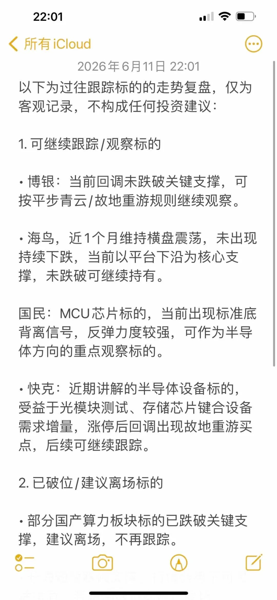
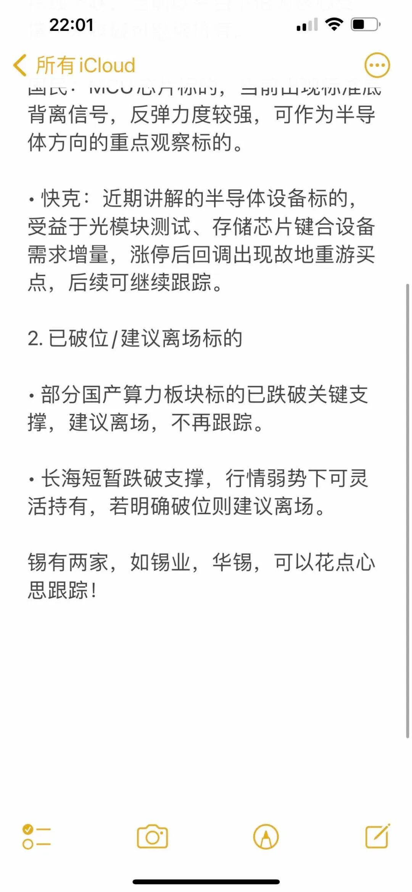

## 六月详细复盘

置顶重点看，这篇也要重点看，十遍都可以看！红色文字重点研究！当前市场行情与趋势观察
1. 下跌趋势的阶段特征

市场的下跌过程，往往会呈现出清晰的阶段特征，这也是我们判断节奏的重要依据：

• 下跌初期：趋势启动时，常伴随中大阴线，且大概率在3-5个交易日内创新低。此时市场情绪仍偏乐观，投资者容易在破位后急于补仓，反而扩大亏损。下跌初期的反弹多为短期修复，是控制仓位、降低风险的时机。

• 下跌末期：随着调整推进，下跌力度会逐步衰竭。以本轮调整为例，从5月14日至6月11日，市场调整已持续近1个月，指数从4200点附近跌至3900点一线，累计调整幅度超300点。前期单日跌幅可达1.5%-2.5%，而后期单日跌幅已收窄至1%以内，即便叠加外部利空影响，市场也表现出较强的抗压性，说明做空动能正在减弱，短期修复的可能性有所提升。

• 市场整体数据：本轮调整中，全市场超八成个股跌幅超过10%，中位数调整幅度约20%。但部分符合产业逻辑的标的表现出较强的抗跌性，多数逆势跑赢市场，体现了资金对景气赛道的偏好。

2. 市场资金流向与主线判断

当前市场主线仍围绕AI产业展开，资金呈现明显的“高低切换”特征：

• 前期涨幅较大的高位算力板块，已进入调整周期，资金流出明显。

• 流出资金主要流向两个AI关联方向：

1. 调整充分的锂电赛道：以受益于AI数据中心储能需求的标的为代表，集中在磷酸铁锂、六氟磷酸锂相关路线。

2. 半导体赛道：资金流入意愿较强，成为阶段性承接高位资金的方向。

• 整体来看，当前市场尚未切换至人形机器人、消费等其他方向，仅在AI内部进行高低切换。后续随着光模块、PCB等高位核心赛道调整充分，资金仍有回流的可能。

二、交易体系与风险控制方法

在波动加剧的市场中，一套清晰的交易规则和风险控制体系，比单纯的选股更重要。以下是我们梳理的通用交易方法框架，仅供参考：

1. 买卖参考位体系

根据标的不同走势特征，我们可以设置不同的支撑与参考位：

• 有明确大阳线/涨停板的标的：

◦ 平步青云位：以大阳线/涨停板实体的一半位置为参考，跌破（以收盘价为准）可考虑减仓，适合成本较高、风险承受能力较弱的投资者。

◦ 故地重游位：以大阳线/涨停板的起涨点为参考，适合已有利润、风险承受能力较强的投资者，可博取更高收益。

• 无明确大阳线的标的：
以放量创新高（阶段或历史新高）的小阳线、中阳线起涨点为支撑，跌破则离场。这类标的资金进场意愿较弱，支撑牢固度较低，交易需更加灵活。

• 平台型标的：
若标的走出扎实的震荡平台，以平台下沿为核心支撑，跌破则离场。

2. 下跌趋势中的应对策略

在明确的下跌趋势中，避免逆势操作是控制风险的关键：

• 下跌阶段划分：以90分钟及以上级别（90分钟、120分钟、日线）判断趋势，下跌通常分为三浪：一浪下跌、二浪反弹、三浪下跌。在一浪下跌、二浪反弹、三浪初期，均不建议补仓或加仓，破位后第一时间减仓，避免扩大亏损。

• 左侧交易的条件：当标的处于三浪下跌末端，且出现股价创新低、但MACD指标未同步创新低的底背离信号时，才具备左侧补仓的基础条件。抄底后预期会有四浪反弹，后续存在趋势反转的可能，但仍需严格控制仓位。

• 不同调整阶段的策略差异：

◦ 调整初期（大涨后前1周）：破位需坚决离场，避免参与不确定的反弹。

◦ 调整末期（已调整1-2个月）：若标的仍在关键支撑位附近，可结合市场情绪和自身成本，灵活应对。

3. 交易心态与纪律要求

• 严禁追高：所有交易均应在明确的买点布局，涨后追高、盘中冲动交易是放大风险的主要原因，需盘后复盘、制定交易计划，无信号不操作。

• 盈亏比原则：追求“小亏大赚”，单只个股亏损控制在10%-20%以内，盈利可根据趋势博取更高收益，做到赚时拿稳、亏时及时止损。

• 学习与认知：交易方法需要结合市场环境和标的特征灵活运用，建议先充分理解趋势和规则，再参与交易，避免盲目跟风。

**四、后续重点关注方向梳理
半导体炒作的背后核心驱动力其实就是AI产业的高速发展。如果没有近两年AI行业的爆发式增长，半导体赛道也很难迎来如今这般高景气周期，理清这条逻辑链，就能看懂当下行业的基本面变化。
半导体当前市场主线仍为AI产业，我们仅做AI内部的高低切换，重点关注相对低位的赛道机会，高位光模块、电子布等标的暂不建议参与：**

1. 半导体赛道（阶段性承接高位资金）

半导体是当前资金流入较为明显的方向，重点关注三个细分领域：

• 大硅片：AI驱动算力芯片需求提升，带动大硅片涨价预期，优先关注供货AI芯片的企业。可参考近期大阳线一半位置设置买点，以关键支撑位为止损参考。

• MCU芯片：国民……作为光模块主控芯片标的，当前出现底背离信号，底部支撑较为牢固，可作为核心观察标的。

• 半导体设备：快克……作为国内光模块测试、存储芯片键合设备龙头，受益于下游需求增量，后续回调可继续跟踪。

• 注：半导体赛道为阶段性轮动方向，需保持灵活，若后续高位核心赛道调整充分，资金仍有回流的可能。

2. 电子元器件赛道

当前MLCC陶瓷电容已炒作较为充分，重点关注未被爆炒的钽电容赛道：

• 钽电容在AI服务器中的用量和价值量不输MLCC，当前关注度较高但炒作热度较低，可关注相关标的的低吸机会。

• 弹性标的可关注创业板宏……稳健标的可关注主板东方……电感方向暂不跟踪。

3. 有色赛道（AI关联副线）

AI产业发展带动铜、铝、锡等金属需求提升，相关标的此前已有一波上涨，当前调整较为充分，可关注相对低位的机会：

• 锡：半导体、电路板焊接的核心原料

• 铜方向，铝方向弹性较弱、边缘化，暂不优先推荐；储能方向相关标的地位边缘，暂不建议布局。

